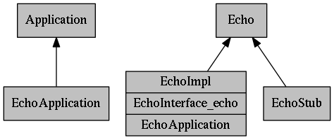

_Audience: Beginning fidl developers._

_Prerequisites: At least intermediate skills in C++ or Dart._

_Maintained by: jimbe@google.com, shayba@google.com_

TODO(FIDL-61):

* Update for FIDL 2.
* Update to reflect Application->Component rename.
* Run through and validate.

[TOC]

# About This Tutorial

This tutorial is based on the libraries that are part of the [GoogleSource fidl repo](https://fuchsia.googlesource.com/fidl/). The fidl (Fuchsia Interface Definition Language) libraries in that repo that you link with your application are called the fidl bindings in [Fuchsia](https://fuchsia.googlesource.com/fuchsia/). You'll see classes like "ApplicationRunner" that are part of this C++ library. These libraries are implemented in different ways for different languages.

You can write a C++ application for fidl without using the fidl Client, or you could selectively replace parts of the Client. In any case, the interface binding code from the fidl compiler can handle communication over the message pipes. Replacing all or part of the Client may be a useful strategy if you have a large existing base of code that you wish to run as a fidl application.

This tutorial depends on Fuchsia. There is no prebuilt binary in the git repo.

# Getting and Building the fidl Source Code

See the instructions on the web site for getting and building Fuchsia: 
[https://fuchsia.googlesource.com/fuchsia/](https://fuchsia.googlesource.com/fuchsia/)

The fidl source code is located inside of Garnet at: [https://fuchsia.googlesource.com/garnet/+/master/public/lib/fidl/](https://fuchsia.googlesource.com/garnet/+/master/public/lib/fidl/)

The examples we will use for this tutorial are located inside of Garnet at: [https://fuchsia.googlesource.com/garnet/+/master/examples/fidl/](https://fuchsia.googlesource.com/garnet/+/master/examples/fidl/)

# fidl Architecture

fidl is organized like this:

A fidl **Application** is software that's designed to work with fidl interfaces. It must implement the mojo::Application interface. C/C++ fidl applications are commonly implemented as a shared library (DSO), but other languages are also supported as first class citizens. The primary thread in a fidl application usually has a run loop to dispatch calls and may have additional threads with run loops.

An Application is called through its **Interface(s)**. Interfaces are reusable and can be vended by multiple applications. An interface is defined with the fuchsia interface definition language (IDL). The classes that bind an interface to a language are generated by the fidl compiler.

An Application almost always implements the **ServiceProvider** interface, which returns interfaces based on the name of the service. The fidl Client Library provides default implementations of ServiceProvider for all supported languages.

A **Service** is your implementation of an interface. Therefore, within a particular fidl application, there is one Service per Interface. In the fidl Client Library, you will see calls like ConnectToService() or AddService().


The **Shell** is the interface to a particular fidl service that knows how to load applications, cache them, and connect them together. You use the Shell interface when you want to connect to another service.

A **Pipe** is an operating system construct for IPC (interprocess communication), although it works equally well between processes, threads, or even within a thread. fidl uses pipes to communicate between applications.

A **Connection** is the request sent to a fidl application to return its **ServiceProvider** interface to another application. Requests for subsequent interfaces are _not_ Connections. A Connection refers to the construction of the initial pipe connection between two Applications.

The word **Client** is used in this document to refer to a fidl application that connects to a **Server** application. The difference between client and server is an artificial distinction for this tutorial. A fidl application you write can be a client, a server, or both, or many.

# Hello World "Echo" Interface

We'll start with a C++ echo service that echoes its input and prints "Hello World".

Open [garnet/examples/fidl/services/echo2.fidl](https://fuchsia.googlesource.com/garnet/+/master/examples/fidl/services/echo2.fidl). A .fidl file defines the interfaces and related data structures that a fidl applications vends (makes available to other fidl applications). An interface can be used in any language supported by fidl, which allows you to easily make calls across languages, even with scripting languages like JavaScript.

The example file `echo2.fidl`, with line numbers added, looks like this:

<!--- TODO: markdown for code blocks with line numbers --->
```
1. library echo2;

2. [ServiceName="echo2.Echo"]
3. interface Echo {
4.   1: EchoString(string? value) -> (string? response);
5. };
```

Let's go through it line by line.

**Line 1:** The library definition is used to define the namespace or package. Fidl interfaces in different modules can have the same name. The Java class path is defined separately.

**Line 2:** The ServiceName provides the C++ namespace as well as the name that can be explicitly used to access the service.

**Line 3:** The name of the interface.

**Line 4:** The function name. There are three unusual aspects of this line. First, note the 1: before the function name. This is a **sequence number**, and is used to ensure backwards compatibility when there are multiple versions of the same interface . All functions must have a unique sequence number. Second, note the "string?" declarations with a question mark. The question mark means that these parameters may be null. Third, the return type comes after the function declaration, not before. Unlike C++ or Java, a function can return multiple values.

## Generated Files

When you [build the tree](#getting-and-building-the-fidl-source-code), the fidl compiler is run automatically. It writes the glue code that allows the interfaces to be used from different languages. Below are the implementation files created for Python, Rust and C++.

```
./out/Debug/gen/examples/echo/echo2.fidl.cc
./out/Debug/gen/examples/echo/echo2.fidl.h
./out/Debug/gen/examples/echo/echo2.fidl-common.cc
./out/Debug/gen/examples/echo/echo2.fidl-common.h
./out/Debug/gen/examples/echo/echo2.fidl-internal.h
./out/Debug/gen/examples/echo/echo2_fidl.py
./out/Debug/gen/examples/echo/echo2.rs
```

# Echo Server in C++

Let's take a look at the server implementation in C++:

[garnet/examples/fidl/echo2_server_cpp/echo2_server.cc](https://fuchsia.googlesource.com/garnet/+/master/examples/fidl/echo2_server_cpp/echo2_server.cc)

This file implements the main function, an EchoDelegate, and an implementation of the Echo interface.

- The `EchoDelegate` ensures the `EchoImpl` is exposed as a handler for the Echo interface by registering it as a service implementation.
- `EchoImpl` is the implementation of the Echo interface that is bound to incoming pipes.

To understand how the code works, here's a summary of what happens in the server to execute an IPC call. We will dig into what each of these lines means, so it's not necessary to understand all of this before you move on.

1. The fidl Shell loads the server executable and calls `main`.
1. `main` creates an `EchoDelegate` object which will bind to the service interface when it is constructed. The `EchoDelegate` also manages the `EchoImpl` instance used by the server to handle requests.
1. `EchoDelegate()` tells the `ApplicationContext` what services/interfaces are supported by calling `context->outgoing_services()->AddService<Echo2>()`. It passes a lambda function that is called when a connection request arrives.
1. Now `main` starts the run loop, expressed as an `fsl::MessageLoop`.
1. The run loop receives a request to connect from another application, so calls the lambda created in `Echo2Delegte()`.
1. That function constructs a new `EchoImpl`, which binds itself to the pipe in its constructor. 
1. The run loop receives a call to `EchoString()` from the message pipe and dispatches it to the object created in the last step.
1. `EchoString()` issues an async call back to the client using `callback(value)`, then returns to the run loop.

Let's go through the details of how this works.

## File Headers

First the namespace definition. This matches the namespace defined in the fidl file in its "library" declaration, but that's incidental:

```
namespace echo2 {
```

Here are the #include files used in the server implementation:

```
#include "lib/app/cpp/application_context.h"
#include "lib/fidl/cpp/bindings/binding_set.h"
#include "lib/fidl/cpp/bindings/interface_request.h"
#include "lib/fxl/macros.h"
#include "lib/fsl/tasks/message_loop.h"
#include "garnet/examples/fidl/services/echo2.fidl.h"
```

- `application_context.h` is used by `EchoDelegate` to expose service implementations.
- `binding_set.h` is used by `EchoImpl` to track its connections.
- `interface_request.h` encapsulates a message pipe request.
- `macros.h` contains some utiliy macros.
- `message_loop.h` sets up the message loop.
- Last but not least, `echo2.fidl.h`. It contains the C++ definition of our Echo2 fidl interface.

## main

Most `main()` functions for fidl applications look very similar. They create a run loop using `fsl::MessageLoop` or some other construct, and bind service implementations. The `MessageLoop.Run()` function starts the run loop to process requests that arrive over message pipes. The run loop terminates when the application calls `QuitNow()` on the message loop, which is shown in the client code.

Eventually, another fidl application will attempt to connect to our application.

## The `EchoDelegate()` constructor

Before going further, a quick review from the [fidl Architecture](#fidl-architecture) section. A connection is defined as the _first_ message pipe with another application. Strictly speaking, the connection is complete when both applications have bound their ServiceProvider to that first pipe. Any additional pipes are not "connections." Therefore, service registration is performed before the run loop begins and before the first connection is made.

Here's what the `EchoDelegate` constructor looks like:

```
EchoDelegate() : context_(component::ApplicationContext::CreateFromStartupInfo()) {
    context_->outgoing_services()->AddService<Echo>(
      [this](fidl::InterfaceRequest<Echo> request) {
        echo_provider_.AddBinding(std::move(request));
      });
}
```

The function calls `AddService` once for each service it makes available to the other application (remember that each service exposes a single interface). The information is cached by `ApplicationContext` and used to decide which `InterfaceFactory<>` to use for additional incoming pipes. A new pipe is created every time someone calls `ConnectToService()` on the other end.

If you read the code carefully, you'll see that the parameter to `AddService` is actually a lambda function that captures `this`. This means that the lambda function won't be executed until a pipe tries to bind to the interface, at which point the object is bound to the pipe and will receive calls from other applications. Note that these calls have thread-affinity, so calls will only be made from the same thread.

The function passed to `AddService` can be implemented in different ways. The default implementation `EchoDelegate` uses the same object for all pipes. That's a good choice for the Echo2 interface because the implementation is stateless. Other, more complex interfaces could create a different object for each pipe or perhaps re-use the objects in some sort of a caching scheme.

Connections are always point to point. There are no multicast connections.

## The EchoString function

Finally we reach the end of our server discussion. The run loop receives a message in the pipe to call the `EchoString()` function in the Echo interface. Here is the implementation:

```
void EchoString(const fidl::StringPtr& value,
                const EchoStringCallback& callback) override {
    FXL_LOG(INFO) << "EchoString: " << value;
    callback(value);
}
```

Here's what's interesting about this code:

- The first parameter to `EchoString()` is a `fidl::StringPtr`. As the name suggests, a `fidl::StringPtr` can be null.  Strings in fidl are supposed to be UTF-8, but this is not enforced by the fidl Client Library.
- The `EchoString()` function returns void because fidl calls are asynchronous. Any value we might otherwise return wouldn't have anywhere to go.
- The last parameter to `EchoString()` is the client's callback function. In this case, the callback takes a `fidl::StringPtr`.
- `EchoImpl::EchoString()` returns its response to the client by calling the callback. The callback invocation is also asynchronous, so the call often returns before the callback is run in the client.
- Because the callback is async, the callback also return void.

Any call to an interface in fidl is asynchronous. This is a big shift if you are used to a procedural world where function calls return after the work is complete. Because it's async, there's no guarantee that the call will ever actually happen, so your callback may never be called. The remote fidl application might close, crash, be busy, or many other problems beyond your control.

# Echo Client in C++

The structure of the client is the same as the server, with a `main` function and an `fsl::MessageLoop`. The difference is that the client immediately kicks off work once everything is initialized. In contrast, the server does no work until a connection is accepted.

**Note:** an application can be a client, a server, or both, or many. The distinction in this example between Client and Server is purely for demonstration purposes.

Here is the summary of how the client makes a connection to the echo service.

1. The shell loads the client executable and calls `main`.
1. `main()` creates an `EchoClientApp` object to handle connecting to the server, calls `Start()` to initiate the connection, and then starts the run loop.
1. In `Start()`, the client calls `context_->launcher()->CreateApplication ` with the url to the server application. If the server application is not already running, it will be created at this point.
1. Next, the client calls `ConnecttoService()` to open a channel to the server application.
1. Internally, `ConnectToService()` calls `shell->ConnectToApplication("fidl:echo2_server")`.
1. The shell loads the new application and returns its `ServiceProvider` interface in the form of an `ApplicationConnection` object, which contains a handle to the message pipe.
1. Using the `ApplicationConnection` object,  `ConnectToService(string, InterfacePtr)` calls `ConnectToService(InterfacePtr)` to open the pipe and returns the interface.
1. The interface pointer passed to `ConnectToService() `is filled in with the service implementation.
1. `Start()` calls `echo_->EchoString(...)` and passes the callback. Because fidl IPC calls are async,` EchoString()` will probably return before the server processes the call.
1. `Start()` returns and the run loop is started, waiting for a callback.
1. Eventually, the server calls the callback, our run loop receives the call, and `ResponsePrinter` is called with the result.
1. `ResponsePrint` calls `QuitNow()` to terminate the run loop.
1. The `echo_client` application exits.

### main

main() in the client is almost identical to the server.

```
int main(int argc, const char** argv) {
  echo::Echo2ClientApp app;
  if (app.Start(server_url, msg))
    loop.Run();
  return 0;
}
```

The only difference is that we create `EchoClientApp` instead of `EchoDelegate`. The practical difference is in the implementation of `EchoClientApp`. In `EchoDelegate` we implemented a callback when a connection request is received. In contrast, `EchoClientApp` runs everything directly in Start().

### Start

`Start()` contains the implementation of the client for the echo service:

```
class EchoClientApp {
 public:
  bool Start(std::string server_url, std::string msg) {
    auto launch_info = component::ApplicationLaunchInfo::New();
    launch_info->url = server_url;
    launch_info->directory_request = echo_provider_.NewRequest();

    context_->launcher()->CreateApplication(std::move(launch_info),
                                            controller_.NewRequest());

    echo_provider_.ConnectToService(echo_.NewRequest());
    FXL_DCHECK(echo_);

    echo_->EchoString(msg, [this](f1dl::StringPtr value) {
      ResponsePrinter printer;
      printer.Run(std::move(value));
    });
    return true;
  }

 private:
  EchoPtr echo_;
};
```

First, `Start()` calls `CreateApplication()` to load `echo_server`. Then, it calls `ConnectToService()` to  bind to the server's Echo2 interface. The exact mechanism is somewhat hidden, but the particular interface is automatically inferred from the type of `Echo2Ptr`, which is a typedef for `fidl::InterfacePtr<Echo2>`.

The second parameter to `ConnectToService()` is actually a URL. The protocol `"fidl"` is a shortcut to load the given shared library module from the same directory. Do not include the trailing `".fidl"` extension when using the `"fidl"` protocol in the url passed to `ConnectToService()`. Protocols other than fidl may be handled by a content handler, depending on the fidl shebang declaration in the file.

Next the client calls `EchoString()` in the returned interface. Fidl interface are asynchronous, so `Start()` does not wait for `EchoString()` to complete before return. `EchoString()` returns void because of the async behavior. The return values from `EchoString()` calls are passed to the callback that's supplied as the second parameter. After `EchoString()` returns, `Start()` returns and the run loop starts.

The `ResponsePrinter` object is constructed in place with the syntax `ResponsePrinter()`. This object will be destroyed as soon as `EchoString()` returns, which happens immediately. At first glance, this shouldn't work. However, what's happening under the hood is that `ResponsePrinter` is passed by value, so the `EchoString()` proxy actually makes a copy of the value and passes it around.

At some point in the future, the echo service will call the callback, which will be routed to `ResponsePrinter::Run()`. This function prints the response, calls `RunLoop::current()->Quit()`, and returns. The call to `Quit()` forces the run loop to exit, and the echo client application terminates.

The callback is any C++ struct or class that implements the `Run()` member function with the interface's return value(s) as parameters. The C++ struct/class does not need to inherit from any base class and does not need any virtual functions.

`OnInitialize()` also has access to command line arguments, service connections, and startup and shutdown information, all of which is in the base class.

### Run the Sample

You can run the Hello World example like this:

```
$ system/bin/echo_client_cpp
```

You do not need to specifically run the server because the call to `CreateApplication()` in the client will automatically demand-load the server.

# Echo Server in Dart

**Status: Dart section needs to be updated for FIDL 2 (Last reviewed Jan 23, 2017)**

The echo server implementation in Dart can be found at:
[topaz/examples/fidl/echo_server_dart/lib/main.dart](https://fuchsia.googlesource.com/topaz/+/master/examples/fidl/echo_server_dart/lib/main.dart)

This file implements the `main()` function, the EchoApplication class, and the EchoImpl class:

- The `main()` function is executed when the application is loaded.
- The `EchoApplication` class registers the availability of the service with incoming connections from fidl.
- `EchoImpl` processes requests on the `Echo` interface. A new object is created for each pipe.

To understand how the code works, here's a summary of what happens in the server to execute an IPC call. We will dig into what each of these lines means, so it's not necessary to understand all of this before you move on.

1. **Startup.** The fidl Shell loads the Dart "content handler", which starts the VM, loads `echo_server.mojo` and calls `main()`.
1. **Startup.** `main()` creates an `EchoApplication` object and returns. However, the application doesn't exit because the root base class of `EchoApplication` called `listen()` in the `fromHandle()` named constructor. This means that the Dart isolate will continue running listening for connections.
1. **Registration.** The mojo package receives a request to connect from an `echo_client` application, so calls `acceptConnection()` in `EchoApplication`.
1. **Registration.** `acceptConnection()` must tell the `ServiceProvider` what services/interfaces are supported, so calls `connection.provideService(Echo.serviceName, _createService)`. Note that `_createService` isn't actually called at this point. It's a factory function that is called as necessary by the mojo package to create `EchoImpl` objects to process IPC function calls.
1. **Service Request.** The mojo package receives a request to bind to a new message pipe, so calls the `_createService()` function passed in the previous step.
1. **Service Request.** `_createService()` constructs a new `EchoImpl` that's bound to the pipe (endpoint).
1. **API Request.** The mojo package receives a call to `echoString()` from the message pipe and dispatches it to `echoString()` in the `EchoImpl` object created in the last step.
1. **API Request.** `echoString()` calls the given `respond()` function to return the response.

### Dart Class Diagram



Now let's go through the details of how this works.

### File Headers

Here are the import declarations in the Dart server implementation:

```
import 'package:fidl/fidl.dart';
import 'package:fuchsia.fidl.echo2/echo2.dart';
import 'package:lib.app.dart/app.dart';
```

- `dart:async` is required to define the Future class.
- `mojo/application.dart` defines the Application and ServiceProvider classes.
- `mojo/core.dart` defines the core fidl functionality for Dart, such as `fidlHandle` and `fidlMessagePipeEndpoint`.
- `fidl/mojo/examples/echo.fidl.dart` is generated from the `echo.fidl` file. It defines the abstract interface, the proxy and the stub for the Echo interface.

### main()

Everything starts with main():

```
void main(List<String> args) {
  _context = new ApplicationContext.fromStartupInfo();
  _echo = new _EchoImpl();
  _context.outgoingServices.addServiceForName<Echo>(_echo.bind, 'echo2.Echo');
}
```

`main()` is called by the Dart VM when your service is loaded, similar to `main()` in a C or C++ application. `handleToken` is a handle that expects to be bound to a `fidlHandle` and passed to your application's [Application](https://github.com/domokit/mojo/blob/master/mojo/public/dart/mojo/lib/src/application.dart) implementation. After the `Application` object is constructed, `OnInitialize()` will be called on your `Application` subclass, just like C++.

Most fidl Dart `main()` functions look very similar. They bind `handleToken` to a `fidlHandle`, create their `Application` object using the `fromHandle()` constructor, and return, which causes the system to start processing incoming connections.

Eventually, another fidl application will attempt to connect to our application.

### The `acceptConnection` Function

Before going further, a quick review from the [fidl Architecture](#fidl-architecture) section. A connection is defined as the _first_ message pipe with another application. Strictly speaking, the connection is complete when both applications have bound their `ServiceProvider` to that first pipe. Any additional pipes are not "connections." The function names will make more sense if you keep this in mind.

Here's what it looks like:

``` 
void acceptConnection(String requestorUrl, String resolvedUrl,
        ApplicationConnection connection) {
    connection.provideService(Echo.serviceName, _createService);
}
```

The `acceptConnection` function is called when the first pipe is received from another application. This function calls `provideService()` once for each service it makes available to the other application (remember that each service exposes a single interface). The information is cached by `ServiceProvider` and used to create objects to be the endpoints for additional incoming pipes.

#### Tip for C++ Developers

C++ developers new to Dart should note that the reference to `_createService` works differently than you might expect. It looks similar to a C++ pointer to member function, but it's not. It's actually a closure bound to the parent's `this` object, which is an `Echo2Application` object. In other words, it's really a shorthand for something like this:

```
connection.provideService(Echo.serviceName, (endpoint) {
    this._createService(endpoint));
}
```

---

Finally, unlike C++, Dart only has a single thread per VM, so there's no possible confusion over which thread owns a pipe.

#### Advanced FAQ - is there really only one thread?

Both yes and no. There's only one thread in your application's VM, but the handle watcher Isolate (where the code calls `fidlWaitMany` has its own, separate thread so that application Isolates don't have to block. Application Isolates can also spawn new Isolates, which will run on different threads.

---

### Creating the Service

Moving along, imagine that ServiceProvider responds to a request for a new message pipe. The pipe needs to be bound to an object that implements the appropriate interface. That's the second parameter to the provideService() function. Here is how it's implemented in this example:

```
EchoImpl _createService(fidlMessagePipeEndpoint endpoint) {
  if (_closing) {
    endpoint.close();
    return null;
  }
  var echoService = new EchoImpl(this, endpoint);
  _echoServices.add(echoService);
  return echoService;
}
```

`_createService()` first makes sure that the service isn't in the middle of shutting down. This is necessary because the `_errorHandler()` function is async and uses `await`, which means that other requests can be received while `close()` is waiting. Checking the `_closing` variable prevents a race condition.

Otherwise, `_createService()` constructs a new `EchoImpl` object and passes the `endpoint`, which contains the handle to the message pipe. The `EchoImpl` object is now bound to the pipe and will receive calls from the client application.

`_createService()` also adds the `EchoImpl` object to the `_echoServices` collection of known clients. This collection is used if there is an error in the service so that all client connections can be closed.

### Cleanup

In C++, a `mojo::Binding` object coordinates the work of taking requests from the message pipe and dispatching them to the bound Impl object. In Dart, the `EchoStub` class is responsible for this work (`EchoStub` inherits from `EchoInterface`, which inherits from `fidlInterface<Echo`>).

However, the bindings layer does not know how you are structuring the relationship between pipes and Impl objects, so you need to implement the cleanup logic. Dart has no destructors, so the technique is different than the `mojo::StrongBinding` class found in the C++ library.

The `EchoImpl` constructor says:

```
_echo.ctrl.onError = _errorHandler;
```

This causes _errorHandler() to be called when there is an error on the pipe. In particular, a pipe being closed is considered an error, so when an errors happens, our implementation of _errorHandler calls _application.removeService(this) to remove this object from the collection of active service connections.

### The `echoString` function

Finally we reach the implementation of the server API. Your `EchoImpl` object receives a call to the `echoString()` function. It receives the arguments to the function, as well as a callback function to return the result parameters:

```
void echoString(String value, void callback(String response)) {
  print('EchoString: $value');
  callback(value);
}
```

# Echo Client in Dart

The echo server implementation in Dart can be found at:
[https://github.com/domokit/mojo/blob/master/examples/dart/echo_client/lib/main.dart](https://github.com/domokit/mojo/blob/master/examples/dart/echo_client/lib/main.dart)

The structure of the client is the same as the server, with a `main()` function and a class derived from `Application`. The difference is that the client immediately kicks off work when fidl calls the `initialize()` function in your `Application` object. In contrast, the server does no work until a connection is accepted.

**Note:** an application can be a client, a service, or both, or many. The distinction in this example between Client and Server is purely for demonstration purposes.

Here is the summary of how the client makes a connection to the echo service.

1. **Startup.** The fidl Shell loads the Dart "content handler", which starts the Dart VM, loads `dart_echo_client.mojo` and calls `main()`.
1. **Startup.** `main()` creates an `EchoClientApplication` object and returns. The fidl Client Library calls the `initialize()` method, which, despite its name, is where the client does the real work.
1. **Connect.** In `initialize()`, the client calls `connectToService(String url, bindings.fidlInterface interface)` with the url to the application and with the proxy object. On return, the proxy object is initialized and connected to the pipe. However, the remote end of the pipe is not connected yet. That happens in the next step.
1. **Connect.** The fidl shell loads the server application, which connects the `ServiceProvider` interface to the remote end of the pipe.
1. **Execute.** `initialize()` calls `_echo.echoString(...)` and specifies an anonymous function to handle the return value. The call to `echoString()` returns immediately because fidl calls are async.
1. **Execute.** The fidl run loop is idle, waiting for messages from pipes.
1. **Execute.** Eventually, the server returns the result on the pipe, which the mojo package passes to our anonymous function, which prints the result.
1. **Shutdown.** The `whenComplete()` block of the Completer closes all handles.
1. **Shutdown.** The server calls `Quit()`, which closes the pipe.
1. **Shutdown.** `dart_echo_client` exits.

### main()

The `main()` function in the client is almost identical to the server.

```
main(List args, Object handleToken) {
  fidlHandle appHandle = new fidlHandle(handleToken);
  new EchoClientApplication.fromHandle(appHandle);
}
```

Again, remember that everything in fidl is async. The call to `new EchoClientApplication.fromHandle()` returns immediately and then `main()` returns. The fidl client library keeps its own pointer to the application object, which prevents the application from exiting.

### EchoClientApplication

fidl calls the `initialize()` function of your `Application` object once setup is complete.

```
@override
void initialize(List<String> arguments, String url) {
  // See README.md for how to specify an alternate server on the cmd line.
  final server = (arguments.length > 0) ? arguments[1] : "dart_echo_server";
  connectToService(url.replaceAll("dart_echo_client", server), _echo);

  var c = new Completer();
  _echo.echoString("hello world", (String response) {
    print("${response}");
    c.complete(null);
  });
  c.future.whenComplete(_closeHandles);
}
```

The `initialize()` method receives two parameters, `arguments` and `url`. The `arguments` parameter contains the `args-for` parameters from the `mojo_shell` command as described in the `README.md` file. The `url` parameter contains the URL used to start the `dart_echo_client`. To start the server, the code replaces `"dart_echo_client"` with `"dart_echo_server"`, then calls connectToService() to load dart_echo_server and bind to its `Echo` service. The desired interface is defined by the `_echo` object.

Next the client calls `echoString()` on the newly-bound `_echo` proxy object. Fidl interface calls are asynchronous, so `echoString()` immediately returns and `initialize()` returns. After the call to `echoString()` in the server returns, the anonymous function will be called to print the result. Notice that a `Completer` is used to close the handles and clean up once the anonymous function finishes.

Once all of the handles are closed, the application will automatically exit after the anonymous function returns.

### Run the Sample

You can run the Hello World example like this:

```
$ out/Debug/mojo_shell mojo:echo_client
```

You do not need to specifically run the server because the call to `connectToService()` in the client will automatically demand-load the server.

# More About Message Pipes

This section contains a few more details of how two fidl applications actually talk to each other.

Consider the case where fidl Application A wants to talk to B. Both of them have a connection to the Shell, which is received in the call to fidlMain  (there's only one Shell).

For A to tell Shell that it wants to talk to B, A creates a new pipe and passes one end of it to Shell, along with the URL for application B. Shell checks if the app B is already running. If not, it launches one. Then Shell sends the pipe handle to B. This is the Connection.

`AcceptConnection` in B is called with the pipe handle.

Pipes in fidl are typed. The type of the initial pipe is the `ServiceProvider` type, which has a method called `AddService`, which tells `ServiceProvider` what other kinds of pipes can be opened.

In C++ we have `ServiceProviderImpl`, which uses the registry built from `AddService`.

`ServiceProvider` is a generic interface that can expose any other interface. It's a loosely typed interface requester. The first thing that happens on each connection is an exchange of service providers.

Each new call to `ConnectToService()` creates a new message pipe.

Not all interfaces are obtained through `ConnectToService()`. Some interfaces are returned from other interfaces. For example, `network.NetworkService` (from "module network")
In the case of NetworkService, there are several CreateService calls, such as `CreateHttpService()`. So services can exist that aren't in the `ServiceProvider` registry.
