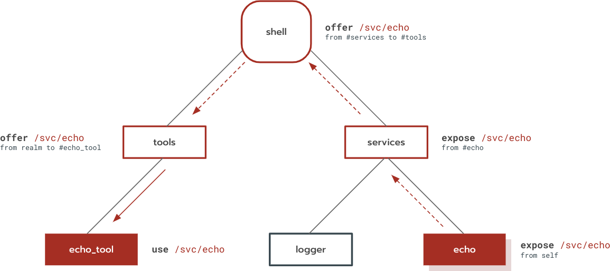

# Component manifests {#component-manifests}

Note: This document describes manifests for the new Component Manager. If your
component launches with [appmgr][doc-glossary-appmgr], indicated for instance by
your manifest file ending in a `.cmx` extension, then refer to
[legacy documentation][doc-legacy-manifest]

A [component manifest](#component-manifest) is a file that defines a component
by encoding a [component declaration](#component-declaration). This document
gives an overview of the concepts used by component declarations, and presents
the syntax for writing [component manifest source](#component-manifest-source).
Component declarations contain:

-   Information about [how to run the component](#runtime).
-   The component's [child component instances][doc-children] and
    [component collections][doc-collections].
-   [Routing rules](#capability-routing) that describe how capabilities are
    used, exposed, and offered between components.
-   [Freeform data ("facets")](#facet-metadata) which is ignored by the
    component framework but can be interpreted by third parties.

## Manifests and declarations {#manifests-and-declarations}

This section explains the distinction between component manifests, component
manifest sources, and component declarations.

### Component manifest {#component-manifest}

A *component manifest* is a file that encodes a
[component declaration](#component-declaration), usually distributed as part of
a [package][doc-packages]. The binary format is a JSON file mapping one-to-one
onto the component declaration, typically ending in a `.cm` extension.

A [fuchsia-pkg URL][doc-package-url] with a component manifest resource path
identifies a component in a package.

### Component manifest source {#component-manifest-source}

A *component manifest source* is a file that encodes part of a component
manifest. Component manifest sources are written in *CML* (*component manifest
language*), which is the developer-facing source format for component manifests.
CML files are JSON5 files that end with a `.cml` extension. Descriptions and
examples of the CML syntax are contained in this document: see
[Syntax](#syntax).

Component manifest sources are compiled to
[component manifests](#component-manifest) by the [`cmc`][src-cmc] tool.

### Component declaration {#component-declaration}

The [`ComponentDecl`][fidl-component-decl] FIDL table is a *component
declaration*. Component declarations are used by the component framework APIs to
represent components and may be provided to components at runtime.

## Concepts {#concepts}

### Runtime {#runtime}

The component framework doesn't dictate a particular format for programs, but
instead requires components to specify which runtime they need by specifying a
[runner](runners.md). The component framework provides a built-in ELF runner,
while other runtimes are implemented as components within the framework. A
component can use any runner available in its [environment][doc-environments].

The [`program`](#program) section of a component manifest declares to the runner
how the component is run, such as the program location and any arguments.
Components using the ELF runner should specify the binary name and arguments, as
[documented in the ELF runner page](elf_runner.md). [Other runners](runners.md)
may have other runner-specific details, documented by that runner.

A component may also have no runtime at all by omitting the `program` section.
In this case, the component may still route capabilities and host children, but
no code will be executed for the component.

See also: [ELF Runner](elf_runner.md), [Component Runners](runners.md).

### Capability routing {#capability-routing}

Component manifests provide a syntax for routing capabilities between
components. For a detailed walkthrough about what happens during capability
routing, see [_Life of a protocol open_](life_of_a_protocol_open.md)

#### Capability types {#capability-types}

The following capabilities can be routed:

-   `protocol`: A filesystem service node that can be used to open a channel to
    a FIDL protocol.
-   `directory`: A filesystem directory.
-   `storage`: A filesystem directory that is isolated to the component using
    it.
-   `runner`: A capability that allows a component to use a particular
    [runner](runners.md).

`protocol`, `directory` and `storage` capabilities are routed to components that
`use` them. `runner` capabilities` are routed to [environments](#environments)
that include them.

#### Routing terminology {#routing-terminology}

Component manifests declare how capabilities are routed between components. The
language of capability routing consists of the following three keywords:

-   `use`: When a component `uses` a capability, the capability is installed in
    the component's namespace. A component may `use` any capability that has
    been `offered` to it.
-   `offer`: A component may `offer` a capability to a *target*, which is either
    a [child][doc-children] or [collection][doc-collections]. When a capability
    is offered to a child, the child instance may `use` the capability or
    `offer` it to one of its own targets. Likewise, when a capability is offered
    to a collection, any instance in the collection may `use` the capability or
    `offer` it.
-   `expose`: When a component `exposes` a capability to its parent, the parent
    may `offer` the capability to one of its other children. A component may
    `expose` any capability that it provides, or that one of its children
    exposes.

When you use these keywords together, they express how a capability is routed
from a component instance's [outgoing directory][doc-outgoing-directory] to
another component instance's namespace:

-   `use` describes the capabilities that populate a component instance's
    namespace.
-   `expose` and `offer` describe how capabilities are passed between component
    instances. Aside from their directionality, there is one significant
    difference between `offer` and `expose`. While a component may `use` a
    capability that was `offered` to it, a component is not allowed to `use` a
    capability that was `exposed` to it by its child. This restriction exists to
    prevent dependency cycles between parent and child.

#### Framework protocols {#framework-protocols}

A *framework protocol* is a protocol provided by the component framework.
Because the component framework itself provides the protocol, any component may
`use` it without an explicit `offer`. Fuchsia supports the following framework
protocols:

-   [`fuchsia.sys2.Realm`][fidl-realm]: Allows a component to manage and bind to
    its children. Scoped to the component's realm.

#### Framework directories {#framework-directories}

A *framework directory* is a directory provided by the component framework.
Because the component framework itself is the provider of the directory, any
component may `use` it without an explicit `offer`. Fuchsia supports the
following framework directories:

-   [`/hub`][doc-glossary-hub]: Allows a component to perform runtime
    introspection of itself and its children.

#### Capability paths {#capability-paths}

Service, protocol, and directory capabilities are identified by paths. A path
consists of a sequence of path components, starting with and separated by `/`,
where each path component consists one or more non-`/` characters.

A path may either be a *source path* or *target path*, whose meaning depends on
context:

-   A *source path* is either a path in the component's outgoing directory (for
    `offer` or `expose` from `self`), or the path by which the capability was
    offered or exposed to this component.
-   A *target path* is either a path in the component's namespace (for `use`),
    or the path by which the capability is being `offered` or `exposed` to
    another component.

#### Capability names {#capability-names}

Runner capabilities are identified by a capability name. A capability name
consists of a string containing the characters `a` to `z`, `A` to `Z`, `0` to
`9`, underscore (`_`), hyphen (`-`), or the full stop character (`.`).

#### Directory Rights {#directory-rights}

Directory rights define how a directory may be accessed in the component
framework. You must specify directory rights on `use` declarations and on
`expose` and `offer` declarations from `self`. On `expose` and `offer`
declarations not from `self`, they are optional.

A *rights* field can be defined by the combination of any of the following
rights tokens:

```
"rights": ["connect", "enumerate", "read_bytes", "write_bytes", "execute_bytes",
            "update_attributes", "get_attributes", "traverse", "modify_directory"]
```

See [`fuchsia.io2.Rights`][fidl-io2-rights] for the equivalent FIDL definitions.

However *rights aliases* should be prefered where possible for clarity.

```
"rights": ["r*", "w*", "x*", "rw*", "rx*"]
```

Except in special circumstances you will almost always want either `["r*"]` or
`["rw*"]`. Only one alias can be provided to a rights field and it must not
conflict with any longform rights.

Right aliases are simply expanded into their longform counterparts:

```
"r*" -> ["connect", "enumerate", "traverse", "read_bytes", "get_attributes"]
"w*" -> ["connect", "enumerate", "traverse", "write_bytes", "update_attributes", "modify_directory"]
"x*" -> ["connect", "enumerate", "traverse", "execute_bytes"]
```

Merged aliases like `rw*` are simply `r*` and `w*` merged without duplicates.

This example shows usage of a directory use declaration annotated with rights:

```
"use": [
  {
    "directory": "/test",
    "from": "parent",
    "rights": ["rw*", "admin"],
  },
],
```

#### Storage capabilities {#storage-capabilities}

Storage capabilities are not directly provided from a component instance's
[outgoing directory][doc-outgoing-directory], but are created from preexisting
directory capabilities that are declared in [`storage`](#storage) in a component
manifest. This declaration describes the source for a directory capability and
can then be listed as a source for offering storage capabilities.

Storage capabilities cannot be [exposed](#expose).

#### Storage types {#storage-types}

Storage capabilities are identified by types. Valid storage types are `data`,
`cache`, and `meta`, each having different semantics:

-   `data`: A mutable directory the component may store its state in. This
    directory is guaranteed to be unique and non-overlapping with directories
    provided to other components.
-   `cache`: Identical to the `data` storage type, but the framework may delete
    items from this directory to reclaim space.
-   `meta`: A directory where the framework can store metadata for the component
    instance. Features such as persistent collections must use this capability
    as they require component manager to store data on the component's behalf.
    The component cannot directly access this directory.

#### Examples {#examples}

For an example of how these keywords interact, consider the following component
instance tree:

<br><br>

In this example, the `echo` component instance provides an `/svc/echo` protocol
in its outgoing directory. This protocol is routed to the `echo_tool` component
instance, which uses it. It is necessary for each component instance in the
routing path to propagate `/svc/echo` to the next component instance.

The routing sequence is:

-   `echo` hosts the `/svc/echo` protocol in its outgoing directory. Also, it
    exposes `/svc/echo` from `self` so the protocol is visible to its parent,
    `services`.
-   `services` exposes `/svc/echo` from its child `echo` to its parent, `shell`.
-   `system` offers `/svc/echo` from its child `services` to its other child
    `tools`.
-   `tools` offers `/svc/echo` from `parent` (i.e., its parent) to its child
    `echo_tool`.
-   `echo_tool` uses `/svc/echo`. When `echo_tool` runs, it will find
    `/svc/echo` in its namespace.

A working example of capability routing can be found at
[//examples/components/routing][examples-routing].

### Facet metadata {#facet-metadata}

*Facets* are metadata that is ignored by the component framework itself, but may
be interpreted by interested components.

## Syntax {#syntax}

This section describes the syntax for each section of the component manifest, in
CML format.

### References {#references}

A *reference* is a string of the form `#<reference-name>`, where
`<reference-name>` is a string of one or more of the following characters:
`a-z`, `0-9`, `_`, `.`, `-`.

A reference may refer to:

-   A [static child instance][static-children] whose name is `<reference-name>`.
-   A [collection][collections] whose name is `<reference-name>`.
-   A [storage declaration](#storage) whose name is `<reference-name>`.

### program {#program}

If the component contains executable code, the content of the `program` section
is determined by the runner the component uses. Some components don't have
executable code; the declarations for those components lack a `program` section.

#### ELF runners {#elf-runners}

If the component uses the ELF runner, `program` is an object with the following
properties:

-   `binary`: Package-relative path to the executable binary
-   `args` _(optional)_: List of arguments

```
"program": {
    "binary": "bin/hippo",
    "args": [ "Hello", "hippos!" ],
},
"use": [
    { "runner": "elf" },
],
```

See also: [ELF Runner](elf_runner.md)

#### Other runners {#other-runners}

If a component uses a custom runner, values inside the `program` stanza are
specific to the runner. The runner receives the arguments as a dictionary of key
and value pairs. Refer to the specific runner being used to determine what keys
it expects to receive, and how it interprets them.

### children {#children}

The `children` section declares child component instances as described in [Child
component instances][children]

`children` is an array of objects with the following properties:

-   `name`: The name of the child component instance, which is a string of one
    or more of the following characters: `a-z`, `0-9`, `_`, `.`, `-`.
-   `url`: The component URL for the child component instance.
-   `startup` _(optional)_: The component instance's startup mode.
    -   `lazy` _(default)_: Start the component instance only if another
        component instance binds to it.
    -   `eager`: Start the component instance as soon as its parent starts.
-   `environment` _(optional)_: If present, the name of the environment to be
    assigned to the child component instance, one of
    [`environments`](#environment). If omitted, the child will inherit the same
    environment assigned to this component.

Example:

```
"children": [
    {
        "name": "logger",
        "url": "fuchsia-pkg://fuchsia.com/logger#logger.cm",
    },
    {
        "name": "pkg_cache",
        "url": "fuchsia-pkg://fuchsia.com/pkg_cache#meta/pkg_cache.cm",
        "startup": "eager",
    },
],
```

### collections {#collections}

The `collections` section declares collections as described in
[Component collections][doc-collections].

`collections` is an array of objects with the following properties:

-   `name`: The name of the component collection, which is a string of one or
    more of the following characters: `a-z`, `0-9`, `_`, `.`, `-`.
-   `durability`: The duration of child component instances in the collection.
    -   `transient`: The instance exists until its parent is stopped or it is
        explicitly destroyed.
    -   `persistent`: The instance exists until it is explicitly destroyed. This
        mode is not yet supported.
-   `environment` _(optional)_: If present, the environment that will be
    assigned to instances in this collection, one of
    [`environments`](#environment). If omitted, instances in this collection
    will inherit the same environment assigned to this component.

Example:

```
"collections": [
    {
        "name": "tests",
        "durability": "transient",
    },
],
```

### environments {#environments}

The `environments` section declares environments as describe in
[Environments][doc-environments].

`environments` is an array of objects with the following properties:

-   `name`: The name of the environment, which is a string of one or more of the
    following characters: `a-z`, `0-9`, `_`, `.`, `-`.
-   `extend`: How the environment should extend this realm's environment.
    -   `realm`: Inherit all properties from this realm's environment.
    -   `none`: Start with an empty environment, do not inherit anything.
-   `runners`: The runners registered in the environment. An array of
    objects with the following properties:
    -   `runner`: The [name](#capability-names) of a runner capability, whose
        source is specified in `from`.
    -   `from`: The source of the runner capability, one of:
        -   `parent`: The component's parent.
        -   `self`: This component.
        -   `#<child-name>`: A [reference](#references) to a child component
            instance.
    -   `as` _(option)_: An explicit name for the runner as it will be known in
        this environment. If omitted, defaults to `runner`.

Example:

```
"environments": [
    {
        "name": "test-env",
        "extend": "realm",
        "runners": [
            {
                "runner": "gtest-runner",
                "from": "#gtest",
            },
        ],
    },
],
```

### use {#use}

The `use` section declares the capabilities that the component can use at
runtime, as explained in [Routing terminology](#routing-terminology).

`use` is an array of objects with the following properties:

-   A capability declaration, one of:
    -   `protocol`: The [source path](#capability-paths) of a protocol
        capability, or an array of source paths of protocol capabilities.
    -   `directory`: The [source path](#capability-paths) of a directory
        capability.
    -   `storage`: The [type](#storage-types) of a storage capability. A
        manifest can only declare one `use` for each storage type.
    -   `runner`: The [name](#capability-names) of a runner capability. A
        component can use at most one `runner`.
-   `as` _(optional)_: The explicit [target path](#capability-paths) for the
    capability. If omitted, defaults to the source path for protocol and
    directory capabilities, and one of `/data` or `/cache` for storage
    capabilities. This property cannot be used:
    -   For meta storage capabilities.
    -   When `protocol` is an array of multiple items.

Example:

```
"use": [
    {
        "protocol": "/svc/fuchsia.logger.LogSink2",
        "as": "/svc/fuchsia.logger.LogSink",
    },
    {
        "protocol": [
            "/svc/fuchsia.ui.scenic.Scenic",
            "/svc/fuchsia.accessibility.Manager",
        ]
    },
    {
        "directory": "/data/themes",
        "as": "/themes",
    },
    {
        "storage": "data",
        "as": "/my_data",
    },
    {
        "runner": "web",
    },
],
```

### expose {#expose}

The `expose` section declares the capabilities exposed by this component, as
explained in [Routing terminology](#routing-terminology).

`expose` is an array of objects with the following properties:

-   A capability declaration, one of:
    -   `protocol`: The [source path](#capability-paths) of a protocol
        capability, or an array of source paths to protocol capabilities.
    -   `directory`: The [source path](#capability-paths) of a directory
        capability.
    -   `runner`: The [source name](#capability-names) of a runner capability.
-   `from`: The source of the capability, one of:
    -   `self`: This component.
    -   `#<child-name>`: A [reference](#references) to a child component
        instance.
-   `as` _(optional)_: The explicit [target path](#capability-paths) for the
    capability. If omitted, defaults to the source path. This property cannot be
    used when `protocol` is an array of multiple items.

Example:

```
"expose": [
    {
        "directory": "/data/themes",
        "from": "self",
    },
    {
        "protocol": "/svc/pkg_cache",
        "from": "#pkg_cache",
        "as": "/svc/fuchsia.pkg.PackageCache",
    },
    {
        "protocol": [
            "/svc/fuchsia.ui.app.ViewProvider",
            "/svc/fuchsia.fonts.Provider",
        ],
        "from": "self",
    },
    {
        "runner": "web-chromium",
        "from": "#web_runner",
        "as": "web",
    },
],
```

### offer {#offer}

The `offer` section declares the capabilities offered by this component, as
explained in [Routing terminology](#routing-terminology).

`offer` is an array of objects with the following properties:

-   A capability declaration, one of:
    -   `protocol`: The [source path](#capability-paths) of a protocol
        capability, or an array of source paths of protocol capabilities.
    -   `directory`: The [source path](#capability-paths) of a directory
        capability.
    -   `storage`: The [type](#storage-types) of a storage capability.
    -   `runner`: The [source name](#capability-names) of a runner capability.
-   `from`: The source of the capability, one of:
    -   `parent`: The component's parent. This source can be used for all
        capability types.
    -   `self`: This component. This source can only be used when offering
        protocol, directory, or runner capabilities.
    -   `#<child-name>`: A [reference](#references) to a child component
        instance. This source can only be used when offering protocol,
        directory, or runner capabilities.
    -   `#<storage-name>` A [reference](#references) to a storage declaration.
        This source can only be used when offering storage capabilities.
-   `to`: An array of capability targets, each of which is a
    [reference](#references) to the child or collection to which the capability
    is being offered, of the form `#<target-name>`.
-   `as` _(optional)_: The explicit [target path](#capability-paths) for the
    capability. If omitted, defaults to the source path. `as` cannot be used:
    -   For storage capabilities.
    -   When `protocol` is an array of multiple items.
-   `dependency` _(optional)_: The type of dependency between the source and
    targets, one of:
    -   `strong`: a strong dependency, which is used to determine shutdown
        ordering. Component manager is guaranteed to stop the target before the
        source. This is the default.
    -   `weak_for_migration`: a weak dependency, which is ignored during
        shutdown. When component manager stops the parent realm, the source may
        stop before the clients. Clients of weak dependencies must be able to
        handle these dependencies becoming unavailable. This type exists to keep
        track of weak dependencies that resulted from migrations into v2
        components.

Example:

```
"offer": [
    {
        "protocol": "/svc/fuchsia.logger.LogSink",
        "from": "#logger",
        "to": [ "#fshost", "#pkg_cache" ],
        "dependency": "weak_for_migration",
    },
    {
        "protocol": [
            "/svc/fuchsia.ui.app.ViewProvider",
            "/svc/fuchsia.fonts.Provider",
        ],
        "from": "#session",
        "to": [ "#ui_shell" ],
        "dependency": "strong",
    },
    {
        "directory": "/data/blobfs",
        "from": "self",
        "to": [ "#pkg_cache" ],
        "as": "/blobfs",
    },
    {
        "directory": "/data",
        "from": "parent",
        "to": [ "#fshost" ],
    },
    {
        "storage": "meta",
        "from": "parent",
        "to": [ "#logger" ],
    },
    {
        "runner": "web",
        "from": "parent",
        "to": [ "#user-shell" ],
    }
],
```

### storage {#storage}

A `storage` declaration creates three storage capabilities, for "data", "cache",
and "meta" storage. These storage capabilities are backed by a preexisting
directory capability, as explained in
[Storage capabilities](#storage-capabilities).

`storage` is an array of objects with the following properties:

-   `name`: A name for this storage section which can be used by an `offer`.
-   `from`: The source of the directory capability backing the new storage
    capabilities, one of:
    -   `parent`: The component's parent.
    -   `self`: This component.
    -   `#<child-name>`: A [reference](#references) to a child component
        instance.
-   `path`: The [source path](#capability-paths) of a directory capability.

### facets {#facets}

The `facets` section is a JSON object containing [facets](#facet-metadata),
chunks of metadata which components may interpret for their own purposes. The
component framework enforces no schema for this section, but third parties may
expect their facets to adhere to a particular schema.

This section may be omitted.

[doc-children]: realms.md#child-component-instances
[doc-collections]: realms.md#component-collections
[doc-environments]: environments.md
[doc-glossary-appmgr]: /docs/glossary.md#appmgr
[doc-glossary-hub]: /docs/glossary.md#hub
[doc-legacy-manifest]: /docs/concepts/storage/component_manifest.md
[doc-module-facets]: /docs/concepts/modular/module_facet.md
[doc-outgoing-directory]: /docs/concepts/system/abi/system.md#outgoing_directory
[doc-package-url]: /docs/concepts/packages/package_url.md
[doc-packages]: /docs/concepts/packages/package.md
[doc-realm-definitions]: realms.md#definitions
[doc-static-children]: realms.md#static-children
[examples-routing]: /examples/components/routing
[fidl-component-decl]: /sdk/fidl/fuchsia.sys2/decls/component_decl.fidl
[fidl-io2-rights]: /sdk/fidl/fuchsia.io2/rights-abilities.fidl
[fidl-realm]: /sdk/fidl/fuchsia.sys2/realm.fidl
[src-cmc]: /tools/cmc
