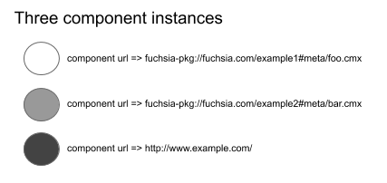
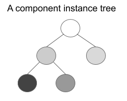
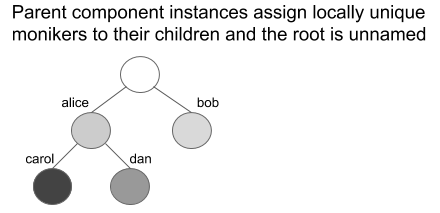
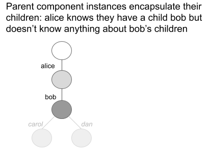
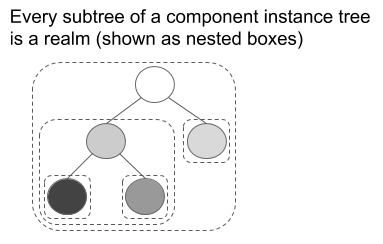
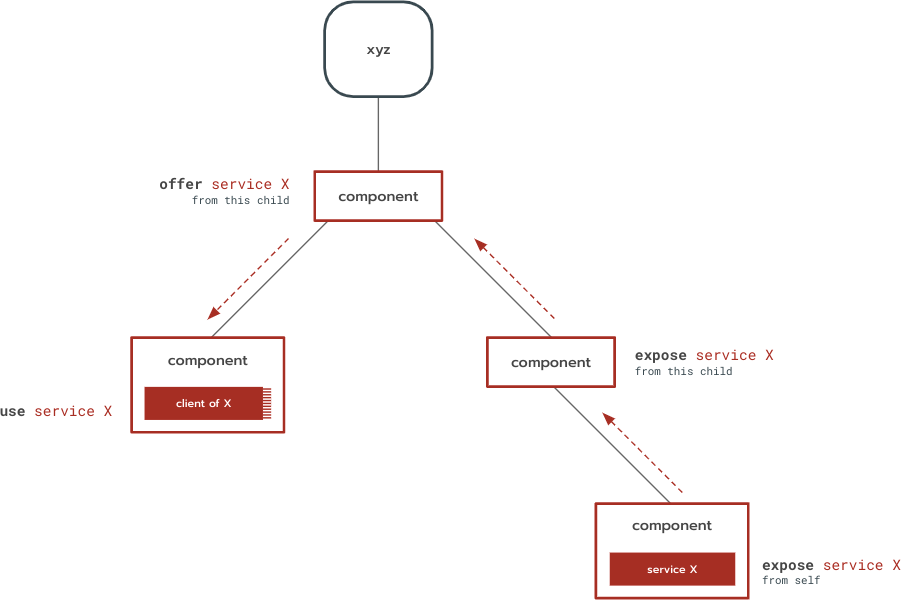
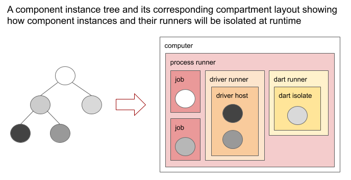

# Component Topology

The component topology is an abstract data structure that represents the
relationships among [component instances](#component-instances).

It is made of the following:

- Component instance tree: Describes how component instances are
  [composed](#composition) together (their parent-child relationships).
- Capability routing graph: Describes how component instances gain access to
  use capabilities exposed by other component instances (their
  provider-consumer relationships).
- Compartment layout: Describes how component instances are
  isolated from one another and the resources their sandboxes may share at
  runtime (their isolation relationships).

The structure of the component topology greatly influences how components
run and obtain capabilities.

## Component Instances {#component-instances}

A component instance is a distinct embodiment of a component running in its own
sandbox that is isolated from other instances of the same component and of
other components.

You can often use the terms component and component instance interchangeably
when the context is clear. For example, it would be more precise to talk about
"starting a component instance" rather than "starting a component" but you
can easily infer that "starting a component" requires an instance of that
component to be created first so that the instance can be started.

## Component Instance Tree {#composition}

The component instance tree expresses how components are assembled together
to make more complex components.

Using hierarchical composition, a parent component creates instances of other
components which are known as its children. The newly created children belong
to the parent and are dependent upon the parent to provide them with the
capabilities that they need to run. Meanwhile, the parent gains access to the
capabilities exposed by its children through
[capability routing](#capability-routing).

Children can be created in two ways:

- Statically: The parent declares the existence of the child in its own
  [component declaration](#component-declarations). The child is destroyed
  automatically if the child declaration is removed in an updated version of
  the parent's software.
- Dynamically: The parent uses [realm services][doc-realms] to add
  a child to a [component collection][doc-collections] that the parent declared.
  The parent destroys the child in a similar manner.

The component topology represents the structure of these parent-child
relationships as a [component instance tree][glossary-component-instance-tree].

## Monikers {#monikers}

A moniker identifies a specific component instance in the component tree
using a topological path. Monikers are collected in system logs and for
persistence.

See the [monikers documentation][doc-monikers] for details.

## Encapsulation {#encapsulation}

The capabilities of child components cannot be directly accessed outside of the
scope of their parent; they are fully encapsulated.

Children remain forever dependent upon their parent; they cannot be reparented
and they cannot outlive their parent. When a parent is destroyed so are all
of its children.

This model resembles [composition][wiki-object-composition] in object-oriented
programming languages.

## Realms {#realms}

A realm is a subtree of component instances formed by
[hierarchical composition](#composition). Each realm is rooted by a component
instance and includes all of that instance's children and their descendants.

Realms are important [encapsulation](#encapsulation) boundaries in the
component topology. The root of each realm receives certain privileges to
influence the behavior of components, such as:

- Declaring how capabilities flow into, out of, and within the realm.
- Binding to child components to access their services.
- Creating and destroying child components.

See the [realms documentation][doc-realms] for more information.

## Capability Routing Graph {#capability-routing}

The capability routing graph describes how components gain access to use
capabilities exposed and offered by other components in the component topology.

See the [capability routing documentation][doc-capability-routing]
for more information.

## Compartments {#compartments}

A compartment is an isolation boundary for component instances. It is an
essential mechanism for preserving the
[confidentiality, integrity, and availability][wiki-infosec] of components.

Physical hardware can act as a compartment. Components running on the
same physical hardware share CPU, memory, persistent storage, and peripherals.
They may be vulnerable to side-channels, privilege elevation, physical attacks,
and other threats that are different from those faced by components running
on different physical hardware. System security relies on making effective
decisions about what capabilities to entrust to components.

A [job][glossary-job] can act as a compartment. Running a component in its
own job ensures that the component's [processes][glossary-process] cannot
access the memory or capabilities of processes belonging to other components
in other jobs. The component framework can also kill the job to kill all of
the component's processes (assuming the component could not create processes
in other jobs). The kernel strongly enforces this isolation boundary.

A [runner][doc-runners] provides a compartment for each component that it runs.
The runner is responsible for protecting itself and its runnees from each
other, particularly if they share a runtime environment (such as a process)
that limits the kernel's ability to enforce isolation.

Compartments nest: runner provided compartments reside in job compartments
which themselves reside in hardware compartments. This encapsulation clarifies
the responsibilities of each compartment: the kernel is responsible for
enforcing job isolation guarantees so a runner doesn't have to.

Some compartments offer weaker isolation guarantees than others. A job offers
stronger guarantees than a runner so sometimes it makes sense to run multiple
instances of the same runner in different job compartments to obtain those
stronger guarantees on behalf of runnees. Similarly, running each component
on separate hardware might offer the strongest guarantees but would be
impractical. There are trade-offs.

See the [compartment documentation][doc-compartments]
for more information.

[doc-collections]: realms.md#collections
[doc-manifests]: component_manifests.md
[doc-realms]: realms.md
[glossary-job]: ../../glossary.md#job
[glossary-process]: ../../glossary.md#process
[wiki-infosec]: https://en.wikipedia.org/wiki/Information_security
[wiki-least-privilege]: https://en.wikipedia.org/wiki/Principle_of_least_privilege
[wiki-object-composition]: https://en.wikipedia.org/wiki/Object_composition
