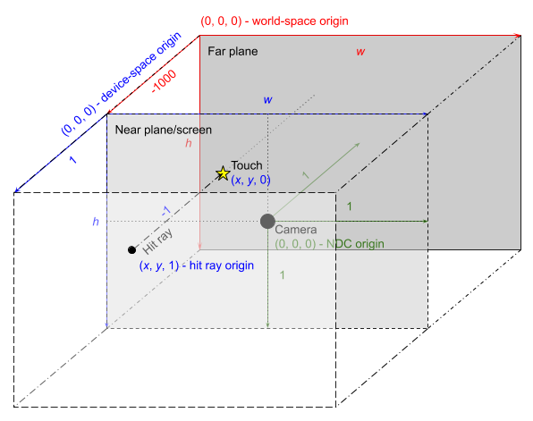

# Views, Bounds, and Clipping

- [Introduction](#introduction)

- [Concepts](#concepts)
  - [Setting View Bounds](#setting-view-bounds)
    - [Bound Extent and Insets](#bound-extent-and-insets)
    - [Example](#example-1)
  - [Coordinate System](#coordinate-system)
    - [Example](#example-2)
  - [Centering Geometry](#centering-geometry)
  - [Debug Wireframe Rendering](#debug-wireframe-rendering)
  - [Ray Casting and Hit Testing](#ray-casting-and-hit-testing)
    - [The Hit Ray](#the-hit-ray)
    - [Rules](#rules)
    - [Edge Cases](#edge-cases)
    - [Pixel Offsets](#pixel-offsets)
      - [Example](#example-3)

# Introduction

This is a guide that explains how view bounds and clipping work in Scenic. This guide explains how to set view bounds, how to interpret what the commands are doing, and the effects that the view bounds have on existing Scenic subsystems.

# Concepts

## Setting View Bounds {#setting-view-bounds}

An embedder must create a pair of tokens for a view and view holder, and must also allocate space within its view for the embedded view holder to be laid out. This is done by setting the bounds on the view holder of the embedded view. To set the view bounds on a view, you have to call `SetViewProperties` on its respective ViewHolder. You can call `SetViewProperties` either before or after the view itself is created and linked to the ViewHolder, so you do not have to worry about the order in which you do your setup. The bounds themselves are set by specifying their minimum and maximum points (xyz) in 3D space.

### Bound Extent and Insets {#bound-extent-and-insets}

There are four values needed to set a view's bounds properly, `bounds_min`, `bounds_max`, `inset_min` and `inset_max`. The minimum and maximum bounds represent the minimum and maximum coordinate points of an axis-aligned bounding box. The minimum and maximum insets specify the distances between the view’s bounding box and that of its parent. So the final extent of a view's bounds can be defined with the following formula:

```cpp
{ bounds_min + inset_min, bounds_max - inset_max}
```

### Example {#example-1}

```cpp
// Create a pair of tokens to register a view and view holder in
// the scene graph.
auto [view_token, view_holder_token] = scenic::ViewTokenPair::New();

// Create the actual view and view holder.
scenic::View view(session, std::move(view_token), "View");
scenic::ViewHolder view_holder(session, std::move(view_holder_token),
                               “ViewHolder");
// Set the bounding box dimensions on the view holder.
view_holder.SetViewProperties({.bounding_box{.min{0, 0, -200}, .max{500, 500, 0}},
                               .inset_from_min{20, 30, 0},
                               .inset_from_max{20, 30, 0}});
```

The above code creates a View and ViewHolder pair whose bounds start at (20,&nbsp;30,&nbsp;-200) and extend out to (480,&nbsp;470,&nbsp;0). The bounds themselves are always axis-aligned.

## Coordinate System {#coordinate-system}

View bounds are specified in local coordinates, and their world-space position is determined by the global transform of the view node.

Input coordinates originate from input device space, which usually corresponds to pixel coordinates with an origin at the upper left of the screen. The input system works with the compositor and camera to map from input device coordinates to world space by way of [Ray Casting and Hit Testing](#ray-casting-and-hit-testing).

### Example {#example-2}

```cpp
// Create a view and view-holder token pair.
auto [view_token, view_holder_token] = scenic::ViewTokenPair::New();
scenic::View view(session, std::move(view_token), "View");
scenic::ViewHolder view_holder(session, std::move(view_holder_token),
                               "ViewHolder");

// Add the view holder as a child of the scene.
scene.AddChild(view_holder);

// Translate the view holder and set view bounds.
view_holder.SetTranslation(100, 100, 200);
view_holder.SetViewProperties({.bounding_box{.max{500, 500, 200}}});
```

In the above code, the view bounds in local space have a min and max value of (0,&nbsp;0,&nbsp;0) and (500,&nbsp;500,&nbsp;200), but since the parent node is translated by (100,&nbsp;100,&nbsp;200) the view bounds in world space will actually have a world space bounds min and max of (100,&nbsp;100,&nbsp;200) and (600,&nbsp;600,&nbsp;400) respectively. However, the view itself doesn’t see these world-space bounds, and only deals with its bounds in its own local space.

## Centering Geometry {#centering-geometry}

The center of mass for a piece of geometry such as a `RoundedRectangle` is its center, whereas for a view, the center of mass for its bounds is its minimum coordinate. This means that if a view and a rounded-rectangle that is a child of that view both have the same translation, the center of the rounded-rectangle will render at the minimum-coordinate of the view’s bounds. To fix this, apply another translation on the shape node to move it to the center of the view’s bounds.


## Debug Wireframe Rendering {#debug-wireframe-rendering}

To help with debugging view bounds, you can render the edges of the bounds in wire-frame mode to see where exactly your view is located in world space. This functionality can be applied per-view using a Scenic command:

```cpp
// This command turns on wireframe rendering of the specified
// view, which can aid in debugging.
struct SetEnableDebugViewBoundsCmd {
    uint32 view_id;
    bool display_bounds;
};
```

This command takes in a `view id`, and a `bool` to toggle whether or not the view bounds should be displayed. The default display color is white, but you can choose different colors by running the `SetViewHolderBoundsColorCmd` on the specified view holder:

```cpp
// This command determines the color to be set on a view holder’s debug
// wireframe bounding box.
struct SetViewHolderBoundsColorCmd {
    uint32 view_holder_id;
    ColorRgbValue color;
};
```

## Ray Casting and Hit Testing {#ray-casting-and-hit-testing}

Hit testing by ray casting maps input device coordinates to scene geometry and coordinates. Ultimately, inputs are delivered to views with view coordinates. As described in the [Coordinate System](#coordinate-system) section, view coordinates are determined by the global transform of the view node, which maps from world space to view coordinates.

### The Hit Ray {#the-hit-ray}

The conversion from input device space to world space involves the input system, compositor layer, and camera.



The original input coordinate is a two-dimensional coordinate in screen pixels. The input system and compositor agree on a convention, illustrated above as device coordinates in 3 dimensions (blue), where the viewing volume has depth 1, the near plane is at z = 0, and the far plane is at z = -1. With this in mind, the input system constructs a hit ray with its origin at the touch coordinates at a distance of 1 behind the camera, z = 1, and direction (0,&nbsp;0,&nbsp;-1), towards the scene.

The input device space as described here is a left-handed coordinate system, a holdover from when Scenic was left-handed. Future work may adjust the z convention of input device space to match NDC or the viewing volume, as a right-handed coordinate system, and adjust the hit ray to originate at the near plane, z = 0.

The compositor layer transforms this ray into NDC (green) and then applies the inverse camera transforms (clip-space, projection, and camera positioning) to project the ray into the scene (world coordinates, red). The above illustration reflects the orthographic camera coded into Scenic, with scene origin at the upper left of the far plane, viewing volume width and height reflecting device dimensions, and viewing depth 1000, such that the near plane is at z = -1000. (In actuality, the orthographic camera itself is positioned at z = -1010, but this does not affect the math in an orthographic projection.)

In world space then, the hit ray described above originates at (_x_,&nbsp;_y_,&nbsp;-2000) with direction (0,&nbsp;0,&nbsp;1000).

### Rules {#rules}

When performing hit tests, Scenic runs tests against the bounds of a `ViewNode` before determining whether the ray should continue checking children of that node.

* If a ray completely misses a view’s bounding box, nothing that is a child of that   view will be hit.

* If a ray does intersect a bounding box, only geometry that exists within the range of the ray’s entrance and exit from the bounding box will be considered for a hit. For example, clipped geometry cannot be hit.

If you forget to set the bounds for a view, any geometry that exists as a child of that view cannot be hit. This is because the bounds would be null and therefore infinitely small, which also means that there would be no geometry rendered to the screen.

In debug mode, a null bounding box will trigger an `FXL_DCHECK` in the `escher::BoundingBox` class stating that the bounding box dimensions need to be greater than or equal to 2.

### Edge Cases {#edge-cases}

 Situations where a ray is perpendicular to a side of a bounding box and just grazes its edge will not count as a hit. Since the six planes that constitute the bounding box are themselves the clip planes, it follows that anything that is directly on a clip plane would also get clipped.

### Collisions {#collisions}

A collision occurs when a ray cast detects two or more hits at the same distance. A collision indicates that hittable targets are overlapping and occupying the same position in the scene. This is considered incorrect behavior and Scenic does not provide hit test ordering guarantees in case of collisions. The client must prevent collisions.

There are two ways collisions can occur:

* Collision between nodes in the same view. The owning view must ensure the proper placement of elements within a view.

* Collision between nodes in separate views. The parent view must prevent any intersection between the clip bounds of its children.

It is also best practice to follow these rules to avoid Z-fighting for visual content.

When a collision is detected, a warning is logged of the colliding nodes by session id and resource id.