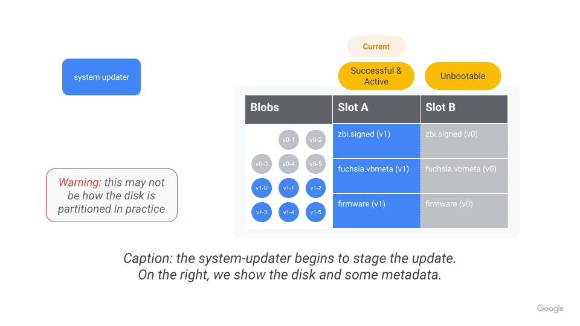
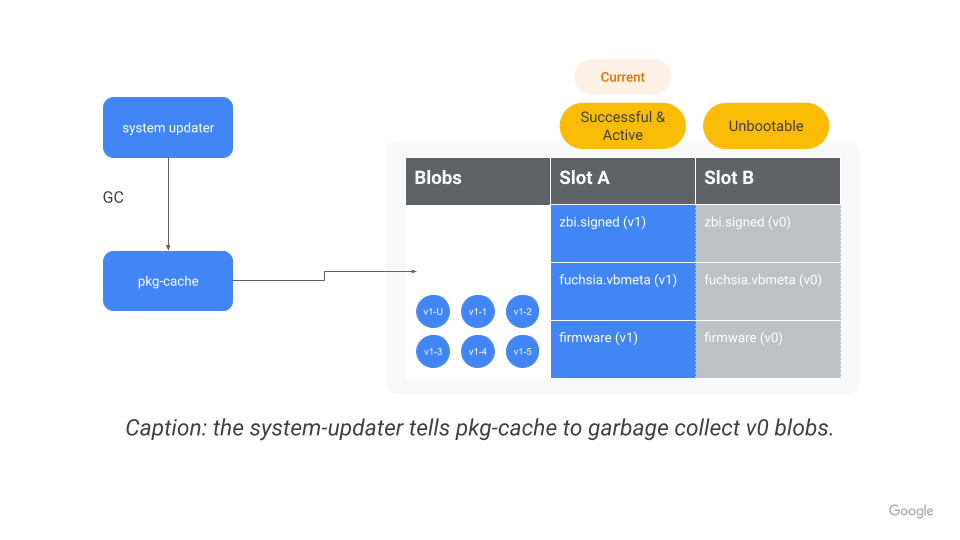
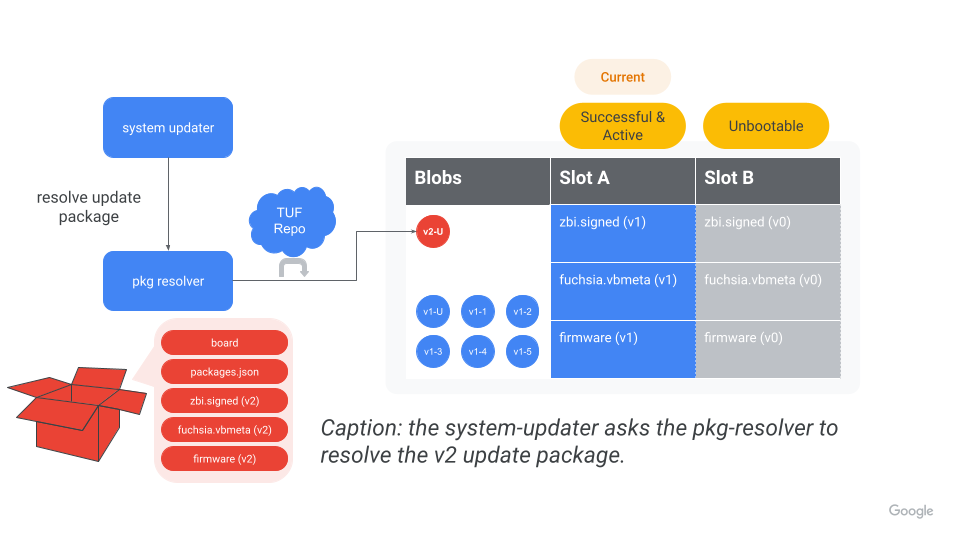
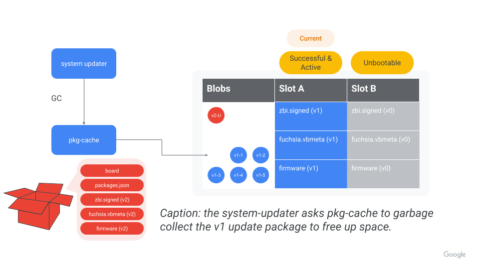
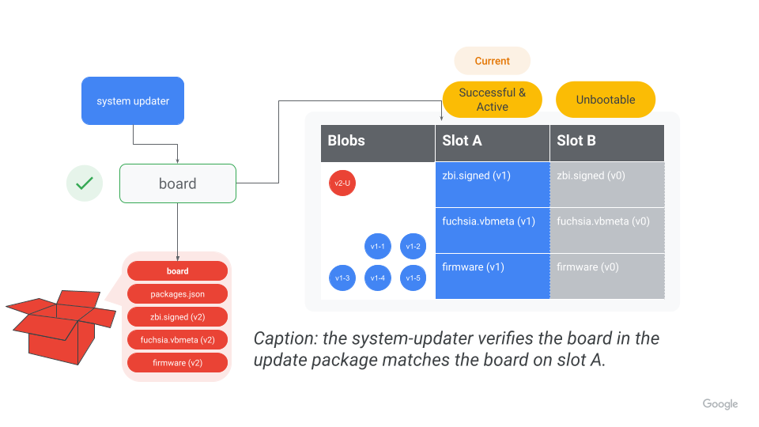
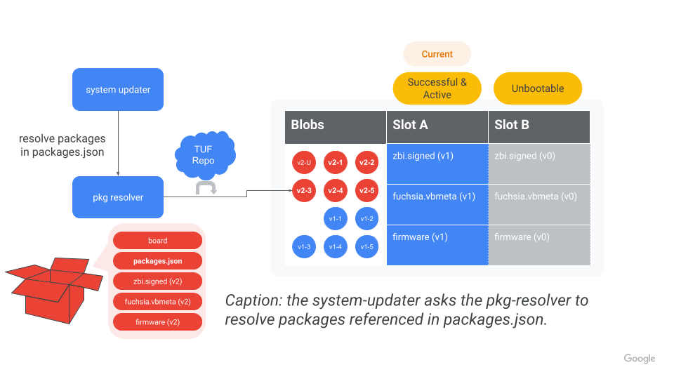
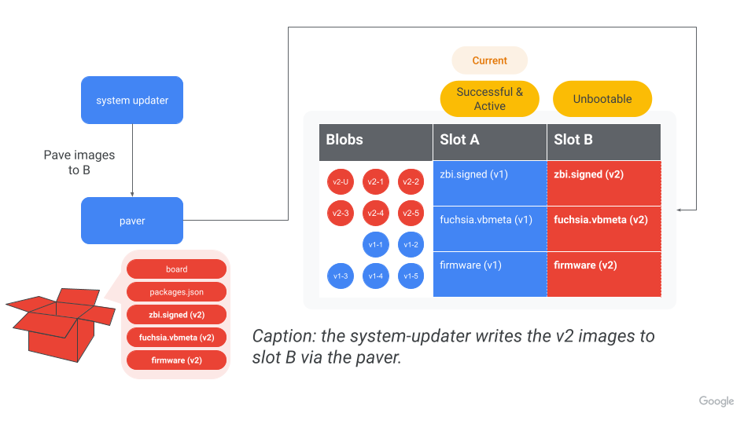
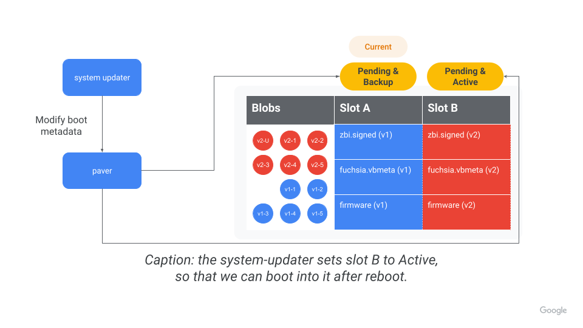
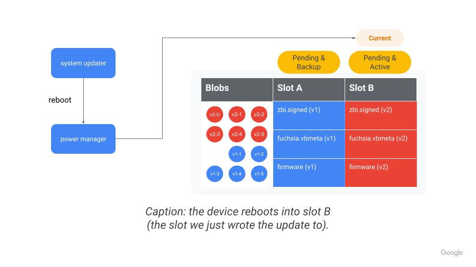

# System updates

System updates, otherwise known as Over-The-Air updates (OTAs), are a mechanism for monolithic OS
updates on Fuchsia. This doc aims to centralize the most up-to-date information about the OTA flow.

## Phase 1: Checking for an update
All system updates need to start somewhere. The two entry points into this process are omaha-client
and the system-update-checker. On any given system, only one of these components may be running.

### Update checks with omaha-client
First, let’s describe systems which use omaha-client. During boot, omaha-client starts up and begins
periodic update checks. During these checks, omaha-client polls the Omaha server to check for
updates.

Omaha is an update availability management protocol. We’re not going to dive into the specifics of
the Omaha server here (though you can read more about it [here](https://github.com/google/omaha)).
The benefits of using Omaha are:

* It allows for fractional rollout. For example, we can choose to update 10% of a fleet.
  Specifically, only 10% of devices will get the “Yes, here’s the update pkg” when polling Omaha.
  The remaining 90% will get “No”.
  * Moving forward, we can keep updating more devices in the fleet (e.g. 20%, 50%, etc) until all
    devices are up to date.
  * Alternatively, we can choose to continue updating only the original 10% of devices, without
    touching the 90%.
* It allows for different update channels. For example, dogfood devices can get updates from the
  dogfood channel and get the newest (possibly unstable) software. Whereas production devices can
  get updates from the production channel and get the most stable software. Channel information can
  be optionally given to Omaha along with product and version.


The diagram above shows a simplified version of the update check process with omaha-client.
In practice, there are policies that gate whether omaha-client can check for an update or apply an
update.

Once omaha-client gets the update package URL from the omaha server, omaha-client tells the
system-updater to start an update.

### Update checks with system-update-checker
Devices that don’t use omaha-client will instead use the system-update-checker. Depending on how
it's [configured], the system-update-checker regularly polls for an update package. These checks
default to disabled if no auto_update is specified.

To check if an update is available, the system-update-checker checks these conditions:

* Is the hash of the currently running system image (found at /pkgfs/system/meta) different from
  the hash of system image (found in packages.json) in the update package?
* If the system image isn’t different, is the vbmeta that’s currently running on the system
  different from the vbmeta of the update package?
* If there is no vbmeta, is the ZBI that’s currently running on the system different from the ZBI
  of the update package?

If _any_ of these answers are “yes”, then the system-update-checker knows the update package has
changed*. Once the system-update-checker realizes the update package has changed, the
system-update-checker tells the system-updater to start an update using the default update package
(fuchsia-pkg://fuchsia.com/update).


The diagram above shows a simplified version of the update check process the system-update-checker.

To short-circuit the checks to the vbmeta or ZBI, the update checker saves the update hash if no
update is required after performing the vbmeta and ZBI checks. On subsequent checks for an update,
the hash of the update package we just fetched is checked against the last known hash. If the hashes
 are the same, no update is triggered. If the hashes are different, the vbmeta and ZBI is then
 checked for changes to determine if an update is necessary.

*There is currently no way to check bootloader-only updates because there is no [paver API] to read
the firmware. An update will not be triggered even though the update package has changed. Until
this is fixed, developers should use `update force-install <update-pkg-url>` to force an update in
this situation.

### Why have both omaha-client and the system-update-checker?
Both the omaha-client and system-update-checker serve the same role: to find out if we have an
update and kick off the update process. If both components serve the same role, then why do we have
both?

We know we want to use Omaha to manage updates for some products. However, we are also an
open-source project that needs to be able to update. In order to support both use cases, we need two
different components. Products should use omaha-client if they want to use Omaha to determine update availability. Products should use system-update-checker if they don’t want to use Omaha, and instead
want to check for updates directly from package repositories.

## Phase 2: Staging an update
Regardless of how we got here (e.g. a request from omaha-client, the system-update-checker, or a
forced update check by the user), it’s time to stage an update (e.g. write it to disk). In this
section, we'll consider a hypothetical update from version 1 to version 2. Without loss of
generality, assume we are writing an update to the B partition.




### Step 1: Garbage collection
First, the system-updater tells the pkg-cache to do garbage collection (delete all blobs that aren’t
referenced in either the static or dynamic index). This step cleans up most of the blobs referenced
by the old system.

Note this does NOT garbage collect the old update package because the old update package is
referenced in the dynamic index.



### Step 2: Fetch update package
Then, the system-updater fetches the [update package], using the provided update package URL.
The dynamic index is then updated to reference the new update package. A sample update package may
look like this:

```
/board
/firmware
/fuchsia.vbmeta
/meta
/packages.json
/recovery.vbmeta
/version
/zbi.signed
/zedboot.signed
```

Update packages may optionally contain an update-mode file. This file controls whether the system
update happens in Normal or ForceRecovery mode. If the update-mode file is not present, the
system-updater defaults to the Normal mode.

At a high level, when the mode is ForceRecovery, the system-updater writes an image to recovery,
marks slots A and B as unbootable, then boots to recovery. For simplicity, we won’t discuss the
nuances of ForceRecovery in this doc (see the [code] for more info).

The rest of this document assumes the system update is happening in Normal mode.



### Step 3: Garbage collection (again)
Now that the old update package is no longer referenced by the dynamic index, we trigger another
garbage collection to delete the old update package. We do this because we want to free up as much
space as possible before we fetch the rest of the new packages.



### Step 4: Verify board matches
The current running system has a board file at /config/build-info/board. At this point, the
system-updater will verify the board file on the system matches the board file in the update
package.



### Step 5: Fetch remaining packages
Next, the system-updater parses the packages.json file in the update package. Packages.json is in
the form:

```json
{
  "version": “1”,
  "content": [
    "fuchsia-pkg://fuchsia.com/sshd-host/0?hash=123..abc",
    "fuchsia-pkg://fuchsia.com/system-image/0?hash=456..def"
    ...
  ]
}
```

The system-updater then tells the pkg-resolver to resolve all the URLs. When fetching packages, the
package management system ensures we only fetch the blobs we [need]...that is, we only fetch blobs
that have changed or that aren’t currently on the system. Note the package management system
fetches entire blobs, as opposed to diff of whatever might currently be on the system.

Once we fetch all packages, we trigger a BlobFs sync to flush to persistent storage and ensure we’ve
got all the blobs we need for the new system version in blobfs.



### Step 6: Write images to block device
First, the system-updater figures out which images we want to write to the block device. There’s
some [magic] behind the scenes that we won’t go over here. There’s also two kinds of images: assets
and firmware. For simplicity, we won’t discuss the difference in detail here, though feel free to
check out the [source code] if you are curious.

Then, the system-updater tells the paver to write the bootloader and firmware. Where we write these
images does NOT depend on whether the device supports ABR ([these paver APIs don’t even take in a
configuration]). To prevent flash wear, we only write to a partition if the image we’re writing is
different from the image already on the block device.

Next, the system-updater tells the paver to write the fuchsia zbi and its vbmeta. Where we write
these images depends on whether the device supports ABR ([the paver API for this takes in a
configuration to write to]). If the device supports ABR, we’ll write the fuchsia zbi and its vbmeta
to the slot that’s not currently booted (e.g. the “alternate” slot). Otherwise, we’ll write them to
both the A and B partitions (if a B partition exists).

Finally, the system-updater tells the paver to write the recovery zbi and its vbmeta. Like the
bootloader and firmware, where we write recovery does NOT depend on if the device supports ABR.



### Step 7: Set alternate partition as active
If the device supports ABR, the system-updater will use the paver to set the alternate partition as
active. That way, the device will boot into the alternate partition on the next boot. This is
important because we just wrote the new version to the alternate partition!

There are a couple of ways we can refer to slot state: Active, Inactive, Bootable, Unbootable,
Current, Alternate, Healthy/Successful, etc. [Under the hood], what it really comes down to is 3
pieces of metadata we store for each kernel slot, that we can use to reason about which “state” the
slot is in. For example, BEFORE we mark B as active in the example, the metadata might look like:

|     Metadata    | Slot A | Slot B |
|:---------------:|:------:|:------:|
|     Priority    |   15   |    0   |
| Tries Remaining |    0   |    0   |
|     Healthy*    |    1   |    0   |

AFTER we mark B as active, the metadata would then look like:

|     Metadata    | Slot A | Slot B |
|:---------------:|:------:|:------:|
|     Priority    | **14** |**15****|
| Tries Remaining |    0   |**7**** |
|     Healthy     |    1   |    0   |

If the device doesn’t support ABR, we skip this since there is no alternate partition. Instead,
there is an active partition that we write to on every update.

*The paver internally calls this “[Successful]”, but the [FIDL service] uses “Healthy”. To be
consistent with the FIDL, here we will use “Healthy”.

**These numbers are based on the [hardcoded] maxes for priority and tries remaining (at the time
this doc is written).



### Step 8: Reboot (or wait for reboot)
Depending on the update configuration, the device may or may not reboot. After the device eventually
reboots, we’ll boot into the new slot. More on this in the next section.




## Phase 3: Committing an update
Without loss of generality, assume we just wrote the update to the B partition (as in the example).
But how confident are we that the newly updated system will work? Surely, we’d like to make sure
slot B works before giving up on the blobs in slot A. In this phase, we address these questions.

### Rebooting into the updated version
On the next boot, the bootloader first needs to [figure out] which slot to boot into. The bootloader
determines we should boot into B because Slot B has a higher priority and tries remaining >0 (see
"Staging an update" for context). Then, the bootloader verifies the ZBI of B matches the vbmeta of
B, and finally boots into B.

After early boot, fshost launches pkgfs using the new system-image package (that is, the system
image package that was referenced in the packages.json we used while staging the update). The
system-image package has a static_packages file in it that lists the base packages for the new
system. e.g.

```
pkg-resolver/0 = new-version-hash-pkg-resolver
foo/0 = new-version-hash-foo
bar/0 = new-version-hash-bar
...
// Note the system-image package is not referenced in static_packages
// because it's impossible for it to refer to its own hash.
```

Pkgfs then loads all these packages as base packages. The packages appear in
/pkgfs/{packages, versions}, and then we consider them “installed” or “activated”.At this point,
we can start appmgr, which starts the pkg-resolver, pkg-cache, netstack, etc.

### Committing the update
At this point, we launch the system-update-committer, which is the component responsible for
committing the update. On launch, the system-update-committer verifies the new update is good by
running various checks. For example, it asks BlobFs to write a blob. If the system is already
committed on boot, we skip the checks. Note: this check framework is currently being developed
(see [fxbug.dev/54357](https://bugs.fuchsia.dev/p/fuchsia/issues/detail?id=54357) for tracking).

After the update is verified, we’ll first mark the current partition (slot B) as healthy. Using the
example from the “Staging an update” section, the boot metadata might now look like:

|     Metadata    | Slot A | Slot B |
|:---------------:|:------:|:------:|
|     Priority    |   14   |   15   |
| Tries Remaining |  **7** |  **0** |
|     Healthy     |  **0** |  **1** |

Then, we'll mark the alternate partition (slot A) as unbootable. Now, the boot metadata might now
look like:

|     Metadata    | Slot A | Slot B |
|:---------------:|:------:|:------:|
|     Priority    |  **0** |   15   |
| Tries Remaining |  **0** |    0   |
|     Healthy     |    0   |    1   |

Once all of this happens, we consider the update committed. This means:

* We will always boot into slot B until the next system update.
* We are “giving up” on falling back to slot A (one might call this the [point of no return]).
  * We won’t boot into A again until the next system update overwrites slot A.
  * The blobs referenced by slot A are now able to be garbage collected.
* Subsequent system updates are now allowed. When the update checker discovers a new update,
  the whole process starts over again.

[configured]: https://cs.opensource.google/fuchsia/fuchsia/+/master:src/sys/pkg/bin/system-update-checker/BUILD.gn;l=114;drc=50245a9ce68f3b877e165b004175e2a4fc12eaef
[paver API]: https://fuchsia.dev/reference/fidl/fuchsia.paver#DataSink
[update package]: /docs/concepts/packages/update_pkg.md
[code]: https://cs.opensource.google/fuchsia/fuchsia/+/master:src/sys/pkg/bin/system-updater/src/update.rs;l=429;drc=202c37fa01f75c431f61ca824b4d2f7c2ec82178
[need]: https://cs.opensource.google/fuchsia/fuchsia/+/master:src/sys/pkg/bin/pkg-resolver/src/cache.rs;l=275;drc=c557680c2d1d59f4ec4f31981b08610bec7c8514
[magic]: https://cs.opensource.google/fuchsia/fuchsia/+/master:src/sys/pkg/bin/system-updater/src/update.rs;l=507;drc=202c37fa01f75c431f61ca824b4d2f7c2ec82178
[source code]: https://cs.opensource.google/fuchsia/fuchsia/+/master:src/sys/pkg/bin/system-updater/src/update/paver.rs;l=200;drc=216f7ea082148714bac1e95299c1bc8b087dc1d8
[these paver APIs don’t even take in a configuration]: https://fuchsia.dev/reference/fidl/fuchsia.paver#fuchsia.paver/DynamicDataSink.WriteBootloader
[the paver API for this takes in a configuration to write to]: https://fuchsia.dev/reference/fidl/fuchsia.paver#fuchsia.paver/DynamicDataSink.WriteAsset
[Under the hood]: https://cs.opensource.google/fuchsia/fuchsia/+/master:src/firmware/lib/abr/include/lib/abr/data.h;l=32;drc=bea16aa2d8a0bbc293a82ed44e03525ebe13bc94
[Successful]: https://cs.opensource.google/fuchsia/fuchsia/+/master:src/firmware/lib/abr/include/lib/abr/data.h;l=43;drc=bea16aa2d8a0bbc293a82ed44e03525ebe13bc94
[FIDL service]: https://fuchsia.dev/reference/fidl/fuchsia.paver#fuchsia.paver/BootManager.SetActiveConfigurationHealthy
[hardcoded]: https://cs.opensource.google/fuchsia/fuchsia/+/master:src/firmware/lib/abr/include/lib/abr/data.h;l=28;drc=bea16aa2d8a0bbc293a82ed44e03525ebe13bc94
[figure out]: https://cs.opensource.google/fuchsia/fuchsia/+/master:src/firmware/lib/abr/flow.c;l=197;drc=bea16aa2d8a0bbc293a82ed44e03525ebe13bc94
[point of no return]: https://www.youtube.com/watch?v=2v8YragSIuI