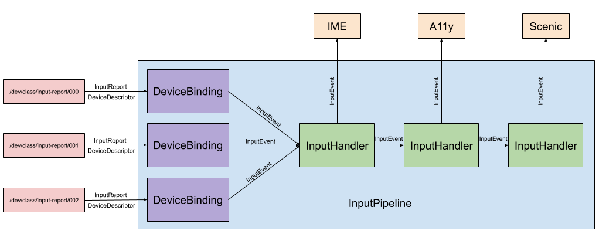

# Input client library

## Overview

The input library tracks available input devices, manages device state, and allows session to
register handlers for events.

The session creates an input pipeline that is configured for the specific product. First the session
decides which types of input devices the input pipeline should support. Then the session registers
input handlers for input events. The input library provides implementations for common input
handlers, such as Scenic and input method editors (IME). After the session instantiates components that
consume input, the input pipeline directly sends input events to those components through the registered
input handlers.

## Input pipeline

An input pipeline manages `InputDeviceBindings` and `InputHandlers`.

* An `InputDeviceBinding` represents a connection to a physical input device (e.g. mouse, keyboard).
* An `InputHandler` represents a client of `InputEvents`.



An input pipeline routes input from physical devices to various clients. An input pipeline does the following:

1. Detects and binds to new input devices as they appear in `/dev/class/input-report`.
2. Propagates `InputEvents` through `InputHandlers`.

Session authors are responsible for setting up input pipelines. More details on how can be found in
[input_pipeline.rs](/src/session/lib/input/src/input_pipeline.rs).

### InputDeviceBinding

An `InputDeviceBinding` does the following:

1. Connects to an `InputReport` file located at `/dev/class/input-report/XXX`.
2. Generates `InputEvents` from the `DeviceDescriptor` and incoming `InputReports`.

The input pipeline creates and owns `InputDeviceBindings` as new input peripherals are connected to
a device.

### InputHandler

When an `InputHandler` receives an `InputEvent`, it does at least one of the following:

* Forwards the `InputEvent` to the relevant client component.
* Outputs a vector of `InputEvents` for the next `InputHandler` to process.

`InputHandlers` must satisfy at least one of these conditions, but otherwise their implementation
details can vary.

In the following example, if the `MouseHandler` detects a mouse-typed input event, the handler sends
the event to Scenic and returns an empty vector. On all other types of input events, the
`MouseHandler` returns a vector containing the `InputEvent` for the next `InputHandler` to process.

```rust
#[async_trait]
impl InputHandler for MouseHandler {
   async fn handle_input_event(
       &mut self,
       input_event: InputEvent,
   ) -> Vec<InputEvent> {
       match input_event {
           InputEvent {
               device_event: InputDeviceEvent::Mouse(mouse_event),
               device_descriptor: InputDeviceDescriptor::Mouse(mouse_descriptor),
           } => {
               // ... Handler specific details
               self.send_events_to_scenic(...)).await;
               vec![] // InputEvent is consumed because it was sent to Scenic
           }
           _ => vec![input_event], // InputEvent is returned for the next InputHanlder
       }
   }
}
```

## Vocabulary

<table>
  <tr>
   <th>Term</th>
   <th>Definition</th>
  </tr>
  <tr>
   <td><a href="https://fuchsia.dev/reference/fidl/fuchsia.input.report#InputReport">InputReport</a>
   </td>
   <td>A stateless representation of an event from an input device. Zircon generates InputReports
   from HID Reports.
   </td>
  </tr>
  <tr>
   <td><a href="https://fuchsia.dev/reference/fidl/fuchsia.input.report#DeviceDescriptor">DeviceDescriptor</a>
   </td>
   <td>A struct containing information specific to an input device, e.g. the number of buttons on a
   mouse. Zircon generates DeviceDescriptors.
   </td>
  </tr>
  <tr>
   <td><a href="https://fuchsia.googlesource.com/fuchsia/+/refs/heads/master/src/session/lib/input/src/input_device.rs#27">InputEvent</a>
   </td>
   <td>An event from an input device containing context (a DeviceDescriptor) and state (e.g. phase
   and location of a button press). The input pipeline generates InputEvents from InputReports and
   DeviceDescriptors.
   </td>
  </tr>
</table>