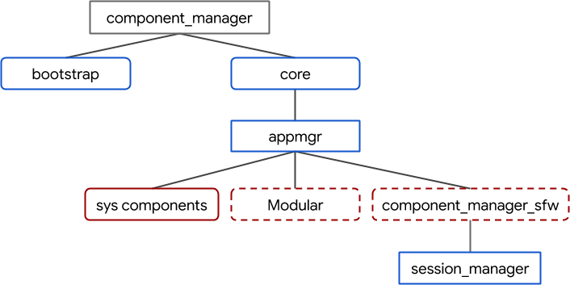

# Components v2 migration

## Goal & motivation

The Component Framework is one of the key foundations for Fuchsia's usermode
runtime environment. The original incarnation of components dates back to the
inception of the Fuchsia OS and the initial commits in 2016. The framework has
steadily evolved since then.

## Technical background

Last updated: **August 2021**

A high-level diagram of the system's component topology is shown below:

*   v2 components are shown in blue boxes.
*   v1 components are shown in red boxes.
*   Boxes with dashed lines represent components that are only present on some
    build configurations.

In addition, all [unit tests with generated manifests][unit-tests-generated]
are v2 components.

### Components v1 vs. v2

Presently there are two revisions of the Component Framework that exist on
Fuchsia, which are referred to as [Components v1][glossary.components-v1] and
[Components v2][glossary.components-v2].

Components v1 is largely comprised of:

*   [`appmgr`][appmgr], a program that manages the runtime environment for v1
    components. `appmgr` implements the root of the v1 components tree, as well
    as some foundational services such as the Components v1 ELF runner and
    Loader service.
*   [`sysmgr`][glossary.sysmgr], a component that manages the so-called `"sys"` realm.
    `sysmgr` is launched by `appmgr`.
*   The [`.cmx`][cmx] file format for v1 component manifests.
*   The [`fuchsia.sys.*`][fuchsia-sys] FIDL library.

Components v1 development reached its peak in 2018. In 2019, Fuchsia team began
developing [Component Framework v2][intro].

Components v2 is largely comprised of:

*   [Component manager][component_manager], a program that manages the runtime
    environment for v2 components. Component manager is now responsible for
    launching `appmgr`. `appmgr` has become a v2 component itself, which serves
    as the parent of all v1 components still present in the system.
*   The [`.cml`][cml] file format for v2 component manifests.
*   The [`fuchsia.sys2.*`][fuchsia-sys2] FIDL library.

In addition, both Components v1 and v2 use [`cmc`][cmc] (component manifest
compiler), a build-time host tool that processes all formats of component
manifest files.

#### Interoperability

Component manager launches `appmgr`, itself a v2 component, in order to manage
v1 components. All v1 components on the system run under `appmgr`. Users may
continue developing and maintaining v1 components while v2 migrations take place
at their own pace.

Build configurations that use the [Session Framework][session-framework] also
include the `session_manager` component. All v1-backed capabilities the session
needs are routed to the `session_manager` from `appmgr`.

### Terminology

Use this terminology when talking about the state of migrating a component and
its tests from v1 to v2.

&nbsp; | The component | Tests that exercise it
:----: | ------------- | ----------------------
**Fully migrated**|<ul><li>has a `.cml` file and no `.cmx` file</li><li>runs as v2 in all product builds</li></ul>|<ul><li>All automated tests run the component as a v2 component</li></ul>
**Partially migrated**|<ul><li>has a `.cml` file and a `.cmx` file</li><li>runs as v1 in some product configurations but not others, or is guarded by a flag to do so for development purposes</li></ul>|<ul><li>Some automated tests exist in which the component runs as a v2 component, but others run it as v1</li></ul>
**Prototyped**|<ul><li>runs as a v1 component in all product configurations</li><li>has a `.cml` file</li></ul>|<ul><li>All automated tests in CI/CQ run the component as v1</li><li>there are tests with the component as v2, but they don't run in CI/CQ</li></ul>
**Not migrated**|<ul><li>does not have a `.cml` file</li></ul>|<ul><li>There are no tests that run the component as v2</li></ul>

#### Examples
"root_presenter is _partially migrated_ but its tests are _not migrated_."

"stash and its tests are _fully migrated_."

"basemgr is a _partially migrated_ component with _partially migrated_ tests.
Specifically, ..."

"setui_service was _prototyped_ to v2 and it exposed some missing dependencies."

## How to help

Last updated: **August 2021**

### Picking a task

Components v2 migrations are happening throughout the system. Any component that
still has at least one `.cmx` file is a migration candidate.

For legacy `sys` realm components you may use the [self-service migration
guide][migrating-sys-components]. Multiple component owners have recently seen
success in using this guide, including but not limited to:

*   Software Delivery
*   Netstack
*   Wlan
*   Bluetooth
*   Cobalt
*   Archivist

### Doing a task

Component migrations may take multiple incremental steps to complete due to
dependencies between other components that have not been migrated yet.
For example, a component and its tests can be migrated separately.
For more details on the incremental stages, see [terminology](#terminology).

The final step for migrating a component from v1 to v2 typically involves
replacing all `.cmx` files with equivalent `.cml` files.
For detailed instructions on migrating a component and its tests, see the
[self-service migration guide][migrating-sys-components].

### Completing a task

Send code reviews to owners of the directories with the component definitions
that you're changing, and to people listed below who volunteered to help with
these migrations:

*   jmatt@google.com
*   geb@google.com
*   yeg@google.com

New volunteer? Please add yourself to the list!

## Examples

*  [504575: [http-client] Migrate to Components v2](https://fuchsia-review.googlesource.com/c/fuchsia/+/504575)
*  [504523: [soundplayer] transition to CFv2](https://fuchsia-review.googlesource.com/c/fuchsia/+/504523)
*  [489757: [device_settings] Migrate to CFv2](https://fuchsia-review.googlesource.com/c/fuchsia/+/489757)

## Sponsors

Reach out for questions or for status updates:

*   <jmatt@google.com>
*   <shayba@google.com>
*   <component-framework-dev@fuchsia.dev>

[appmgr]: /src/sys/appmgr
[glossary.components-v1]: /docs/glossary/README.md#components-v1
[glossary.components-v2]: /docs/glossary/README.md#components-v2
[cmc]: /tools/cmc/
[cml]: /docs/concepts/components/v2/component_manifests.md
[cmx]: /docs/concepts/components/v1/component_manifests.md
[component_manager]: /docs/concepts/components/v2/component_manager.md
[fuchsia-sys2]: https://fuchsia.dev/reference/fidl/fuchsia.sys2
[fuchsia-sys]: https://fuchsia.dev/reference/fidl/fuchsia.sys
[initial-processes]: /docs/concepts/booting/everything_between_power_on_and_your_component.md#initial-processes
[intro]: /docs/concepts/components/v2/introduction.md
[label-cf-v2-migration]: https://bugs.fuchsia.dev/p/fuchsia/issues/list?q=label%3Acf-v2-migration
[migrating-sys-components]: /docs/development/components/v2/migration.md
[session-framework]: /docs/concepts/session/introduction.md
[sfw]: /docs/concepts/session/introduction.md
[glossary.sysmgr]: /docs/glossary/README.md#sysmgr
[unit-tests-generated]: /docs/development/components/build.md#unit-tests
