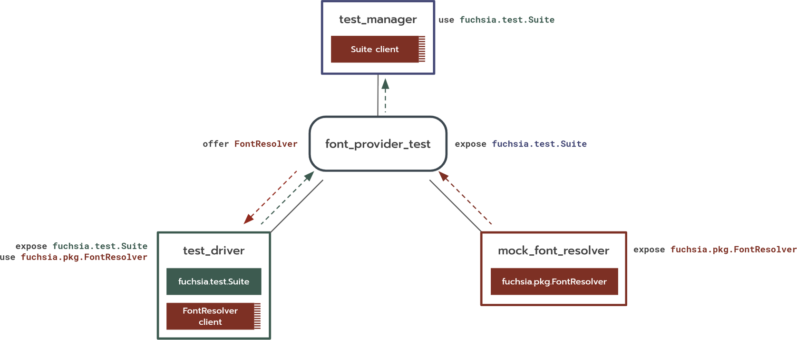

# Migrating system components

This document provides instructions for migrating a system component from
[Components v1][glossary.components-v1] to
[Components v2][glossary.components-v2]. A *system component* is a component
that exists to provide services to other components in the system. Typically, in
Components v1 the mapping of service to component is registered in a
[sysmgr configuration file][sysmgr-config].

To migrate your system component from v1 to v2, do the following:

-   [Background](#background)
-   [Migrate the component manifest](#create-component-manifest)
-   [Migrate the tests](#migrate-tests)

Depending on the features your component supports, you may need to explore the
following sections for additional guidance:

-   [Diagnostics capabilities](#diagnostics)
-   [Other common situations](#other-situations)
-   [Converting CMX features](#cmx-features)

For more details on the components migration effort, see
[State of the Components v2 Migration][components-migration-status].

## Background {#background}

You should familiarize yourself with the following topics:

-   [Introduction to the Fuchsia Component Framework][components-intro]:
    Components v2 comprises a set of concepts and APIs that are distinct from
    Components v1 or traditional OS program models.
-   [Introduction to the Test Runner Framework][trf-intro]: Test Runner
    Framework is built on the Component Framework. You need to be familiar with
    these concepts before you migrate tests.

## Migrate the component manifest {#create-component-manifest}

Create a minimal CML [CML file][glossary.component-manifest] and configure it
with GN so that it gets compiled and installed in your package.

Note: Unlike CMX, CML is JSON5, which allows comments and trailing commas. Take
advantage of this when writing your CML file!

1.  Determine where your CMX file is located in the source tree (for example,
    [`fonts.cmx`][example-fonts]). Create a file in the same directory that has
    the same filename but with a `.cml` extension, with the following contents:

    ```json5
    // fonts.cml
    {
        include: [
            // Enable system logging
            "syslog/client.shard.cml",
        ],
    }
    ```

    Note: Your CML file will live side-by-side with the CMX file for now. Do not
    delete the CMX file yet.

1.  Find the build rule that defines your component. Normally, this is a
    `fuchsia_component` rule. For example, see the fonts
    [`BUILD.gn`][example-package-rule].

    ```gn
    fuchsia_component("fonts") {
      manifest = "meta/fonts.cmx"
      deps = [ ":font_provider" ]
    }
    ```

1.  Update the `manifest` element of the associated `fuchsia_component` rule to
    point to your new `.cml` file instead:

    ```gn
    fuchsia_component("fonts") {
      manifest = "meta/fonts.cml"
      deps = [ ":font_provider" ]
    }
    ```

1.  Build the target for your package:

    ```posix-terminal
    fx build
    ```

You are ready to start writing your v2 component manifest.

### Adding the executable {#component-executable}

Add the [`program`][manifests-program] section of your CML file along with the
appropriate runner declaration.

Note: The [runner][glossary.runner] declaration is necessary even if your
component is launched using the ELF runner. This is the default in CMX but must
be explicitly specified in CML.

```json
// fonts.cmx
{
    "include": [
        "syslog/client.shard.cmx"
    ],
    {{ '<strong>' }}"program": {
        "binary": "bin/font_provider"
    },{{ '</strong>' }}
    ...
}
```

```json5
// fonts.cml
{
    include: [
        // Enable system logging
        "syslog/client.shard.cml",
    ],
    {{ '<strong>' }}program: {
        runner: "elf",
        binary: "bin/font_provider",
    },{{ '</strong>' }}
}
```

### Declaring required services {#required-services}

Add [`use`][manifests-use] declarations to your CML file. These are the
approximate equivalent of the [`services`][cmx-services] list in CMX.

```json
// fonts.cmx
{
    "include": [
        "syslog/client.shard.cmx"
    ],
    "program": {
        "binary": "bin/font_provider"
    },
    {{ '<strong>' }}"sandbox": {
        "services": [
            "fuchsia.logger.LogSink",
            "fuchsia.pkg.FontResolver"
        ]
        ...
    }{{ '</strong>' }}
}
```

Convert each element of the `services` list to a `use` declaration for the
corresponding service `protocol`.

```json5
// fonts.cml
{
    include: [
        // Enable system logging
        "syslog/client.shard.cml",
    ],
    program: {
      runner: "elf",
      binary: "bin/font_provider",
    },
    {{ '<strong>' }}use: [
        {
            protocol: [ "fuchsia.pkg.FontResolver" ],
        },
    ],{{ '</strong>' }}
}
```

### Exposing available services {#available-services}

In [Components v1][glossary.components-v1], you typically declare information
about services exposed by a component in a
[sysmgr configuration file][sysmgr-config]. These files are referenced by
`config_data` targets in the build, and specify mappings of services to
components in the `sys` [environment][glossary.environment].

Note: The most common location of this service mapping is
[`services.config`][example-services-config], which defines service mappings
that apply to every product configuration.

1.  Identify all service mappings, if any, for your component. You can use
    [CodeSearch][code-search] to find service mappings. Here is a
    [sample search][sysmgr-config-search].

    ```json
    // services.config
    {
        "services": {
            ...
            "fuchsia.fonts.Provider": "fuchsia-pkg://fuchsia.com/fonts#meta/fonts.cmx",
            ...
        }
    }
    ```

1.  For each service mapping, add an [`expose`][manifests-expose] declaration
    and a corresponding [`capabilities`][manifests-capabilities] entry with the
    service `protocol`.

    ```json5
    // fonts.cml
    {
        include: [
            // Enable system logging
            "syslog/client.shard.cml",
        ],
        program: {
          runner: "elf",
          binary: "bin/font_provider",
        },
        {{ '<strong>' }}capabilities: [
            {
                protocol: [ "fuchsia.fonts.Provider" ],
            },
        ],{{ '</strong>' }}
        use: [
            {
                protocol: [ "fuchsia.pkg.FontResolver" ],
            },
        ],
        {{ '<strong>' }}expose: [
            {
                protocol: "fuchsia.fonts.Provider",
                from: "self",
            },
        ],{{ '</strong>' }}
    }
    ```

1.  Build your updated package:

    ```posix-terminal
    fx build
    ```

1.  Verify that your package includes the compiled v2 component manifest (with a
    `.cm` extension).

    ```posix-terminal
    ffx scrutiny shell "search.components --url {{ '<var label="component">my_component.cm</var>' }}$"
    ```

Note: it is valid to `use` from `self` in the unusual case that your component
both consumes and publishes the same protocol. You'll know this is the case
when the "services" section in your `.cmx` references a protocol that is mapped
to the same component's URL in a `services.config` file.

## Migrate the tests {#migrate-tests}

In most cases, tests for v1 components are themselves v1 components. The first
step is to identify all tests that exercise your component’s functionality.
Typically this is a `fuchsia_test_package` or `fuchsia_unittest_package` rule.
For example, see the fonts [`BUILD.gn`][example-package-rule].

A test may include or depend on components that are separate from the test
driver. Here are some things to look for:

-   Is your test self-contained in one file (a unit test)? Or does it launch
    other components (an integration test)?
-   Does your test have a CMX with [`fuchsia.test facets`][fuchsia-test-facets],
    such as `injected-services` or `system-services`?
-   Does your test create environments in-process? If so, does it create a
    separate environment for each test case?

### Update the test configuration {#update-test-config}

The migration procedure varies depending on the testing framework features in
your v1 component:

-   [Test has no external services](#no-injected-services): The test component's
    manifest is generated by a `fuchsia_unittest_*` GN rule, or the CMX does not
    contain [fuchsia.test facets][fuchsia-test-facets].
-   [Test uses system services](#system-services): The test has a CMX that
    contains [`system-services`][system-services] test facets.
-   [Test has injected services](#injected-services): The test has a CMX that
    contains [`injected-services`][fuchsia-test-facets] test facets.

Note: For more details on the services and capabilities provided to components
by the Test Runner Framework, see the
[test manager documentation][trf-test-manager].

#### Test with no injected services {#no-injected-services}

For tests that use no injected services, your [test root][trf-roles] can be the
same component as the [test driver][trf-roles]. The v2 test's component manifest
should be distributed in the same package that contains the test binary. Follow
the same instructions from
[Migrate the component manifest](#create-component-manifest) that you used to
package your component.

Consider the following example test component:

```json
// fonts_test.cmx
{
    "include": [
        "syslog/client.shard.cmx"
    ],
    "program": {
        "binary": "bin/font_test"
    }
}
```

To migrate this test to the Test Runner Framework, do the following:

1.  Create a CML file that points to the test binary that includes the
    appropriate [test runner][trf-test-runners]:

    Note: See [test runners][trf-provided-test-runners] that are provided by the
    framework.

    ```json5
    // fonts_test.cml
    {
        include: [
            // Select the appropriate test runner shard here:
            // rust, gtest, go, etc.
            "//src/sys/test_runners/rust/default.shard.cml",
            // For common includes such as the below, typically you will find
            // a `.cmx` and a `.cml` equivalent at the same path.
            "syslog/client.shard.cml",
        ],
        program: {
            binary: "bin/font_test",
        }
    }
    ```

1.  Update the build definitions for your test to reference the new CML file:

    ```gn
    fuchsia_unittest_package("font_provider_tests") {
      manifest = "meta/fonts_test.cml"
      deps = [ ":font_test" ]
    }
    ```

In the example above, the test component's manifest is simple enough that it can
be generated for you at build time by `fuchsia_unittest_package` or
`fuchsia_unittest_component`. This is the
[preferred practice][unit-tests-with-generated-manifests] for simple unit tests.
To allow the GN target to generate your CML file, simply edit it to remove the
`manifest`.

```gn
fuchsia_unittest_package("fonts_test") {
  {{ '<strike>' }}manifest = "meta/fonts_test.cml"{{ '</strike>' }}
  deps = [ ":font_test" ]
}
```

#### Test with system services {#system-services}

For tests that use [`system-services`][system-services] test facets, consider if
they can be converted to [injected services](#injected-services) instead.
Injecting services is the preferred method because it promotes hermetic test
behavior.

For certain non-hermetic tests, the Test Runner Framework provides the test
realm with the following services:

| Service                             | Description                           |
| ----------------------------------- | ------------------------------------- |
| `fuchsia.hardware.display.Provider` | Provider for display controllers      |
| `fuchsia.scheduler.ProfileProvider` | Profile provider for scheduler        |
| `fuchsia.sysmem.Allocator`          | Allocates system memory buffers       |
| `fuchsia.tracing.provider.Registry` | Register to trace provider            |
| `fuchsia.vulkan.loader.Loader`      | Vulkan library provider               |
| `fuchsia.sys.Loader`                | CFv1 loader service to help with      |
:                                     : migration.                            :
| `fuchsia.sys.Environment`           | CFv1 environment service to help with |
:                                     : migration.                            :

Consider the following example test component that uses a single system service,
`fuchsia.sysmem.Allocator`:

```json
// my_test.cmx
{
    "facets": {
        "fuchsia.test": {
            "system-services": [
                "fuchsia.sysmem.Allocator"
            ]
        }
    },
    "program": {
        "binary": "bin/my_test"
    },
    "sandbox": {
        "services": [
            "fuchsia.sysmem.Allocator"
        ]
    }
}
```

To migrate this test to the Test Runner Framework, declare each available system
service with the other [required services](#required-services) in your test
component manifest.

```json5
// my_test.cml

{
    include: [
        // Select the appropriate test runner shard here:
        // rust, gtest, go, etc.
        "//src/sys/test_runners/rust/default.shard.cml",
    ],
    program: {
        binary: "bin/my_test",
    },
    use: [
        {
            protocol: [ "fuchsia.sysmem.Allocator" ],
        },
    ],
}
```

#### Test with injected services {#injected-services}

For tests that use other [fuchsia.test facets][fuchsia-test-facets], such as
`injected-services`, your [test root][trf-roles] and [test driver][trf-roles]
must be split into different components to enable proper capability routing.

In this example, suppose there's a single injected service,
`fuchsia.pkg.FontResolver`:

```json
// font_provider_test.cmx
{
    "facets": {
        "fuchsia.test": {
            "injected-services": {
                "fuchsia.pkg.FontResolver":
                    "fuchsia-pkg://fuchsia.com/font_provider_tests#meta/mock_font_resolver.cmx"
            }
        }
    },
    "program": {
        "binary": "bin/font_provider_test"
    },
    "sandbox": {
        "services": [
            "fuchsia.pkg.FontResolver"
        ]
    }
}
```

To migrate this test to the Test Runner Framework, construct the following
components topology:



Do the following:

1.  Create a CML file for the test driver that points to the test binary, and
    includes the appropriate [test runner][trf-test-runners]:

    Note: See [test runners][trf-provided-test-runners] that are provided by the
    framework.

    ```json5
    // test_driver.cml (test driver)
    {
        include: [
            // Select the appropriate test runner shard here:
            // rust, gtest, go, etc.
            "//src/sys/test_runners/rust/default.shard.cml",
        ],
        program: {
            binary: "bin/font_provider_test",
        },
        use: [
            {
                protocol: [ "fuchsia.pkg.FontResolver" ],
            },
        ],
    }
    ```

1.  You need CML files for each component that provides a capability needed in
    the test. If there is an existing CML file for the component providing the
    injected service, you may be able to reuse it. Otherwise, create a new CML
    file.

    ```json5
    // mock_font_resolver.cml (capability provider).
    {
        program: {
          runner: "elf",
          binary: "bin/mock_font_resolver",
        },
        capabilities: [
            {
                protocol: [ "fuchsia.pkg.FontResolver" ],
            },
        ],
        expose: [
            {
                protocol: "fuchsia.pkg.FontResolver",
                from: "self",
            },
        ],
    }
    ```

    Note: The CML files for the capability providers can be distributed in the
    same package that contained the v1 test. Follow the same instructions in
    [Migrate the component manifest](#create-component-manifest) that you used
    to package your component.

1.  Create a new CML file for the test root that includes the test driver and
    capability provider(s) as children and offers the capabilities from the
    provider(s) to the driver. This component should also expose the
    [test suite protocol][trf-test-suite].

    ```json5
    // font_provider_test.cml (test root)
    {
        children: [
            {
                name: "test_driver",
                url: "fuchsia-pkg://fuchsia.com/font_integration_test#meta/test_driver.cm",
            },
            {
                name: "font_resolver",
                url: "fuchsia-pkg://fuchsia.com/font_integration_test#meta/mock_font_resolver.cm",
            },
        ],
        expose: [
            {
                protocol: "fuchsia.test.Suite",
                from: "#test_driver",
            },
        ],
        offer: [
            {
                protocol: "fuchsia.pkg.FontResolver",
                from: "#font_resolver",
                to: [ "#test_driver" ],
            },
        ],
    }
    ```

1.  Add `fuchsia_component` rules for each CML file, and update the
    `fuchsia_package` to reference the child components as dependencies:

    ```gn
    fuchsia_component("test_driver") {
      testonly = true
      manifest = "meta/test_driver.cml"
      deps = [ ":font_provider_test_bin" ]
    }

    fuchsia_component("mock_font_resolver") {
      testonly = true
      manifest = "meta/mock_font_resolver.cml"
      deps = [ ":mock_font_resolver_bin" ]
    }

    fuchsia_component("font_provider_test") {
      testonly = true
      manifest = "meta/font_provider_test.cml"
    }

    fuchsia_test_package("font_provider_tests") {
      test_components = [ ":font_provider_test" ]
      deps = [
        ":test_driver",
        ":mock_font_resolver",
      ]
    }
    ```

### Verify the migrated tests {#verify-tests}

Build and run your test and verify that it passes. Like any other test, use `fx
test` to invoke the test:

```posix-terminal
fx build && fx test font_provider_tests
```

Your component is now tested in Components v2.

If your test doesn't run correctly or doesn't start at all, try following the
advice in [Troubleshooting components][troubleshooting-components].

## Add the new component {#add-component-to-topology}

Now you're ready to add your new component to the
[v2 component topology][components-topology]. This defines the relationship
between your component and the rest of the system.

Take another look at any sysmgr configuration file(s) that defines service
mappings to your component, which you identified while
[migrating the component manifest](#create-component-manifest). The steps below
refer to the collection of all these services as your component’s "exposed
services".

```json
// services.config
{
    "services": {
        ...
        "fuchsia.fonts.Provider": "fuchsia-pkg://fuchsia.com/fonts#meta/fonts.cmx",
        ...
    }
}
```

### Add the component to core {#add-component-to-core}

-   [Add a core realm shard](#add-core-shard): Your component is **not** present
    in *all* products (eg. maybe it is present on workstation, but not
    terminal). Using a [core realm shard][core-realm-rfc] allows the component
    to be safely excluded where it isn't available.
-   [Add directly to core](#add-core-direct): Your component is present on all
    product and test build configurations. In this case you can add the
    component directly to `core.cml`.

#### Add a core realm shard {#add-core-shard}

1.  Create a [manifest shard][manifests-shard]. A manifest shard uses generally
    the syntax as a manifest, but *may* reference objects that don't exist
    within the manifest itself. In this case we reference the `appmgr` child
    which is not defined here, but we know is defined in `core`'s manifest.

    ```json5
    // component.core_shard.cml
    {
        children: [
            {
                name: "font_provider",
                url: "fuchsia-pkg://fuchsia.com/fonts#meta/fonts.cm",
            },
        ],
        offer: [
            {
                protocol: "fuchsia.fonts.Provider",
                from: "#font_provider",
                to: [ "#appmgr" ],
            },
        ],
    }
    ```

1.  Create a target in your `BUILD.gn` that defines the `core_shard`.

    ```gn
    # font_provider/BUILD.gn

    import("//src/sys/core/build/core_shard.gni")

    core_shard("font_provider_shard") {
      shard_file = "component.core_shard.cml"
    }
    ```

1.  Add the core realm shard to the appropriate products. For example, you can
    add the component to the workstation product by modifying
    `//products/workstation.gni` by adding the build target path to the
    `core_realm_shards` array. If your component is present on all products that
    derive from core and you are adding it via a shard, modify
    `//products/core.gni`.

    ```gn
    # //products/workstation.gni
    ...
    core_realm_shards += [
        ...
        //path/to/font_provider:font_provider_shard",
    ]
    ...
    ```

#### Add directly to core {#add-core-direct}

Add your component as a child instance of the [`core.cml`][cs-core-cml]
component, and offer its exposed services to appmgr. You need to choose a name
for your component instance and identify its component URL (you should be able
to get this from the config mapping).

```json5
// core.cml
{
    children: [
        ...
        {
            name: "font_provider",
            url: "fuchsia-pkg://fuchsia.com/fonts#meta/fonts.cm",
        },
    ],
    offer: [
        ...
        {
            protocol: "fuchsia.fonts.Provider",
            from: "#font_provider",
            to: [ "#appmgr" ],
        },
    ],
}
```

#### Learn your component moniker {#component-moniker}

If you added your component to `core.cml` as explained here, then it's easy to
infer your component [moniker][moniker] as `/core/component_name` where
`component_name` is the name of the child you added to `core.cml`.

You can see this hierarchy using `ffx component list` as well:

```
.
  bootstrap
    archivist
    ...
  core
    ...
    appmgr
      app
        sysmgr.cmx
        sys
          build-info.cmx
          cobalt.cmx
          ...
    battery_manager
    font_provider
    ...
  startup
```

### Expose services to sys environment {#expose-services}

Declare each of these services in [`appmgr.cml`][cs-appmgr-cml] to make them
available to v1 components under the `sys` environment. Change `appmgr.cml` as
follows:

```json5
// appmgr.cml
{
    use: [
        ...
        {
            protocol: "fuchsia.fonts.Provider",
            path: "/svc_for_sys/fuchsia.fonts.Provider",
        },
    ],
}
```

### Offer services to your component {#offer-services}

To work properly, your component must be offered all services that appear in its
[`use`][manifests-use] declarations. These services may be provided by v1 or v2
components. Look in the sysmgr config files and `core.cml` to find the
originating components ([example search][sysmgr-config-search]).

There are three possible cases:

-   [v1 component provides service](#v1-component-provides-service): The
    provider of the service is a v1 component.
-   [v2 component in `core.cml` provides service](#v2-core-cml-provides-service):
    The provider of the service is a v2 component that's a child of `core.cml`.
-   The provider of the service is a v2 component that's not child of
    `core.cml`. If this is the case, reach out to
    [component-framework-dev][cf-dev-list] for assistance.

Note: You must also route all services requested by any manifest shards listed
in your manifest's [`include`][manifests-include].

#### v1 component provides service {#v1-component-provides-service}

You’ll reach this case if a mapping for the service exists in a sysmgr config
file. Take a look at [`appmgr.cml`][cs-appmgr-cml], and search for the service.
If it’s already exposed, no modifications are required. If not, you’ll need to
change `appmgr.cml` to expose the service and route it from `appmgr` to your
component:

```json5
// appmgr.cml
{
    expose: [
        ...
        {
            protocol: [
                ... // (Any services already exposed from appmgr are here)
                "fuchsia.pkg.FontResolver",
            ],
            from: "self",
        },
        ...
    ],
}
```

```json5
// core.cml
{
    offer: [
        ...
        {
            protocol: "fuchsia.logger.LogSink",
            from: "parent",
            to: [ "#font_provider" ],
        },
        {
            protocol: [
                "fuchsia.pkg.FontResolver",
            ],
            from: "#appmgr",
            to: [ "#font_provider" ],
        },
        ...
    ],
}
```

#### v2 component in core.cml provides service {#v2-core-cml-provides-service}

Route the service from the component in `core` that exposes it to your component
in `core.cml`:

```json5
// core.cml
{
    offer: [
        ...
        {
            protocol: [ "fuchsia.pkg.FontResolver" ],
            from: "#font_resolver",
            to: [ "#font_provider" ],
        },
        ...
    ],
}
```

### Resolve dependency cycles {#dependency-cycles}

In Components v1, `appmgr` represents a collection of multiple components with
many capabilities. This increases the chance that a v2 component routes multiple
capabilities into and out of `appmgr` for a given component. Components that
both offer services to `appmgr` and consume services offered by `appmgr` create
a **dependency cycle** that you may need to resolve during the migration.

```none
Strong dependency cycles were found. Break the cycle by removing a dependency or
marking an offer as weak. Cycles: { { ... }, { ... } }
```

To avoid build-time errors resulting from dependency cycles, apply the
`weak_for_migration` tag to one of the capability routes. For example:

```json5
// core.cml
{
    offer: [
        {
            protocol: [ "fuchsia.pkg.FontResolver" ],
            from: "#appmgr",
            to: [ "#font_provider" ],
            {{ '<strong>' }}dependency: "weak_for_migration",{{ '</strong>' }}
        },
        {
            protocol: "fuchsia.fonts.Provider",
            from: "#font_provider",
            to: [ "#appmgr" ],
        },
    ]
}
```

You can apply `weak_for_migration` to either capability in a dependency cycle.
Determine which side is most appropriate for your component. In most cases, the
convention is to apply `weak_for_migration` on the capability offered from
`appmgr` until everything is migrated out of Components v1.

### Remove sysmgr configuration entries {#remove-config-entries}

Before you test your component, remove the service mappings in
[`services.config`][example-services-config] and other sysmgr configuration
files you identified previously.

Without this step, sysmgr will report errors attempting to load services from
your v1 component instead of using the new capabilities routed to it through
`core.cml`.

```json
// services.config
{
    "services": {
        ...
        // Delete these lines
        "fuchsia.fonts.Provider": "fuchsia-pkg://fuchsia.com/fonts#meta/fonts.cmx",
        ...
    }
}
```

### Test your component {#test-component}

Manually verify that your component and its dependencies still work. Perform
manual verification of capability routing as it is usually outside the scope of
hermetic tests. The `verify routes` command built into [scrutiny][fx-scrutiny]
reports routing errors in the static component topology of the current build.
This can help you find missing `offer` or `expose` declarations before
performing runtime tests.

```posix-terminal
ffx scrutiny verify routes
```

Note: Scrutiny can only verify routes in the v2 component topology. It cannot
look into `appmgr` and the `sys` environment to review usage from v1 components.

If your component manifest contains additional system features that haven't been
migrated at this point, see [Other common situations](#other-situations) and
[Converting CMX features](#cmx-features) for additional guidance.

If your component or one of the components that depends on it isn't working
correctly, try following the advice in
[Troubleshooting components][troubleshooting-components].

Once your component has been registered in the v2 topology and all tests have
been converted, you can delete the Components v1 definition of your component.
Find and remove any CMX files for your component and its tests, including any
remaining references to it from the package rule(s) you modified when you
[migrated the component manifest](#create-component-manifest).

## Diagnostics capabilities {#diagnostics}

This section provides guidance on migrating the capabilities for diagnostics
features to Components v2.

### Inspect {#inspect}



Note: If your component shares Inspect data in product feedback reports, you may
also need to update the approved selectors to reference the new component
moniker. For more details on updating feedback selectors, see
[go/tq-diagnostics-migration](http://go/tq-diagnostics-migration).



If your component is using [Inspect][inspect], you'll need to expose additional
information to the framework. You can quickly determine if your component uses
Inspect by looking for one of the following library dependencies in the
component's `BUILD.gn`:

-   `//sdk/lib/sys/inspect/cpp`
-   `//src/lib/diagnostics/inspect/rust`
-   `dart_package_label.fuchsia_inspect`

In Components v1, `appmgr` provides access to the component's `/diagnostics`
directory, which contains Inspect data. Components v2 requires a component to
explicitly expose `/diagnostics` to the framework. This allows the
[Archivist][archivist] to read Inspect data for snapshots, [iquery][iquery],
etc.

Note: For more details on the differences in data collection between Components
v1 and Components v2, see the [Archivist documentation][archivist].

When [migrating the component manifest](#create-component-manifest), you can add
Inspect capabilities to your v2 component by including the following manifest
shard:

```json5
// my_component.cml
{
    // Expose the diagnostics directory capability for Inspect
    include: [ "inspect/client.shard.cml" ],
    ...
}
```

#### Component moniker for selectors

As [explained previously](#component-moniker), it's possible to infer the
component moniker using `ffx component list`. Alternatively you can use `fx
iquery list` to see available components for querying inspect data. Your
component moniker should appear in the `iquery` output up after adding the
`client.shard.cml` above.

#### Inspect data in tests {#inspect-tests}

If your test components read Inspect diagnostics data, migrate to the
`fuchsia.diagnostics.ArchiveAccessor` service provided by the
[Archivist][archivist]. Consider the following approaches you may be currently
using from Components v1 to accomplish this:

-   Injected services. The test CMX contains
    `fuchsia.diagnostics.ArchiveAccessor` as an `injected-service`, reading
    isolated inspect data from an embedded Archivist limited to test components:

    ```json
    {
        "fuchsia.test": {
            "injected-services": {
                "fuchsia.diagnostics.ArchiveAccessor":
                    "fuchsia-pkg://fuchsia.com/archivist-for-embedding#meta/archivist-for-embedding.cmx",
                ...
            }
        },
        ...
    }
    ```

    It means the test is reading isolated inspect data from an embedded
    Archivist that only sees test components.

-   Directly from the [Hub](#hub).

In v2, there's an Archivist running inside each test. Instead of instantiating
another Archivist in your test, you can use that embedded Archivist Accessor
protocol directly in your test. Therefore you'll need to do the following:

1.  When [migrating tests](#migrate-tests), add the protocol capability to your
    test root or test driver:

    ```json5
    // test_driver.cml (test driver)
    {
        use: [
            {
                protocol: [
                    "fuchsia.diagnostics.ArchiveAccessor",
                ],
            },
        ]
    }
    ```

1.  Update your program to use the `ArchiveReader` library, which is available
    in [C++][archive-cpp], [Rust][archive-rust], and [Dart][archive-dart].

    Note: For components in other languages, use the `ArchiveAccessor`
    [FIDL protocol][archive-fidl] directly.

### Logging {#logging}

If your component requires access to [logging][logs], you'll need to declare the
`fuchsia.logger.LogSink` capability in your manifest. In Components v1, you may
have included `diagnostics/syslog/client.shard.cmx` or referenced the protocol
directly under `services` in your CMX file.

You can add syslog capabilities to your v2 component by including the following
manifest shard:

```json5
// my_component.cml
{
    // Expose the LogSink capability for syslog
    include: [ "syslog/client.shard.cml" ],
    ...
}
```

Additionally, Components v1 redirects `stderr` and `stdout` to `debuglog`, but
in Components v2 they have no default destination. The `debuglog` is typically
used for low-level debugging information from the kernel and device drivers. If
your component writes log data to these streams, consider the following:

-   [Redirect to syslog](#syslog-redirect): Forward print statements to use the
    system's standard `syslog` buffer instead. This buffer is larger and capable
    of attributing logs per-component.
-   [Redirect to debuglog](#debuglog-redirect): If you have integration tests or
    other use cases that require preserving the default Components v1 behavior
    for log messages, direct the streams back to the `debuglog` buffer.

#### Redirecting to syslog {#syslog-redirect}

To send `stderr` and `stdout` to [syslog][syslog] in your v2 component, you'll
need to configure the ELF runner to forward the streams. This enables forwarding
for all print statements, including those generated by libraries or runtime
code.

When [migrating your component manifest](#create-component-manifest), include
the following manifest shard to enable forwarding:

```json5
// my_component.cml
{
    // Enable forwarding of stdio to syslog
    include: [ "syslog/elf_stdio.shard.cml" ],
    ...
}
```

Note: Logging directly to `syslog` from your code provides additional features
to your component, such as severity levels. To take advantage of these features,
consider migrating your code to use the logging libraries highlighted in the
[`syslog` documentation][syslog].

#### Redirecting to debuglog {#debuglog-redirect}

Your component may have external dependencies that rely on log messages in
[debuglog][debug-log]. One common use case is integration tests that directly
parse log messages from the `stdout` of an emulator process using the
[emulatortest][emulatortest] framework. In these cases, you'll need to manually
direct log messages back to the `debuglog` buffer.

1.  When [migrating your component manifest](#create-component-manifest),
    request the `fuchsia.boot.WriteOnlyLog` capability.

    ```json5
    // my_component.cml
    {
        use: [
            ...
            {
                protocol: [
                    "fuchsia.boot.WriteOnlyLog",
                ],
            },
        ],
    }
    ```

1.  When [adding your component](#add-component-to-topology), add the following
    to offer this capability to your component from `core`:

    ```json5
    // core.cml
    {
        offer: [
            ...
            {
                protocol: [ "fuchsia.boot.WriteOnlyLog" ],
                from: "parent",
                to: [ "#my_component" ],
            },
        ],
    }
    ```

1.  Direct `stderr` and `stdout` to `debuglog` in your program. You can use
    libraries for the initialization if your component is written in
    [Rust][debug-log-rust] or [C++][debug-log-cpp].

    Note: If the component isn't written in C++ or Rust you can use the existing
    libraries as a template for how to perform the initialization.

### Hub {#hub}

The hub provides access to detailed structural information about component
instances at runtime. In Components v1, `appmgr` provides the [v1 Hub][hub-v1]
through a specific directory structure populated in your component's namespace
under `/hub`. In Components v2, many v1 Hub use cases have preferred alternative
approaches.

When migrating to Components v2, consider the following alternatives:

-   [Observing lifecycle events](#events): Clients watching the filesystem to
    observe component instance changes should use
    [event capabilities][event-capabilities] instead.
-   [Reading inspect data](#inspect-tests): Clients reading Inspect data from
    `out/diagnostics` should migrate to the
    `fuchsia.diagnostics.ArchiveAccessor` service instead.
-   [Connecting to exposed services](#injected-services): Clients connecting to
    services exposed through a component's `out/svc` directory should route
    these services and capability providers into their tests instead, similar to
    `injected-services`.

For other use cases, follow the instructions in this section to migrate to the
[v2 Hub][hub-v2] provided by Component Manager.

Note: Features of the Hub are designed to support test components only. If you
need to access the Hub outside of the test realm, reach out to
[component-framework-dev][cf-dev-list] for assistance.

#### Route the hub directory

When [migrating tests](#migrate-tests), you'll need to route the `hub`
[directory capability][directory-capabilities] to your test if the test driver
or any other components in the test realm need to read data from the v2 Hub.

Following the example in [Test uses injected services](#injected-services), add
the `hub` directory capability to your CML file:

```json5
//test_driver.cml
{
    use: [
        {
            directory: "hub",
            from: "framework",
            rights: [ "r*" ],
            path: "/hub",
        },
    ]
}
```

#### Update hub reference paths

Update your code to reference the content path from the v2 Hub directory
structure. Here are some examples of path differences between the Hub
implementations:

| [v1 Hub][hub-v1] Path | [v2 Hub][hub-v2] Path |
| --------------------- | --------------------- |
| `/hub/c/{{ '<var>' }}component-name{{ '</var>' }}/{{ '<var>' }}instance-id{{ '</var>' }}/url` | `/hub/url` |
| `/hub/c/{{ '<var>' }}component-name{{ '</var>' }}/{{ '<var>' }}instance-id{{ '</var>' }}/in/{{ '<var>' }}svc-path{{ '</var>' }}` | `/hub/exec/in/{{ '<var>' }}svc-path{{ '</var>' }}` |
| `/hub/c/{{ '<var>' }}component-name{{ '</var>' }}/{{ '<var>' }}instance-id{{ '</var>' }}/process-id` | `/hub/exec/runtime/elf/process-id` |
| `/hub/c/{{ '<var>' }}child-component{{ '</var>' }}` | `/hub/children/{{ '<var>' }}child-component{{ '</var>' }}` |

Note: The `hub` directory routed to your component is scoped to the current
realm. To access hub contents from the parent realm, route the hub from `parent`
instead of `framework`. This feature is not available with the v1 Hub.

## Other common situations {#other-situations}

This section provides guidance on migrating components that use other common
capabilities or features.

### Resolvers

If your component is not part of the `base` package set for your product, you
must route the `universe` resolver to it. Resolvers are routed to components
using environments, and `core.cml` has a shared environment named
`universe-resolver-env` for components outside of `base`.

Use the `list-packages` command to report the package sets where your component
package is included.

```posix-terminal
fx list-packages --verbose {{ '<var label="package name">my-package</var>' }}
```

If the package is not listed with the `base` tag, follow the remaining
instructions in this section.

When [adding your component](#add-component-to-topology), assign the shared
`universe-resolver-env` as your component's `environment`.

```json5
// core.cml
{
  children: [
    ...
    {
      name: "my_component",
      url: "fuchsia-pkg://fuchsia.com/my-pkg#meta/my_component.cm",
      {{ '<strong>' }}environment: "#universe-resolver-env",{{ '</strong>' }}
    },
  ],
}
```

### Start on boot {#start-on-boot}

Note: Starting component on boot is an area of active development. It is highly
recommended that you reach out to [component-framework-dev][cf-dev-list] before
migrating this behavior.

If your component appears in a sysmgr config `startup_services` or `apps` block
you should make your component an `eager` component in its parent's manifest.

```json5
// parent.cml
{
    children: [
        ...
        {
            name: "font_provider",
            url: "fuchsia-pkg://fuchsia.com/fonts#meta/fonts.cm",
            startup: "eager",
        },
    ],
}
```

Additionally you need to ensure that all your component's ancestors up to
`/core` are `eager` components. If your component is present on *all* products
that derive from the `core` you can [add it to core directly](#add-core-direct),
otherwise you need to use [core realm variability](#add-core-shard) to allow
products without your component to continue to boot.

The `eager` component should be in the base package set; `eager` is generally
incompatible with being outside the base package set.

For more details on how `eager` impacts component startup see,
[lifecycle][eager-lifecycle] and [component manifests][eager-manifest].

### critical_components {#critical-components}

[`critical_components`][sysmgr-critical-components] is a sysmgr feature that
allows a component to mark itself as critical to system operation:

```json
{
  ...
  "critical_components": [
    "fuchsia-pkg://fuchsia.com/system-update-checker#meta/system-update-checker.cmx"
  ]
}
```

The equivalent feature in Components v2 is called "reboot-on-terminate". If your
component appears in `critical_components` you should mark it as `on_terminate:
reboot` in the parent component's manifest:

```
// core.cml
{
    children: [
        ...
        {
            name: "system-update-checker",
            url: "fuchsia-pkg://fuchsia.com/system-update-checker#meta/system-update-checker.cm",
            startup: "eager",
            on_terminate: "reboot",
        },
    ],
}
```

Also, you'll need to add the component's moniker to component manager's security
policy allowlist at
[`//src/security/policy/component_manager_policy.json5`][src-security-policy]:

```
// //src/security/policy/component_manager_policy.json5
{
    security_policy: {
        ...
        child_policy: {
            reboot_on_terminate: [
                ...
                "/core/system-update-checker",
            ],
        },
    },
}
```

### Shell binaries

Your project may contain a `fuchsia_shell_package()` build target designed to
execute in a shell environment. Many of these packages also contain a CMX file
to support invoking the binary as a v1 component. When
[exposing your services](#expose-services) to the `sys` environment, include any
services required by shell binaries.

Note: If your component requires `shell-commands` directory access to invoke
shell binaries, see [directory features](#directory-features) for more details.

Shell binaries are run in the `sys` [environment][glossary.environment], and
have access to all the capabilities provided there. Capabilities are not defined
by the CMX manifest file unless shell binaries are invoked as a component using
the `run` command.

When working with shell binaries, consider the following:

-   If you only need access to the binary through a shell interface, remove the
    unused CMX file entirely. Do not replace it with a corresponding CML file.
-   If you need to access the binary from somewhere else in the v2 component
    topology (such as tests), migrate the functionality into a new v2 component
    instead.

Note: There is no v2 equivalent of using `run` to invoke a shell binary **as a
component**. If you require this feature for your component, reach out to
[component-framework-dev][cf-dev-list].

### Lifecycle

If your component is a client of the `fuchsia.process.lifecycle.Lifecycle`
protocol, then follow the instructions in this section to migrate lifecycle
access.

1.  Remove your component's entry in the `appmgr`
    [allowlist][cs-appmgr-allowlist]:

```cpp
// Remove this entry.
lifecycle_allowlist.insert(component::Moniker{
    .url = "fuchsia-pkg://fuchsia.com/my_package#meta/my_component.cmx", .realm_path = {"app", "sys"}});
```

1.  When [migrating your component manifest](#create-component-manifest), add
    the lifecycle stop event:

```json5
// my_component.cml
{
    include: [
        "syslog/client.shard.cml",
    ],
    program: {
        runner: "elf",
        binary: "bin/my_binary",
        {{ '<strong>' }}lifecycle: { stop_event: "notify" },{{ '</strong>' }}
    },
    ...
}
```

## Converting CMX features {:#cmx-features}

This section provides guidance on migrating additional CMX
[`sandbox`][cmx-services] features. If there's a feature in your CMX file that's
not in this list, reach out to [component-framework-dev][cf-dev-list].

### Storage features {#storage-features}

If your component uses any of the following features, follow the instructions in
this section to migrate storage access:

| Feature                       | Description | Storage Capability | Path     |
| ----------------------------- | ----------- | ------------------ | -------- |
| `isolated-persistent-storage` | Isolated    | `data`             | `/data`  |
:                               : persistent  :                    :          :
:                               : storage     :                    :          :
:                               : directory   :                    :          :
| `isolated-cache-storage`      | Managed     | `cache`            | `/cache` |
:                               : persistent  :                    :          :
:                               : storage     :                    :          :
:                               : directory   :                    :          :
| `isolated-temp`               | Managed     | `temp`             | `/tmp`   |
:                               : in-memory   :                    :          :
:                               : storage     :                    :          :
:                               : directory   :                    :          :

These features are supported in v2 components using
[storage capabilities][storage-capabilities].

#### Declare the required storage capabilities

When [migrating your component manifest](#create-component-manifest), add the
following to your CML file:

```json5
// my_component.cml
{
    use: [
        ...
        {
            storage: "{{ '<var label="storage">data</var>' }}",
            path: "{{ '<var label="storage path">/data</var>' }}",
        },
    ],
}
```

#### Route storage from the parent realm

When [adding your component](#add-component-to-topology), you'll need to offer
the appropriate storage path to your component from its parent realm.

```json5
// core.cml
{
    children: [
        ...
        {
            name: "my_component",
            url: "fuchsia-pkg://fuchsia.com/my-package#meta/my_component.cm",
        },
    ],
    offer: [
        ...
        {{ '<strong>' }}{
            storage: "{{ '<var label="storage">data</var>' }}",
            from: "self",
            to: [ "#my_component" ],
        },{{ '</strong>' }}
    ]
}
```

Note: If the appropriate storage capability is not currently provided by your
component's parent realm, reach out to [component-framework-dev][cf-dev-list]
for assistance.

#### Update component storage index

Components that use storage use a [component ID index][component-id-index] to
preserve access to persistent storage contents across the migration, such as
[`core_component_id_index.json5`][example-component-id-index]. You must update
the component index to map the new component moniker to the same instance within
the component that provides the storage capability.

Find any instances of your current v1 component in component index files:

```json5
// core_component_id_index.json5
{
    instances: [
        ...
        {
            instance_id: "...",
            appmgr_moniker: {
                url: "fuchsia-pkg://fuchsia.com/my-package#meta/my_component.cmx",
                realm_path: [ ... ]
            },
        },
    ],
}
```

Replace the `appmgr_moniker` for your component instance with the new moniker in
the migrated v2 realm, keeping the same `instance_id`:

```json5
// core_component_id_index.json5
{
    instances: [
        ...
        {
            instance_id: "...",
            moniker: "/core/my_component",
        },
    ],
}
```

Note: If you are migrating your component to a realm other than `core`, the
moniker should reflect that.

#### Inject storage capabilities into tests

When [migrating tests](#migrate-tests), you will need to inject storage access
into your test component if the test driver or any of the other components in
the test realm access a storage path.

Following the example in [Test uses injected services](#injected-services), add
the following to route storage access to your test driver from the test root:

```json5
// test_root.cml
}
    children: [
        {
            name: "test_driver",
            url: "fuchsia-pkg://fuchsia.com/my-package#meta/my_component_test.cm",
        },
    ],
    offer: [
        ...
        {{ '<strong>' }}{
            storage: "{{ '<var label="storage">data</var>' }}",
            from: "parent",
            to: [ "#test_driver" ],
        },{{ '</strong>' }}
    ],
}
```

Note: Storage capabilities are backed by in-memory storage in tests and contents
will not persist once the test exits.

### Directory features {#directory-features}

If your component uses any of the following features, follow the instructions in
this section to migrate directory access:

Feature                 | Description                                 | Directory Capability    | Path
----------------------- | ------------------------------------------- | ----------------------- | ----
`factory-data`          | Read-only factory partition data            | `factory`               | `/factory`
`durable-data`          | Persistent data that survives factory reset | `durable`               | `/durable`
`shell-commands`        | Executable directory of shell binaries      | `bin`                   | `/bin`
`root-ssl-certificates` | Read-only root certificate data             | `root-ssl-certificates` | `/config/ssl`

These features are supported in v2 components using
[directory capabilities][directory-capabilities].

#### Declare the required directory capabilities

When [migrating your component manifest](#create-component-manifest), add the
following to your CML file:

```json5
// my_component.cml
{
    use: [
        ...
        {
            directory: "{{ '<var label="directory">root-ssl-certificates</var>' }}",
            rights: [ "r*" ],
            path: "{{ '<var label="directory path">/config/ssl</var>' }}",
        },
    ],
}
```

Note: Unlike storage locations, which are isolated per-component, directories
are a shared resource. You may need to also determine the **subdirectory** your
component needs to access in order to complete this migration.

#### Route directory from the parent realm

When [adding your component](#add-component-to-topology), you'll need to offer
the directory capabilities to your component.

```json5
// core.cml
{
    children: [
        ...
        {
            name: "my_component",
            url: "fuchsia-pkg://fuchsia.com/my-package#meta/my_component.cm",
        },
    ],
    offer: [
        ...
        {{ '<strong>' }}{
            directory: "{{ '<var label="directory">root-ssl-certificates</var>' }}",
            from: "parent",
            to: [ "#my_component" ],
        },{{ '</strong>' }}
    ],
}
```

Note: If the appropriate directory capability is not currently provided by your
component's parent realm, reach out to [component-framework-dev][cf-dev-list]
for assistance.

#### Inject directory path into tests

When [migrating tests](#migrate-tests), you need to inject the directory
capabilities in your test if the test driver or any of the other components in
the test realm require directory access.

Test Runner Framework only allows the following directory capabilities to be
used by non-hermetic tests:

Capability              | Description                     | Path
----------------------- | ------------------------------- | -------------
`root-ssl-certificates` | Read-only root certificate data | `/config/ssl`

Following the example in [Test uses injected services](#injected-services), add
the following to route directory access to your test driver from the test root:

```json5
// test_root.cml
{
    children: [
        {
            name: "test_driver",
            url: "fuchsia-pkg://fuchsia.com/my-package#meta/my_component_test.cm",
        },
    ],
    offer: [
        ...
        {{ '<strong>' }}{
            directory: "{{ '<var label="directory">root-ssl-certificates</var>' }}",
            from: "parent",
            to: [ "#test_driver" ],
        },{{ '</strong>' }}
    ],
}
```

Note: If the appropriate directory capability is not currently provided by the
Test Runner Framework, reach out to [component-framework-dev][cf-dev-list] for
assistance.

### Configuration data {#config-data}

If your component uses any of the following features, follow the instructions in
this section to migrate directory access:

| Feature       | Description        | Directory Capability | Path           |
| ------------- | ------------------ | -------------------- | -------------- |
| `config-data` | Read-only          | `config-data`        | `/config/data` |
:               : configuration data :                      :                :

These features are supported in v2 components using
[directory capabilities][directory-capabilities].

For more details using data files, see
[product-specific configuration with `config_data()`][config-data].

#### Declare the required directory capabilities

When [migrating your component manifest](#create-component-manifest), add the
following to your CML file:

```json5
// my_component.cml
{
    use: [
        ...
        {
            directory: "config-data",
            rights: [ "r*" ],
            path: "/config/data",
        },
    ],
}
```

#### Route directory from the parent realm

When [adding your component](#add-component-to-topology), you'll need to offer
the directory capability with the appropriate subdirectory to your component.

```json5
// core.cml
{
    children: [
        ...
        {
            name: "my_component",
            url: "fuchsia-pkg://fuchsia.com/my-package#meta/my_component.cm",
        },
    ],
    offer: [
        ...
        {{ '<strong>' }}{
            directory: "config-data",
            from: "parent",
            to: [ "#my_component" ],
            subdir: "{{ '<var label="package name">my-package</var>' }}",
        },{{ '</strong>' }}
    ],
}
```

#### Inject directory path into tests

When [migrating tests](#migrate-tests), you need to inject the directory
capability with the appropriate subdirectory in your test if the test driver or
any of the other components in the test realm require directory access. The name
of the subdirectory should match the name of the package that contains the
component.

Following the example in [Test uses injected services](#injected-services), add
the following to route directory access to your test driver from the test root:

```json5
// test_root.cml
{
    children: [
        {
            name: "test_driver",
            url: "fuchsia-pkg://fuchsia.com/my-package#meta/my_component_test.cm",
        },
    ],
    offer: [
        ...
        {{ '<strong>' }}{
            directory: "config-data",
            from: "parent",
            to: [ "#test_driver" ],
            subdir: "{{ '<var label="package name">my-package</var>' }}",
        },{{ '</strong>' }}
    ],
}
```

### Device directories {#devices}

If your component uses any of the following features, follow the instructions in
this section to migrate device access:

Feature | Description                      | Path
------- | -------------------------------- | --------------
`dev`   | Device driver entries in `devfs` | `/dev/class/*`

[Device filesystem][device-model] access is supported in Components v2 using
[directory capabilities][directory-capabilities].

Consider the following example using Components v1 to access
`/dev/class/input-report`:

```json
// my_component.cmx
{
    "program": { ... },
    "sandbox": {
        "dev": [
            "{{ '<var label="device subpath">class/input-report</var>' }}"
        ]
    }
}
```

#### Declare the required device capabilities

When [migrating your component manifest](#create-component-manifest), add the
device path as a directory capability to your CML file:

```json5
// my_component.cml
{
    use: [
        ...
        {
            directory: "{{ '<var label="device">dev-input-report</var>' }}",
            rights: [ "r*" ],
            path: "/dev/{{ '<var label="device subpath">class/input-report</var>' }}",
        },
    ],
}
```

#### Route device subdirectory from the parent realm

When [adding your component](#add-component-to-topology), you'll need to offer
the appropriate device path to your component from its parent realm.

```json5
// core.cml
{
    children: [
        ...
        {
            name: "my_component",
            url: "fuchsia-pkg://fuchsia.com/my-package#meta/my_component.cm",
        },
    ],
    offer: [
        ...
        {{ '<strong>' }}{
            directory: "dev",
            from: "parent",
            as: "{{ '<var label="device">dev-input-report</var>' }}",
            to: [ "#my_component" ],
            subdir: "{{ '<var label="device subpath">class/input-report</var>' }}",
        },{{ '</strong>' }}
    ],
}
```

#### Inject device directory into tests

When [migrating tests](#migrate-tests), you need to inject the directory
capabilities in your test if the test driver or any of the other components in
the test realm require directory access.

Test Runner Framework only allows the following device directories to be used by
non-hermetic tests:

Capability                   | Description
---------------------------- | -----------------------------
`dev-input-report`           | Input method events
`dev-display-controller`     | Graphical display controller
`dev-goldfish-address-space` | Goldfish address space device
`dev-goldfish-control`       | Goldfish control device
`dev-goldfish-pipe`          | Goldfish pipe device
`dev-gpu`                    | GPU device

Following the example in [Test uses injected services](#injected-services), add
the following to route directory access to your test driver from the test root:

```json5
// test_root.cml
{
    children: [
        {
            name: "test_driver",
            url: "fuchsia-pkg://fuchsia.com/my-package#meta/my_component_test.cm",
        },
    ],
    offer: [
        ...
        {{ '<strong>' }}{
            directory: "{{ '<var label="device">dev-input-report</var>' }}",
            from: "parent",
            to: [ "#test_driver" ],
        },{{ '</strong>' }}
    ],
}
```

Note: If the appropriate device directory is not currently provided by the Test
Runner Framework, reach out to [component-framework-dev][cf-dev-list] for
assistance.

### Event capabilities {#events}

If your component uses any of the following features, follow the instructions in
this section:

Feature | Description                      | Path
------- | -------------------------------- | ----------
`hub`   | Observing component path changes | `/hub/c/*`
`hub`   | Observing realm path changes     | `/hub/r/*`

These features are supported in v2 components using
[event capabilities][event-capabilities].

#### Inject event sources into tests

When [migrating tests](#migrate-tests), you'll need to inject any components you
wish to observe into the test realm and route the apppropriate lifecycle events
for those components to your test driver.

Following the example in [Test uses injected services](#injected-services),
offer the `fuchsia.sys2.EventSource` capability and the appropriate events to
your test driver from the test root:

```json5
// test_root.cml
{
    children: [
        {
            name: "test_driver",
            url: "fuchsia-pkg://fuchsia.com/my-package#meta/my_component_test.cm",
        },
    ],
    offer: [
        {{ '<strong>' }}{
            protocol: "fuchsia.sys2.EventSource",
            from: "parent",
            to: [ "#test_driver" ],
        },
        {
            event: [ "{{ '<var label="event name">started</var>' }}" ],
            from: "framework",
            to: [ "#test_driver" ],
        },{{ '</strong>' }}
    ],
}
```

Note: The `EventSource` capability comes from the test realm (`parent`), but the
events come from the Component Manager (`framework`). This sets the event scope
to only components in the test root's topology. For more details on event scope,
see [Using events][event-scopes].

In your test driver, consume the events routed by the test root:

```json5
// test_driver.cml
{
    use: [
        {
            protocol: "fuchsia.sys2.EventSource",
            from: "parent"
        },
        {
            event: [ "{{ '<var label="event name">started</var>' }}" ],
            from: "parent",
            modes: [ "async" ],
        },
    ],
}
```

### Build Info {#build-info}

When migrating the `build-info` feature, instead use the
`fuchsia.buildinfo.Provider` [protocol][build-info-fidl]. This protocol is the
only supported method of retrieving build information moving forward. To use
this protocol, add it [while declaring required services](#required-services).

[glossary.component-manifest]: /docs/glossary/README.md#component-manifest
[glossary.components-v1]: /docs/glossary/README.md#components-v1
[glossary.components-v2]: /docs/glossary/README.md#components-v2
[glossary.environment]: /docs/glossary/README.md#environment
[glossary.runner]: /docs/glossary/README.md#runner
[archive-cpp]: /sdk/lib/inspect/contrib/cpp
[archive-fidl]: https://fuchsia.dev/reference/fidl/fuchsia.diagnostics#ArchiveAccessor
[archive-rust]: /src/lib/diagnostics/reader/rust
[archive-dart]: /sdk/dart/fuchsia_inspect/lib/src/reader
[archivist]: /docs/reference/diagnostics/inspect/tree.md#archivist
[build-info-fidl]: https://fuchsia.dev/reference/fidl/fuchsia.buildinfo#Provider
[cf-dev-list]: https://groups.google.com/a/fuchsia.dev/g/component-framework-dev
[cmx-services]: /docs/concepts/components/v1/component_manifests.md#sandbox
[code-search]: https://cs.opensource.google/fuchsia
[component-id-index]: /docs/development/components/component_id_index.md
[components-intro]: /docs/concepts/components/v2/introduction.md
[components-topology]: /docs/concepts/components/v2/topology.md
[components-migration-status]: /docs/contribute/open_projects/components/migration.md
[config-data]: /docs/development/components/data.md#product-specific_configuration_with_config_data
[core-realm-rfc]: /docs/contribute/governance/rfcs/0089_core_realm_variations.md
[cs-appmgr-cml]: /src/sys/appmgr/meta/appmgr.cml
[cs-appmgr-allowlist]: https://cs.opensource.google/fuchsia/fuchsia/+/main:src/sys/appmgr/main.cc;l=125;drc=ddf6d10ce8cf63268e21620638ea02e9b2b7cd20
[cs-core-cml]: /src/sys/core/meta/core.cml
[debug-log]: /docs/development/diagnostics/logs/recording.md#debuglog_handles
[debug-log-cpp]: /src/sys/lib/stdout-to-debuglog/cpp
[debug-log-rust]: /src/sys/lib/stdout-to-debuglog/rust
[device-model]: /docs/concepts/drivers/device_driver_model/device-model.md
[directory-capabilities]: /docs/concepts/components/v2/capabilities/directory.md
[emulatortest]: /tools/emulator/emulatortest
[eager-lifecycle]: /docs/concepts/components/v2/lifecycle.md#eager
[eager-manifest]: /docs/concepts/components/v2/component_manifests.md#children
[event-capabilities]: /docs/concepts/components/v2/capabilities/event.md
[event-scopes]: /docs/concepts/components/v2/capabilities/event.md#using-events
[example-component-id-index]: /src/sys/appmgr/config/core_component_id_index.json5
[example-fonts]: https://fuchsia.googlesource.com/fuchsia/+/cd29e692c5bfdb0979161e52572f847069e10e2f/src/fonts/meta/fonts.cmx
[example-package-rule]: https://fuchsia.googlesource.com/fuchsia/+/cd29e692c5bfdb0979161e52572f847069e10e2f/src/fonts/BUILD.gn
[example-services-config]: /src/sys/sysmgr/config/services.config
[trf-intro]: /docs/concepts/testing/v2/test_runner_framework.md
[trf-provided-test-runners]: /src/sys/test_runners
[trf-roles]: /docs/concepts/testing/v2/test_runner_framework.md#test-roles
[trf-test-manager]: /docs/concepts/testing/v2/test_runner_framework.md#the_test_manager
[trf-test-runners]: /docs/concepts/testing/v2/test_runner_framework.md#test-runners
[trf-test-suite]: /docs/concepts/testing/v2/test_runner_framework.md#test-suite-protocol
[fuchsia-test-facets]: /docs/concepts/testing/v1_test_component.md
[fx-scrutiny]: https://fuchsia.dev/reference/tools/fx/cmd/scrutiny
[hub-v1]: /docs/concepts/components/v1/hub.md
[hub-v2]: /docs/concepts/components/v2/hub.md
[inspect]: /docs/development/diagnostics/inspect/README.md
[iquery]: /docs/reference/diagnostics/consumers/iquery.md
[logs]: /docs/development/diagnostics/logs/README.md
[manifests-capabilities]: /docs/concepts/components/v2/component_manifests.md#capabilities
[manifests-expose]: /docs/concepts/components/v2/component_manifests.md#expose
[manifests-include]: /docs/concepts/components/v2/component_manifests.md#include
[manifests-program]: /docs/concepts/components/v2/component_manifests.md#program
[manifests-shard]: /docs/development/components/build.md#component-manifest-shards
[manifests-use]: /docs/concepts/components/v2/component_manifests.md#use
[moniker]: /docs/concepts/components/v2/monikers.md
[protocol-capabilities]: /docs/concepts/components/v2/capabilities/protocol.md
[src-security-policy]: /src/security/policy/component_manager_policy.json5
[storage-capabilities]: /docs/concepts/components/v2/capabilities/storage.md
[syslog]: /docs/development/diagnostics/logs/recording.md#logsinksyslog
[sysmgr-config-search]: https://cs.opensource.google/search?q=fuchsia-pkg:%2F%2Ffuchsia.com%2F.*%23meta%2Fmy_component.cmx%20-f:.*.cmx$%20%5C%22services%5C%22&ss=fuchsia
[sysmgr-config]: /docs/concepts/components/v1/sysmgr.md
[sysmgr-critical-components]: /docs/concepts/components/v1/sysmgr.md#critical_components
[system-services]: /docs/concepts/testing/v1_test_component.md#services
[troubleshooting-components]: /docs/development/components/v2/troubleshooting.md
[unit-tests-with-generated-manifests]: /docs/development/components/build.md#unit-tests
