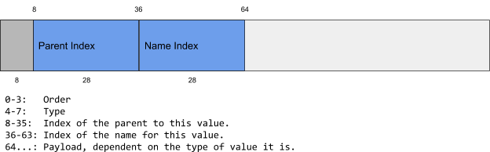

# Inspection VMO Heap Format

[TOC]

# Buddy-Allocated Heap
The [VMO] is treated as a heap using [buddy allocation][buddy].

The minimum block size is 16 bytes (`MIN_BLOCK_SIZE`) and the maximum block
size is 2048 bytes (`MAX_BLOCK_SIZE`).

There are 8 possible block orders (`NUM_ORDERS`), numbered 0...7, corresponding
to blocks of sizes 16, 32, 64, 128, 256, 512, 1024, and 2048 respectively.

All blocks are aligned on 16-byte boundaries, and addressing within the VMO
is in terms of 16-byte blocks (`offset = index * 16`).

## Block header

A `block_header` consists of 16 bytes as follows:


# Type headers

There are currently 11 types defined in
[//zircon/system/ulib/inspect-vmo/include/lib/inspect-vmo/block.h][block.h]:

enum             | value | type name 
-----------------|-------|----------------
`kFree`          | 0     | `FREE`
`kReserved`      | 1     | `RESERVED`
`kHeader`        | 2     | `HEADER`
`kObjectValue`   | 3     | `OBJECT_VALUE`
`kIntValue`      | 4     | `INT_VALUE`
`kUintValue`     | 5     | `UINT_VALUE`
`kDoubleValue`   | 6     | `DOUBLE_VALUE`
`kPropertyValue` | 7     | `PROPERTY_VALUE`
`kExtent`        | 8     | `EXTENT`
`kName`          | 9     | `NAME`
`kTombstone`     | 10    | `TOMBSTONE`

Each type interprets the payload differently, as follows.

## FREE:


`FREE` blocks contain the index of the next free block of the same order.
Free blocks create singly linked lists of free blocks of each size for
fast allocation. The end of the list is reached when NextFreeBlock points
to a location that is either not `FREE` or not of the same order.

## RESERVED:


`RESERVED` blocks are simply available to be changed to a different type.
It is an optional transitional state between the allocation of a block and
setting its type that is useful for correctness checking of
implementations (to ensure that blocks that are about to be used are not
treated as free).

## HEADER:


There is one `HEADER` block at the beginning of the VMO region.
It consists  of a **Magic Number** ("INSP"), a **Version** (currently 0),
and the **Generation Count** for concurrency control.

This will always appear at index 0 in the VMO, so the index 0 will always
be an invalid index regardless of what other type is expected; 0 may then
serve as an invalid index for use as a sentinel value.

## *_VALUE:



Values all start with the same prefix, consisting of the index of the
parent for the value and the index of the name used to refer to the value.

The payload is interpreted differently depending on the type of value, as
below:

## OBJECT_VALUE and TOMBSTONE:


`OBJECT_VALUE` blocks contain a reference count that is incremented when it
is referenced as a parent and decremented when the referencing value is
deleted.
Objects are anchor points for further nesting.
The `ParentID` field of values may only refer to blocks of type `OBJECT_VALUE`.

A deleted object becomes a new, special type called `TOMBSTONE`, which is
only deleted when its refcount becomes 0.

## {INT,UINT,DOUBLE}_VALUE:


Numeric `VALUE` blocks all contain the 64-bit numeric type inlined.

## PROPERTY_VALUE:


`PROPERTY_VALUE` blocks contain the index of the first `EXTENT` block holding
the string data, and they contain the total length of the string across
all extents.

## EXTENT:


`EXTENT` blocks contain a string payload and the index of the next `EXTENT`
in the chain.
Strings are retrieved by reading each `EXTENT` in order until **Total Length**
bytes are read.

## NAME:


`NAME` blocks give objects and values a human-readable identifier. They
consist of a UTF-8 payload that fits entirely within the given block.

# Algorithms

> Note: These algorithms may be incomplete

The `InspectState` consists of the following data:

Name                 | Type          | Description
---------------------|---------------|----------------------------------------------------------------------------------------------
`vmo`                | `zx::vmo`     | VMO mapped into the address space of this program.
`vmo_size`           | `uint64_t   ` | Size of the VMO, in bytes.
`vmo_data`           | `void*`       | Mapped vmo buffer.
`free_blocks`        | `uint64_t[8]` | Pointer to the first free block of the order given by the index into the array. Indices are multiplied by 16 to give the byte offset. A pointer pointing to either an invalid region or a block that is not FREE and of the right order is treated as representing the end of the list.
`generation_counter` | `uint64_t*`   | Pointer to the generation count for updates.

## Limits

```c
MIN_SIZE = 1 << 4  // 16 bytes
MAX_SIZE = 1 << 11 // 2048 bytes
NUM_ORDERS = 8
BLOCK_HEADER_SIZE = 16
EXTENT_VALUE_OFFSET = 4 // Value starts at byte 4
NAME_VALUE_OFFSET = 1   // Value starts at byte 1
```

## Lock

```c
if (generation_counter)
  atomically_increment(generation_counter, acquire_ordering);
```

Locks the region against concurrent reads by setting the generation to an
odd number. During initialization this does nothing.

## Unlock

```c
if (generation_counter)
  atomically_increment(generation_counter, release_ordering);
```

Unlocks the region allowing concurrent reads by setting the generation to
a new even number.
During initialization this does nothing.

## WithLock
Below, `WithLock` designates an algorithm that must occur between a single
iteration of `Lock` and `Unlock`.
It is up to the implementer to ensure that nested calls to `WithLock`
algorithms only lock and unlock once.

## type Block

A `Block` is an offset into the VMO.
Dereferencing this offset is assumed to give access to a `block_header` with
getters and setters for the various fields specified above.

Assume `block.size = MIN_SIZE << block.order`

## SetBlock

This denotes pseudocode describing what changes to make to a block, it is
assumed the block header is set to 0 before the described changes.

## Buddy

```c
Buddy(Block block):
  // This common buddy allocation algorithm calculates the buddy of a block of a
  // given size.
  return ((block * MIN_SIZE) XOR block.size)
```

## IsFreeBlock

```c
IsFreeBlock(Block block, int expected_order):
  // Ensure the block index is within the bounds of the VMO,
  // that the block is free, and (optionally) that the order matches what is
  // expected
  return (block >= 0 &&
          block < vmo_size/MIN_SIZE &&
          block.type == FREE &&
          block.order == expected_order)
```

## RemoveFreeBlock

```c
RemoveFreeBlock(Block block):
  // If the block is at the head of the list, short circuit.
  if free_blocks[block.order] == block:
    free_blocks[block.order] = block.next_free
    return

  // Iterate through the list and unlink the block when it is found.
  current_block := free_blocks[block.order];
  while (IsFreeBlock(current_block)):
    if current_block.next_free == block:
      current_block.next_free = block.next_free
      return
```

## SplitBlock

```c
@WithLock
SplitBlock(Block block):
  // Remove the block from its current free list.
  RemoveFree(block);

  // Reduce the order of the block, and find its new buddy.
  block.order -= 1
  buddy := Buddy(block)

  // Set both blocks to free with the new order.
  SetBlock(block, type=FREE, order=block.order)
  SetBlock(buddy, type=FREE, order=block.order)

  // Prepend [block, buddy] onto the free list.
  buddy.next_free = free_blocks[buddy.order]
  block.next_free = buddy
  free_blocks[block.order] = block
```

## GrowVmo

```c
@WithLock
GrowVmo(size_t size):
  old_size := vmo_size
  vmo_data, vmo_size = Grow vmo to size, remap, get new size
  next_free_block := free_blocks[NUM_ORDERS-1]
  // Store all of the new blocks in the free list in ascending order.
  for block = vmo_size - MAX_SIZE; block >= old_size; block -= MAX_SIZE:
    block.SetBlock(type=FREE, order=NUM_ORDERS-1, next_free=next_free_block)
    next_free_block = block
  free_blocks[NUM_ORDERS-1] = next_free_block
```

## Allocate

```c
@WithLock
Allocate(size_t size):
  order := Minimum order that can contain size

  // No free blocks to accommodate the size, grow the VMO to create more.
  if not any(IsFreeBlock(free_blocks[i], i) for i in range(order, NUM_ORDERS):
    GrowVmo(vmo_size*2)

  // Find the first block with order >= the desired order
  block := first(free_blocks[i] for i in range(order, NUM_ORDERS) where
                 IsFreeBlock(free_blocks[i], i))

  // If the block is too big, split until it is the right size.
  while block.order > order:
    SplitBlock(block)

  // Remove that block from the free list and allocate it.
  RemoveFree(block)
  block.SetBlock(type=ALLOCATED, order=block.order)
  return block
```

## Free (and merge if possible)

```c
@WithLock
Free(Block block):
  buddy := Buddy(block)
  // As long as the buddy of this block is free, keep merging blocks.
  while buddy.type == FREE && block.order < NUM_ORDERS - 1:
    // Ensure we only merge with the left most block.
    if buddy < block:
     tmp := buddy
     buddy = block
     block = tmp
    RemoveFree(buddy)
    block.order += 1
    buddy = Buddy(block)
  // Free the block and put it at the head of the free list.
  block.SetBlock(type=FREE, order=block.order, next_free =
                                               free_blocks[block.order])
  free_blocks[block.order] = block
```

## Initialize

```c
// Initial size is a valid VMO size that is a multiple of MAX_SIZE.
Initialize(size_t initial_size):
  for i in range(NUM_ORDERS):
    free_blocks[i] = 0  // Invalid for all but the maximum size block.
  GrowVmo(initial_size);
  block := Allocate(MIN_SIZE);
  // The first order 0 block in the region is special; it contains a region header
  // consisting of a magic number in the first 8 bytes and the
  // generation count in the second 8 bytes.
  // We may now use 0 as the sentinel value for all free lists.
  block.SetBlock(type=HEADER,
                 magic="INSP",
                 version=0,
                 generation=0);
  generation_count = &block.generation;
```

## FreeExtents

```c
// Iteratively free all extents including and following the given one.
@WithLock
FreeExtents(Block extent):
  assert(extent.type == EXTENT);
  cur_extent := extent
  while cur_extent != 0:
    next_extent = cur_extent.next_extent
    Free(cur_extent)
    cur_extent = next_extent
```

# Lock-free Update Strategy

We propose a mechanism for multiple readers and single writer.
We can use a global version counter so that readers can detect in-flight
modifications and modifications between reads.

Readers:
1. spinlock until the version number is even (no concurrent write),
2. copy the entire VMO buffer, and
3. check that the version number from step 1 is the same as in the copy.
   As long as the version numbers match, the client may read their local
   copy to construct the shared state.
   If the version numbers do not match, the client may retry the whole
   process.

This is a simple strategy with a significant benefit: between incrementing
the version number for beginning and ending a write the writer can perform
any number of operations on the buffer without regard for atomicity of
data updates.

The main drawback is that reads could be delayed indefinitely due to a
frequently updating writer, but readers can have mitigations in place in
practice.

<!-- xrefs -->
[buddy]: https://en.wikipedia.org/wiki/Buddy_memory_allocation
[VMO]: /zircon/docs/objects/vm_object.md
[block.h]: /zircon/system/ulib/inspect-vmo/include/lib/inspect-vmo/block.h

