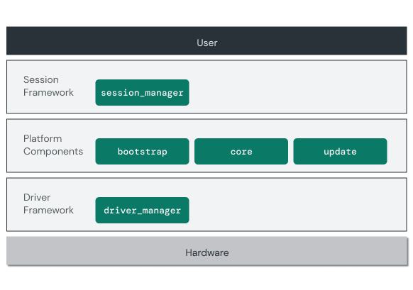

# Building a cohesive product

Components form the basis for the software that runs in Fuchsia user space. The
components you've explored so far are part of the core platform that is
generally common to all products running Fuchsia. Fuchsia products are composed
of platform components and product-specific elements to serve the unique needs
of the device hardware and user experience. In this section, you'll explore how
Fuchsia builds on components to enable product-level customization.

{: width="582"}

## Session framework

Sessions are components that encapsulate a product’s user experience. The
session framework serves as a boundary between the Fuchsia platform and the
product-level user interaction. Each Fuchsia product defines a single session
instance as the root of the product experience, which may or may not manage
additional child components.

The `session_manager` platform component starts the session component on boot
and offers it a fixed set of capabilities necessary to support the session
framework APIs for elements such as window management, input event handling, or
accessibility.

Note: For more details on the session framework, see
[Introduction to the session framework](/docs/concepts/session/introduction.md).

## Driver framework

Similar to session, the Fuchsia Driver Framework enables developers to
implement product-specific device drivers as components. Some driver components
represent hardware interface controllers, such as PCI or USB, while others
interact with end devices, such as an ethernet controller or keyboard.

As devices are discovered or attached to the system, the `driver_manager`
platform component starts the necessary driver components, binds them to the
hardware interfaces, and manages their lifecycle.

Note: For more details on the driver framework, see
[Fuchsia Driver Framework](/docs/concepts/drivers/fdf.md).

## What's Next?

Congratulations! You've successfully built some basic Fuchsia components and
integrated them into a working system.

In the next module, you'll learn more about how Fuchsia components interact with
each other using:

<a class="button button-primary"
    href="/docs/get-started/learn/fidl">Fuchsia interfaces</a>
