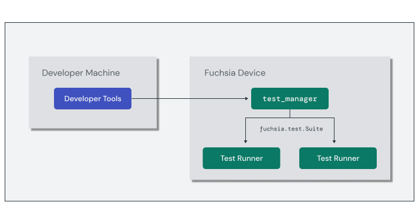

# Component tests

The Fuchsia **Test Runner Framework** enables developers to build tests for
components using a variety of languages and runtimes and execute them on a
target device. The framework provides **test runner** components that implement
the `fuchsia.test.Suite` protocol and integrate with common language-specific
testing frameworks such as GoogleTest (C++) or built-in Rust test modules.

The `test_manager` component is responsible for running tests on a Fuchsia
device. It examines components implementing the test suite protocol and launches
them as child components. This means that `test_manager` is also responsible for
providing capabilities to each test suite, creating what is commonly called the
**test realm**.



Developer tools such as `ffx test` communicate with the `test_manager` on the
device to execute test suites and retrieve the results.

## Test runners

Test runners are reusable adapters between the Test Runner Framework and common
frameworks used by developers to write tests in their preferred
language. Each test runner component exposes the `fuchsia.test.Suite` capability
that enables the `test_manager` to enumerate and execute individual tests, and
declares the appropriate execution `runner` with test framework support.

```json5
{
    // Expose test suite protocol to test manager
    capabilities: [
        { protocol: "fuchsia.test.Suite" },
    ],
    // Execute tests using language-specific runner
    use: [
        { runner: "rust_test_runner" },
    ],
    expose: [
        {
            protocol: "fuchsia.test.Suite",
            from: "self",
        },
    ],
}
```


To simplify integration, the Test Runner Framework provides **manifest shards**
for each language-specific runner. The following is an equivalent test runner
CML for declaring the capabilities from the previous example for Rust component
tests.

```json5
{
    include: [ "//src/sys/test_runners/rust/default.shard.cml" ]
}
```

Note: For complete details on the Test Runner Framework and component testing,
see the
[testing documentation](/docs/concepts/testing/v2/test_runner_framework.md).

## Unit tests

[Unit testing](https://en.wikipedia.org/wiki/Unit_testing){:.external} focuses
on validating the individual units of code within your component and isolated
from other components on the system. Unit tests should be **hermetic**, meaning
that they do not require or provide additional capabilities outside of the test.

The Fuchsia build system provides additional GN targets to facilitate unit
testing components:

* `fuchsia_unittest_package()`: A single-component package that automatically
  generates a minimal component manifest to reference the test binary and
  requires no additional capabilities.
* `fuchsia_unittest_component()`: A component declaration that generates the
  same minimal component manifest. This rule is useful if you need to build
  multiple unit test components into the same `fuchsia_package()`.

Below is an example `BUILD.gn` snippet for including unit tests:

```gn
import("//build/components.gni")

executable("bin_test") {
  sources = [ "main_test.cc" ]
  deps = [
    "//src/lib/fxl/test:gtest_main",
    "//third_party/googletest:gtest",
  ]
  testonly = true
}

fuchsia_unittest_package("hello-world-unittests") {
  deps = [
    ":bin_test",
  ]
}
```


<aside class="key-point">
Test components and other targets used exclusively in tests should set the
<code>testonly</code> attribute to <code>true</code>.
</aside>


## Exercise: Echo unit tests

In this exercise, you'll add unit tests to the `echo-args` component with the
Test Runner Framework and run those tests in a FEMU environment.

### Implement unit tests

Unit tests verify that the internal functions of the component behave as
expected. For the `echo-args` component, you'll validate that the `greeting()`
function used in the previous exercise returns the expected values.

Add the following unit test functions to the `test` module in your `main.rs`
file to validate the behavior of the `greeting()` function when supplied with
one, two, or three arguments:


`echo-args/src/main.rs`:

```

```

<aside class="key-point">
The <code>fuchsia::test</code> attribute removes some common boilerplate for
component tests in Rust, such as initializing logging for each test case.
</aside>

### Run the unit tests

In the previous exercise, your component project scaffold generated a
`fuchsia_unittest_package()` in the `BUILD.gn` file. Locate this rule:

`echo-args/BUILD.gn`:

```gn
fuchsia_unittest_package("echo-args-unittests") {
  deps = [ ":bin_test" ]
}
```

This rule packages your unit tests into a component with the following URL:


```none
fuchsia-pkg://fuchsia.com/echo-args-unittests#meta/echo-args-unittests.cm
```

Run `fx build` again to build the test package:

```posix-terminal
fx build
```

Use the `ffx test` command to execute the unit tests inside this package.
Verify that the tests pass:

```posix-terminal
ffx test run \
    fuchsia-pkg://fuchsia.com/echo-args-unittests#meta/echo-args-unittests.cm
```
