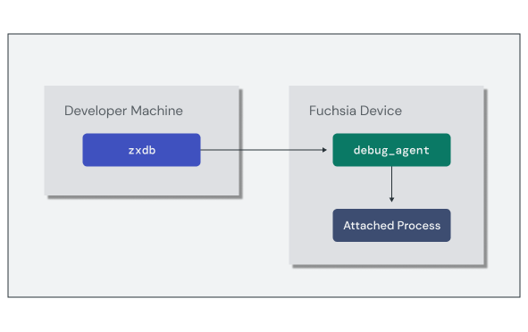

# Debugging components

Developing software means dealing with program crashes and uncovering the
source of bugs. Fuchsia has a suite of tools to help identify and diagnose
issues in your components from analyzing crash logs to full step-through
debugging in core code.


## Analyzing crashes

Fuchsia starts a program at boot called `crashanalyzer` that reports program
crashes and prints a backtrace of the crashing thread to the system log. While
you can explore these directly by reviewing the logs at runtime, the backtrace
content is encoded using the stack memory address references rather than
pointing to the corresponding lines in the program source files.


```none {:.devsite-disable-click-to-copy}
[klog][I] devmgr: crash_analyzer_listener: analyzing exception type 0x108
[klog][I] <== fatal exception: process crasher[42410] thread initial-thread[42424]
[klog][I] <== fatal page fault, PC at 0x1e1888dbbbd7
[klog][I]  CS:                   0 RIP:     0x1e1888dbbbd7 EFL:            0x10246 CR2:                  0
[klog][I]  RAX:                  0 RBX:                0x1 RCX:     0x721ad98697c6 RDX:     0x77accb36f264
[klog][I]  RSI:                  0 RDI:                  0 RBP:     0x2781c4816f90 RSP:     0x2781c4816f80
[klog][I]   R8:                  0  R9:                  0 R10:                  0 R11:              0x246
[klog][I]  R12:     0x773bf11dcda0 R13:     0x773bf11dcdd0 R14:               0x16 R15:         0x78050d69
[klog][I]  errc:               0x6
[klog][I] bottom of user stack:
[klog][I] 0x00002781c4816f80: f11dcda0 0000773b 9ccd2b38 000039b2 |....;w..8+...9..|
[klog][I] 0x00002781c4816f90: c4816fd0 00002781 88dbbba7 00001e18 |.o...'..........|
[klog][I] 0x00002781c4816fa0: 00000008 00000000 9ccd2b38 000039b2 |........8+...9..|
[klog][I] 0x00002781c4816fb0: f11dcf70 0000773b f11dcf70 0000773b |p...;w..p...;w..|
[klog][I] 0x00002781c4816fc0: cb36f570 000077ac f11dcdd0 0000773b |p.6..w......;w..|
[klog][I] 0x00002781c4816fd0: c4816ff0 00002781 cb2b0d0f 000077ac |.o...'....+..w..|
[klog][I] 0x00002781c4816fe0: 00000054 00000000 f11dcf70 0000773b |T.......p...;w..|
[klog][I] 0x00002781c4816ff0: f11dcfe0 0000773b 00000000 00000000 |....;w..........|
[klog][I] arch: x86_64
[klog][I] dso: id=a94c78564173530d51670b6586b1aa471e004f06 base=0x7d3506a49000 name=libfdio.so
[klog][I] dso: id=a61961ba9776a67a00fb322af9ebbdcfd1ce3f62 base=0x77accb297000 name=libc.so
[klog][I] dso: id=760f1e6e47d3dd8b6a19150aa47241279ec75a9c base=0x721ad9863000 name=<vDSO>
[klog][I] dso: id=b18462140c6784a53736105bbf3021852eeda68c base=0x1e1888dbb000 name=app:crasher
[klog][I] bt#01: pc 0x1e1888dbbbd7 sp 0x2781c4816f80 (app:crasher,0xbd7)
[klog][I] bt#02: pc 0x1e1888dbbba7 sp 0x2781c4816fa0 (app:crasher,0xba7)
[klog][I] bt#03: pc 0x77accb2b0d0f sp 0x2781c4816fe0 (libc.so,0x19d0f)
[klog][I] bt#04: pc 0 sp 0x2781c4817000
[klog][I] bt#05: end
```

This is because the **debug symbols** are stripped out of the core binaries
by default at build time. To properly analyze the crash log, you need to
reapply those symbols to the backtrace to see the call stack in terms of source
code line numbers. When you call the `fx log` command, the developer tools
process the raw log through an additional binary called `symbolizer` that
reapplies the symbols from your local build configuration to any backtraces in
the log.

```posix-terminal
fx log
```

The output you see includes the symbols reapplied to the backtrace:

```none {:.devsite-disable-click-to-copy}
[klog][I] devmgr: crash_analyzer_listener: analyzing exception type 0x108
... same output as "raw" backtrace ...
start of symbolized stack:
[klog][I] #01: blind_write at ../../src/developer/forensics/crasher/cpp/crasher.c:21
[klog][I] #02: main at ../../src/developer/forensics/crasher/cpp/crasher.c:137
[klog][I] #03: start_main at ../../zircon/third_party/ulib/musl/src/env/__libc_start_main.c:49
[klog][I] #04: unknown, can't find pc, sp or app/library in line
end of symbolized stack
```

<aside class="key-point">
If you have a manually captured backtrace, you can run the same process by
passing the content through the <code>fx symbolize</code> command.
</aside>

With a properly symbolized backtrace, you can directly discover the site of a
crash in your source code.

### Step-through debugging

Just knowing where a program crashed may not be enough information to fully
diagnose the issue. Sometimes it's necessary to walk through the code
step-by-step and even inspect the state of variables in memory. To support this,
Fuchsia has a debugger for core code called `zxdb`.

The `zxdb` tool is a client that connects to a running `debug_agent` component
on the target device. You can use the `zxdb` commands to configure the
`debug_agent` to attach to specific processes and set breakpoints. Once a debug
session is attached to a running process, `zxdb` allows you to step through the
code and inspect the stack frames.



Setting up the debug session requires the following high-level steps:

1.  Run the `debug_agent` component on the target device.
1.  Run the `zxdb` client and connect to the target device.
1.  Set the location for `zxdb` to find debug symbols.

The simplest method to start a debug session is to use the `fx debug` command,
which does all of these in the context of your local Fuchsia build. However,
these steps can also be performed manually if you need to configure them
separately.

Once the debug session is active, you are taken to a `[zxdb]` prompt to issue
debugger commands. You can use `zxdb` to configure the `debug_agent` to attach
to a process using a name filter and set pending breakpoints even if no
matching process is currently running.

The following example sets a pending breakpoint on main to stop at the
beginning of execution, and waits for a process called "hello-world" to start:

```none
[zxdb] attach hello-world
Waiting for process matching "hello-world"

[zxdb] break main
Breakpoint 1 (Software) on Global, Enabled, stop=All, @ main
Pending: No matches for location, it will be pending library loads.
```

<aside class="caution">
  <b>Launching components with zxdb</b>
  <p>The Fuchsia debugger supports two main methods of debugging a process:
  <code>run</code> and <code>attach</code>. Avoid using <code>run</code> to
  start and debug components.</p>

  <p>When the debugger launches a component, the component will have the same
  capabilities as the <code>debug_agent</code>. The only way to get the correct
  environment is to launch your component in the way it expects and attach the
  debugger to it.</p>
</aside>

Once the debugger is attached to a process, you can use `zxdb` commands to
control and inspect the state of the process. Here is a short collection of
common commands:

Note: For complete details and reference on `zxdb` commands, see
[The Fuchsia debugger](/docs/development/debugger).

<table>
  <tr>
   <td><code>step</code>
   </td>
   <td>Step over the next line of code in the thread
   </td>
  </tr>
  <tr>
   <td><code>next</code>
   </td>
   <td>Step into the next line of code in the thread
   </td>
  </tr>
  <tr>
   <td><code>continue</code>
   </td>
   <td>Continue execution until the next breakpoint, exception, or exit
   </td>
  </tr>
  <tr>
   <td><code>frame</code>
   </td>
   <td>List or select from the current stack frames
   </td>
  </tr>
  <tr>
   <td><code>print</code>
   </td>
   <td>Evaluate an expression and print the result
   </td>
  </tr>
</table>

## Exercise: Using the Fuchsia debugger

In this exercise, you'll use the Fuchsia debugger (`zxdb`) to inspect a running
instance of the `echo-args` component and understand the cause of a crash.

<<../_common/_start_femu.md>>

### Start a debug session

Once the emulator has started up, start a `zxdb` debugging session with the
`fx debug` command:

```posix-terminal
fx debug
```

```none
Checking for debug agent on [...]:2345.
Debug agent not found. Starting one.
Connecting (use "disconnect" to cancel)...
Connected successfully.
👉 To get started, try "status" or "help".
[zxdb]
```

After successfully connecting, the `zxdb` prompt is ready to accept commands.

### Attach to the component

Before launching the component, configure `zxdb` to attach to an instance of
`greeter`. This enables the debugger to attach as soon as the process starts:

```none
[zxdb] attach echo_args
```

Set a breakpoint on the `greeting()` function:

```none
[zxdb] break greeting
```

With the debugger ready, start a new `echo-args` component instance:


```posix-terminal
ffx component run fuchsia-pkg://fuchsia.com/echo-args#meta/echo_args.cm
```

### Explore the debug session

Upon reaching the breakpoint in `greeting()`, execution stops and the debugger
waits for a new command. Use the `list` command to show where execution is
currently paused:

```none
[zxdb] list
   18
   19 // Return a proper greeting for the list
   20 fn greeting(names: &Vec<String>) -> String {
   21     // Join the list of names based on length
 ▶ 22     match names.len() {
   23         0 => String::from("Nobody"),
   24         1 => names.join(""),
   25         2 => names.join(" and "),
   26         _ => names.join(", "),
   27     }
   28 }
   29
```

The `print` command will output the state of any variables in the current stack
frame. Print the current value of `names`:

```none
[zxdb] print names
vec!["Alice", "Bob", "Spot"]
```

Step through the `greeting()` function a few times using the `next` command:

```none
[zxdb] next
```

To let the program continue to completion, use the `continue` command:

```none
[zxdb] continue
```

Exit the debugging session to return to the terminal:

```none
[zxdb] exit
```

### Introduce some crashing code

Next, you'll add some code to `src/main.rs` to cause the component to crash
(or panic). Simulate this behavior by adding an `assert!(false)` macro just
after the arguments are collected:

`echo-args/src/main.rs`:

```rust
#[fuchsia::component(logging = true)]
async fn main() -> Result<(), anyhow::Error> {
    // ...

    {{ '<strong>' }}// Simulate a crash {{ '</strong>' }}
    {{ '<strong>' }}assert!(false, "fake crash");{{ '</strong>' }}

    // Print a greeting to syslog
    info!("Hello, {}!", greeting(&args));

    Ok(())
}
```

Run `fx build` again to rebuild the component:

```posix-terminal
fx build
```

Start a new debug session with `zxdb`:

```posix-terminal
fx debug
```

### Debug the crashing stack frame

Configure the debugger to attach to the `echo-args` component:

```none
[zxdb] attach echo_args
```

Start a new instance of the component:


```posix-terminal
ffx component run fuchsia-pkg://fuchsia.com/echo-args#meta/echo_args.cm
```

This time, the debugger detects that an exception was thrown. Use the `frame`
command to inspect the stack trace at the point of the crash:

```none
[zxdb] frame
▶ 0 abort() • abort.c:7
  1 panic_abort::__rust_start_panic::abort() • panic_abort/src/lib.rs:43
  2 panic_abort::__rust_start_panic(…) • panic_abort/src/lib.rs:38
  3 std::panicking::rust_panic(…) • library/std/src/panicking.rs:672
  4 std::panicking::rust_panic_with_hook(…) • library/std/src/panicking.rs:642
  5 std::panicking::begin_panic::$({closure#0}<&str>)() • rust/library/std/src/panicking.rs:544
  6 std::sys_common::backtrace::$(__rust_end_short_backtrace<std::panicking::begin_panic::{closure#0}, !>)(…) • rust/library/std/src/sys_common/backtrace.rs:144
  7 std::panicking::begin_panic<…>(…) • rust/library/std/src/panicking.rs:543
  {{ '<strong>' }}8 echo_args::main::component_entry_point::$({generator#0})(…) • main.rs:18{{ '</strong>' }}
  9 core::future::from_generator::$({impl#1})::$(poll<echo_args::main::component_entry_point::{generator#0}>)(…) • rust/library/core/src/future/mod.rs:80
  10 core::future::future::$({impl#1})::$(poll<&mut core::future::from_generator::GenFuture<echo_args::main::component_entry_point::{generator#0}>>)(…) • future/future.rs:119
  11 futures_util::future::future::FutureExt::$(poll_unpin<core::pin::Pin<&mut core::future::from_generator::GenFuture<echo_args::main::component_entry_point::{generator#0}>>>)(…) • future/future/mod.rs:562
  12 fuchsia_async::runtime::fuchsia::executor::local::MainTask::$(poll<core::pin::Pin<&mut core::future::from_generator::GenFuture<echo_args::main::component_entry_point::{generator#0}>>>)(…) • fuchsia/src/lib/fuchsia-async/src/runtime/fuchsia/executor/local.rs:444
  13 fuchsia_async::runtime::fuchsia::executor::local::LocalExecutor::$(run_singlethreaded<core::future::from_generator::GenFuture<echo_args::main::component_entry_point::{generator#0}>>)(…) • fuchsia/src/lib/fuchsia-async/src/runtime/fuchsia/executor/local.rs:73
  14 fuchsia::$(main_singlethreaded<fuchsia::init_logging_for_component_with_executor::{closure#0}, core::future::from_generator::GenFuture<echo_args::main::component_entry_point::{generator#0}>, core::result::Result<(), anyhow::Error>>)(…) • fuchsia/src/lib/fuchsia/src/lib.rs:152
  15 echo_args::main() • main.rs:7
  16 core::ops::function::FnOnce::call_once<…>(…) • /b/s/w/ir/x/w/rust/library/core/src/ops/function.rs:227
  17 std::sys_common::backtrace::__rust_begin_short_backtrace<…>(…) • rust/library/std/src/sys_common/backtrace.rs:125
  18 std::rt::lang_start::$({closure#0}<core::result::Result<(), anyhow::Error>>)() • rust/library/std/src/rt.rs:63
  19 core::ops::function::impls::$({impl#2})::call_once<…>(…) • /b/s/w/ir/x/w/rust/library/core/src/ops/function.rs:259 (inline)
  20 std::panicking::try::do_call<…>(…) • library/std/src/panicking.rs:403 (inline)
  21 std::panicking::try<…>(…) • library/std/src/panicking.rs:367 (inline)
  22 std::panic::catch_unwind<…>(…) • library/std/src/panic.rs:129 (inline)
  23 std::rt::lang_start_internal::$({closure#2})() • library/std/src/rt.rs:45 (inline)
  24 std::panicking::try::$(do_call<std::rt::lang_start_internal::{closure#2}, isize>)(…) • library/std/src/panicking.rs:403 (inline)
  25 std::panicking::$(try<isize, std::rt::lang_start_internal::{closure#2}>)(…) • library/std/src/panicking.rs:367 (inline)
  26 std::panic::$(catch_unwind<std::rt::lang_start_internal::{closure#2}, isize>)(…) • library/std/src/panic.rs:129 (inline)
  27 std::rt::lang_start_internal(…) • library/std/src/rt.rs:45
  28 std::rt::lang_start<…>(…) • rust/library/std/src/rt.rs:62
  29 $elf(main) + 0x1f
  30 «libc startup» (-r expands)
  31 «libc startup» (-r expands)
  32 $elf(_start) + 0x11
```

Notice line 8 in the stack trace indicates the point in `src/main.rs` where the
crash happened, corresponding to the `assert!()` macro line of code.

The current stack frame (frame 0) is deep within the system library, but you
can inspect any stack frame by prefixing the command with the frame number from
the stack trace. Print the value of `args` at the point of the crash by passing
the frame number as follows:

```none
[zxdb] frame 8 print args
vec!["Alice", "Bob", "Spot"]
```

Exit the debugging session to return to the terminal:

```none
[zxdb] exit
```
