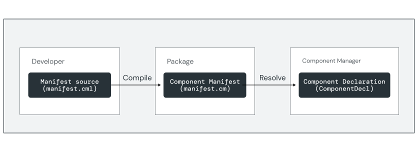

# Declaring components

Every component has a declaration that describes the component's attributes and
capabilities. For components that are distributed in packages, the declaration
is expressed using a **component manifest file** and loaded with the help of a
**component resolver**.



You declare components using component manifest language (CML) files. At build
time, the Component Manifest Compiler (`cmc`) tool validates and compiles the
manifest source into a binary format (`.cm`) and stores it in the component's
package. At runtime, component resolvers load the manifest into a
[ComponentDecl](https://fuchsia.dev/reference/fidl/fuchsia.sys2#ComponentDecl)
FIDL structure for [Component Manager](/docs/glossary/README.md#Component-Manager).

## Component manifests

CML files are JSON5 files that end with a `.cml` extension. Below is an example
CML manifest file for a simple component running an ELF binary that prints a
"Hello, World" message to the system log:

```json5
{
    // Information about the program to run.
    program: {
        // Use the built-in ELF runner.
        runner: "elf",
        // The binary to run for this component.
        binary: "bin/hello",
        // Program arguments
        args: [
            "Hello",
            "World!",
        ],
    },

    // Capabilities used by this component.
    use: [
        { protocol: "fuchsia.logger.LogSink" },
    ],
}
```

This file declares two main sections of information about the component:

Note: For more details on component manifests and CML syntax, see
[component manifests](/docs/concepts/components/v2/component_manifests.md).

* `program`: Describes the executable information such as the binary file,
  program arguments, and the associated runtime. In this example, a binary
  written in C++ or Rust is compiled as an ELF executable and uses the built-in
  [ELF runner](/docs/concepts/components/v2/elf_runner.md).
* `use`: Declares the capabilities this component requires to run. In this
  example, the `fuchsia.logger.LogSink` protocol enables the component to write
  messages to the system log (`syslog`).

## Manifest shards

Some collections of capabilities represent use case requirements that are common
to many components in the system, such as logging. To simplify including these
capabilities in your components, the framework abstracts them into
**manifest shards** that can be included in your CML source file.

Below is an equivalent CML to the previous example. In this case, the necessary
logging capabilities are provided by including
`diagnostics/syslog/client.shard.cml` instead of declaring
`fuchsia.logger.LogSink` explicitly:

```json5
{
    include: [ "syslog/client.shard.cml" ],

    // Information about the program to run.
    program: {
        // Use the built-in ELF runner.
        runner: "elf",
        // The binary to run for this component.
        binary: "bin/hello-world",
        // Program arguments
        args: [
            "Hello",
            "World!",
        ],
    },
}
```

<aside class="key-point">
To review the merged CML output with all includes resolved, run the
<code>fx cmc include</code> command with your manifest. For more details, see
the <a href="/docs/reference/tools/sdk/cmc.md"> reference documentation</a>.
</aside>

## Building components

The Fuchsia build system provides templates as GN imports in
[`//build/components.gni`](/build/components.gni) to build and package software
into Fuchsia components. Below is an example of a `BUILD.gn` file for a simple
C++ component:

```gn

import("//build/components.gni")

executable("bin") {
  sources = [ "main.cc" ]
}

resource("my_file") {
  sources = [ "my_file.txt" ]
  outputs = [ "data/{{source_file_part}}" ]
}

fuchsia_component("hello-world-component") {
  component_name = "hello-world"
  deps = [
    ":bin",
    ":my_file",
  ]
  manifest = "meta/hello-world.cml"
}

fuchsia_package("hello-world") {
  package-name = "hello-world"
  deps = [
    ":hello-world-component",
  ]
}

```

This file contains the following main elements:

* `executable()`: Compiles the source code into a binary. This target varies
  depending on the programming language. For example, an `executable` target
  can be used for C++, `rustc_binary` for Rust, `go_binary` for Golang.
* `resource()`: Optional named collection of data files to copy as resources
  into another GN target. These files are accessible to the binary inside the
  component's namespace.
* `fuchsia_component()`: Collects the binary, component manifest, and additional
  resources together into a single target. This target compiles the manifest
  source into a component declaration using `cmc`.
* `fuchsia_package()`: Unit of distribution for components. Allows one or more
  components to be hosted in a package repository and included in the target
  device's package sets. This target generates the package metadata and builds
  the Fuchsia Archive (`.far`) file.

Packages can contain multiple components, listed as `deps` in the
`fuchsia_package()` template. You can simplify the build file for packages
containing only one component using the `fuchsia_package_with_single_component()`
template.

The following simplified `BUILD.gn` example is equivalent to to the previous
example:

```gn

import("//build/components.gni")

executable("bin") {
  sources = [ "main.cc" ]
}

resource("my_file") {
  sources = [ "my_file.txt" ]
  outputs = [ "data/{{source_file_part}}" ]
}

fuchsia_package_with_single_component("hello-world") {
  manifest = "meta/hello-world.cml"
  deps = [
    ":bin",
    ":my_file",
  ]
}

```

Note: For more details on the GN syntax of the component build rules, see the
[components build reference](/docs/development/components/build.md).

## Exercise: Create a new component

In this exercise, you'll build and run a basic component that reads the program
arguments and echoes a greeting out the system log.

To begin, create a project scaffold for a new Rust component called `echo-args`
under the `//vendor/fuchsia-codelab` directory:

```posix-terminal
fx create component --path vendor/fuchsia-codelab/echo-args --lang rust
```

This creates a project directory structure with a basic component template:

```none {:.devsite-disable-click-to-copy}
echo-args
  |- BUILD.gn
  |- meta
  |   |- echo_args.cml
  |
  |- src
      |- main.rs
```

* `BUILD.gn`: GN build targets for the executable binaries, component, and
  package.
* `meta/echo_args.cml`: Manifest declaring the component's executable and
  required capabilities.
* `src/main.rs`: Source code for the Rust executable binary and unit tests.

### Add program arguments

Open the `echo_args.cml` component manifest file in your editor and locate the
`program` block. This defines the attributes of the component's executable.
Add an `args` array to supply the list of names to greet:

`echo-args/meta/echo_args.cml`:

```json5

```

### Log the arguments

Open the `main.rs` source file and replace the import statements with the
following code:

`echo-args/src/main.rs`:

```rust

```

Replace the `main()` function with the following code:

`echo-args/src/main.rs`:

```rust

```

<aside class="key-point">
The <code>fuchsia::component</code> attribute removes some common boilerplate
for component execution in Rust, such as initializing logging or async execution
behavior.
</aside>

This code reads the program arguments and passes them to a function called
`greeting()` to generate a response for the syslog entry.

Add the following code to implement the `greeting()` function:

`echo-args/src/main.rs`:

```rust

```

This function creates a simple string from the list of provided arguments based
on the length of the list.

<aside class="key-point">
  <b>Logging and standard streams</b>
  <p>Fuchsia has two main logging buffers; the system log (<code>syslog</code>)
  and debug log (<code>klog</code>). By default, components do not have stream
  handles for stdout and stderr available to record log messages from your code.
  Instead, you must use one of Fuchsia's logging libraries or redirect these
  streams to a Fuchsia log buffer.</p>

  <p>For more details on logging from your code, see
  <a href="/docs/development/diagnostics/logs/recording.md">Recording Logs</a>.</p>
</aside>

### Add to the build configuration

Add your new component to the build configuration:

```posix-terminal
fx set workstation.qemu-x64 --with //vendor/fuchsia-codelab/echo-args
```

Run `fx build` and verify that the build completes successfully:

```posix-terminal
fx build
```

In the next section, you'll integrate this component into the build and test the
output in the system log.
