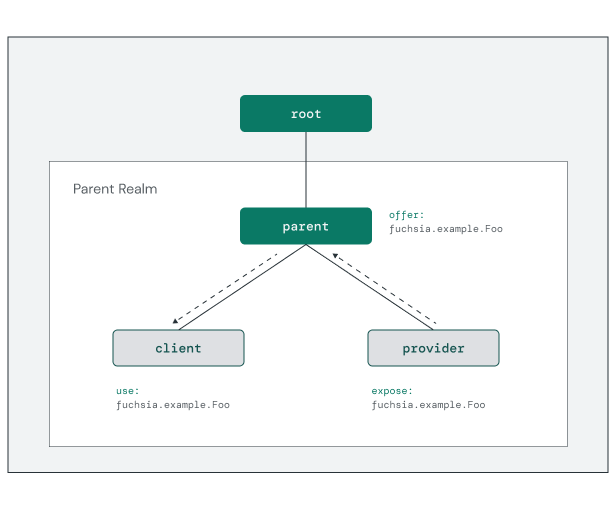
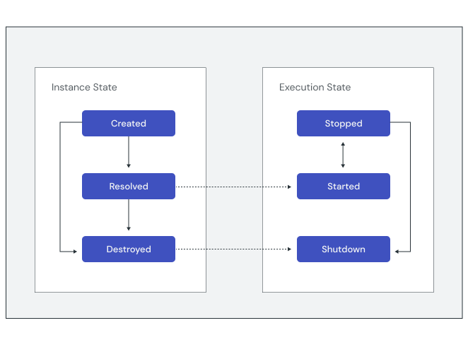

# Organizing components

All components in the system are composed into a rooted
**component instance tree**. Parent components in the tree are responsible for
declaring instances of other components as their children and providing them
with capabilities. At the same time, child components can expose capabilities
back to the parent. These component instance and capability relationships make
up the **component topology**.

Any parent component and all its children form a group within the tree called a
**realm**. Realms enable a parent to control which capabilities flow into and
out of its sub-tree of components, creating a capability boundary. This
encapsulation allows the realm to be reorganized internally without affecting
external components dependent on its exposed capabilities.

{: width="616"}

In the above diagram, a protocol capability for `fuchsia.example.Foo` is routed
through the component instance tree from the provider to the client. Components
declare the capabilities they **require** with the `use` keyword:

```json5
{
    // Information about the program to run.
    program: {
        // Use the built-in ELF runner to run core binaries.
        runner: "elf",
        // The binary to run for this component.
        binary: "bin/client",
    },

    // Capabilities required by this component.
    use: [
        { protocol: "fuchsia.example.Foo" },
    ],
}
```

Components declare the capabilities they implement, or **provide**, using the
`capabilities` section of the component manifest. This makes the capability and
its provider known to the component framework. See the following `provider.cml`
example:

```json5
{
    // Information about the program to run.
    program: {
        // Use the built-in ELF runner to run core binaries.
        runner: "elf",
        // The binary to run for this component.
        binary: "bin/provider",
    },

    // Capabilities provided by this component.
    capabilities: [
        { protocol: "fuchsia.example.Foo" },
    ],
    // Capabilities routed through this component.
    expose: [
        {
            protocol: "fuchsia.example.Foo",
            from: "self",
        },
    ],
}
```

The `expose` keyword makes the capability available from this component to other
realms through its parent, which may also include capabilities provided by this
component's children. In this case, the source of the capability is `self`
because this component is the provider.

Parent components control **capability routing** within the realm, creating
explicit pathways from the client component to a provider. See the following
example `parent.cml` manifest:

```json5
{
    children: [
        {
            name: "provider",
            url: "fuchsia-pkg://fuchsia.com/foo-package#meta/provider.cm",
        },
        {
            name: "client",
            url: "fuchsia-pkg://fuchsia.com/foo-package#meta/client.cm",
        },
    ],
    offer: [
        {
            protocol: "fuchsia.example.Foo",
            from: "#provider",
            to: [ "#client" ],
        },
    ],
}
```

<aside class="key-point">
<b>Tip:</b> Strings prefixed with <code>#</code> in the manifest are
<a href="/docs/concepts/components/v2/component_manifests.md#references">references</a>
to a child component instance.
</aside>

The parent component declares the set of child components in the realm and
routes capabilities to them using the `offer` keyword. In this way, the parent
determines both the scope and the source of each child's capabilities. This also
enables multiple components in the topology to provide the same capability, as
the component framework relies on explicit routes to determine how to resolve
the requests from each client.

Note: For more details on component organization, see
[Component topology](/docs/concepts/components/v2/topology.md).

## Capability types

Fuchsia components support many different types of capabilities. So far in this
module, the examples have showcased two distinct capability types: `runner` and
`protocol`. You may have noticed that the `protocol` capability requires a
routing path but the `runner` capability does not.

Some capabilities are **explicitly routed** to components by their parent, while
others are provided to all components **within the same realm** using
**environments**. Environments enable the framework to provision capabilities
that don't make sense to route explicitly on a per-component basis. By default,
a component inherits the environment of its parent. Components may also declare
a new environment for their children.


<aside class="key-point">
  <b>No ambient authority</b>
  <p>One of Fuchsia's <a href="/docs/concepts/principles/secure.md">security
  design principles</a> is "no ambient authority" for programs on the system.
  This means that every operation must be scoped to an object capability rather
  than granting access based on a higher-level scope such as user identity or
  role.</p>

  <p>The component framework upholds this principle by ensuring that components
  only have direct access to capabilities explicitly routed by their parent.
  Access to capabilities provisioned through environments is mediated by
  Component Manager on the component's behalf.</p>
</aside>

The following table lists the capability types available to components,
and whether they must be explicitly routed from the parent component or
provided by the environment:


<table>
  <tr>
   <th><strong>Type</strong>
   </th>
   <th><strong>Description</strong>
   </th>
   <th><strong>Provided by</strong>
   </th>
  </tr>
  <tr>
   <td><code>directory</code>
   </td>
   <td>Shared filesystem directories provided by other components.
   </td>
   <td>Routing
   </td>
  </tr>
  <tr>
   <td><code>event</code>
   </td>
   <td>Events generated by Component Manager, such as components starting or a capability request.
   </td>
   <td>Routing
   </td>
  </tr>
  <tr>
   <td><code>protocol</code>
   </td>
   <td>FIDL protocols provided by other components or the framework.
   </td>
   <td>Routing
   </td>
  </tr>
  <tr>
   <td><code>resolver</code>
   </td>
   <td>A component capable of resolving a URL to a component manifest.
   </td>
   <td>Environment
   </td>
  </tr>
  <tr>
   <td><code>runner</code>
   </td>
   <td>A runtime used to execute specific components.
   </td>
   <td>Environment
   </td>
  </tr>
  <tr>
   <td><code>service</code>
   </td>
   <td>Named groups of related FIDL protocols performing a common task.
   </td>
   <td>Routing
   </td>
  </tr>
  <tr>
   <td><code>storage</code>
   </td>
   <td>Isolated filesystem directories unique to each component.
   </td>
   <td>Routing
   </td>
  </tr>
</table>


Note: For more details on individual capabilities, see
[component capabilities](/docs/concepts/components/v2/capabilities/README.md)
and [environments](/docs/concepts/components/v2/environments.md).


## Identifying components

Components are identified by a URL. The framework resolves component URLs to
component declarations with the help of a **component resolver**. Resolvers are
components themselves that are capable of handling a particular URL scheme and
fetching the component manifest, program, and assets.

Most components are published inside a Fuchsia package, so the component URL is
a reference to the component manifest inside that package. See the following
example:


```none
fuchsia-pkg://fuchsia.com/{{ '<var>' }}foo-package{{ '</var>' }}#meta/{{ '<var>' }}foo-component.cm{{ '</var>' }}
```

Component instances are identified by a topological path reference known as a
**moniker**. A component's moniker indicates its location within the component
instance tree as an absolute or relative path. For example, the moniker path
`/core/system-updater` refers to the instance of `system-updater` that exists
in the `core` realm.

## Component lifecycle

Component instances are created and destroyed when they are added and removed
in the component topology. This can happen in one of two ways:

* **Statically**: The instance is declared in the component manifest as a child
  of another component in the tree. Static components are only created and
  destroyed when an update changes the component topology.
* **Dynamically**: The instance is added or removed in a component `collection`
  at runtime using the `fuchsia.sys2.Realm` protocol. Dynamic components are
  destroyed on system shutdown.

Once a component is destroyed, the framework removes its persistent state
(such as local storage).

The framework starts a component instance when another component attempts to
open a channel to it — known as **binding**. Binding happens **implicitly** when
connecting to a capability exposed by the component. Binding to a component that
is already started connects to the currently running instance.

<aside class="key-point">
Components are initially <strong>stopped</strong> when they are created. A
component must be successfully <strong>resolved</strong> by a component resolver
before it can <strong>start</strong>.
</aside>

Components may stop themselves by exiting the program (as defined by the
component's `runner`), or the framework may stop the component as part of
system shutdown. Before being destroyed, the framework moves components to a
**shutdown** state to indicate that it cannot be started again.

{: width="662"}

Note: For more details on component states and execution, see
[component lifecycle](/docs/concepts/components/v2/lifecycle.md).

## Exercise: Integrate components

In order for a component to be invoked, it must be present in the active
component topology. For this exercise, you will add your component to the
`ffx-laboratory` — a restricted collection used for development inside the
product's **core realm**. Collections enable components to be dynamically
created and destroyed at runtime.

<<../_common/_start_femu.md>>

### Add to the component topology

Create a new instance of the `echo-args` component using the following command:

```posix-terminal
ffx component create /core/ffx-laboratory:echo-args \
    fuchsia-pkg://fuchsia.com/echo-args#meta/echo_args.cm
```

This command accepts two parameters:

* `/core/ffx-laboratory:echo-args`: This is the **component moniker**,
  representing the path inside the component topology for the component instance.
* `fuchsia-pkg://fuchsia.com/echo-args#meta/echo_args.cm`: This is the
 **component URL**, indicating how Fuchsia should resolve the component from the
 package server.

A new component instance named `echo-args` now exists in the topology. Show the
details of the new instance using the following command:

```posix-terminal
ffx component show echo-args
```

You should see the following output:

```none {:.devsite-disable-click-to-copy}
Moniker: /core/ffx-laboratory:echo-args
URL: fuchsia-pkg://fuchsia.com/echo-args#meta/echo_args.cm
Type: CML dynamic component
Component State: Unresolved
Execution State: Stopped
```

Notice that the instance has been created, but the component URL has not been
resolved. Resolution happens when the framework attempts to start the instance.

### Start the component instance

Bind to the new `echo-args` component instance using the following command:

```posix-terminal
ffx component bind /core/ffx-laboratory:echo-args
```

This command accepts one parameter:

* `/core/ffx-laboratory:echo-args`: This is the **component moniker**,
  representing the path inside the component topology for the component instance.

This causes the component instance to start, print a greeting to the log,
then exit. Open a new terminal window and filter the device logs for messages
from the example:

```posix-terminal
fx log --only echo
```

You should see the following output in the device logs:

```none {:.devsite-disable-click-to-copy}
[ffx-laboratory:echo-args][I] Hello, Alice, Bob, Spot!
```

### Explore the instance

Show the details of the `echo-args` instance again using the following command:

```posix-terminal
ffx component show echo-args
```

You should now see the following output:

```none {:.devsite-disable-click-to-copy}
Moniker: /core/ffx-laboratory:echo-args
URL: fuchsia-pkg://fuchsia.com/echo-args#meta/echo_args.cm
Type: CML dynamic component
Component State: Resolved
Incoming Capabilities (1):
  fuchsia.logger.LogSink
Exposed Capabilities (1):
  diagnostics
Execution State: Stopped
```

The component state has changed to `Resolved` and you can see more details
about the component's capabilities.

Components have no ambient capabilities to access other parts of the system.
Every capability a component requires must be explicitly routed to it through
the component topology or provided by its environment.

The `echo-args` component requires the `fuchsia.logger.LogSink` capability to
write to the system log. You were able to successfully view the log output
because this capability is **offered** to components in the `ffx-laboratory`
collection from the `core` realm:

```json5
{
    collections: [
        {
            name: "ffx-laboratory",
        },
    ],
    offer: [
        {
            protocol: [ "fuchsia.logger.LogSink" ],
            from: "parent",
            to: "#ffx-laboratory",
        },
    ],
}
```

<aside class="key-point">
  <b>Reminder</b>
  <p>The required logging capabilities in the project are implicitly declared by
  the syslog manifest shard: <code>syslog/client.shard.cml</code>.
</aside>
