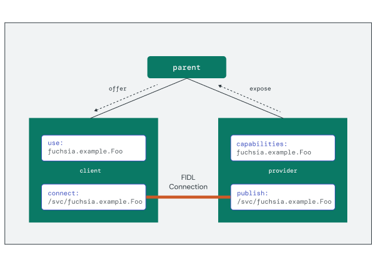

# Connecting components

A protocol handle is a well-known object that provides an implementation of a
FIDL protocol that is discoverable using component namespaces. The component
framework facilitates protocol discovery between
[components](/docs/glossary/README.md#component) using capabilities.
Capability routing describes which component should act as the provider for any
given client. Once the proper components are identified, the
[Component Manager](/docs/glossary/README.md#component-manager)
initiates connections between components using handles found in each
component's namespace.

Consider the following example for a `fuchsia.example.Foo` protocol:

{: width="629"}

The diagram highlights the main elements involved in performing the connection:

1.  The provider component statically **declares** the protocol in the
    `capabilities` section of the manifest. This enables the component framework
    to perform capability routing.
1.  A client component statically **requests** the protocol in the `use` section
    of the manifest. This creates the `/svc/fuchsia.example.Foo` protocol entry
    in the client's namespace if capability routing is successful.
1.  The provider code **publishes** the implementation at runtime. This creates
    a protocol entry at `/svc/fuchsia.example.Foo` in the provider's outgoing
    directory.
1.  The client code **connects** to the protocol handle at runtime. This opens a
    FIDL connection to the implementation running in the provider component.

## Publishing a protocol implementation

Components that implement a FIDL protocol **declare** and **expose** that
protocol as a capability in their component manifest. This enables the component
framework to perform capability routing from this component to others in the
topology that request the capability.

```json5
{
    // ...
    capabilities: [
        { protocol: "fuchsia.example.Foo" },
    ],
    expose: [
        {
            protocol: "fuchsia.example.Foo",
            from: "self",
        },
    ],
}
```

Capability routing describes the access rights for the protocol, but it does
not establish the necessary endpoints for a connection. Components must publish
the implementation as an `/svc/` handle in the outgoing directory using the
[fuchsia.io](https://fuchsia.dev/reference/fidl/fuchsia.io) protocol. The
generated FIDL bindings wrap this handle and enable the provider to connect a
request handle to begin receiving FIDL messages.

```rust
async fn main() -> Result<(), anyhow::Error> {
    let mut service_fs = ServiceFs::new_local();

    // Serve the protocol
    service_fs.dir("svc").add_fidl_service(PROTOCOL_NAME);
    service_fs.take_and_serve_directory_handle().context("failed to serve outgoing namespace")?;

    // ...

    Ok(())
}
```

## Connecting to a protocol implementation

Client components declare the protocol as a required capability in their
component manifest. This allows the component framework to determine whether
the component has the rights to access protocol implementation. If a valid route
exists, the component's namespace contains a corresponding `/svc/` handle.

```json5
{
    // ...
    use: [
        { protocol: "fuchsia.example.Foo" },
    ],
}
```

<aside class="key-point">
Recall that capabilities are routed explicitly between components, so the
topology must include a connected set of offers between components for routing
to succeed.
</aside>

The client component uses the
[fuchsia.io](https://fuchsia.dev/reference/fidl/fuchsia.io) protocol to
establish a connection to the protocol implementation and open a channel. The
generated FIDL bindings wrap this channel and enable the client to begin sending
messages to the provider.

```rust
async fn main() -> Result<(), anyhow::Error> {
    // Connect to FIDL protocol
    let protocol = connect_to_protocol::<FooMarker>().expect("error connecting to echo");

    // ...

    Ok(())
}
```

## Exercise: Echo server and client

In this section, you'll use the generated FIDL bindings for
`fidl.examples.routing.echo` to implement client and server components in Rust.

<<../_common/_start_femu.md>>

### Create the server component

Begin by creating a new component project to implement the echo server. This
component will serve the `Echo` protocol and handle incoming requests.

```posix-terminal
fx create component --path vendor/fuchsia-codelab/echo-server --lang rust
```

Add the generated Rust bindings to the `BUILD.gn` file as a dependency:

`echo-server/BUILD.gn`:

```gn
rustc_binary("bin") {
  output_name = "echo-server"

  deps = [
    {{ '<strong>' }}"//vendor/fuchsia-codelab/echo-fidl:echo-rustc",{{ '</strong>' }}
    ...
  ]

  sources = [ "src/main.rs" ]
}
```

Declare the `Echo` protocol as a capability provided by the server component,
and expose it for use by the parent realm:

`echo-server/meta/echo_server.cml`:

```json5

```

### Implement the server

Open the `main.rs` source file and replace the import statements with the
following code:

`echo-server/src/main.rs`:

```rust

```

<aside class="key-point">
FIDL bindings for Rust generate a Rust library crate named after the FIDL
<code>library</code>. For the <code>fidl.examples.routing.echo</code> library,
the generated crate name is <code>fidl_fidl_examples_routing_echo</code>. For
more details, see
<a href="/docs/reference/fidl/bindings/rust-bindings">Rust bindings</a>.
</aside>

Add the following code to `main()` to serve the `Echo` protocol:

`echo-server/src/main.rs`:

```rust

```

This code performs the following steps to serve the `Echo` protocol:

1.  Initialize `ServiceFs` and add an entry under
    `/svc/fidl.examples.routing.echo.Echo` in the outgoing directory.
1.  Serve the directory and begin listening for incoming connections.
1.  Attach the `handle_echo_request()` function as a request handler for any
    matching `Echo` requests.

Add the following code to implement `handle_echo_request()` and handle incoming
requests:

`echo-server/src/main.rs`:

```rust

```

Each request in the `EchoRequestStream` is typed by the method name
(`EchoString`) and includes a responder interface to send back the return value.
This implementation simply "echoes" the same string value from the request back
in the response payload.

### Create the client component

Create another new component project to implement the echo client. This
component will connect to the protocol implementation and send requests.

```posix-terminal
fx create component --path vendor/fuchsia-codelab/echo-client --lang rust
```

Add the generated Rust bindings to the `BUILD.gn` file as a dependency:

`echo-client/BUILD.gn`:

```gn
rustc_binary("bin") {
  output_name = "echo-client"

  deps = [
    {{ '<strong>' }}"//vendor/fuchsia-codelab/echo-fidl:echo-rustc",{{ '</strong>' }}
    ...
  ]

  sources = [ "src/main.rs" ]
}
```

Configure the client's component manifest to request the
`fidl.examples.routing.echo.Echo` capability exposed by the server:

`echo-client/meta/echo_client.cml`:

```json5

```

### Implement the client

Similar to `echo-args`, the client passes the program arguments as a message
to the server. Add the following program arguments to `echo_client.cml`:

`echo-client/meta/echo_client.cml`:

```json5

```

Open the `main.rs` source file and replace the import statements with the
following code:

`echo-client/src/main.rs`:

```rust

```

Add the following code to `main()` to connect to the `Echo` protocol and send
a request:

`echo-client/src/main.rs`:

```rust

```

The `EchoMarker` provides a wrapper to connect to the exposed capability by
name and return a handle to the open `EchoProxy` interface. This proxy contains
the `echo_string()` FIDL protocol method. Since `echo_string()` is a two-way
method, the client blocks waiting for a response after sending the `message` to
the server.

### Integrate the components

The capabilities provided by the server must be routed to the client through
the component framework. To enable this, you will implement a realm component
to act as the parent and manage capability routing.

Create a new project directory for the realm product definition:

```posix-terminal
mkdir vendor/fuchsia-codelab/echo-realm
```

Create a new component manifest file `meta/echo_realm.cml` with the
following contents:

`echo-realm/meta/echo_realm.cml`:

```json5

```

This creates a component realm with the server and client as child components, and routes the `fidl.examples.routing.echo.Echo` protocol capability to the client.

Add a `BUILD.gn` file to create a build target for the realm component:

`echo-realm/BUILD.gn`:

```gn
import("//build/components.gni")

fuchsia_component("echo_realm") {
  manifest = "meta/echo_realm.cml"
}

fuchsia_package("echo-realm") {
  deps = [
    ":echo_realm",
    "//vendor/fuchsia-codelab/echo-server:component",
    "//vendor/fuchsia-codelab/echo-client:component",
  ]
}
```

Update the build configuration to include the new components:

```posix-terminal
fx set workstation.qemu-x64 \
    --with //vendor/fuchsia-codelab/echo-fidl:echo \
    --with //vendor/fuchsia-codelab/echo-server \
    --with //vendor/fuchsia-codelab/echo-client \
    --with //vendor/fuchsia-codelab/echo-realm
```

Run `fx build` again to build the components:

```posix-terminal
fx build
```

### Add the components to the topology

You will add your component to the `ffx-laboratory` — a restricted collection
used for development inside the product's **core realm**. Collections enable
components to be dynamically created and destroyed at runtime.

Create the component instances by passing the `echo-realm` component URL and
an appropriate moniker inside `ffx-laboratory` to `ffx component create`:

```posix-terminal
ffx component create /core/ffx-laboratory:echo-realm \
    fuchsia-pkg://fuchsia.com/echo-realm#meta/echo_realm.cm
```

Verify that instances of the server and client were also created as child
components using `ffx component show`:

```posix-terminal
​​ffx component show echo
```

```none {:.devsite-disable-click-to-copy}
Moniker: /core/ffx-laboratory:echo-realm/echo_client
URL: #meta/echo_client.cm
Type: CML static component
Component State: Unresolved
Execution State: Stopped

Moniker: /core/ffx-laboratory:echo-realm/echo_server
URL: #meta/echo_server.cm
Type: CML static component
Component State: Unresolved
Execution State: Stopped

Moniker: /core/ffx-laboratory:echo-realm
URL: fuchsia-pkg://fuchsia.com/echo-realm#meta/echo_realm.cm
Type: CML dynamic component
Component State: Resolved
Incoming Capabilities (0):
Exposed Capabilities (0):
Execution State: Running
Merkle root: 666c40477785f89b0ace22b30d65f1338f1d308ecceacb0f65f5140baa889e1b
```

### Verify the component interactions

Start the existing client component instance using `ffx component bind`:

```posix-terminal
ffx component bind /core/ffx-laboratory:echo-realm/echo_client
```
Open another terminal window and verify the log output from the client component:

```posix-terminal
fx log --only echo
```

You should see the following output in the device logs:

```none {:.devsite-disable-click-to-copy}
[echo_client][I] Server response: Hello, Fuchsia!
```

The server component starts once the client makes a connection to the
`fidl.examples.routing.echo.Echo` capability and continues running to serve
additional FIDL requests.

Use `ffx component show` the see the echo server running in the component
instance tree:

```posix-terminal
ffx component show echo_server
```

```none {:.devsite-disable-click-to-copy}
Moniker: /core/ffx-laboratory:echo-realm/echo_server
URL: #meta/echo_server.cm
Type: CML static component
Component State: Resolved
Incoming Capabilities (1):
  fuchsia.logger.LogSink
Exposed Capabilities (2):
  diagnostics
  fidl.examples.routing.echo.Echo
Execution State: Running
Job ID: 474691
Process ID: 474712
Process Start Time (ticks): 2026280474361
Process Start Time (UTC estimate): (not available)
Merkle root: 666c40477785f89b0ace22b30d65f1338f1d308ecceacb0f65f5140baa889e1b
Outgoing Capabilities (2):
  diagnostics
  fidl.examples.routing.echo.Echo
```
