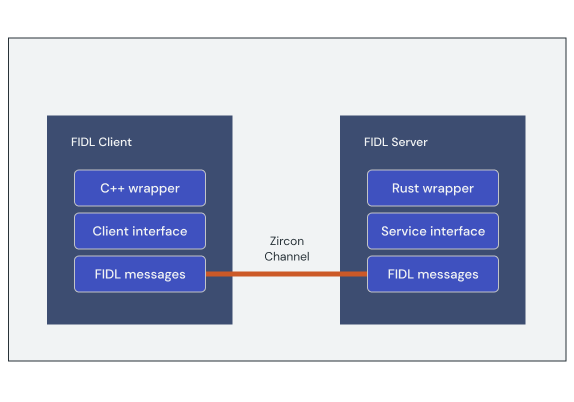

# Fuchsia Interface Definition Language

Fuchsia Interface Definition Language (FIDL) is the language used to describe
interprocess communication (IPC) protocols used by Fuchsia programs. FIDL
provides a simplified declaration syntax for providers to define interfaces as a
**protocol**. Supported data types include integers, floats, booleans, strings,
and [handles][glossary.handle]. These can be organized into more complex arrays,
vectors, structs, tables, and unions.

Consider the following example FIDL protocol for an `Echo` interface:

```fidl
library fuchsia.examples;




```

FIDL protocols describe a set of **methods** invoked by sending messages over
a channel. Channel messages are inherently asynchronous, with the sender and
receiver operating independently of each other. FIDL methods introduce
higher-level semantics that enable more idiomatic programming on the client and
server side of a FIDL transaction.

FIDL supports the following method types:

* **Two-way methods:** A typical method call that accepts optional parameters
  with a return type defined after the `->` operator. Two-way methods block
  until a response is received. In the `Echo` example, the `EchoString()`
  method is a two-way method.
* **One-way methods:** Asynchronous method calls that return immediately
  without waiting for a response. Methods without a declared return type are
  considered one-way from the client. In the `Echo` example, the `SendString()`
  method is a one-way method.
* **Events:** When necessary, a server may send unsolicited messages to the
  client, called events. Events declare their method name on the return side of
  the `->` operator. In the `Echo` example, the `OnString()` method is an event.

Note: For more details on FIDL language syntax and supported types, see the
[FIDL Language specification](/docs/reference/fidl/language/language.md).

## Creating a FIDL library

**FIDL libraries** group FIDL source files together. A library acts as a
namespace for the protocols it contains, and FIDL source files can implicitly
access all other declarations within the same library. FIDL source files must
**import** any declarations from another library.

The Fuchsia build system provides the `fidl()` build target to compile FIDL
source files into a library. The name of the library target must match the
`library` declarations in each source file. See the following `BUILD.gn` example
for the `fuchsia.examples` library:

```gn
# Import the fidl GN template.
import("//build/fidl/fidl.gni")

# Define a FIDL library target.
fidl("fuchsia.examples") {
  # FIDL source files contained in library
  sources = [
    "echo.fidl",
  ]
}
```

<aside class="key-point">
By default, the build system uses the <code>fidl()</code> GN target name as the
library name. You can override this behavior with the <code>name</code>
parameter.
</aside>

At build time, the FIDL Compiler (`fidlc`) frontend tool validates and compiles
the library source files into a JSON Intermediate Representation (IR). This JSON
IR format is the basis for the FIDL bindings.

## Generating FIDL bindings

Components consume FIDL protocols through generated code called
**FIDL bindings**. Bindings encode and decode requests and responses as
**FIDL messages** and transfer them over the underlying IPC channel. The
language-specific binding libraries provide wrappers around these structures to
align interactions with familiar programming idioms.

The client interface (sometimes referred to as a proxy) performs translation
between higher-level function calls and FIDL messages. On the server side,
bindings process incoming request messages and deliver them through an abstract
interface for components to implement.




Note: For more details on the bindings specification and supported programming
languages, see the [Bindings Reference](/docs/reference/fidl/bindings/overview.md).

At build time, the `fidlgen` backend tools generate bindings for supported
programming languages from the JSON IR library produced by `fidlc`. For example,
`fidlgen_rust` generates Rust bindings from the JSON IR.

The `fidl()` library target creates individual binding targets for each
supported language. Due to the nature of GN, these bindings are not generated
at build time unless they are included as a dependency.

See the following example `BUILD.gn` snippet that includes the generated Rust
bindings target for the `fuchsia.examples` library (`fuchsia.examples-rustc`):

```gn
deps = [
  "fidl/fuchsia.examples:fuchsia.examples-rustc",
  ...
]
```

## Exercise: Echo FIDL Library

In this section, you'll define a new FIDL library with a protocol called
`Echo` containing a single method that returns string values back to the
caller.

Start by creating a new directory for the FIDL library target:

```posix-terminal
mkdir vendor/fuchsia-codelab/echo-fidl
```

Add a new FIDL interface file called `echo.fidl` with the following contents:

```fidl

```

`EchoString` is a two-way method that accepts an optional (nullable) string
value and returns the same value.

Add a `BUILD.gn` file with the following contents to declare the library target:

```gn

```

Add the library target to the build configuration:

```posix-terminal
fx set workstation.qemu-x64 --with //vendor/fuchsia-codelab/echo-fidl:echo
```

Run `fx build` to compile the FIDL interface:

```posix-terminal
fx build vendor/fuchsia-codelab/echo-fidl:echo
```

### Examine the FIDL bindings

The `fidl()` GN target compiles the FIDL interface and generates additional
build targets to provide the bindings in various languages. To examine the
bindings, you must compile the individual targets.

Compile the `fidl.examples.routing.echo` bindings for Rust:

```posix-terminal
fx build vendor/fuchsia-codelab/echo-fidl:echo-rustc
```

Use GN to locate the generated source file for the target and open it in an
editor:

```posix-terminal
fx gn desc out/default/ vendor/fuchsia-codelab/echo-fidl:echo-rustc sources
```

Explore the contents of the file. Below is a summary of some of the key
generated interfaces:

<table>
  <tr>
   <th><strong>Interface</strong>
   </th>
   <th><strong>Description</strong>
   </th>
  </tr>
  <tr>
   <td><code>EchoMarker</code>
   </td>
   <td>Used to open a proxy and request stream for a given protocol.
   </td>
  </tr>
  <tr>
   <td><code>EchoProxy</code>
   </td>
   <td>Asynchronous client that transforms protocol methods into FIDL request messages sent over the IPC channel.
   </td>
  </tr>
  <tr>
   <td><code>EchoSynchronousProxy</code>
   </td>
   <td>Synchronous client that transforms protocol methods into FIDL request messages sent over the IPC channel.
   </td>
  </tr>
  <tr>
   <td><code>EchoRequest</code>
   </td>
   <td>Structured types for handling incoming requests for each protocol method.
   </td>
  </tr>
  <tr>
   <td><code>EchoRequestStream</code>
   </td>
   <td>Stream to handle incoming FIDL request messages over the IPC channel.
   </td>
  </tr>
  <tr>
   <td><code>EchoEchoStringResponder</code>
   </td>
   <td>Callback to send a return value for each proxy request as a FIDL response message.
   </td>
  </tr>
</table>


<aside class="key-point">
<b>Asynchronous vs. synchronous clients</b>
<p>The FIDL toolchain generates client bindings that are asynchronous by default.
This means the client methods return immediately to the caller and responses
are delivered using a callback or future. Synchronous clients provide a
simplified API that guarantees responses are delivered before the client
method returns.</p>

<p>Synchronous clients are not available in all supported languages. For more
details, see the specifications for your chosen language in the
<a href="/docs/reference/fidl/bindings/overview">Bindings Reference</a>.</d>
</aside>


[glossary.handle]: /docs/glossary/README.md#handle
