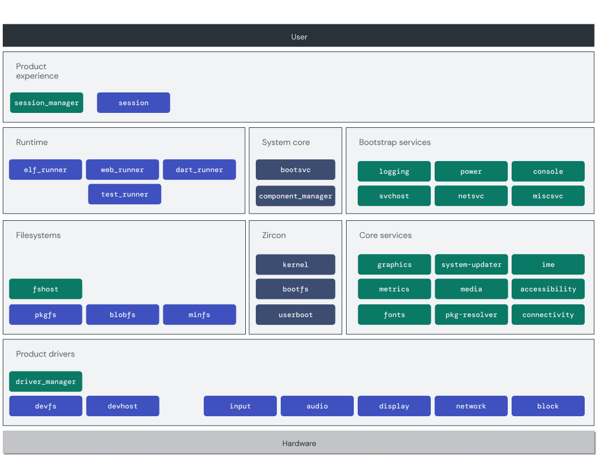

# Fuchsia architecture

The following architectural principles guide Fuchsia's design and development:

* [Secure](/docs/concepts/principles/secure.md):
  All software that runs on Fuchsia receives the least privilege it needs to
  perform its job, and gains access only to information it needs to know.
* [Updatable](/docs/concepts/principles/updatable.md):
  Much like the web, software on Fuchsia is designed to come and go as needed,
  and security patches can be pushed to all products on demand.
* [Inclusive](/docs/concepts/principles/inclusive.md):
  Fuchsia is an open source project designed to be extensible and enable
  software written against various languages and runtimes to integrate together.
* [Pragmatic](/docs/concepts/principles/pragmatic.md):
  Fuchsia is not a science experiment, it's a production-grade operating system
  that must adhere to fundamentals, like performance.

The core of the system is [Zircon][glossary.zircon], a
microkernel and collection of libraries for handling system startup and
bootstrapping. All other system components are implemented in user space and
isolated, reinforcing the **principle of least privilege**. This includes:

*   Device drivers
*   Filesystems
*   Network stacks

[glossary.zircon]: /docs/glossary/README.md#zircon