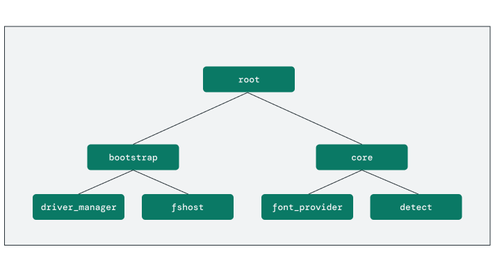
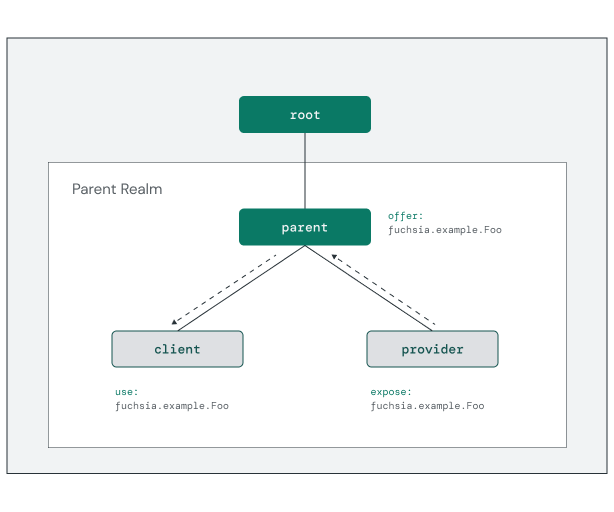

# Component-based software

**Components** are the foundational building blocks of software running in
Fuchsia. Each component is a composable, sandboxed module that interacts with
other components through capabilities. This promotes system security and
creates clear interfaces between individual components, making them easier to
update or replace.

In Fuchsia, **everything is a component** (almost). Recall from the previous
discussion of Zircon that the surface area of the kernel is intentionally small,
with most core services being implemented in user space. This means that most
software running on Fuchsia is implemented using the component framework,
including:

*   User-facing applications
*   Device drivers
*   Filesystems
*   Media codecs
*   Network stacks

Outside the kernel there are only a few low-level exceptions not using the
component framework, such as bootloaders and the `userboot` process.

### Component manager

The heart of the component framework is the **component manager**. It is
responsible for coordinating the execution of all component instances,
providing them with their capabilities, and intermediating connections between
components.

Components can be launched explicitly (from a URL, for example) or implicitly
from a request for a particular capability. Component manager performs the
necessary resolution to determine whether to launch a new component or route
the request to an existing instance. For this routing to take place, every
component must declare any capabilities that it **provides** to the system
and any it **consumes**.


<aside class="key-point">
  <b>Does each component run in its own process?</b>
  <p>Zircon defines the common kernel objects for runnable code, such as
  processes. However, component instances do not always correlate directly
  with a single process. Often the policy for how these processes are used
  is defined by the runner. For example, the
  <a href="/docs/concepts/components/v2/elf_runner.md">ELF runner</a> launches
  each component into a new job with a process running the executable code.</p>

  <p>For more examples, see
  <a href="/docs/concepts/components/v2/components_vs_processes.md">components
  vs. processes</a>.</p>
</aside>

Component manager parses each component's **declaration** to determine how to
run the component and supply the necessary capabilities. Components are
typically declared to the system through a **component manifest** file within
the component's package.

Below is a simple example of a component manifest that describes an ELF
executable with some additional command arguments:

```json5
program: {
    runner: "elf",
    binary: "bin/hello",
    args: [ "Hello", "World!" ],
},
```

Notice the runtime declaration telling the component manager that this
component requires the [ELF runner](/docs/concepts/components/v2/elf_runner.md).
**_This is an example of a capability!_**

### Component capabilities

Components obtain privileges to access various parts of the wider system
through **capabilities**. Each component can declare new capabilities that
they offer to the system and capabilities provided by other components
(or the framework) that they require to function.

As you just saw, `runner` is an example of a capability declaring the runtime
used by the component. Other examples of common capability types are
`directory` to access filesystem resources and `protocol` for communicating
with other components.

Developers declare the capability types required by the component using the
component manifest. Below is an example of a component manifest requesting
two capabilities: read access to an `example-data` directory and a service
described by the `fuchsia.example.Foo` FIDL protocol.

```json5
use: [
    {
        directory: "example-data",
        rights: [ "r*" ],
        path: "/example/data",
    },
    {
        protocol: "fuchsia.example.Foo",
    },
]
```

Component manager uses the capability declarations to populate each component's
namespace with the necessary directory handles. For this example, the component
would receive `/example/data` and `/svc/fuchsia.example.Foo` in their namespace.

### Component organization

All components in the system are composed into a single rooted
**component instance tree**. This tree structure governs several important
aspects of component behavior.




Parent components in the tree are responsible for creating instances of
other components as their children and providing them with the necessary
capabilities. At the same time, child components can expose capabilities back
to the parent. Child components can be created one of two ways:

* **Statically**: The parent declares the existence of the child in its own
  component declaration.
* **Dynamically**: The parent adds the child to a component collection at
  runtime using the `fuchsia.sys2.Realm` protocol.

Any parent component and all its children form a group within the tree called
a **realm**. Realms enable a parent to control which capabilities flow into
and out of its sub-tree of components, creating a capability boundary.
Components decide whether to export capabilities outside their realm using the
`expose` keyword:

```json5
expose: [
    {
        protocol: "fuchsia.example.Foo",
        from: "self",
    },
],
```

Once a capability is exposed to the realm, the parent can share it with other
components within the same realm. This is done using the `offer` keyword:

```json5
offer: [
    {
        protocol: "fuchsia.example.Foo",
        from: "self",
    },
],
```

[Component manager][glossary.component-manager] is responsible for resolving
requests to access a capability (such as a directory or protocol) with the
component providing that capability. This is known as **capability routing**.
Component Manager can only resolve capabilities that are **exposed** and
**offered** within the same realm.



<aside class="key-point">
You will explore more about capabilities and building components later on.
You can also find more of the technical details in the
<a href="/docs/concepts/components/v2/introduction.md">component documentation</a>.
</aside>

## Exercise: Components

In this exercise, you'll explore the component instance tree and look in detail
at capability routing in action using some core system components.

<<../_common/_start_femu.md>>

### Explore system components

Open another terminal window and use the `component list` command to dump the
system's component tree:


```posix-terminal
ffx component list
```

You should see output similar to the (truncated) list below:

```none {:.devsite-disable-click-to-copy}
<root>
  bootstrap
    archivist
    base_resolver
    console
    console-launcher
    decompressor
    device_name_provider
    driver_manager
    fshost
    miscsvc
    netsvc
    power_manager
    ptysvc
    pwrbtn-monitor
    shutdown_shim
    svchost
    sysinfo
    virtual_console
  core
    activity
    appmgr
      ...
    debug_serial
    detect
    font_provider
    log-stats
    remote-control
    remote-diagnostics-bridge
    sampler
    system-update-committer
    temperature-logger
    test_manager
    universe-resolver
  startup
```

This list represents the **component instance tree**, with organizational
components like `bootstrap`, `core`, and `startup` forming sub-trees
underneath the root.

The `component show` command provides more details about each component.

Use this command to see the details of `fshost` — the Fuchsia filesystem manager:

```posix-terminal
ffx component show fshost
```


The command outputs the following report:


```none {:.devsite-disable-click-to-copy}
Moniker: /bootstrap/fshost
URL: fuchsia-boot:///#meta/fshost.cm
Type: CML static component
Component State: Resolved
Execution State: Running
Job ID: 2641
Process ID: 2670
Incoming Capabilities (11):
  boot
  dev
  fuchsia.boot.Arguments
  fuchsia.boot.Items
  fuchsia.cobalt.LoggerFactory
  fuchsia.device.manager.Administrator
  fuchsia.feedback.CrashReporter
  fuchsia.logger.LogSink
  fuchsia.process.Launcher
  fuchsia.tracing.provider.Registry
  svc_blobfs
Exposed Capabilities (22):
  bin
  blob
  build-info
  config-data
  deprecated-misc-storage
  diagnostics
  durable
  factory
  fuchsia.fshost.Admin
  fuchsia.fshost.BlockWatcher
  fuchsia.fshost.Loader
  fuchsia.update.verify.BlobfsVerifier
  install
  minfs
  pkgfs
  pkgfs-delayed
  pkgfs-packages-delayed
  root-ssl-certificates
  system
  system-delayed
  tmp
  volume
Outgoing Capabilities (7):
  delayed
  diagnostics
  fs
  fuchsia.fshost.Admin
  fuchsia.fshost.BlockWatcher
  fuchsia.fshost.Loader
  fuchsia.update.verify.BlobfsVerifier
```

Notice a few of the details reported here:

1.  A unique identifier for the component instance (called a **moniker**).
1.  The package URL where this component was loaded from.
1.  The execution state of the component.
1.  The current job/process ID where the instance is running.
1.  A set of requested and exposed capabilities for the component.


### Trace a capability route

In the previous output, there are three capability groups listed:

* **Incoming Capabilities**: Capabilities that the component declares with
  `use`. These are provided to the component through its **namespace**.
* **Outgoing Capabilities**: Capabilities the component has published to its
  **outgoing directory** and is currently serving to others.
* **Exposed Capabilities**: Capabilities the component declares with
  `expose`. These are the component's **exposed services**.

One of the capabilities exposed by `fshost` to its parent **realm** is
[fuchsia.fshost.Admin](https://fuchsia.dev/reference/fidl/fuchsia.fshost#Admin).
This enables other components to access directories in the registered
filesystems on the device.

Use the `component select` command determine how many components use this
capability (i.e., have it listed under **Incoming Capabilities**):

```posix-terminal
ffx component select moniker '*/*:in:fuchsia.fshost.Admin'
```

The command lists all the matching components:


```none {:.devsite-disable-click-to-copy}
bootstrap/driver_manager
|
--in
   |
   --fuchsia.fshost.Admin
```


Looks like this protocol is consumed by the `driver_manager` component. The
common ancestor between these components is `bootstrap`, which handles the
routing of this capability to the necessary children.


<aside class="key-point">
  <b>Extra credit</b>
  <p>A lot of components use the <code>fuchsia.logger.LogSink</code> capability,
  which is needed to read the system logs. You can list them using the same
  <code>component select</code> search for incoming capabilities.</p>
  <p>Can you find which component exposes this capability?</p>
</aside>

[glossary.component-manager]: /docs/glossary/README.md#component-manager