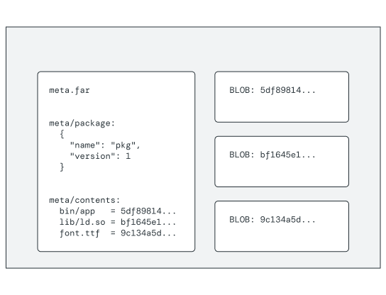
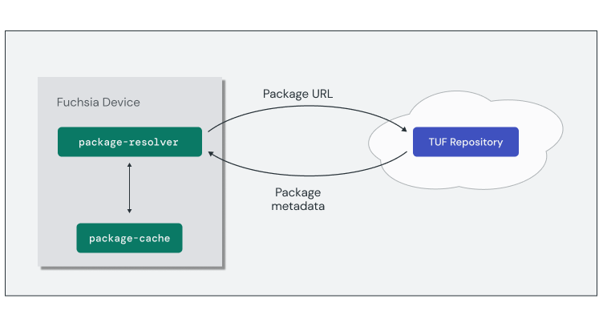
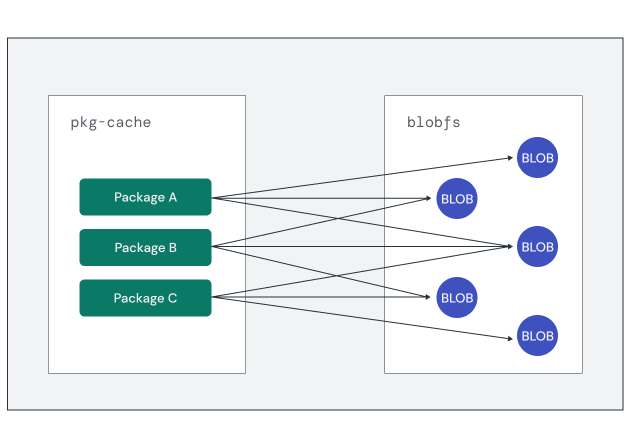

# Software delivery

Fuchsia software is delivered **on demand** to the system through **packages**.
This is a critical component to Fuchsia's core design principles of
**security** and **updatability**. Packages can be updated independently and
delivered on demand, like a web page. This enables a vulnerability patch to be
pushed to all Fuchsia products at once without the need for individual product
coordination.

A package is not a single archive or image file, but rather a tree of
**Binary Large Objects** (BLOBs) rooted in a single **Fuchsia Archive** (`.far`)
known as the **package metadata**. The BLOBs inside Fuchsia packages are
**content-addressable**, meaning they are referenced using a hash of their
contents. The content-address of the package metadata is known as the
**package hash**.

<aside class="key-point">
  </b>Merkle Roots</b>
  <p>Content-addresses are computed as the root hash of a Merkle tree. This is
  a common technique for verifying the integrity of content in transit and on
  disk. This allows Fuchsia to verify the contents of an entire package using
  just the package hash!</p>

  <p>To learn more about Merkle roots and how they are used in Fuchsia, see
  <a href="/docs/concepts/packages/merkleroot.md">Fuchsia package hash</a>.</p>
</aside>

The package metadata (`meta.far`) contains a `meta/` directory with at least the
following two items:

* `meta/package`: JSON file containing the package's identity information
  such as name and version.
* `meta/contents`: A map of the human-readable file names in a package to
  their content-addresses.

{: width="544"}

If two or more packages share the same content (such as a library dependency,
or font resource), their metadata will point to the same content-address for
that resource. This enables Fuchsia to optimize package distribution and
storage by avoiding the need to fetch and save a content BLOB that already
exists.

### Hosting and serving packages

Packages are hosted in **repositories** based on
[The Update Framework](https://theupdateframework.io/) (TUF). This framework is
a specification designed to enable secure delivery of software updates. TUF
repositories secure updates through signed metadata attached to records that
are verifiable against known trusted public and private keys. This means that
**any HTTP server can serve a TUF repository** without the need for
transport-level security, **_including a developer's workstation!_**

<aside class="key-point">
Developer tools such as <code>fx serve</code> host a simple HTTP server locally
serving a static tree of files formatted as a TUF repository.
</aside>

Packages within a repository are identified by a URL with the
`fuchsia-pkg` scheme:

```none
fuchsia-pkg://{{ '<var>' }}repo-hostname{{ '</var>' }}[/{{ '<var>' }}pkg-name{{ '</var>' }}[#{{ '<var>' }}resource-path{{ '</var>' }}]]
```

* `repo-hostname`: Hostname of a trusted package repository, such as `fuchsia.com`.
* `pkg-name`: Unique identifier for the package in this repository.
* `resource-path`: Resource contained within the package, such as a component
  manifest.

{: width="751"}

Requests for software on a Fuchsia device are handled by the
**package resolver**. The package resolver determines if the system already has
the package cached locally. If not, the resolver fetches the package metadata
from the repository and updates the necessary content BLOBs.

### Storing packages

On the device, package BLOBs are stored in a content-addressable filesystem
optimized for write-once, read-often files called `blobfs`. This allows them
to be **de-duplicated** across all packages and
**cryptographically verified** using their hash. Fuchsia runs the `pkg-cache`
service on top of `blobfs` to facilitate package management.

{: width="632"}

The `pkg-cache` layer tracks which packages in the system are currently
active. **Packages are not explicitly installed or removed in Fuchsia**.
Software is delivered on demand and likewise space can be reclaimed from
packages that are no longer active through periodic **garbage collection**.
When `pkg-cache` triggers garbage collection to reclaim space, content BLOBs
not referenced by any active package are deleted.

Note: For more of the technical details on Fuchsia packages and software
delivery, see the [package documentation](/docs/concepts/packages/package.md).

## Exercise: Packages

So far in this codelab, you've been experiencing on demand software delivery
to your device and you probably didn't even know it! In this exercise, you'll
peel back the covers and see the details of how packages are delivered and stored
on a Fuchsia device.

<<../_common/_restart_femu.md>>

### Examine the package server

When the emulator device launches, the device launcher also starts a
**local package server** that will be used to deliver packages.

Inspect the logs from your terminal window where the emulator was launched.
You should find output indicating that a package server is running. Note the
**port number** of the server:

```none {:.devsite-disable-click-to-copy}
[info] pm: Package server serving ..., at port 54189, pid: ...
[pm serve] serving ... at http://[::]:54189
[pm serve] 200 /
```

Open a browser to `http://localhost:[server-port]`. This loads an HTML page
listing all the packages currently available in the package repository. Each
one of these are packages that can be delivered to the device.

### Monitor package loading

Packages are resolved and loaded on demand by a Fuchsia device. Take a look at
this in action with the `bouncing_ball` example package.

From the device shell prompt, you can confirm whether a known package is
currently on the device:

```posix-terminal
pkgctl pkg-status fuchsia-pkg://fuchsia.com/bouncing_ball
```

```none {:.devsite-disable-click-to-copy}
Package in registered TUF repo: yes (merkle=ef65e2ed...)
Package on disk: no
```

Open a new terminal and begin streaming the device logs for `pkg-resolver`:

```posix-terminal
fx log --only pkg-resolver
```

This shows all the instances where a package was loaded from the package
server.

From the device shell prompt, attempt to resolve the package:

```posix-terminal
pkgctl resolve fuchsia-pkg://fuchsia.com/bouncing_ball
```

Notice the new lines added to the log output for `pkg-resolver`:

```none {:.devsite-disable-click-to-copy}
[core/pkg-resolver][pkg-resolver][I] Fetching blobs for fuchsia-pkg://google3-devhost/bouncing_ball: [
    e57c05aa909bcb38ca452d31abfbf9cc1d099751c9cd644b4d40cbf64e2af48b,
]
[core/pkg-resolver][pkg-resolver][I] resolved fuchsia-pkg://fuchsia.com/bouncing_ball as fuchsia-pkg://google3-devhost/bouncing_ball to 4ca324998ae9679241c74d2d9d9779fe86c79e2fa1f1627d941a37e987215895 with TUF
```

From the device shell prompt, check the package status again on the device:

```posix-terminal
pkgctl pkg-status fuchsia-pkg://fuchsia.com/bouncing_ball
```

```none {:.devsite-disable-click-to-copy}
Package in registered TUF repo: yes (merkle=ef65e2ed...)
Package on disk: yes (path=/pkgfs/versions/ef65e2ed...)
```

Fuchsia resolved the package and loaded it from the local TUF repository on
demand!

### Explore package metadata

Now that the `bouncing_ball` package has successfully been resolved, you can
explore the package contents. Once resolved, the package is referenced on the
target device using its content-address.

From the device shell prompt, use the `pkgctl get-hash` command to determine the
package hash for `bouncing_ball`:

```posix-terminal
pkgctl get-hash fuchsia-pkg://fuchsia.com/bouncing_ball
```

```none {:.devsite-disable-click-to-copy}
ef65e2ed...
```

Provide the full package hash to the `pkgctl open` command to view the package
contents:

```posix-terminal
pkgctl open ef65e2ed...
```

```none {:.devsite-disable-click-to-copy}
opening ef65e2ed... with the selectors []
package contents:
/bin/bouncing_ball
/lib/ld.so.1
/lib/libasync-default.so
/lib/libbackend_fuchsia_globals.so
/lib/libc++.so.2
/lib/libc++abi.so.1
/lib/libfdio.so
/lib/libsyslog.so
/lib/libunwind.so.1
/meta/bouncing_ball.cmx
/meta/contents
/meta/package
```

This lists the package metadata and each of the content BLOBs in the package.
You can `bin/` entries for executables, `lib/` entries for shared library
dependencies, additional metadata and resources.

## What's Next?

Congratulations! You now have a better understanding of what makes Fuchsia
unique and the goals driving this new platform's design.

In the next module, you'll learn more about the Fuchsia open source project and
the tools used to build and customize the system:

<a class="button button-primary"
    href="/docs/get-started/learn/build">Building Fuchsia</a>
