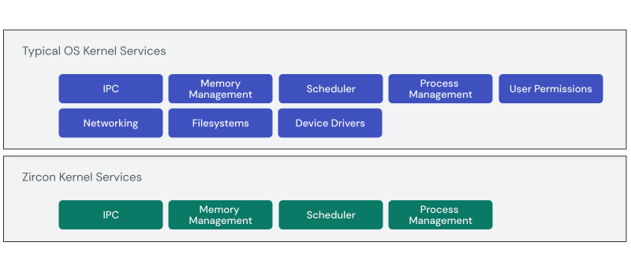
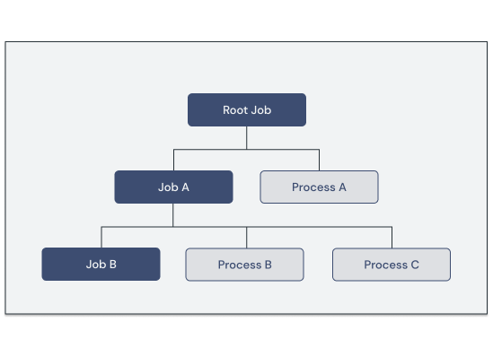
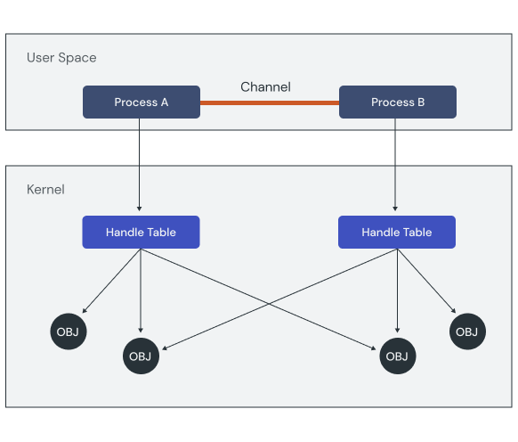

# Zircon fundamentals

[Zircon][glossary.zircon] is the core that powers Fuchsia.
It is composed of a microkernel and a small set of userspace services, drivers,
and libraries necessary for core system functions such as booting.

Although [Zircon][glossary.zircon] applies many of the concepts popularized by
microkernels, it does not strive to be minimal. Instead, the microkernel
architecture of Zircon enables Fuchsia to reduce the amount of trusted code
running in the system to a few core functions:

* Memory management
* Scheduling
* Inter-process communication



## System calls

User space code interacts with the objects in kernel space using
**system calls**. Zircon has system calls to perform low-level operations such
as:

*   Memory management
*   Task and process management
*   Inter-process communication (IPC) and synchronization
*   Exception handling
*   Hardware support services (clocks, entropy, device I/O)

<aside class="key-point">
  <p>Zircon has fewer system calls than POSIX-oriented operating systems due to
  services like filesystems and drivers being hosted outside the kernel. See the
  full list of available Zircon system calls in the
  <a href="/docs/reference/syscalls.md"> reference documentation.</a></p>
</aside>

User space processes access system calls through `libzircon.so` — a
[virtual Dynamic Shared Object (vDSO)][glossary.virtual-dynamic-shared-object].
The Zircon vDSO is a shared library in ELF format that the kernel maps into the
address space of each new process. This library is considered "virtual" because
it is exposed directly by the kernel image rather than being loaded from a file.

Most system calls operate directly with one or more [handles][glossary.handle]
— process-local references to objects living in kernel space represented as a
32-bit integer (`zx_handle_t`). Each handle declares the privileges, or
**rights**, the holder has to perform actions on the handle itself or the
referenced object.

<aside class="key-point">
 <b>Handles vs. file descriptors</b>
 <p>Similar to POSIX file descriptors, handles are references to a specific
 kernel object and they play a role in granting capabilities. However, Zircon
 handles are slightly more flexible with rights applied to the handle rather
 than the calling process. It is possible for a single process to have two
 different handles to the same kernel object with different rights.</p>

 <p>In addition, handles cannot be referenced by name and Zircon does not
 reserve any identifiers for common streams like stdin and stdout.</p>

 <p>For more details, see <a href="/docs/concepts/kernel/handles.md">
 Zircon handles</a>.</p>
</aside>

## Jobs, processes and threads

Zircon exposes three main kernel objects for running code:

* [Thread](/docs/reference/kernel_objects/thread.md):
  Thread of execution within a given address space.
* [Process](/docs/reference/kernel_objects/process.md):
  Set of executable instructions run in a private, isolated address space.
* [Job](/docs/reference/kernel_objects/job.md):
  Group of related processes and jobs. All jobs form a single rooted tree.



Processes form the basis for system capabilities. Each process is granted a set
of capabilities through the various handles it holds.

Fuchsia software may or may not run within the confines of a single process.
Jobs allow "applications" that are composed of more than one process to be
controlled as a single entity.

## Inter-process communication

Since processes are isolated by default, the kernel needs to provide a way for
them to securely communicate with each other. Zircon includes the following
kernel object types for inter-process communication (IPC):

* [Event](/docs/reference/kernel_objects/event.md):
  Signaling interface between two processes.
* [Socket](/docs/reference/kernel_objects/socket.md):
  Streaming data transport, similar to a pipe.
* [Stream](/docs/reference/kernel_objects/stream.md):
  Streaming data transport that is seekable, like a file.
* [Channel](/docs/reference/kernel_objects/channel.md):
  Message-based transport capable of passing both data and a set of handles.
* [FIFO](/docs/reference/kernel_objects/fifo.md):
  Control plane for shared memory access, optimized for small data payloads.

Among these objects, channels are uniquely suited to assist in launching new
processes because they are capable of transferring handles (and therefore,
capabilities) across to another process.

Channels have exactly two endpoint handles, each owned by a separate process.
Only the owners may read or write messages, but ownership of an endpoint may
be transferred from one process to another. When handles are written into a
channel, they are removed from the sending process. When a message with handles
is read from a channel, the handles are added to the receiving process.



Note: You can find more of Zircon's deep technical details in the
[kernel documentation](/docs/concepts/kernel/README.md).

Zircon channels are the basis for service-level IPC protocols described by
the [Fuchsia Interface Definition Language (FIDL)][glossary.FIDL]. FIDL
protocols are the primary method of IPC used by Fuchsia programs. You will
explore creating and consuming FIDL protocols in more detail later on.

## Exercise: Jobs and processes

Let's explore some of these fundamental concepts on a running system. In
this exercise, you'll see how jobs and processes interact to form a tree.

<<../_common/_start_femu.md>>

### Dump the process list

From the device shell prompt, you can use the `ps` command to dump the list of
running jobs and processes.

```posix-terminal
ps
```

Below is a trimmed example of what the output looks like:

```none {:.devsite-disable-click-to-copy}
TASK                     PSS PRIVATE  SHARED   STATE NAME
j: 1027               507.8M  507.4M                 root
  p: 1061             564.4k    564k     36k         bin/bootsvc
  p: 1150            4264.4k   4264k     36k         bin/component_manager
  j: 1479             228.4k    228k
    p: 1583           228.4k    228k     36k         pwrbtn-monitor.cm
  j: 1484             532.4k    532k
    p: 1599           532.4k    532k     36k         svchost.cm
  j: 1544             402.4k    304k
    p: 1633           402.4k    304k    232k         netsvc.cm
  j: 1681             296.4k    296k
    p: 1733           296.4k    296k     36k         console-launcher.cm
  j: 1799            7232.4k   7232k
    p: 1825          7232.4k   7232k     36k         archivist.cm
  j: 1927             660.4k    660k
    p: 1955           660.4k    660k     36k         base-resolver.cm
  j: 2072            1016.4k   1016k
    p: 2088          1016.4k   1016k     36k         driver_manager.cm
  j: 2239             348.4k    348k
    p: 2252           348.4k    348k     36k         device-name-provider.cm
  j: 2364             275.3M  275.3M
    p: 2380          1012.4k   1012k     36k         fshost.cm
    p: 6544           252.1M  252.1M     36k         /pkg/bin/blobfs
    p: 10205         9744.4k   9744k     36k         /pkg/bin/minfs
    p: 10475           12.8M   12.8M     36k         pkgfs
```


Let's focus on two columns in the output for now:

* **TASK**: This tells you whether each entry is a job (`j`) or process (`p`)
  followed by their unique id.
* **NAME**: This provides a little more detail about what piece of the system
  is running there.

Let's break down some interesting things here based on what we've discussed so
far:

1. Every process is connected to a parent job. Some jobs have multiple
   processes.
1. All jobs trace back to the `root` job as the ultimate parent, forming a tree.
1. During startup, the system launches a few processes directly into the `root` job.
   Most other processes are launched under their own parent jobs.
1. After the initial startup work, many of the entries have a `.cm` extension. These
   refer to **components**, and you will learn more about them later on.
1. Some of these components are core services like filesystems (`fshost.cm`) and
   drivers (`driver_manager.cm`) that live in user space separate from the
   kernel.

Next, we'll explore how the Zircon enables the fundamentals of Fuchsia's
security model.

<aside class="key-point">
  <b>Extra Credit: Fuchsia Startup</b>
  <p>Exploring the tree of running processes is also a great way to learn about
  the startup process of a Fuchsia device. Take a moment to review
  <a href="/docs/concepts/booting/everything_between_power_on_and_your_component.md">
  device startup</a> and map how the initial processes align with the
  <code>ps</code> output on the emulator.</p>
</aside>


[glossary.FIDL]: /docs/glossary/README.md#FIDL
[glossary.zircon]: /docs/glossary/README.md#zircon
[glossary.virtual-dynamic-shared-object]: /docs/glossary/README.md#virtual-dynamic-shared-object
[glossary.handle]: /docs/glossary/README.md#handle