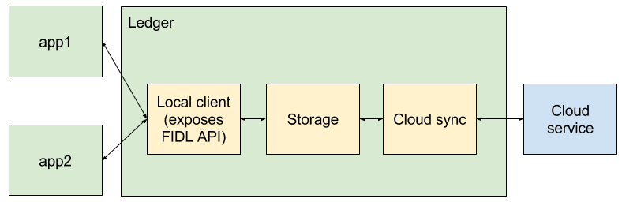

# Architecture

This document explains the internal architecture of Ledger.

[TOC]

## Overview

The Ledger implementation is logically composed of the following components:

 - **Storage** that stores and provides access to the data locally,
 - client components that interact with storage:
   - **Local client** that exposes Ledger FIDL API to locally running apps,
   - **Cloud sync** that synchronizes the Ledger state across devices

All of these components run together within the Ledger process.

## Storage

*** promo
Ledger stores data in key-value stores called pages. A page changes in atomic
commits, each commit adding, removing or modifying one or more entries in the
key-value store.

The commit history of each page forms a DAG in which each commit has either no
parents (initial commit), 1 parent (regular commit) or 2 parents (merge commit).
***

The Storage component persists:

 - the commit history of each page
 - immutable storage objects holding the state of each page
 - sync metadata, including synchronization state of each object

The contents of each commit are key-value pairs (entries), stored in a
B-Tree-like structure with the following main properties:

 - entries are ordered by the keys, permitting efficient evaluation of range
   queries
 - tree nodes are immutable, allowing referencing the same node from two (or
   more) different commits and thus avoiding duplicating the state among
   different commits with similar content
 - the B-Tree is history-independent, i.e. given the same set of entries, the
   resulting structure of the tree will be the same, independently of the
   insertion order. This property permits to efficiently compute the diff
   between two given commits.

Storage exposes a key-value API to Local client and creates new storage objects
and commits in response to modifications the Local client makes. Similarly,
Storage receives commits and storage objects synced from other devices from
Cloud Sync.

Code:

 - [/bin/ledger/storage], in particular:
   - [/bin/ledger/storage/public] contains the public (exposed to other components) API
   - [/bin/ledger/storage/impl] contains the implementation
   - [/bin/ledger/storage/impl/btree] contains the implementation of the B-tree

## Local client

Local Client exposes a FIDL API to apps running on the device. In response to
modifications to the key-value store requested by apps connecting to Ledger, it
makes corresponding calls to Storage.

When notified about a conflict by Storage, Local client resolves it according to
the policy selected by the client app, calling back to it if necessary - see
[Conflict resolution](api_guide.md#Conflict-resolution) in the API Guide.

Code:

 - [/bin/ledger/app], in particular:
   - [/bin/ledger/app/merging] implements conflict resolution

## Cloud sync

Cloud sync is notified by Storage about new locally-produced commits and is
responsible for pushing them, along with the associated storage objects, to the
cloud. Conversely, Cloud sync also tracks new commits being synced to the cloud
by other devices, downloads them and registers them with Storage.

Code:

 - [/bin/ledger/cloud_sync] implements high-level sync logic, in particular:
   - [/bin/ledger/cloud_sync/public] contains the public (exposed to other components) API
   - [/bin/ledger/cloud_sync/impl] contains the implementation
 - [/bin/cloud_provider_firebase] and [/bin/cloud_provider_firestore]
   implement integration with cloud services

[/bin/ledger/storage]: /bin/ledger/storage/
[/bin/ledger/storage/public]: /bin/ledger/storage/public/
[/bin/ledger/storage/impl]: /bin/ledger/storage/impl/
[/bin/ledger/storage/impl/btree]: /bin/ledger/storage/impl/btree/
[/bin/ledger/app]: /bin/ledger/app/
[/bin/ledger/app/merging]: /bin/ledger/app/merging/
[/bin/ledger/cloud_sync]: /bin/ledger/cloud_sync/
[/bin/ledger/cloud_sync/public]: /bin/ledger/cloud_sync/public/
[/bin/ledger/cloud_sync/impl]: /bin/ledger/cloud_sync/impl/
[/bin/cloud_provider_firebase]: /bin/ledger/cloud_provider_firebase/
[/bin/cloud_provider_firestore]: /bin/ledger/cloud_provider_firestore/
