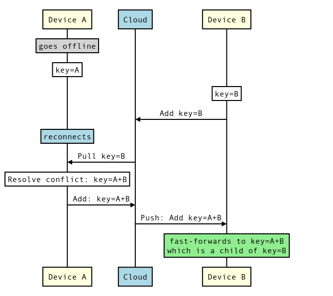

# Conflict Resolution

This document explains how Ledger handles conflicts.

[TOC]

## Conflicts

Ledger is an offline-first database - devices can naturally diverge when making
concurrent changes and thus, the change history forms a directed acyclic graph
(DAG) of [commits](architecture.md#Storage). Whenever the local history DAG has
more than one head commit, i.e. more than one leaf in the DAG, we call this
state a **conflict**.

*** aside
A conflict can be created by **two devices** making a concurrent modification of
the Ledger state, but also by a **single device** making two concurrent changes
to the local state - this is usually not desirable, but certainly possible.
***

Whenever a conflict arises, Ledger by default merges the local heads
automatically, using an entry-by-entry last-one-wins policy based on
non-reliable timestamps of the two commits being merged.

Client apps that want to override this behavior can opt for either one of the
predefined merging policies or use a custom policy and handle the merges
themselves, see [Conflict Resolution](api_guide.md#Conflict-resolution) in the
API Guide.

## Convergence

As the same conflict can be resolved concurrently on two devices, the resulting
state can once more be different between devices. This can potentially create a
situation where two or more devices keep creating merge commits that are then
synced and merged again. This situation is called a **merge storm**.

Ledger employs a number of strategies in order to prevent merge storms:

 - a device uploads local changes **only** when the local state is resolved
   (there is a single local head). If the local state is divergent, the device
   first resolves the conflicts and only later uploads the result.
 - identical merge of two commits made concurrently on multiple devices results
   in the exact same commit (as long as the conflict resolver makes the same
   decisions, i.e. is deterministic). This is ensured because commits are
   content-addressed based on the B-tree content and the commit metadata; and
   commit metadata of a merge commit, including the commit timestamp, depends
   only on the parent commits - the timestamp is selected as the biggest of two
   parent timestamps.
 - when merging **two merge commits**, Ledger waits with exponential backoff,
   allowing one device to win the race and have a final say on the resolved state.
   The exponential backoff should occur only if the two devices create
   conflicting merge commits, e.g. if the conflict resolution is not
   deterministic (see below).

## Custom conflict resolvers

In order to facilitate convergence, any custom conflict resolution implemented
by the client app should be **deterministic** - that is, the resulting merge
commit should depend only on the two commits being merged. This ensures that the
same conflict resolved concurrently on two devices yields the very same result.

The pair of commits passed to the conflict resolver is ordered deterministically
by Ledger, so the conflict resolver doesn’t need to be **commutative**.

## Case studies

This section discusses conflict resolution behavior in a number of scenarios.

### Offline

When a device that has been making modifications offline goes back online, the
device downloads remote modifications first, then resolves any conflicts, and
only after that uploads its own changes to the cloud. This way the other devices
that are online and in sync with each other only need to fast-forward to catch
up with remote changes. We sacrifice sync latency (it takes longer for changes
from the offline device to be visible to others) for faster convergence and less
bandwidth spend.

### Online

When two online devices make a concurrent change (that is, both make their
changes before seeing changes from the other device), the convergence is ensured
as long as the conflict resolver is deterministic (see [Custom conflict
resolvers](#Custom-conflict-resolvers)). When two devices concurrently resolve
the same conflict, they produce the same resulting merge commit. This commit can
be then uploaded to the cloud twice, once by each device, but any extra
occurrences will be ignored by each participant and will not trigger further
merges.

