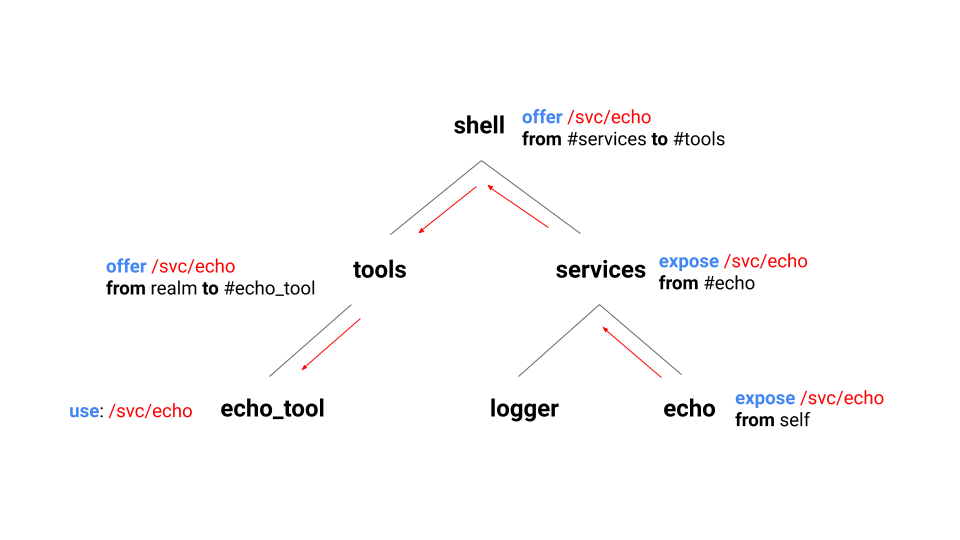

# Component manifests

A component manifest is a declaration that defines a component. This document
gives an overview of the concepts used by component manifests, and presents the
syntax for writing component manifest source (CML). Component manifests
contain:

- Information about [how to run the component](#runtime).
- The realm's [child component instances](#child-component-instances).
- [Routing rules](#capability-routing) that describe how capabilities are used,
  exposed, and offered between components.
- [Freeform data ("facets")](#facet-metadata) which is ignored by the component
  framework but can be interpreted by third parties.

## Formats

A component manifest can be represented in multiple formats, depending on the
context.

### CML format

*CML* (*component manifest language*) is the developer-facing source format for
component manifests. CML files are JSON5 files that end with a `.cml` extension.
Descriptions and examples of the CML syntax are contained in this document: see
[Syntax](#syntax).

### FIDL format

The [`ComponentDecl`](/sdk/fidl/fuchsia.sys2/decls/component_decl.fidl) FIDL
table is the canonical representation of a component manifest. It is the
representation used by the component framework APIs and the form in which
component manifests are provided to components at runtime.

### Binary format

The binary format stores component manifests at rest (for example, as part of a
package). The binary format is a JSON file mapping one-to-one onto the FIDL
representation, by convention ending in a `.cm` extension.

## Concepts

### Runtime

The [`program`](#program) section of a component manifest declares how the
component is run. For a component containing an ELF binary, this section
consists of a path to a binary in the package and, optionally, a list of
arguments. For a component that does not contain an executable, this section is
omitted.

See also: [ELF Runner](elf_runner.md)

### Child component instances

The [`children`](#children) section of a component manifest may declare zero or
more child component instances. The [`offer`](#offer) declarations determine
which capabilities the child instances have access to (see [Routing
terminology](#routing-terminology)).

### Capability routing

Component manifests provide a syntax for routing capabilities between
components. For a detailed walkthrough about what happens during capability
routing, see [_Life of a service open_](life_of_a_service_open.md)

#### Capability types

The following capabilities can be routed:

- `service`: A filesystem service node that can be used to open a channel to a
  service provider.
- `directory`: A filesystem directory.

#### Routing terminology

Component manifests declare how capabilities are routed between components. The
language of capability routing consists of the following three keywords:

- `use`: When a component `uses` a capability, the capability is installed in
  the component's namespace. A component may `use` any capability that has been
  `offered` to it.
- `offer`: When a component `offers` a capability to one of its child component
  instances, the child may `use` that capability or offer it to one of its own
  children. A component may `offer` any capability that it provides itself, has
  been `offered` to it by a parent, or has been `exposed` to it by a child.
- `expose`: When a component `exposes` a capability to its containing realm
  (i.e., its parent), the parent may `offer` the capability to one of its other
  children. A component may `expose` any capability that it provides, or that
  one of its children exposes.

When you use these keywords together, they express how a capability is routed
from a component instance's [outgoing
directory](/docs/development/abi/system.md#outgoing-directory) to another
component instance's namespace:

- `use` describes the capabilities that populate a component instance's
  namespace.
- `expose` and `offer` describe how capabilities are passed between component
  instances. Aside from their directionality, there is one significant
  difference between `offer` and `expose`. While a component may `use` a
  capability that was `offered` to it, a component is not allowed to `use` a
  capability that was `exposed` to it by its child. This restriction exists to
  prevent dependency cycles between parent and child.

#### Capability paths

Service and directory capabilities are identified by paths.  A path consists of
a sequence of path components, starting with and separated by `/`, where each
path component consists one or more non-`/` characters.

A path may either be a *source path* or *target path*, whose meaning depends on
context:

- A *source path* is either a path in the component's outgoing directory (for
  `offer` or `expose` from `self`), or the path by which the capability was
  offered or exposed to this component.
- A *target path* is either a path in the component's namespace (for `use`), or
  the path by which the capability is being `offered` or `exposed` to another
  component.

#### Examples

For an example of how these keywords interact, consider the following component
instance tree:



In this example, the *echo* component instance provides an `/svc/echo` service
in its outgoing directory. This service is routed to the `echo_tool` component
instance, which uses it. It is necessary for each component instance in the
routing path to propagate `/svc/echo` to the next component instance.

The routing sequence is:

- *echo* hosts the `/svc/echo` service in its outgoing directory. Also, it
  exposes `/svc/echo` from `self` so the service is visible to its parent,
  *system*.
- *system* exposes `/svc/echo` from its child `echo` to its parent, *root*.
- *root* offers `/svc/echo` from its child `system` to its other child *shell*.
- *shell* offers `/svc/echo` from `realm` (i.e., its parent) to its child
  *echo_tool*.
- *echo_tool* uses `/svc/echo`. When `echo_tool` runs, it will find `/svc/echo`
  in its namespace.

A working example of capability routing can be found at
[//examples/components/routing](/examples/components/routing).

### Facet metadata

*Facets* are metadata that is ignored by the component framework itself, but may
be interpreted by interested components. For example, a module component might
contain [module facets](/peridot/docs/modular/module_facet.md) declaring intents
the module subscribes to.

## Syntax

This section explains the syntax for each section of the component manifest, in
CML format. For the full schema, see
[cml_schema.json](/garnet/lib/rust/cm_json/cml_schema.json).

### program

`program` varies depending on how the component is run. If the component
contains no executable, `program` is to omitted. If the component contains an
ELF binary, `program` will contain information on how to run the binary.

When `program` contains information on how to run a binary, it is an object with
the following properties:

- `binary`: Package-relative path to the executable binary
- `args` *(optional)*: List of arguments

Example:

```
"program": {
    "binary": "bin/hippo",
    "args": [ "Hello", "hippos!" ],
},
```

See also: [ELF Runner](elf_runner.md)

### children

The `children` section declares child component instances as described in [Child
component instances](#child-component-instances).

`children` is an array of objects with the following properties:

- `name`: The name of the child component instance, which is a string of one or
  more of the following characters: `a-z`, `0-9`, `_`, `.`, `-`.
- `url`: The component URL for the child component instance.
- `startup` *(optional)*: The component instance's startup mode.
    - `lazy` *(default)*: Start the component instance only if another component
      instance binds to it.
    - `eager`: Start the component instance as soon as its parent starts.

Example:

```
"children": [
    {
        "name": "logger",
        "url": "fuchsia-pkg://fuchsia.com/logger#logger.cm",
    },
    {
        "name": "pkg_cache",
        "url": "fuchsia-pkg://fuchsia.com/pkg_cache#meta/pkg_cache.cm",
        "startup": "eager",
    },
],
```

### use

The `use` section contains `use` declarations of child component instances as
explained in [Routing terminology](#routing-terminology).

`use` is an array of objects with the following properties:

- A capability declaration, one of:
    - `service`: The [source path](#capability-paths) of a service capability.
    - `directory`: The [source path](#capability-paths) of a directory
      capability.
- `as` *(optional)*: The explicit [target path](#capability-paths) for the
  capability. If omitted, defaults to the source path.

Example:

```
"use": [
    {
        "service": "/svc/fuchsia.log.Log",
    },
    {
        "directory": "/data/themes",
        "as": "/data",
    },
],
```

### expose

The `expose` section declares capabilities exposed by this component, as
explained in [Routing terminology](#routing-terminology).

`expose` is an array of objects with the following properties:

- A capability declaration, one of:
    - `service`: The [source path](#capability-paths) of a service capability.
    - `directory`: The [source path](#capability-paths) of a directory
      capability.
- `from`: The source of the capability, one of:
    - `self`: This component.
    - `#<child-name>`: A [reference](#references) to a child component instance.
- `as` *(optional)*: The explicit [target path](#capability-paths) for the
  capability. If omitted, defaults to the source path.

Example:

```
"expose: [
    {
        "directory": "/data/themes",
        "from": "self",
    },
    {
        "service": "/svc/pkg_cache",
        "from": "#pkg_cache",
        "as": "/svc/fuchsia.pkg.PackageCache",
    },
],
```

### offer

The `offer` section declares capabilities offered by this component, as
explained in [Routing terminology](#routing-terminology).

`offer` is an array of objects with the following properties:

- A capability declaration, one of:
    - `service`: The [source path](#capability-paths) of a service capability.
    - `directory`: The [source path](#capability-paths) of a directory
      capability.
- `from`: The source of the capability, one of:
    - `realm`: The component's containing realm (parent).
    - `self`: This component.
    - `#<child-name>`: A [reference](#references) to a child component instance.
- `to`: An array of target declarations, each of which is an object with the
  following properties:
    - `dest`: A [reference](#references) to the child to which the capability is
      being offered, `#<child-name>`.
    - `as` *(optional)*: The explicit [target path](#capability-paths) for the
      capability. If omitted, defaults to the source path.

Example:

```
"offer": [
    {
        "service": "/svc/fuchsia.log.Log",
        "from": "#logger",
        "to": [
            { "dest": "#fshost" },
            { "dest": "#pkg_cache" },
        ],
    },
    {
        "directory": "/data/blobfs",
        "from": "self",
        "to": [
            { "dest": "#pkg_cache", "as": "/blobfs" },
        ],
    },
    {
        "directory": "/data",
        "from": "realm",
        "to": [
            { "dest": "#fshost" },
        ],
    },
],
```

### facets

The `facets` section is a JSON object containing [facets](#facet-metadata),
chunks of metadata which components may interpret for their own purposes. The
component framework enforces no schema for this section, but third parties may
expect their facets to adhere to a particular schema.

This section may be omitted.

### References

A *reference* is a string of the form `#<reference-name>`, where
`<reference-name>` is a string of one or more of the following characters:
`a-z`, `0-9`, `_`, `.`, `-`.

Currently, the only type of supported reference is a *child reference*, which
refers to the [child component instance](#child-component-instances) whose
`name` is `<reference-name>`.
