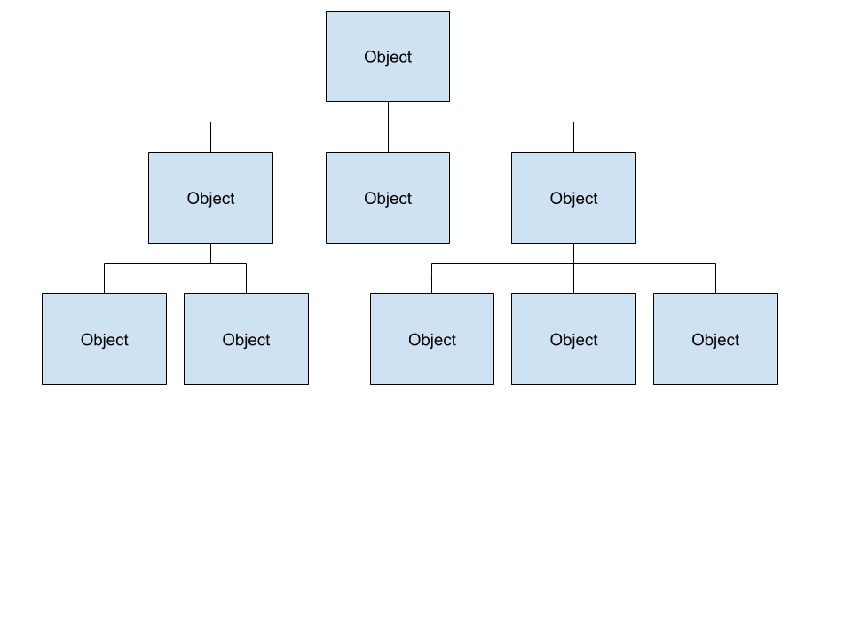
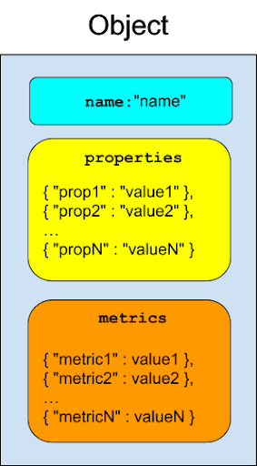

Fuchsia Component Inspection
=====

Components in Fuchsia may expose structured information about themselves
conforming to the Inspect API. This document describes the concepts of
Component Inspection, the interface, the C++ language implementation
of the interface, and user-facing tools for interacting with components
that expose information.

[TOC]

# Quick Links

* [iquery](iquery.md) &mdash; The userspace tool for inspecting components.
* [Getting started with Inspect](gsw-inspect.md) &mdash; A quick start guide.
* [VMO format](vmo-format/README.md) &mdash; Describes the Inspect VMO File Format.

# Concepts

Components may expose a tree of **Objects**, each of which has a set of
string-valued **Properties** and numeric **Metrics**.

## Object

An object is an exported entity within a component that may have 0 or
more children. Each object has a name, and each child of an object
must have a unique name among the children.

## Property

Objects may have any number of properties. A property has a key and a
value which are both strings.

## Metric

Objects may have any number of metrics. A metric has a string key and numeric value.

There are three types of metric values:

- `UINT`, a 64-bit unsigned integer.
- `INT`, a 64-bit signed integer.
- `DOUBLE`, a 64-bit floating point value.

## Events

**WORK IN PROGRESS**: Streaming events are planned to be supported in
the future.

# API

## [FIDL](/zircon/system/fidl/fuchsia-inspect/inspect.fidl)

The FIDL protocol, `fuchsia.inspect.Inspect`, exposes the following
operations on an object:

### `ReadData`
Read the object's properties and metrics.

### `ListChildren`
Obtain a list of names for the object's children.

## Filesystem Interface

Objects are exposed as a tree in the filesystem. Each directory is
named with the object's name, and they must expose a file `.channel`
that allows binding to the `fuchsia.inspect.Inspect` interface.

Components by default obtain a reference to their `out/` directory in
their hub. It is customary to expose a root-level object called `objects`
at `out/objects/`.

The manager for a component's environment may expose its own information
about the component to the hub. For instance, appmgr exposes
`system_objects` for each component.

# C++ Interface

## [Object Wrapper](/garnet/public/lib/component/cpp/expose.h)

Class `Object` is the implementation of an object in C++. It implements
the `Vnode` and `Inspect` interfaces to expose the object through the
filesystem and raw FIDL protocols respectively.

Helper classes `Property` and `Metric` wrap the functionality of dealing
with their respective values and serializing to FIDL.

### On-Demand Values

Property values, metric values, and even the set of children may be set
on-demand through callbacks.

Properties and metrics utilizing a callback will *only* get their value
by callback until they are set to an explicit value.

The set of children for an object is the union of its explicitly set
children and on-demand children provided by callback.

### Arithmetic

`Metric` allows for typed addition and subtraction. The `Set*` methods set
the type of the metric, and arithmetic operations do not modify this type.

## [ObjectDir](/garnet/public/lib/component/cpp/object_dir.h)

Class `ObjectDir` is a lightweight wrapper around a refcounted pointer
to an `Object`. `ObjectDirs` are safe to copy, and provide a stable
reference to a single object.

`ObjectDir` simplifies traversing a tree of objects by name and setting
properties/metrics on those objects with a STL-style wrapper.

## [ExposedObject](/garnet/public/lib/component/cpp/exposed_object.h)

Class `ExposedObject` is a base class simplifying management of complex
persistent hierarchies of objects. It is the recommended implementation
point for exposing objects from your components.

An `ExposedObject` is not an object itself, rather it contains a reference
to the object itself as well as a reference to the (optional) parent for
the object. On destruction, the `ExposedObject` automatically removes
itself from its parent without invalidating underlying references to
the object. This enables developers to expose complex, rapidly changing
hierarchies of objects without worrying about object lifetime.

# Userspace Tools

The primary userspace tool is [iquery](iquery.md), which has its own manual page.
