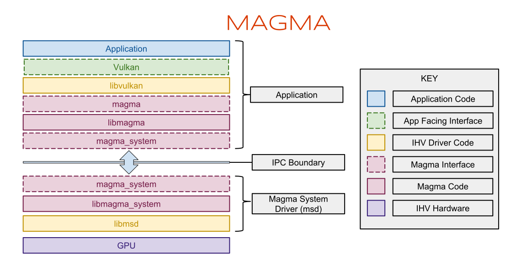

Magma: Design
=============

For an overview of Magma including background, hardware requirements, and description of architecture, please see [Magma: Overview](overview.md).

## Goals

### Extensible core

Magma aims to pragmatically minimize the architectural differences in the way that client drivers communicate with their respective system drivers across different gpu and client driver designs.  Where necessary, Magma adds gpu-specific queries, command structures, and interfaces to accomodate specific requirements.  These differences are clarified in driver-specific documentation.

### Feed forward

Wherever possible, the main IPC channel is used in a feed-forward manner to prevent blocking client threads.  For notifications from the system driver back to the client, driver-defined messages are sent asynchronously.

### Avoid gpu faults

Clients can cause the gpu to hang or fault, and when this happens it will affect system critical gpu clients like the compositor, resulting in a noticeable hiccup in user experience.  Consequently Magma attempts to minimize the opportunities for clients to induce gpu faults.

## Architecture

As mentioned in the overview, the Magma architecture involves two driver components: a client library, and a privileged system driver process.  Both are gpu-specific; the client library must compile software from IR (intermediate representation, for example SPIR-V) into machine code, and format command buffers correctly for consumption by the hardware.  These are fed to the Magma system driver, which performs that actual programming of the hardware.

Magma defines two interfaces to gpu-specific code:
* The **magma** interface provides the foundation for the client driver, typically libvulkan
* The **msd** (magma system driver) interface dictates the entry points for an implementation of a magma service driver

libmagma is a convenience layer that implements the magma interface and forwards calls appropriately to magma_system, which is a gpu-agnostic layer handling driver initialization and teardown, transport of IPC commands, and some validation.

The creation of a magma driver is thus simplified at a high level into two steps:

1. Produce a client driver by leveraging the magma interface (described below)
2. Implement the msd interface to produce a magma system driver.

For details on the process of building these two components, see the [porting](porting.md) guide.

## The Magma interface

The Magma interface is a service interface provided by the Magma system driver. The interface is designed to be useful for implementing an accelerated graphics api.  It consists of [magma.h](../include/magma_abi/magma.h)
plus gpu specific headers (example: [intel](../../../drivers/gpu/msd-intel-gen/include/msd_intel_gen_query.h)).

### Physical devices
During the fuchsia boot sequence, a Magma system driver is instantiated for each physical device capable of accelerated graphics.  The instantiation creates a device binding in the class gpu; for example, in a single gpu system the device is bound to /dev/class/gpu/000.
With appropriate application privilege, client drivers may scan for the presence of one or more gpu class devices, and open them.
Synchronous queries may be performed on the device file descriptor to return various parameters, some of which may be useful for helping the application decide which physical devices, under which configuration, to work with.

### Connections
When the application declares its intent to work with a particular physical device, a connection is established to the Magma system driver. This connection forms the basis for all further communication between the client driver and system driver.
A connection allows the client driver to allocate buffers and map them into the gpu address space.  The connection defines a memory isolation boundary; Magma guarantees that buffers mapped into one connection’s address space are by default not accessible to another connection.  Buffer sharing between connections is possible with explicit export/import.

### Contexts
To execute work on the gpu, a context is needed.  Contexts are scheduled for execution on the gpu by the Magma system driver.  Contexts should contain all gpu state required to allow for multiple contexts to be switched onto the hardware.  Command buffers are used to set the state of the gpu, so command buffers are submitted to a particular context.
Magma supports multiple contexts per connection; this is to allow for more than one context to share a single address space.

When a client connection is closed, to avoid gpu fault the address space must remain alive while gpu is executing work using that address space; therefore, context takes a shared reference on the address space.

### Buffers and Mappings
Currently Magma requires a unified memory architecture, as is the case with most mobile hardware, where cpu and gpu access the same physical memory.   Magma buffers are just zircon virtual memory objects ([VMOs](https://fuchsia.googlesource.com/zircon/+/master/docs/objects/vm_object.md)). Client drivers allocate buffers and register those buffers with the system driver.

Gpu address space management may be performed by the client or by the system driver. The client driver design may dictate the model.

If the system driver manages buffer mapping lifetime, the system driver ensures mappings, and their underlying buffers, are alive while command buffers referencing them are outstanding on the gpu.  Since mapping is slow (because it requires ensuring that buffer pages are committed, and modifying page tables to reference the correct bus address for each page), buffers mappings must either persist for the lifetime of the buffer, or a gpu mapping cache could be used to limit the amount of memory used by cached mappings.

The disadvantage of system driver managed buffer mappings is when building command lists, the client needs to know the gpu address of mapped buffers; so command buffers must be patched by the Magma service driver prior to execution.  For this reason, it is preferred to have the client driver explicitly manage gpu mapping lifetime.  The disadvantage with the explicit approach is that a client may unmap or release a buffer while a mapping is in flight on the gpu; if this occurs, the page table entries will be invalidated while in use by the gpu, likely causing a gpu fault.

A mitigation for this disadvantage is possible if each command buffer is accompanied by a list of dependent buffer mappings; then, the command buffer can share ownership of the gpu mappings; and if an unmap or release is received while a resource is inflight, this is treated as a fatal error to the client without disrupting the gpu.

### Command submission

Commands consist of vendor-specific data that modify the state of the gpu and trigger code execution on the gpu compute cores.
The system driver is responsible for queueing and scheduling submitted commands onto the gpu for execution.
Various scheduling algorithms are possible: FIFO (default), priority, time slicing.
Pre-emption of inflight command buffers, if supported by hardware, can be used to implement context prioritization.

### Semaphores

Magma provides semaphores as a general signalling mechanism that can be used to implement vulkan fences and semaphores.  Magma semaphores are built on zircon [events](https://fuchsia.googlesource.com/zircon/+/master/docs/objects/event.md).

### Summary of object ownership
* Client: owns connections; shared ownership of buffers, mappings, contexts
* Connection: shared ownership of address space
* Context: shared ownership of address space
* Address space: shared ownership of mappings
* Mappings: shared ownership of buffers
* Command buffer: shared ownership of context; may have shared ownership of mappings

## Error Handling

When an error occurs in the magma service driver, the corresponding connection is killed.  When the client driver attempts to access the closed connection it typically will pass up a "device lost" vulkan api error.

## Power Management

Power management involves adjustment of the gpu execution frequency based on a measurement of gpu load, and potential power or thermal limitations.  Power management will be detailed in further documentation.

## Testing Strategy

See [test_strategy](test_strategy.md).
