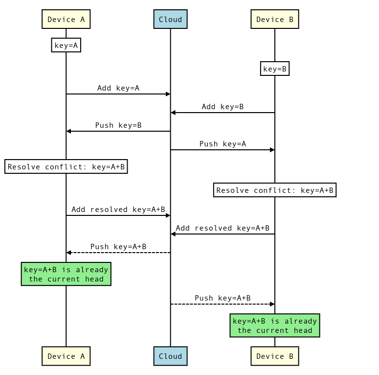

# Conflict Resolution

This document explains how Ledger handles conflicts.

[TOC]

## Conflicts

Ledger is an offline-first database - devices can naturally diverge when making
concurrent changes and thus, the change history forms a directed acyclic graph
(DAG) of [commits](architecture.md#Storage). Whenever the local history DAG has
more than one head commit, i.e. more than one leaf in the DAG, we call this
state a **conflict**.

*** aside
A conflict can be created by **two devices** making a concurrent modification of
the Ledger state, but also by a **single device** making two concurrent changes
to the local state - this is usually not desirable, but certainly possible.
***

Whenever a conflict arises, Ledger by default merges the local heads
automatically, using an entry-by-entry last-one-wins policy based on
non-reliable timestamps of the two commits being merged. See the [Merge
Strategies](#Merge-Strategies) section for more details.

Client apps that want to override this behavior can opt for either one of the
predefined merging policies or use a custom policy and handle the merges
themselves, see [Conflict Resolution](api_guide.md#Conflict-resolution) in the
API Guide.

## Convergence

As the same conflict can be resolved concurrently on two devices, the resulting
state can once more be different between devices. This can potentially create a
situation where two or more devices keep creating merge commits that are then
synced and merged again. This situation is called a **merge storm**.

Ledger employs a number of strategies in order to prevent merge storms:

 - a device uploads local changes **only** when the local state is resolved
   (there is a single local head). If the local state is divergent, the device
   first resolves the conflicts and only later uploads the result.
 - identical merge of two commits made concurrently on multiple devices results
   in the exact same commit (as long as the conflict resolver makes the same
   decisions, i.e. is deterministic). This is ensured because commits are
   content-addressed based on the B-tree content and the commit metadata; and
   commit metadata of a merge commit, including the commit timestamp, depends
   only on the parent commits - the timestamp is selected as the biggest of two
   parent timestamps.
 - when merging **two merge commits**, Ledger waits with exponential backoff,
   allowing one device to win the race and have a final say on the resolved state.
   The exponential backoff should occur only if the two devices create
   conflicting merge commits, e.g. if the conflict resolution is not
   deterministic (see below).

## Merge Strategies

For each [page](data_organization.md#Pages), client apps can define a *merge
strategy*. These strategies determine the behavior of Ledger when a conflict is
detected, and are appropriate for different situations.

To avoid merge storms (as described above), we ensure that any automatic merge
strategy is **deterministic**, so that two devices seeing the same conflict
reach the same resolution.

### Last-one-wins

The *last-one-wins* merge strategy is the default one, i.e. the one applied if
the client app didn't configure any other strategy. When using this strategy,
the client app delegates all merging to Ledger and doesn't have to handle
merges.

The last-one-wins strategy operates by taking, for each conflicting key/value
pair, the one present in the latest commit, ordered by creation timestamp.
However, if a key/value pair is modified by one commit only (added, removed, or
changed value), the modification is taken, regardless of the timestamp.

This strategy is very convenient for applications that use Ledger to store
independent key/value pairs, as it removes the burden of merging from the
client application entirely. Storing independent key/value user preferences
would be a good case for this strategy.

*** aside
The creation timestamps are generated on each device. Thus, unsynchronized
clocks or clock drift between devices may result in older values taking
precedence over new ones.

We think this is fine because:
* We want a fully automatic merge strategy for developers who don't have
cross-key consistency needs and want to keep their app simple. Others should
use the more advanced policies with custom mergers.
* We could do an "arbitrary-one wins" merge policy and use the ordering of an
internal ID other than a timestamp. As long as this ID (as the timestamp) is
fixed for a given commit, then the merge is deterministic and we can have a
valid merge. It seemed better to us to use a policy that makes sense to users
in the usual case, rather than a random-looking policy.
* This merge policy operates per key/value pair. This means that the timestamp
is used only when a value has been changed on both sides: any merge strategy
must discard at least one of the two values. We think this case is narrow
enough that clock synchronization issues would be very limited.
* This is only at the merge level. No other part of Ledger uses these
timestamps. In particular, if a user ends up in a case of doing a merge with
last-one-wins, drifted clocks, and conflicting keys, nothing in Ledger would
break.

***

### Automatic with fallback

The *automatic with fallback* merge strategy attempts to automatically merge
commits when no key/value pair conflicts, and defer to a [custom conflict
resolver](#Custom-conflict-resolvers) when at least one key/value pair
conflicts.

When using this strategy, client applications need to write a custom conflict
resolver, but its usage is limited: if the client application modified
disjointed (different) parts of a page on two devices, the modifications of
each device will be applied automatically and the custom conflict resolver will
not be called. However, if an entry was modified on both sides to contain
different values, then the custom conflict resolver will be called.

This strategy is convenient if a client application stores independent
key/value pairs, but wants to control how the values are merged when modified on
both places. For example, when storing a list as value, a client app may want
to merge the list as to keep the modifications of both sides instead of picking
only one. This strategy can also be used to prompt the user to choose the
resolution they want.

### Custom

The *Custom* merge strategy defers to the client app each time there is a
conflict. Remember, however, that Ledger does not consider a change from
another device to be conflicting if there were no local changes during the same
period, and will simply fast-forward the Ledger state.

This strategy is useful when the client app is storing key/value pairs that
have dependencies that need to be enforced by business-logic.

### Custom conflict resolvers

In order to facilitate convergence, any custom conflict resolution implemented
by the client app should be **deterministic** - that is, the resulting merge
commit should depend only on the two commits being merged. This ensures that the
same conflict resolved concurrently on two devices yields the very same result.

The pair of commits passed to the conflict resolver is ordered deterministically
by Ledger, so the conflict resolver doesn’t need to be **commutative**.

## Case studies

This section discusses conflict resolution behavior in a number of scenarios.

### Offline

When a device that has been making modifications offline goes back online, the
device downloads remote modifications first, then resolves any conflicts, and
only after that uploads its own changes to the cloud. This way the other devices
that are online and in sync with each other only need to fast-forward to catch
up with remote changes. We sacrifice sync latency (it takes longer for changes
from the offline device to be visible to others) for faster convergence and less
bandwidth spend.

### Online

When two online devices make a concurrent change (that is, both make their
changes before seeing changes from the other device), the convergence is ensured
as long as the conflict resolver is deterministic (see [Custom conflict
resolvers](#Custom-conflict-resolvers)). When two devices concurrently resolve
the same conflict, they produce the same resulting merge commit. This commit can
be then uploaded to the cloud twice, once by each device, but any extra
occurrences will be ignored by each participant and will not trigger further
merges.

