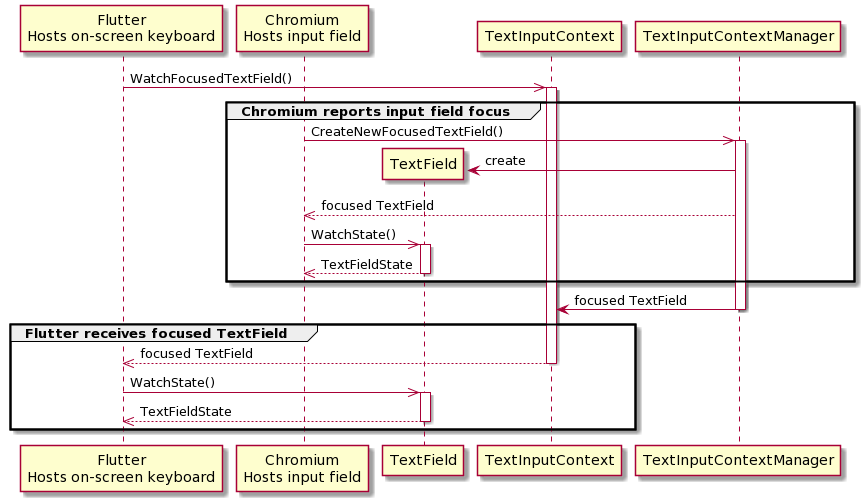
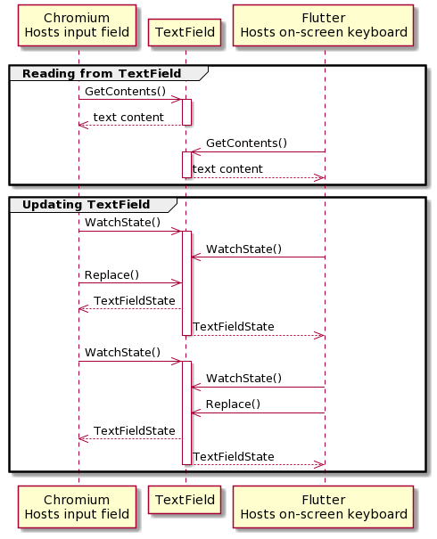

# Text APIs

Fuchsia's text APIs mediate between clients which provide text input field
implementations (e.g. Web text input) as well as clients participating in text
entry (e.g. on-screen keyboards).

## Overview

## Example use-case: focused text field

A client, e.g. Chromium runner, is presenting a text input field to the user.

Another client, e.g. Flutter runner, has an on-screen keyboard implementation
that should be used to edit the text inside the text input field.

Fuchsia provides a `TextInputContext` protocol for Flutter-based on-screen
keyboard to be notified about a text field being focused and ready for input.

When Chromium's input field is focused, Chromium runner connects to the
`TextInputContextManager` FIDL protocol and calls the `CreateNewFocusedField()`
method on it. This method creates a `TextField` endpoint and returns it to
Chromium runner. After that, this `TextField` is marked as focused and is
propagated to other clients, including Flutter runner, as a “hanging get”
response to `TextInputContext.WatchFocusedTextField()`.

Note that Chromium runner and Flutter runner now have the same API to the
`TextField` and should use the same methods for updating it collaboratively.

## Example use-case: querying text from the text field

Assuming `TextField` is made available to Flutter-based on-screen keyboard, it
invokes `TextField.WatchState` to receive current `TextFieldState`. Upon
receiving and processing the response, another request for state should be
scheduled using same `TextField.WatchState`. This request follows recommended
approach for "hanging get" FIDL calls and will only be resolved when text field
state changes.

`TextFieldState` holds `revision` property that is incremented each time text
field state changes, for example text is modified.

To query current text in the text field, `TextField.GetContents()` method could
be used. As a parameter, it takes most recent revision and `Range` and returns a
string of Unicode code points entered.

## Example use-case: editing text

The base implementation relies on the client to ensure that text content wasn't
changes since last edit. Practically it means that client  should always have
most recent `TextInputState.revision` and update text field contents using
`TextField.GetContents` each time revision changes.

To insert new character into the text field, `TextField.Replace()` should be
used. It takes `Range` and a string, and replaces the characters inside the
`Range` with the string provided.

If the `Range` is 0-length, the string is inserted into text field at the index
provided in `Range`.

If the `Range` provides empty string, the text inside `Range` is deleted.
