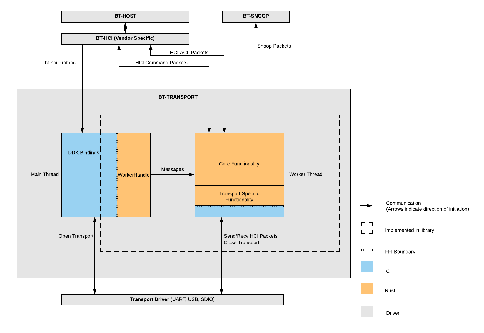
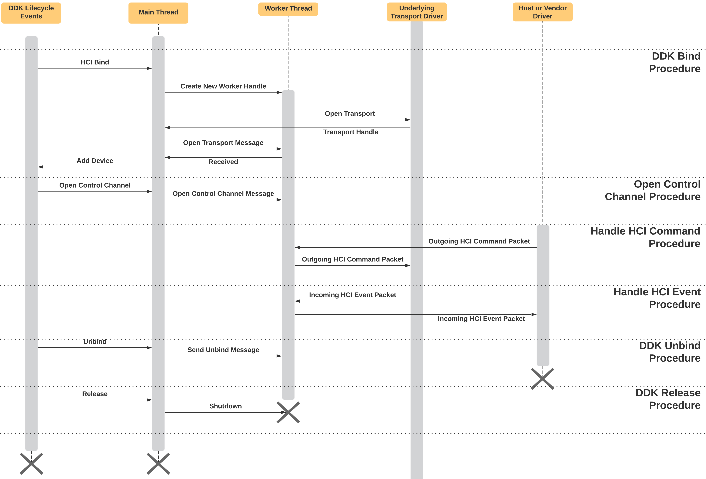

# HCI Transport Library

## Write new implementations of bt-transport DDK protocol without the hassle.

HCI Transport Library contains all the functionality needed to implement the bt-transport DDK
protocol. It is safe, modular, and well-tested.

The library is broken down into [core functionality](#core),
a [C Foreign Function Interface (FFI)](#ffi), and
[transport specific functionality](#transport).

## Transport Driver Structure

## Core Functionality {#core}

The core of the library is an asynchronous event loop running on a dedicated thread. This
loop is responsible for handling input from the various sources and directing data to the correct
output. There are three main inputs to the system.

1. Banjo and driver lifecycle messages passed in from a client driver's thread.
2. HCI packets coming down from the host intended for the controller.
3. HCI packets coming up from the controller intended for the host.

Messages from a client's threads are sent to the dedicated thread in response to banjo requests made
by a client of the driver, when certain driver lifecycle states are entered, and when underlying
transport resources are made available. See `bt_hci::control_plane::Message` for documentation on
each message type. Each `Message` that is sent will be responded to with a zx_status_t to indicate
the result of the request.

HCI commands and data packets come down from clients of the bt-hci driver over zircon channels as
individual messages. They are then passed to a transport specific handler that can encode and route
them to the underlying transport. These packets are also written to the snoop channel if one exists.

HCI packets come up from the underlying transport driver through a transport specific handler that
decodes the packets and wraps them in an enum representing hci packet type. Those packets are
written to zircon channels that clients of bt-hci have opened for that packet type. These
packets are also written to the snoop channel if one exists.

The dedicated thread is started by creating a new `bt_hci::worker::WorkerHandle` object. Once the
handle is created, messages can be passed to the dedicated thread which will handle them as soon
as it is ready to receive. The thread should be stopped by a call to `WorkerHandle::shutdown`, which
consumes the handle, signals the thread to stop all work, and waits for termination of the dedicated
thread.

## FFI {#ffi}

One of the goals of the library is to reduce the amount of C/C++ code required to write a fully
functional bt-transport driver. However, Rust is not a DDK supported language. Therefore an FFI
layer is required to pass messages between the library and a DDK supported language (currently C and
C++). A handle to the `bt_hci::worker::Worker` is provided to C/C++ code in the form of
`bt_hci::worker::WorkerHandle`. `WorkerHandle` is threadsafe and provides a message queue which is
used to send messages to the dedicated `Worker` thread. This handle is also used to initiate unbind
and shutdown proceedures in the `Worker`.

The complete FFI surface includes driver lifecycle management, bt-hci protocol messages, and
transport specific APIs for interfacing with the underlying transport devices.

Driver lifecycle includes bind, unbind, and release. `bt_hci_transport_start` is called from the
bind operation, `bt_hci_transport_unbind` is called from the unbind operation, and
`bt_hci_transport_shutdown` from the release operation.

The FFI has one function per bt-hci protocol message. See the [banjo protocol
documentation](//sdk/banjo/fuchsia.hardware.bt.hci/bt-hci.banjo) for more information.

The Bluetooth core specification defines HCI support for three transport protocols: USB, UART, and
SDIO. Each requires separate FFI functions to interact with drivers providing the given transport
protocol. The details here depend greatly on the transport in use. Generally, a handle to the
transport resource should be opened from within the driver's bind operation, and passed to the
library. The library is responsible for calling into all FFI functions specified for the transport
protocol and for cleaning up when required by the unbind/release device lifecycle operations.

The mutex-guarded message passing design works well for bt-hci because the protocol consists of low
frequency operations meant to open new HCI channels. A threadsafe MPSC channel is sufficient for
this communication while providing a clear API boundary for cross-language use as well as testing.

## Using this library

### Abstracting over a new transport protocol {#transport}

Bluetooth defines HCI over UART, USB, SDIO, and three-wire UART. The core of the HCI Transport
driver should remain the same while transport specifics change. The transport module defines a
`Transport` trait that each transport must implement.

`Sink`: A Transport is a sink into which data can be asynchronously written. Outgoing HCI packets
from clients of bt-hci are passed as bytes to a transport which will perform any encoding necessary
and route the data to the underlying transport device based on packet type.

`Stream`: A Transport is also a stream of tokens that represent complete hci packets.
Internally, a Transport might buffer data until at least one complete packet is buffered and has
been requested by the `Worker`.

`fn take_incoming`: Due to the limitations of the `futures::Stream` API, it is necessary to have a
way to pass around data without allocating new memory for each packet in the stream.
`take_incoming` is the method defined for doing so. Each `IncomingPacketToken` that is emitted by
the transports's Stream interface, can be exchanged, along with a buffer, for a complete HCI packet.
Because an `IncomingPacketToken` can only be minted by the Transport, it is guaranteed to represent
a valid packet. That packet will then be written into the provided buffer which is stored in the
returned `IncomingPacket`.

`unsafe fn unbind`: A transport will be notified that a DDK unbind has been invoked.
It is up to the Transport implementation to perform any actions for clean removal.

### Implementing bt-transport

Drivers that implement the bt-transport protocol should setup the transport core and underlying
transport resource on bind, forward messages to core when they come in from the protocol, and
cleanup resource on unbind/release.

Cleanup is done using the [bt_hci_transport_shutdown](./bindings.h) function call. This will
block until all resources associated with the bt_hci_transport_handle_t are closed and then free the
handle. After the shutdown function returns, the bt_hci_transport_handle_t is invalid and must not
be used. bt_hci_transport_shutdown should be called as part of the response to a DDK "release"
message or in failure cases where client drivers need to be torn down and removed.

Drivers in the bt-transport class are vendor agnostic. They can route data over the Bluetooth
Host-Controller Interface. Drivers implementing the bt-transport protocol are not expected to
perform any vendor specific initializiation or contain knowledge of vendor-specific HCI Commands.
That is left to the bt-hci implementor.

## Transport Driver Lifecycle Sequence

Example lifecycle events in sequence diagram intended to give an idea of how messages flow through
the system. This is not a comprehensive diagram of all possible messages.

