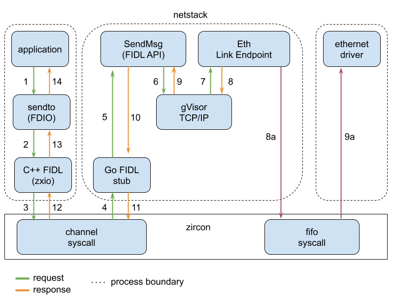
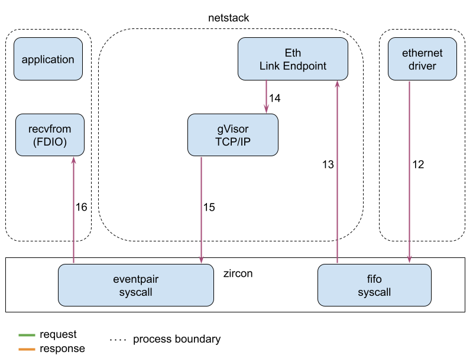
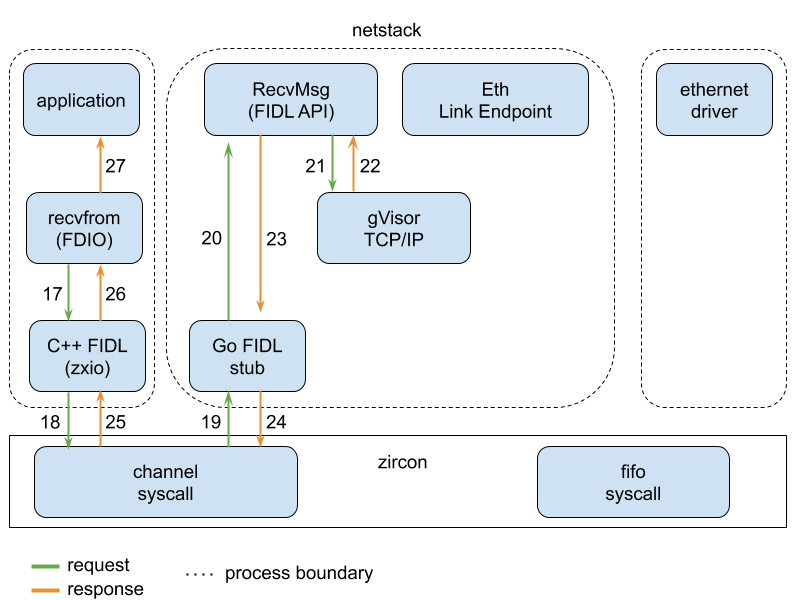

# Life of a Packet

## sendto (UDP)

1. The application calls `sendto` socket API in `FDIO`.
2. Libfdio calls `sendmsg` in zxio, which calls a machine-generated `FIDL` proxy code.
3. The FIDL proxy code calls `channel_call` with a `fuchsia.posix.socket/DatagramSocket.SendMsg`
   FIDL request on a zircon channel.
4. Go FIDL stub code (machine-generated) receives the FIDL request from a zircon channel.
5. Go FIDL stub dispatches `SendMsg` API in netstack.
6. Netstack calls `SendMsg` code in gVisor TCP/IP.
7. IP layer in gVisor TCP/IP calls `Eth Link Endpoint` in netstack.
   * 8a. `Eth Link Endpoint` puts a packet into FIFO.
   * 9a. Ethernet driver gets the packet from FIFO, and transmits it into the wire.
8. The control returns to gVisor.
9. The return values (or an error) return from gVisor.
10. The control returns to Go FIDL stub.
11. Go FIDL stub replies to `channel_call`.
12. FIDL proxy code receives the reply.
13. Returns to `sendto`.
14. The application receives the return values (or the error).

## recvfrom (UDP)

1. The application calls `recvfrom` socket API in FDIO.
2. FDIO calls `recvmsg` in zxio, which calls a machine-generated FIDL proxy code.
3. The FIDL proxy code calls `channel_call` with a `fuchsia.posix.socket/DatagramSocket.RecvMsg`
   FIDL request on a zircon channel.
4. Go FIDL stub code (machine-generated) receives the FIDL request from a zircon channel.
5. Go FIDL stub dispatches `RecvMsg` API in netstack.
6. Netstack calls `RecvMsg` code in gVisor.
7. gVisor returns `tcpip.ErrWouldBlock` as there is no data is available in the UDP layer.
8. Returns to Go FIDL stub.
9. Go FIDL stub replies to `channel_call`.
10. FIDL proxy code receives the reply.
11. Returns to `recvfrom`. `recvfrom` calls `fidl_wait` to wait for an incoming data event,
    which is signaled through a zircon eventpair shared between FDIO and netstack.

12. Ethernet driver receives a packet, and puts it into FIFO.
13. `Eth Link Endpoint` receives the packet from FIFO.
14. `Eth Link Endpoint` sends the packet to gVisor's IP layer. gVisor delivers the packet to its UDP
    layer and stores it in the queue for the destination port.
15. gVisor executes a callback preset by netstack, which signals incoming-data-available event on
    the eventpair.
16. `recvfrom` returns from `fidl_wait` as the event is signaled.

17. FDIO calls the FIDL proxy code again.
18. The FIDL proxy code calls `channel_call`.
19. Go FIDL stub code receives a `RecvMsg` request.
20. Go FIDL stub dispatches `RecvMsg` API.
21. `RecvMsg` calls gVisor.
22. The data in the packet and the return values (or an error) return from gVisor.
23. Returns to Go FIDL stub.
24. Go FIDL stub replies to `channel_call`.
25. FIDL proxy code receives the reply.
26. Returns to `recvfrom`.
27. The application receives the return values (or the error).
