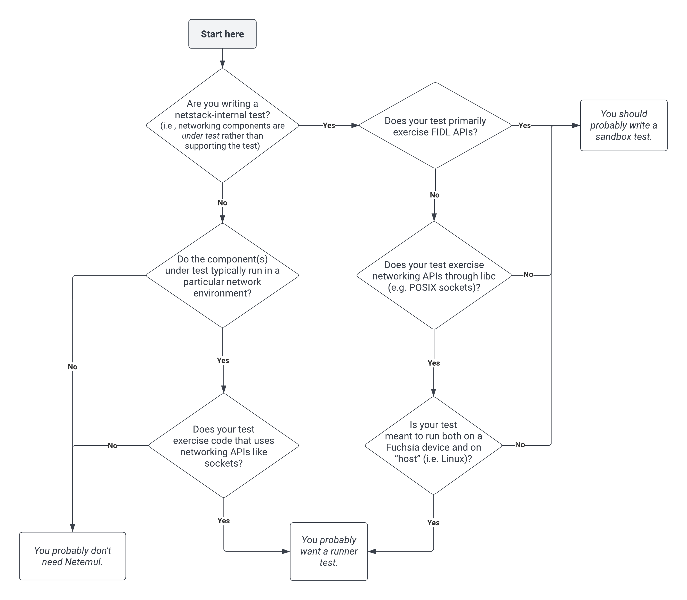
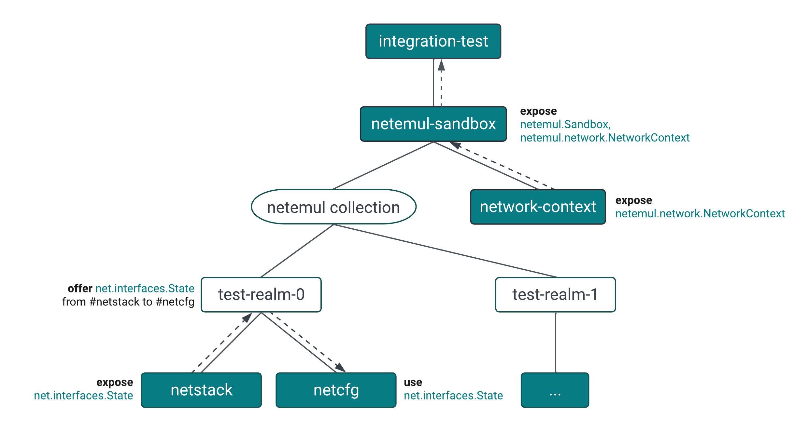

# Netemul

Netemul is a set of components that make it easy to create hermetic test
environments and virtual networks for integration tests.

Netemul can be used to run components in sandboxed [realms][realm], and also to
configure and manage virtual networks between those realms, which can be used to
emulate multiple Fuchsia devices communicating over networks. This is
particularly useful for creating self-contained, hermetic integration tests that
exercise the netstack and other networking components.

Netemul has two components you’re likely to use as a test author:
`netemul-sandbox` and `netemul-runner`.

- The `netemul-runner` is a [test runner], as defined by the Test Runner
Framework, and is the more “managed” of the two options. A `netemul-runner` test
includes some network configuration in its [component manifest] (see
[example](#example-component-manifest)), and the `netemul-runner` runs the test
within the configured network environment.
- The `netemul-sandbox` is a “plain” component that serves the
[`fuchsia.netemul/Sandbox`] protocol, which allows clients to create realms and
configure emulated networks themselves. The runner itself uses the sandbox to do
its configuration; in this sense the sandbox is the “unmanaged” lower-level
option.

### Which one should I use?

The key factor that determines whether you should use the `netemul-runner` is
whether your test component needs to run inside a Netemul realm. (This might be
necessary, for example, to ensure that the protocols available in its namespace
are provided by test components.) There are also other reasons to write a
`netemul-runner` test: for example, if you want to write a test that exercises
the POSIX socket APIs and runs on both Linux and Fuchsia for compatibility, the
runner is the best fit. This is because the runner allows you to write one test
that is run as a plain binary on Linux, and is packaged into a component and
configured via Netemul on Fuchsia (i.e. the platform-agnostic test code is
separated from the platform-specific test configuration, which lives in a
component manifest). In general, though, the Netstack team defaults to the
`netemul-sandbox` for "internal" tests, i.e. those where networking component(s)
themselves are under test. If you're unsure, here is a decision flowchart that
should help you decide:

## Sandbox

The `netemul-sandbox` is essentially a service provider. Tests that use it
directly create sandboxes, managed realms, networks, and endpoints by calling
`fuchsia.netemul` FIDL methods.

### Test setup

Sandbox tests can be written in any FIDL-supported language, though all current
tests are written in Rust and use the [Rust client library][rust-client] (see
[documentation]) to interact with the `fuchsia.netemul` FIDL APIs. Many tests
also use the [`netstack_testing_common`][netstack-testing-common] library which
contains useful helpers for setting up network realms and virtual networks and
interacting with their constituent components (in particular the netstack).

Refer to [this example test][sandbox-test] (see the
[component manifest][sandbox-test-manifest] and
[test source][sandbox-test-source]) that uses the Netemul Sandbox to create two
hermetic test realms containing [Netstack2 components][netstack.cml], both
connected to the same virtual network over virtual interfaces. The test also
uses the [`RealmUdpSocket` trait][RealmUdpSocket] to create UDP sockets with
each hermetic netstack and bind each of them to an address assigned to its
respective virtual interface. The test then exercises the netstack's socket API
by sending a UDP packet from the client to the server and verifying it's sent
and received properly.

### Design & Architecture

The `netemul-sandbox` itself is the core realm-management service provider, and
it implements [`fuchsia.netemul/Sandbox`] and [`fuchsia.netemul/ManagedRealm`].
The sandbox is built on top of [Realm Builder], an integration testing library
that supports dynamic construction of component topologies at runtime.

Here’s a (simplified) illustration of the component topology of an integration
test that uses the Netemul Sandbox (the components with a white background are
non-executable, meaning they don't have a runnable program; they exist for
organizational/routing purposes):

As you can see, the test realms are created inside a [component collection],
which is managed by Realm Builder. Capabilities are routed internally between
components in the test realm, and can also be connected to dynamically from the
test (for example, the test could exercise [`fuchsia.posix.socket/Provider`]
exposed by the netstack to test sockets).

#### Network Context

As you can see in the component diagram above, the `netemul-sandbox` component
uses the `network-context` component to provide access to the
[`fuchsia.netemul.network/NetworkContext`] protocol. `network-context` provides
the ability to configure virtual networks.

## Runner

The `netemul-runner` is a [test runner]™️ in the sense of the Component
Framework and [Test Runner Framework]—a [component runner] serves the
[`fuchsia.component.runner/ComponentRunner`] protocol so that the
[Component Manager] can start the component, and a test runner implements
[`fuchsia.test/Suite`] on behalf of the test component, so that the
[Test Manager] can run the tests on behalf of a user-facing tool like
[`ffx test`][ffx test].

`netemul-runner` implements the [`fuchsia.test/Suite`] protocol by first
configuring the Netemul environment in which the inner test component should
run, then proxying [`fuchsia.test/Suite`] requests to that component. This
allows the runner to delegate the job of actually running the components in the
test to the Component Framework, and delegate running the test and evaluating
its results to the respective test runner.

### Test setup

Outside the `program` section, the manifest for a Netemul Runner test is largely
an ordinary [component manifest]; child components and capability routing are
declared statically. There are, however, some things about a Netemul Runner test
that are different from a typical test component:

#### Test root vs. test driver

A Netemul Runner test effectively requires two components: the component that
actually contains the test suite (sometimes called the
[_test driver_][test driver]), and a non-executable parent component (sometimes
called the test root) that specifies the network environment in which the test
should be run and includes the test driver along with any other components in
the integration test as child components. A developer invoking the test will
actually run (e.g. with `ffx test`) the root component, which
[specifies `"netemul_test_runner"`][netemul_test_runner] as its `runner`
(typically by including the [default shard] in its manifest). The test driver
looks like an ordinary test component, but expects to be run in the network
environment declared by the test root.

#### Network configuration

The virtual network and netstacks in the test are configured in the `program`
section of the test root’s manifest. Following is the schema of the `program`
expected by the Netemul Runner (fields are required unless specifically noted to
be optional). You can also look at the definition of this schema where it's
defined in the source code of the Netemul Runner
[here](https://cs.opensource.google/fuchsia/fuchsia/+/main:src/connectivity/network/testing/netemul/runner/src/config.rs).

##### Program

| **Field**   | **Type**                   | **Description**                                                                                                                                                  |
|-------------|----------------------------|------------------------------------------------------------------------------------------------------------------------------------------------------------------|
| `networks`  | Array of [`Network`]       | Virtual networks to be configured.                                                                                                                               |
| `netstacks` | Array of [`Netstack`]      | Netstack components to be configured; each netstack should be available in the test root’s namespace at `/svc/{name}`, where `name` is the name of the netstack. |
| `start`     | (optional) Array of String | Names of child components to be eagerly started once test network configuration is complete.                                                                     |

##### `Network`: a virtual broadcast domain backed by netemul.

| **Field**   | **Type**              | **Description**                                       |
|-------------|-----------------------|-------------------------------------------------------|
| `name`      | String                | The name of the network (must be unique).             |
| `endpoints` | Array of [`Endpoint`] | Endpoints to be created and attached to this network. |

##### `Endpoint`: a virtual network endpoint backed by netemul.

| **Field** | **Type**           | **Description**                                                                                                  |
|-----------|--------------------|------------------------------------------------------------------------------------------------------------------|
| `name`    | String             | The name of the endpoint (must be unique across all networks).                                                   |
| `mac`     | (optional) String  | MAC address of the virtual endpoint. If not set, will be generated randomly using the endpoint's name as a seed. |
| `mtu`     | (optional) Number  | MTU of the virtual endpoint. If not set, defaults to 1500.                                                       |
| `up`      | (optional) Boolean | Whether to bring the link up during network setup. If not set, defaults to `true`.                               |
| `backing` | (optional) String  | Backing type of endpoint, either `"ethertap"` or `"network_device"`. If not set, defaults to `"network_device"`. |

##### `Netstack`: a configurable netstack component.

| **Field**    | **Type**                | **Description**                             |
|--------------|-------------------------|---------------------------------------------|
| `name`       | String                  | The name of the netstack (must be unique).  |
| `interfaces` | Array of  [`Interface`] | Interfaces to be installed in the netstack. |

##### `Interface`: an endpoint that has been installed in a netstack.

| **Field**                         | **Type**           | **Description**                                                                                                                            |
|-----------------------------------|--------------------|--------------------------------------------------------------------------------------------------------------------------------------------|
| `name`                            | String             | The name of the interface to be installed. Must match an endpoint declared on a network.                                                   |
| `static_ips`                      | Array of String    | Static IP addresses to be assigned to the interface. Corresponding local subnet routes will also be added to the netstack’s routing table. |
| `without_autogenerated_addresses` | (optional) Boolean | Whether to disable automatic generation and assignment of link-local IPv6 addresses for the interface. If not set, defaults to false.      |
| `gateway`                         | (optional) String  | IP address of the default gateway. If not set, no default route is configured.                                                             |
| `enable_ipv4_forwarding`          | (optional) Boolean | Whether to enable IPv4 forwarding on the interface. If not set, defaults to false.                                                         |
| `enable_ipv6_forwarding`          | (optional) Boolean | Whether to enable IPv6 forwarding on the interface. If not set, defaults to false.                                                         |

#### `use` clauses required in test root component manifest

The test root component must `use` [`fuchsia.test/Suite`] from the test driver,
so that the Netemul Runner can proxy it, and it also is required to `use` the
[`fuchsia.netemul/ConfigurableNetstack`] protocol for each of the netstacks to
be configured in the test. Each netstack [`use` clause][use-clause] must set the
`path` field to `/svc/{name}`, where `name` is the name of the netstack as
specified under `program`. See the [example test](#example-test) linked below
for an example.

#### Example test

Refer to [this example test][runner-test] that uses the Netemul Runner to run a
client and server that are connected over a virtual network. (In particular, see
the [component manifest][runner-test-manifest] for the test root and the source
for the [test driver][runner-test-driver] and [server][runner-test-server]. Each
netstack is configured with a network interface and a static IP address.
Additionally, the server component is configured with eager startup, meaning the
Netemul Runner will actively start it once test setup is complete, so it can
bind to its statically assigned IP address and listen for incoming connections.

In addition to the `client`, `server`, and corresponding netstacks, this test
includes a `sync-manager`, which allows the components to synchronize test
execution ([see below](#sync-manager)).

### Design & Architecture

As mentioned above, the Netemul Runner is mainly a high-level orchestrator that
configures the network environment in which the test will run and acts as
liaison between the Test Manager and the test driver, while delegating most of
the functionality of the runner to other components:

- Test realm management is left to the Component Framework.
- Running the test driver is left to its respective test runner.
- Network emulation is left to the `netemul-sandbox` and `network-context`
component.
- The implementation details of netstack configuration are left to the
Configurable Netstack.

This makes the Netemul Runner’s component topology rather simple; it is a
component that exposes the `netemul_test_runner` capability and has a
`netemul-sandbox` as a child component, for use in creating network
environments. The rest of the relevant components (the test driver, the
`configurable-netstack`, etc.) are part of the actual test.

#### Configurable Netstack

The configurable netstack is a support component used in Netemul Runner tests
that is essentially a test-friendly wrapper around the netstack’s administrative
FIDL APIs. It serves the
[`fuchsia.netemul/ConfigurableNetstack`] protocol, which provides a single
method to create an interface by installing a device in the netstack, and
configure it with, for example, static IP addresses.

The primary utility of the configurable netstack is in providing a stable
interface between the Netemul Runner and the netstack. Netemul Runner tests
[use](https://cs.opensource.google/fuchsia/fuchsia/+/main:src/connectivity/network/tests/external_network/meta/test.cml;l=53;drc=1013f1e00fb6f80b32affff6867fc079b5b36035)
[`fuchsia.netemul/ConfigurableNetstack`], which makes it available in its
namespace; the runner
[accesses it](https://cs.opensource.google/fuchsia/fuchsia/+/main:src/connectivity/network/testing/netemul/runner/src/main.rs;l=117;drc=1013f1e00fb6f80b32affff6867fc079b5b36035)
from there in order to configure the requested interfaces. The runner could
theoretically call all the netstack protocols directly, but this would mean that
as those APIs change, all existing Netemul Runner tests would have to be updated
along with the calling code in the Netemul Runner. The configurable netstack
provides a stable API behind which we can encapsulate any netstack-specific
management APIs.

#### Sync Manager

The `sync-manager` is a support component used to synchronize components running
in a Netemul Runner test “out-of-band”, i.e. without direct communication over
FIDL APIs or the network. For example, in
[this test](https://cs.opensource.google/fuchsia/fuchsia/+/main:src/connectivity/network/testing/netemul/configurable-netstack/tests/meta/configurable-netstack-test.cml;drc=1013f1e00fb6f80b32affff6867fc079b5b36035),
the client uses the `sync-manager` to wait until the server is accepting
connections before attempting to connect to the server, because attempts to
connect before the server has had a chance to bind to its
[assigned IP addresses](https://cs.opensource.google/fuchsia/fuchsia/+/main:src/connectivity/network/testing/netemul/configurable-netstack/tests/meta/configurable-netstack-test.cml;l=66;drc=1013f1e00fb6f80b32affff6867fc079b5b36035)
would fail. To synchronize, the server
[joins the bus](https://cs.opensource.google/fuchsia/fuchsia/+/main:src/connectivity/network/testing/netemul/configurable-netstack/tests/src/server.rs;l=19;drc=1013f1e00fb6f80b32affff6867fc079b5b36035)
once it’s bound, and the client
[waits for the server](https://cs.opensource.google/fuchsia/fuchsia/+/main:src/connectivity/network/testing/netemul/configurable-netstack/tests/src/client.rs;l=28;drc=1013f1e00fb6f80b32affff6867fc079b5b36035)
to join before starting connection attempts.

#### Netemul guest tests

The Netemul Runner previously supported running a virtualized guest as part of
an integration test. One use case for this was to verify interoperability
between Fuchsia’s networking stack and that of other operating systems. This is
not currently supported, but there is a proposed design to support it (without
using the runner itself) if we have a need for it: https://fxbug.dev/87587.

[realm]: https://fuchsia.dev/fuchsia-src/concepts/components/v2/realms
[test runner]: https://fuchsia.dev/fuchsia-src/development/testing/components/test_runner_framework#test-runners
[component manifest]: https://fuchsia.dev/fuchsia-src/concepts/components/v2/component_manifests
[`fuchsia.netemul/Sandbox`]: https://cs.opensource.google/fuchsia/fuchsia/+/main:src/connectivity/network/testing/netemul/fidl/netemul.fidl;l=25
[rust-client]: https://cs.opensource.google/fuchsia/fuchsia/+/main:src/connectivity/network/testing/netemul/rust/src/lib.rs
[netstack-testing-common]: https://cs.opensource.google/fuchsia/fuchsia/+/main:src/connectivity/network/tests/integration/common/BUILD.gn
[sandbox-test]: /src/connectivity/network/testing/netemul/doc/sandbox-test
[sandbox-test-manifest]: /src/connectivity/network/testing/netemul/doc/sandbox-test/meta/sandbox-test.cml
[sandbox-test-source]: /src/connectivity/network/testing/netemul/doc/sandbox-test/src/lib.rs
[netstack.cml]: https://cs.opensource.google/fuchsia/fuchsia/+/main:src/connectivity/network/netstack/meta/netstack_debug.cml
[documentation]: https://fuchsia-docs.firebaseapp.com/rust/netemul/index.html
[RealmUdpSocket]: https://fuchsia-docs.firebaseapp.com/rust/netemul/trait.RealmUdpSocket.html
[`fuchsia.netemul/ManagedRealm`]: https://cs.opensource.google/fuchsia/fuchsia/+/main:src/connectivity/network/testing/netemul/fidl/netemul.fidl;l=176
[`fuchsia.posix.socket/Provider`]: https://cs.opensource.google/fuchsia/fuchsia/+/main:sdk/fidl/fuchsia.posix.socket/socket.fidl;l=1131
[`fuchsia.netemul.network/NetworkContext`]: https://cs.opensource.google/fuchsia/fuchsia/+/main:src/connectivity/network/testing/netemul/network-context/fidl/network.fidl;l=240
[Realm Builder]: https://fuchsia.dev/fuchsia-src/development/testing/components/realm_builder
[component collection]: https://fuchsia.dev/fuchsia-src/concepts/components/v2/realms#collections
[Test Runner Framework]: https://fuchsia.dev/fuchsia-src/development/testing/components/test_runner_framework
[component runner]: https://fuchsia.dev/fuchsia-src/concepts/components/v2/capabilities/runners
[`fuchsia.component.runner/ComponentRunner`]: https://fuchsia.dev/reference/fidl/fuchsia.component.runner#ComponentRunner
[`fuchsia.test/Suite`]: https://cs.opensource.google/fuchsia/fuchsia/+/main:sdk/fidl/fuchsia.test/suite.fidl;l=116
[Component Manager]: https://fuchsia.dev/fuchsia-src/concepts/components/v2/component_manager
[Test Manager]: https://fuchsia.dev/fuchsia-src/development/testing/components/test_runner_framework#the_test_manager
[ffx test]: https://fuchsia.dev/reference/tools/sdk/ffx#test
[test driver]: https://fuchsia.dev/fuchsia-src/development/testing/components/test_runner_framework#test-roles
[netemul_test_runner]: https://cs.opensource.google/fuchsia/fuchsia/+/main:src/connectivity/network/testing/netemul/runner/default.shard.cml;l=6;drc=1013f1e00fb6f80b32affff6867fc079b5b36035
[`Network`]: #a-virtual-broadcast-domain-backed-by-netemul
[`Netstack`]: #a-configurable-netstack-component
[`Endpoint`]: #a-virtual-network-endpoint-backed-by-netemul
[`Interface`]: #an-endpoint-that-has-been-installed-in-a-netstack
[default shard]: https://cs.opensource.google/fuchsia/fuchsia/+/main:src/connectivity/network/testing/netemul/runner/default.shard.cml
[use-clause]: https://fuchsia.dev/reference/cml#use
[runner-test]: /src/connectivity/network/testing/netemul/doc/runner-test
[runner-test-manifest]: /src/connectivity/network/testing/netemul/doc/runner-test/meta/runner-test.cml
[runner-test-driver]: /src/connectivity/network/testing/netemul/doc/runner-test/src/client.rs
[runner-test-server]: /src/connectivity/network/testing/netemul/doc/runner-test/src/server.rs
[`fuchsia.netemul/ConfigurableNetstack`]: https://cs.opensource.google/fuchsia/fuchsia/+/main:src/connectivity/network/testing/netemul/fidl/configurable_netstack.fidl;l=14
