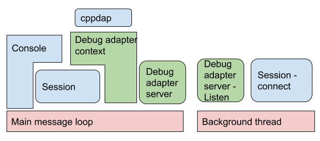

# Debug Adapter

This module integrates with third party debug adapter protocol library to support IDE based
debugging. Read https://microsoft.github.io/debug-adapter-protocol for information about the
protocol and supported IDEs.

## Usage

In order use zxdb with vscode -
* Download the zxdb vscode extension from here (TBD)
* Goto Run > Start Debugging and select zxdb configuration
* Enter target executable to attach/launch
* vscode debugger is now connected to zxdb

## Submodules

* `Debug adapter server` - Manages connection to the debug adapter client. Currently, only a single
client is accepted. If client closes connection, this modules resets the connection and waits for
new client.

* `Debug adapter context` - Parses requests from debug adapter client using `cppdap` library. Once
requests are parsed, they are processed by using zxdb client session

The runtime view of various modules in zxdb and interaction of debug adapter with them is depicted
below - 

Note that the session is shared between console and debug adapter, which enables users to use zxdb
console in addition to the IDE to control the debugging session.

