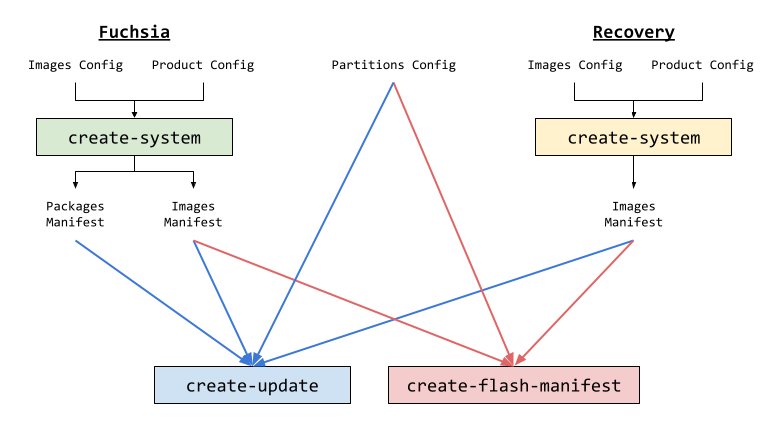

# FFX Plugin for Product and Image Assembly

[RFC-0072 Proposal](/docs/contribute/governance/rfcs/0072_standalone_image_assembly_tool.md).

Note: This documentation lists the future surface area of the Image Assembler,
but the transition to the new format is currently in progress in
[fxbug.dev/84025](http://fxbug.dev/84025).

Image Assembly is responsible for taking prebuilt artifacts and generating
images that can be used to update or flash a Fuchsia device. The FFX plugin has
three subcommands: [`create-system`](#create_system),
[`create-update`](#create_update), and
[`create-flash-manifest`](#create_flash_manifest).



# create-system

Create a Fuchsia system that minimally includes a ZBI, and optionally a VBMeta
and FVM images.

```bash
ffx assembly create-system                      \
  --product product_config.json                 \
  --images images_config.json                   \
  --outdir <output-directory>
```

## Arguments

| input | format | description |
| --- | --- | --- |
| `--product` | [Product Config](#product-config) | Contents of the Fuchsia system that are put into the images. |
| `--images` | [Images Config](#images-config) | Which images to generate and how. |
| `--outdir` | path | Directory to write outputs. |
| `--gendir` | path | (optional; default=outdir) Directory to write intermediate files. |
| `--base-package-name` | string | (optional; default="system_image") Name to give the Base Package. This is currently only used by OTA tests to allow publishing muliple base packages to the same amber repository without naming collisions. |
| `--mode` | [Modes](#modes) | (optional; default="standard") Where to put the packages. |

## Modes

| mode | description |
| --- | --- |
| `standard` | Packages are placed in a blobfs in a FVM that is flashed to a separate partition. |
| `fvm_in_zbi` | Packages are placed in a blobfs in a FVM that is embedded into the ZBI as a ramdisk. |
| `bootfs_only` | Packages are placed into BootFS. |

## Outputs

| output | format | description |
| --- | --- | --- |
| `packages.json` | [Package Manifest](/docs/concepts/packages/update_pkg.md) | List of packages in the system. |
| `images.json` | [Images Manifest](#images-manifest) | List of images generated. |
| `fuchsia.zbi` | | Fuchsia Zircon Boot Image (ZBI). |
| `fuchsia.vbmeta` | | Fuchsia Verified Boot Metadata (VBMeta). |
| `fvm.blk` | | Fuchsia Volume Manager (FVM). |

# create-update

Create an update package for updating a running Fuchsia system.

```bash
ffx assembly create-update                    \
  --packages packages.json                    \
  --partitions partitions.json                \
  --systema images.json                       \
  --systemr recovery_images.json              \
  --board-name "board"                        \
  --version "0.1.2.4"                         \
  --epoch 0                                   \
  --outdir <output-directory>
```

## Arguments

input                   | format                                                    | description
----------------------- | --------------------------------------------------------- | -----------
`--packages`            | [Package Manifest](/docs/concepts/packages/update_pkg.md) | List of packages in the system.
`--partitions`          | [Partitions Config](#partitions-config)                   | Where in the partition table the images are put.
`--system[a,b,r]`       | [Images Manifest](#images-manifest)                       | The system to place in the slot.
`--board-name`          | string                                                    | The name of the board. Fuchsia will reject an Update Package with a different board name.
`--version`             | `a.b.c.d`, where each digit is u32                        | The version of the Fuchsia system.
`--epoch`               | int                                                       | The backstop OTA version. Fuchsia will reject updates with a lower epoch.
`--outdir`              | path                                                      | Directory to write outputs.
`--gendir`              | path                                                      | (optional; default=outdir) Directory to write intermediate files.
`--update-package-name` | string                                                    | (optional; default="update") Name to give the Update Package. This is currently only used by OTA tests to allow publishing multiple update packages to the same amber repository without naming collisions.

## Outputs

output       | format                                          | description
------------ | ----------------------------------------------- | ---------------
`update.far` | [Format](/docs/concepts/packages/update_pkg.md) | Update package.

# create-flash-manifest

Create a manifest file that describes how to flash images onto a Fuchsia device.

```bash
ffx assembly create-flash-manifest \
  --partitions partitions.json     \
  --systema images.json            \
  --systemb images.json            \
  --systemr recovery_images.json   \
  --arch "arm64"                   \
  --outdir <output-directory>
```

## Arguments

| input | format | description |
| --- | --- | --- |
| `--partitions` | [Partitions Config](#partitions-config) | Where in the partition table the images are put. |
| `--system[a,b,r]` | [Images Manifest](#images-manifest) | The system to place in the slot. |
| `--arch` | string | The architecture to specify in the flash manifest. This is typically "arm64" or "x64". |
| `--outdir` | path | Directory to write outputs. |

## Output

output       | format                                                                                       | description
------------ | -------------------------------------------------------------------------------------------- | -----------
`flash.json` | [RFC-0100](https://fuchsia.dev/fuchsia-src/contribute/governance/rfcs/0100_product_metadata) | Flash manifest that specifies which images to flash to which partitions.

# Product Config

The product config specifies the **contents** of the Fuchsia system that is put
into the images.

```json5
{
  // The set of packages included when flashing or updating a device, and should
  // not be removed by the garbage collector.
  base: [ "path/to/package_manifest.json" ],

  // The set of packages included when flashing or updating a device, but can be
  // removed by the garbage collector.
  cache: [ "path/to/package_manifest.json" ],

  // The set of system-critical packages included in the "System Image"
  // (i.e. base package).
  system: [ "path/to/package_manifest.json" ],

  kernel: {

    // Path on host to the kernel ZBI.
    path: "path/to/kernel.zbi",

    // The arguments to pass to the kernel on boot.
    args: [ "arg1", "arg2" ],

    // The minimum clock time.
    // See https://fuchsia.dev/fuchsia-src/concepts/time/utc/behavior for more information.
    // The backstop is called out as a required argument to prevent mistakes.
    clock_backstop: 10,
  },

  // Arguments available in the boot service for userspace programs.
  boot_args: [ "arg1", "arg2" ],

  // Files to put in BootFS.
  bootfs_files: [
    {
      source: "path/to/file/on/host",
      destination: "path/to/file/in/bootfs",
    }
  ],
}
```

When multiple product configs are specified, they are merged, with the following
details:

-   These lists are merged and deduplicated as lists of strings.

    -   `base`
    -   `cache`
    -   `system`
    -   `kernel.args`
    -   `boot_args`

-   One product config MUST specify a path to the kernel, and only one may do
    so.

-   One product config MUST specify a `clock_backstop`, and only one may do so.

-   Bootfs files are deduplicated by `destination` + `source`. Only one `source`
    path may be used for each `destination` path in bootfs.

# Images Config

The images config specifies **which images** to generate and how.

```json5
{
  images: [
    <image>,
    <image>,
  ],
}
```

`<image>` specifies a single image to generate, and has the following format.

```json5
{
  type: "<type>",
  name: "<name>",
  parameters: <type-specific-parameters>,
}
```

`<type>` can be one of: zbi, vbmeta, or fvm.

## zbi type

```json5
{
  type: "zbi",

  // The name to give the file: fuchsia.zbi
  name: "fuchsia",
  parameters: {

    // The compression format for the ZBI.
    compression: "zstd.max",

    // An optional script to post-process the ZBI.
    // This is often used to prepare the ZBI for the
    postprocessing_script: <post-processing-script>,
}
```

`<post-processing-script>` has the following format.

```json5
{
  // The path to the script on host.
  // This script _musts_ take the following arguments:
  //   -z <path to ZBI>
  //   -o <output path>
  //   -B <build directory, relative to script's source directory>
  path: "path/to/script/on/host.sh",

  // Additional arguments to pass to the script after the above arguments.
  args: [ "arg1", "arg2" ],
}
```

## VBMeta Type

```json5
{
  type: "vbmeta",

  // The name to give the file: fuchsia.vbmeta
  name: "fuchsia",
  parameters: {

    // Path on host to the key for signing VBMeta.
    key: "path/to/key/on/host",

    // Path on host to the key metadata to add to the VBMeta.
    key_metadata: "path/to/key/metadata/on/host",

    // Optional descriptors to add to the VBMeta image.
    additional_descriptors: [
      <descriptor>,
      <descriptor>,
    ],
  },
}
```

### VBMeta Descriptor

`<descriptor>` has the following format.

```json5
{
  // Name of the partition.
  name: "mypart",

  // Size of the partition in bytes.
  size: "12345",

  // Custom VBMeta flags to add.
  flags: "1",

  // Minimum AVB version to add.
  min_avb_version: "1.1",
}
```

## FVM Type

```json5
{
  type: "fvm",

  // The name to give the file: fvm.blk
  name: "fvm",
  parameters: {

    // The size of a slice within the FVM.
    slice_size: 0,

    // The list of filesystems to generate that can be added to the outputs.
    filesystems: [
      <filesystem>,
      <filesystem>,
    ],

    // The FVM images to generate.
    outputs: [
      <fvm-output>,
      <fvm-output>,
    ],
  },
}
```

### Filesystem

`<filesystem>` can be one of the following.

```json5
{
  type: "blobfs",

  // The name of the volume in the FVM.
  name: "blob",

  // Optionally compress the volume file.
  compress: true,

  // Optional deprecated layout.
  layout: "deprecated-padded",

  // Reserve |minimum_data_bytes| and |minimum_inodes| in the FVM, and ensure
  // that the final reserved size does not exceed |maximum_bytes|.
  maximum_bytes: 0,
  minimum_data_bytes: 0,
  minimum_inodes: 0,
}
```

```json5
{
  type: "minfs",

  // The name of the volume in the FVM.
  name: "data",

  // Reserve |minimum_data_bytes| and |minimum_inodes| in the FVM, and ensure
  // that the final reserved size does not exceed |maximum_bytes|.
  maximum_bytes: 0,
  minimum_data_byts: 0,
  minimum_inodes: 0,
}
```

```json5
{
  type: "empty-minfs",

  // The name of the volume in the FVM.
  name: "data_empty",
}
```

```json5
{
  type: "reserved",

  // The name of the volume in the FVM.
  name: "internal",

  // The number of slices to reserve.
  slices: 1000,
}
```

### FVM Output

`<fvm-output>` can be one of the following.

```json5
{
  type: "standard",

  // The name to give the file: fvm.blk.
  name: "fvm",

  // The filesystems to include in the FVM.
  filesystems: [
    "blob",
    "data",
    "internal",
  ],

  // Optional parameters to use during construction.
  parameters: {

    // Whether to compress the FVM.
    compress: true,

    // Shrink the FVM to fit exactly the contents.
    resize_image_file_to_fit: true,

    // After the optional resize, truncate the file to this length.
    truncate_to_length: 0,
  }
}
```

```json5
{
  type: "sparse",

  // The name to give the file: fvm.sparse.blk.
  name: "fvm.sparse",

  // The filesystems to include in the FVM.
  filesystems: [
    "blob",
    "data",
    "internal",
  ],

  // Required parameters for Sparse FVMs.
  parameters: {

    // Whether to compress the FVM.
    compress: true,

    // The maximum size the FVM can expand to at runtime.
    // This sets the amount of slice metadata to allocate during construction,
    // which cannot be modified at runtime.
    max_disk_size: 0,
  },
}
```

```json5
{
  type: "nand",

  // The name to give the file: fvm.nand.blk.
  name: "fvm.nand",

  // The filesystems to include in the FVM.
  filesystems: [
    "blob",
    "data",
    "internal",
  ],

  // Required parameters for Nand FVMs.
  parameters {

    // Whether to compress the FVM.
    compress: true,

    // The maximum size the FVM can expand to at runtime.
    // This sets the amount of slice metadata to allocate during construction,
    // which cannot be modified at runtime.
    max_disk_size: 0,
    block_count: 0,
    oob_size: 0,
    page_size: 0,
    pages_per_block: 0,
  },
}
```

## Example

```json5
{
  images: [
    {
      type: "zbi",
      name: "fuchsia",
    },
    {
      type: "vbmeta",
      name: "fuchsia",
      parameters: {
        key: "path/to/key",
        key_metadata: "path/to/key/metadata",
      },
    },
    {
      type: "fvm",
      name: "fvm",
      parameters: {
        slice_size: 0,
        filesystems: [
          {
            type: "blobfs",
            name: "blob",
            compress: true,
            maximum_bytes: 65536,
            minimum_data_bytes: 0,
            minimum_inodes: 4096,
          },
          {
            type: "minfs",
            name: "data",
            maximum_bytes: 65536,
            minimum_data_bytes: 0,
            minimum_inodes: 4096,
          },
        ],
        outputs: [
          {
            type: Standard,
            name: "fvm",
            filesystems: [
              "blob",
              "data",
            ],
          },
          {
            type: Sparse,
            name: "fvm.sparse",
            filesystems: [
              "blob",
              "data",
            ],
            parameters: {
              compress: true,
              max_disk_size: 65536,
            },
          },
        ],
      },
    },
  ],
}
```

# Images Manifest

```json5
[
  <image>,
  <image>,
]
```

## Image

`<image>` has the following format.

```json5
{
  name: "zircon-a",
  path: "path/on/host/to/image",
  type: <image-type>,
}
```

`<image-type>` must be one of: zbi, vbmeta, base-package, blob, storage-full,
storage-sparse, storage-sparse-blob, or fvm.fastboot.

## Example

```json5
[
  {
    name: "zircon-a",
    path: "path/to/fuchsia.zbi",
    type: "zbi",
  },
  {
    name: "zircon-a",
    path: "path/to/fuchsia.vbmeta",
    type: "vbmeta",
  }
]
```

# Partitions Config

```json5
{

  // The list of bootloader partitions that are not slot-specific.
  booloader_partitions: [
    <bootloader-partition>,
    <bootloader-partition>,
  ],

  // The list of non-bootloader partitions that are slot-specific.
  partitions: [
    <partition>,
    <partition>,
  ],
}
```

## Bootloader Partition

`<bootloader-partition>` has the following format.

```json5
{
  // The name of the partition known to fastboot.
  name: "bootloader",

  // The firmware type provided to the update system.
  // See documentation here:
  //   https://fuchsia.dev/fuchsia-src/concepts/packages/update_pkg
  type: "tpl",

  // Path on host to the image.
  image: "path/on/host/to/image",
}
```

## Partition

`<partition>` has the following format.

```json5
{
  // The name of the partition known to fastboot.
  name: "zircon_a",
  type: "<partition-type>",
  slot: "<partition-slot>",
}
```

`<partition-type>` can be one of: zbi, vbmeta, fvm. `<partition-slot>` can be
one of: systema, systemb, systemr.

## Example

```json5
{
  booloader_partitions: [
    {
      name: "bootloader",
      type: "tpl",
      image: "path/to/bootloader.tpl",
    },
  ],
  partitions: [
    {
      name: "zircon_a",
      type: "zbi",
      slot: "systema",
    },
    {
      name: "vbmeta_a",
      type: "vbmeta",
      slot: "systema",
    },
    {
      name: "zircon_b",
      type: "zbi",
      slot: "systemb",
    },
    {
      name: "vbmeta_b",
      type: "vbmeta",
      slot: "systemb",
    },
    {
      name: "fvm",
      type: "fvm",
      slot: "systema",
    },
  ],
}
```
