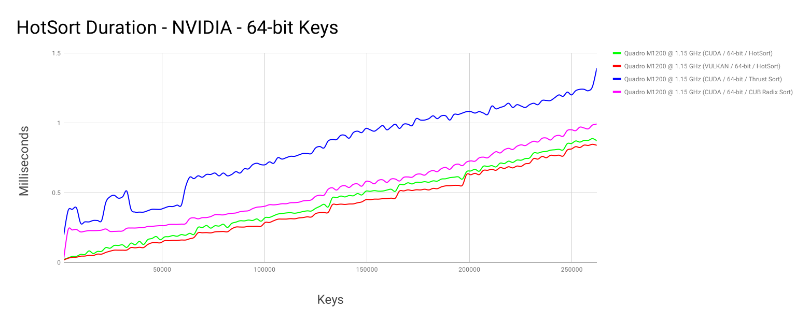
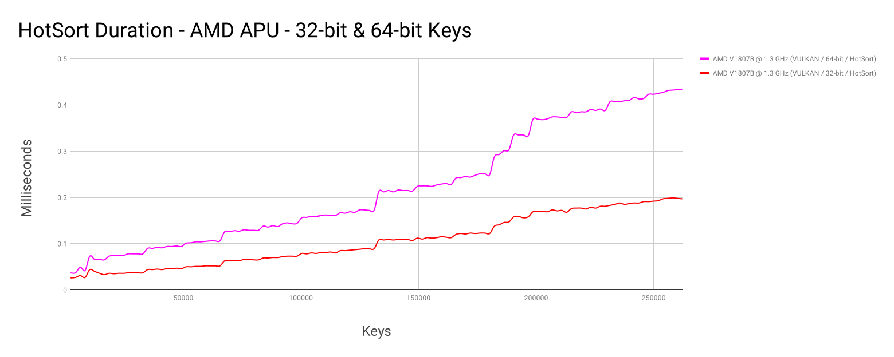
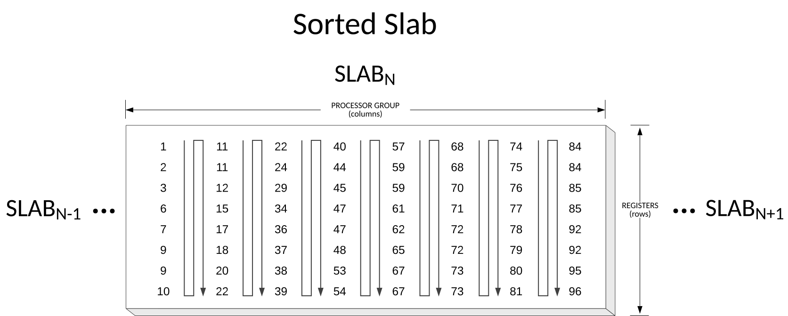
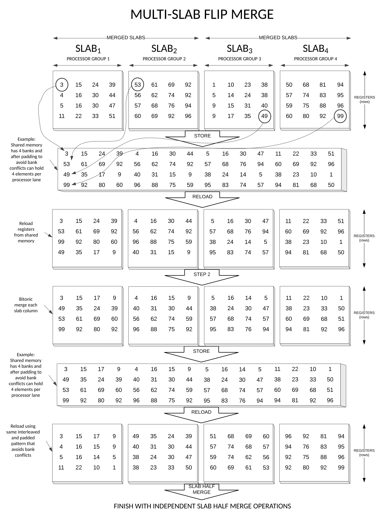

# HotSort

HotSort is a high-performance GPU-accelerated integer sorting library
for Vulkan.

HotSort's advantages include:

* Ultra-fast sorting of 32‑bit or 64‑bit keys
* Reaches peak throughput on small arrays
* In-place sorting for low-memory environments
* Strong scaling with number of multiprocessors
* Low memory transactions relative to array size
* A concurrency-friendly dense kernel grid
* Support for GPU post-processing of sorted results

HotSort is typically significantly faster than other GPU-accelerated
implementations when sorting arrays of smaller than 500K-2M keys.

## Benchmarks

### Throughput

Here is a throughput plot for HotSort sorting 32-bit and 64-bit keys
with a 640-core Quadro M1200:


HotSort throughput on Vulkan (Mesa) with a 704-core AMD V1807B APU:


HotSort throughput on Vulkan with a 192-core Intel HD 630:


### Execution time

Note that these sorting rates translate to sub-millisecond to
multi-millisecond execution times on small GPUs:






# Usage

This repository contains the HotSort API, a utility for generating
HotSort's compute shaders, and recipes for a number of target
architectures.

A simple benchmarking example for HotSort can be found here:
[```hotsort_vk_bench```](platforms/vk/tests/hotsort_vk_bench/main.c).

Note that HotSort is a comparison sort and supports in-place sorting.

*Not all targeted architectures have been tested.*

## Vulkan

The following architectures are supported:

Vendor | Architecture                              | 32‑bit             | 64‑bit             | 32+32‑bit   | Notes
-------|-------------------------------------------|:------------------:|:------------------:|:-----------:|------
NVIDIA | sm_35,sm_37,sm_50,sm_52,sm_60,sm_61,sm_70 | :white_check_mark: | :white_check_mark: | :x:         | Not tested on all architectures
NVIDIA | sm_30,sm_32,sm_53,sm_62                   | :x:                | :x:                | :x:         | Need to generate properly shaped kernels
AMD    | GCN                                       | :white_check_mark: | :white_check_mark: | :x:         | Tested on Linux MESA 18.2
Intel  | GEN8+                                     | :white_check_mark: | :white_check_mark: | :x:         | Good but the assumed *best-shaped* kernels aren't being used due to a compiler issue
Intel  | APL/GLK using a 2x9 or 1x12 thread pool   | :x:                | :x:                | :x:         | Need to generate properly shaped kernels

An architecture-specific instance of the HotSort algorithm is referred to as a "target".

Each target contains configuration data and a bundle of SPIR-V compute shaders.

All supported targets are generated by the Fuchsia build and are found relative to the `root_gen_dir`.

You can add a target by including its header file and associated source.

For example, to sort `count` keys on Vulkan:

```C
#include "src/graphics/lib/compute/hotsort/platforms/vk/targets/intel/gen8/u32/hs_target.h"

// create HotSort instance from a target
struct hotsort_vk * hs = hotsort_vk_create(...,
                                           <pipeline layout>,
                                           <descriptor set locations>,
                                           &hs_intel_gen8_u32);

...
// bind pipeline-compatible descriptor sets
...

// see how much padding may be required
hotsort_vk_pad(hs,count,&count_padded_in,&count_padded_out);

// append compute shaders to command buffer
hotsort_vk_sort(cb,
                hs,
                <array offsets>,
                count,
                padded_in,
                padded_out);

// command buffer end and queue submit

...

// release the HotSort instance
hotsort_vk_release(hs,...);

```

The [`hotsort_vk.h`](platforms/vk/hotsort_vk.h) header file describes these functions in
greater detail.

# Background

The HotSort sorting algorithm was created in 2012 and generalized in
2015 to support GPUs that benefit from non-power-of-two workgroups.

The objective of HotSort is to achieve high throughput as *early* as
possible on small GPUs when sorting modestly-sized arrays ― 1,000s to
100s of thousands of 64‑bit keys.

HotSort uses both well-known and obscure properties of bitonic
sequences to create a novel mapping of keys onto data-parallel devices
like GPUs.

## Overview

The overall flow of the HotSort algorithm is below.  Kernel launches
are in italics.

1. For each workgroup of slabs:
   1. For each slab in the workgroup:
      1. *Slab Load*
      1. *Slab Sort*
   1. Until all slabs in the workgroup are merged:
      1. *Multi-Slab Flip Merge*
   1. *Slab Store*
1. Until all slabs are merged:
   1. *Streaming Flip Merge*
   1. If necessary, *Streaming Half Merge*
   1. If necessary, *Multi-Slab Half Merge*
   1. If necessary, *Slab Half Merge*
   1. If complete:
      1. Optionally, *Report Key Changes*
      1. Optionally, *Slab Transpose & Store*
   1. Otherwise: *Slab Store*
1. Done

## Sorting

The algorithm begins with a very *dense* per-multiprocessor block
sorting algorithm that loads a "slab" of keys into a subgroup's
registers, sorts the slabs, merges all slabs in the workgroup, and
stores the slabs back to global memory.

In the slab sorting phase, each lane of a subgroup executes a bitonic
sorting network on its registers and successively merges lanes until
the slab of registers is sorted in serpentine order.



## Merging

HotSort has several different merging strategies.

The merging kernels leverage the multiprocessor's register file by
loading, merging and storing a large number of strided slab rows
without using local memory.

The merging kernels exploit the bitonic sequence property that
interleaved subsequences of a bitonic sequence are also bitonic
sequences.  This property also holds for non-power-of-two sequences.

As an example, the *Streaming Flip Merge* kernel is illustrated below:



# Future Enhancements

## Hybrid improved merging

HotSort's initial sorting and merging phases are performed on bitonic
sequences.  Because of this, throughput decreases as the problem size
increases.

A hybrid algorithm that combined HotSort's block sorter and several
rounds of merging with a state-of-the-art GPU merging algorithm would
probably improve the algorithm's performance on larger arrays.

## Reenable support for devices lacking shuffle functions

The original version of HotSort ran on pre-Kepler GPUs without
intra-warp/inter-lane shuffling ― reenable this capability.
