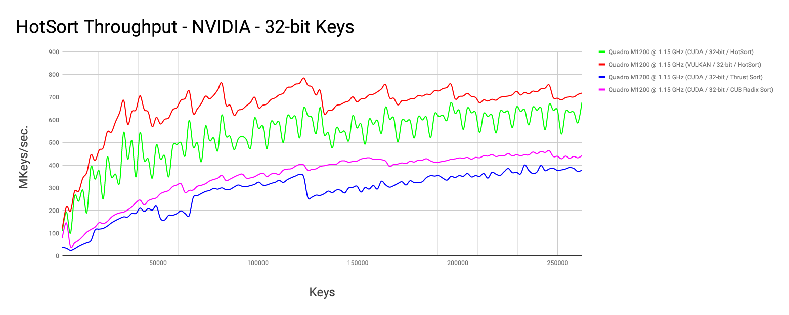
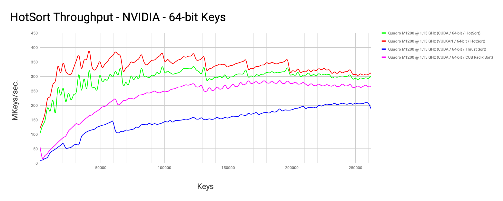
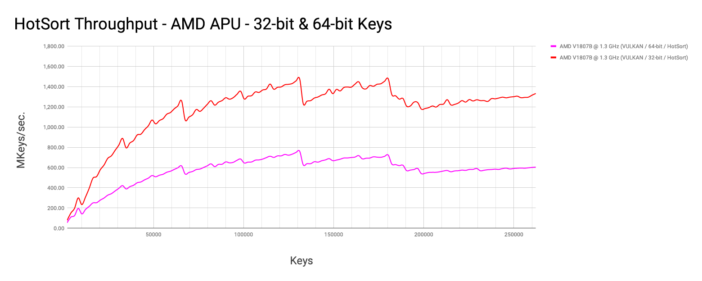
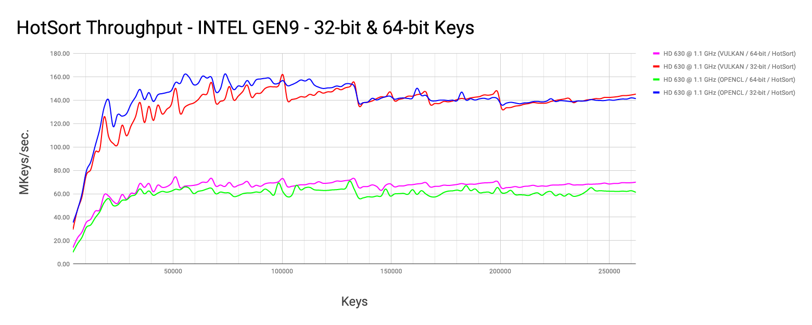
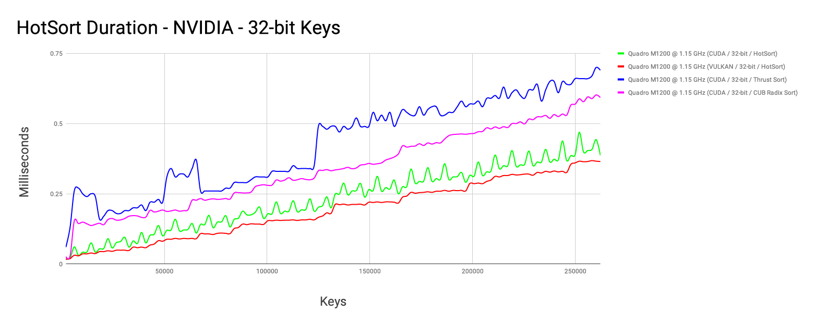
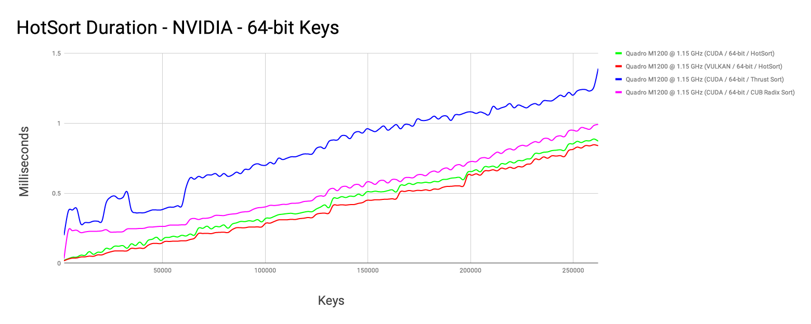
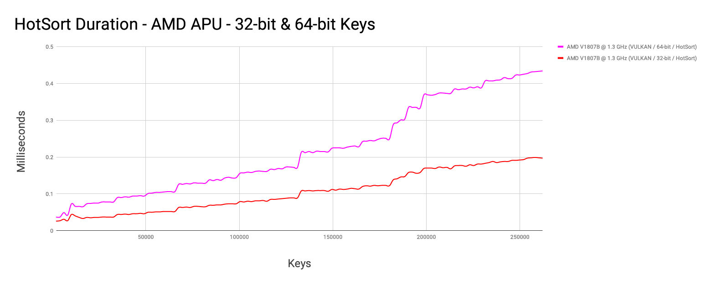
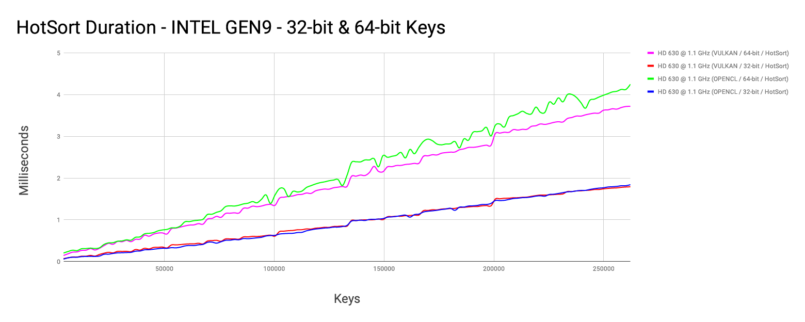
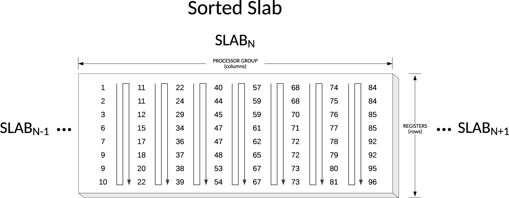
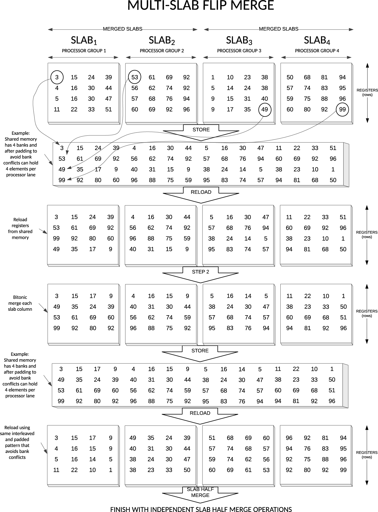

# HotSort

HotSort is a high-performance GPU-accelerated integer sorting library
for Vulkan.

HotSort's advantages include:

* Ultra-fast sorting of 32‑bit or 64‑bit keys
* Reaches peak throughput on small arrays
* In-place sorting for low-memory environments
* Strong scaling with number of multiprocessors
* Low memory transactions relative to array size
* A concurrency-friendly dense kernel grid
* Support for GPU post-processing of sorted results

HotSort is typically significantly faster than other GPU-accelerated
implementations when sorting arrays of smaller than 500K-2M keys.

## Benchmarks

### Throughput

Here is a throughput plot for HotSort sorting 32-bit and 64-bit keys
with a 640-core Quadro M1200:




HotSort throughput on Vulkan (Mesa) with a 704-core AMD V1807B APU:



HotSort throughput on Vulkan with a 192-core Intel HD 630:



### Execution time

Note that these sorting rates translate to sub-millisecond to
multi-millisecond execution times on small GPUs:






# Usage

HotSort provides a build-time tool (named `hotsort_gen`) to generate
highly-optimized sets of compiled compute kernels, based on
[bitonic sorting networks], that target a specific GPU architecture.
These binary code modules are packed with configuration data
into what is called a _hotsort target_ file.

Additionally, HotSort provides a small runtime library to load said target
files into your application, and invoke them to perform high-speed sorting.

A simple benchmarking example for HotSort can be found here:
[```hotsort_vk_bench```](platforms/vk/tests/hotsort_vk_bench/main.c).

Note that HotSort implements a comparison sort and supports in-place sorting.

*Not all targeted architectures have been tested.*

The following architectures are supported:

Vendor | Architecture                              | 32‑bit             | 64‑bit             | 32+32‑bit   | Notes
-------|-------------------------------------------|:------------------:|:------------------:|:-----------:|------
NVIDIA | sm_35,sm_37,sm_50,sm_52,sm_60,sm_61,sm_70 | ✔                 | ✔                 | ❌          | Not tested on all architectures
NVIDIA | sm_30,sm_32,sm_53,sm_62                   | ❌                 | ❌                  | ❌          | Need to generate properly shaped kernels
AMD    | GCN                                       | ✔                 | ✔                 | ❌          | Tested on Linux MESA 18.2
Intel  | GEN8+                                     | ✔                 | ✔                 | ❌          | Good but the assumed *best-shaped* kernels aren't being used due to a compiler issue
Intel  | APL/GLK using a 2x9 or 1x12 thread pool   | ❌                  | ❌                 | ❌          | Need to generate properly shaped kernels

### hotsort target generation

One can generate a HotSort target using the
[`hotsort_target GN template`](platforms/vk/targets/hotsort_target.gni)
as a convenient way to invoke `hotsort_gen` with the selected parameters and
configuration files. See the
[`hotsort_vk_bench BUILD.gn`](platforms/vk/tests/hotsort_vk_bench/BUILD.gn)
for a concrete example.

By default, the hotsort target's binary data will be available as C source
file defining an array of `uint32_t` literals, and a corresponding header
declaring the array by name.

This header file is always named `hs_target.h`, and located into a sub-directory
matching the `hotsort_target()` GN build target name.


### hotsort target usage

Include the generated `hs_target.h` file into your source code to access the
hotsort target's data compiled as an uint32_t array.

Include [`hotsort_vk.h`](platforms/vk/hotsort_vk.h) into your source code to
access the hotsort Vulkan-based APIs to load the hotsort target data and run it.
See comments in this header file for more details about the API.

For example, to sort `count` keys on Vulkan:

```C
// Provide hotsort_vk_xxx() functions.
#include "hotsort_vk.h"

// Defines the hs_intel_gen8_u32 variable pointing to the target's data.
#include "targets/intel/gen8/u32/hs_target.h"

// create HotSort instance from a target
struct hotsort_vk * hs = hotsort_vk_create(...,
                                           <pipeline layout>,
                                           <descriptor set locations>,
                                           &hs_intel_gen8_u32);

...
// bind pipeline-compatible descriptor sets
...

// see how much padding may be required
hotsort_vk_pad(hs,count,&count_padded_in,&count_padded_out);

// append compute shaders to command buffer
hotsort_vk_sort(cb,
                hs,
                <array offsets>,
                count,
                padded_in,
                padded_out);

// command buffer end and queue submit

...

// release the HotSort instance
hotsort_vk_release(hs,...);

```

# Background

The HotSort sorting algorithm was created in 2012 and generalized in
2015 to support GPUs that benefit from non-power-of-two workgroups.

The objective of HotSort is to achieve high throughput as *early* as
possible on small GPUs when sorting modestly-sized arrays ― 1,000s to
100s of thousands of 64‑bit keys.

HotSort uses both well-known and obscure properties of bitonic
sequences to create a novel mapping of keys onto data-parallel devices
like GPUs.

## Overview

The overall flow of the HotSort algorithm is below.  Kernel launches
are in italics.

1. For each workgroup of slabs:
   1. For each slab in the workgroup:
      1. *Slab Load*
      1. *Slab Sort*
   1. Until all slabs in the workgroup are merged:
      1. *Multi-Slab Flip Merge*
   1. *Slab Store*
1. Until all slabs are merged:
   1. *Streaming Flip Merge*
   1. If necessary, *Streaming Half Merge*
   1. If necessary, *Multi-Slab Half Merge*
   1. If necessary, *Slab Half Merge*
   1. If complete:
      1. Optionally, *Report Key Changes*
      1. Optionally, *Slab Transpose & Store*
   1. Otherwise: *Slab Store*
1. Done

## Sorting

The algorithm begins with a very *dense* per-multiprocessor block
sorting algorithm that loads a "slab" of keys into a subgroup's
registers, sorts the slabs, merges all slabs in the workgroup, and
stores the slabs back to global memory.

In the slab sorting phase, each lane of a subgroup executes a bitonic
sorting network on its registers and successively merges lanes until
the slab of registers is sorted in serpentine order.



## Merging

HotSort has several different merging strategies.

The merging kernels leverage the multiprocessor's register file by
loading, merging and storing a large number of strided slab rows
without using local memory.

The merging kernels exploit the bitonic sequence property that
interleaved subsequences of a bitonic sequence are also bitonic
sequences.  This property also holds for non-power-of-two sequences.

As an example, the *Streaming Flip Merge* kernel is illustrated below:



# Future Enhancements

## Hybrid improved merging

HotSort's initial sorting and merging phases are performed on bitonic
sequences.  Because of this, throughput decreases as the problem size
increases.

A hybrid algorithm that combined HotSort's block sorter and several
rounds of merging with a state-of-the-art GPU merging algorithm would
probably improve the algorithm's performance on larger arrays.

## Reenable support for devices lacking shuffle functions

The original version of HotSort ran on pre-Kepler GPUs without
intra-warp/inter-lane shuffling ― reenable this capability.

[bitonic sorting networks]: https://en.wikipedia.org/wiki/Bitonic_sorter
