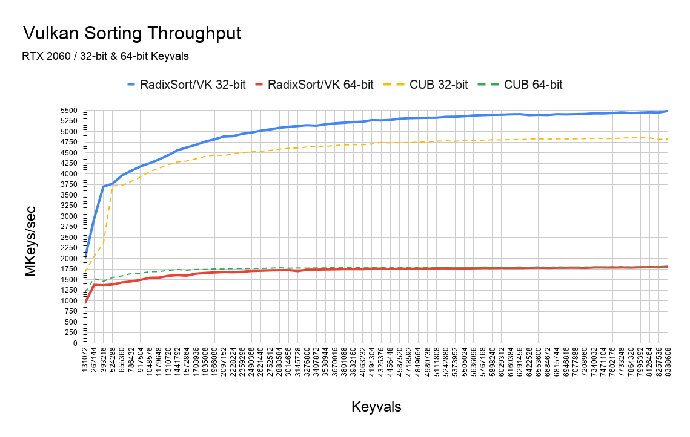

# RadixSort/VK

RadixSort/VK is a high-performance GPU-accelerated sorting library
for Vulkan.

Features include:

* Ultra-fast stable sorting of 32‑bit or 64‑bit keyvals
* Key size is declared at sort time.
* Indirectly dispatchable
* Simple to integrate in a Vulkan 1.2 environment

## Usage

TODO(allanmac): Snippet of "target requirements" usage and snippet of how to
invoke the library.

### Targets

TODO(allanmac): list compile-time switches

### Target Usage

TODO(allanmac)

### Device Support

The following architectures are supported:

Vendor | Architecture  | 32‑bit Keyvals     | 64‑bit Keyvals  | Notes
-------|---------------|:------------------:|:---------------:|------
NVIDIA | sm_35+        | ✔                  | ✔               |
AMD    | GCN           | ✔                  | ✔               |
ARM    | Bifrost4      | ✔                  | ✔               |
ARM    | Bifrost8      | ✔                  | ✔               |
Intel  | GEN8+         | ✔                  | ✔               |

## Benchmarks

### Throughput

#### NVIDIA RTX 2060

#### NVIDIA K2200

## References
