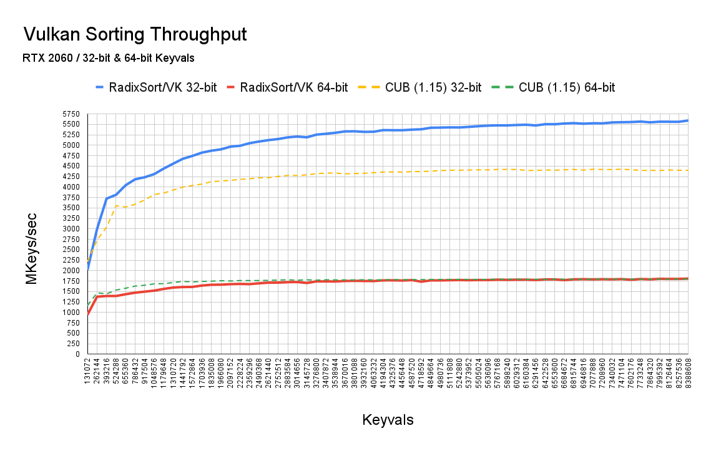
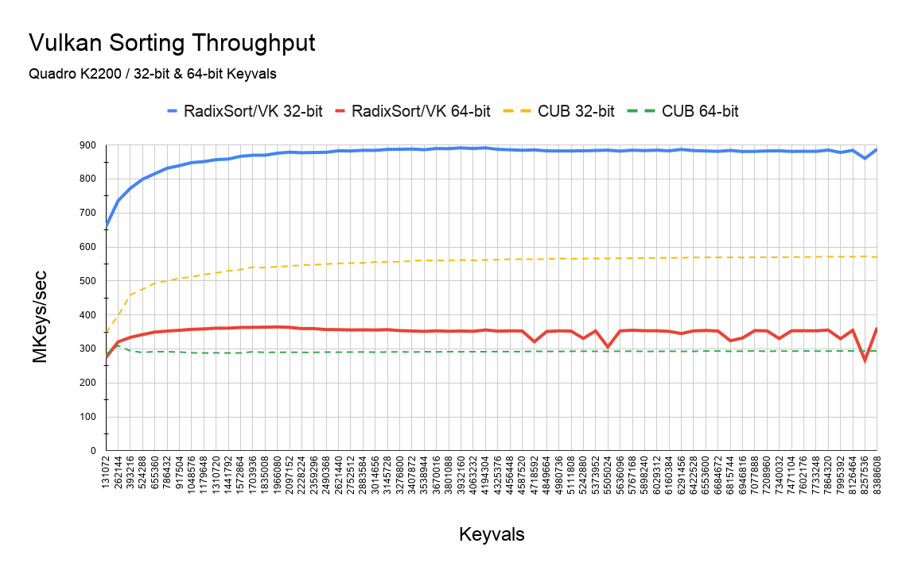
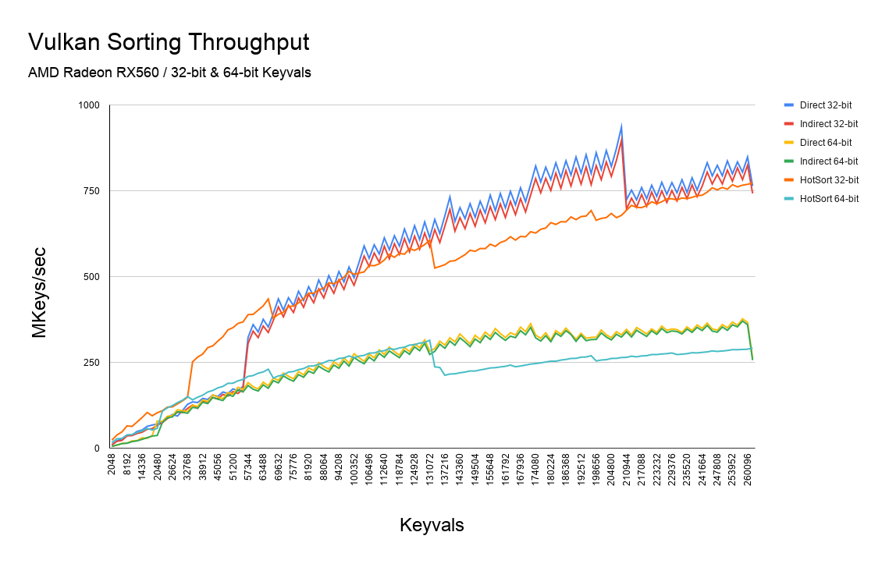
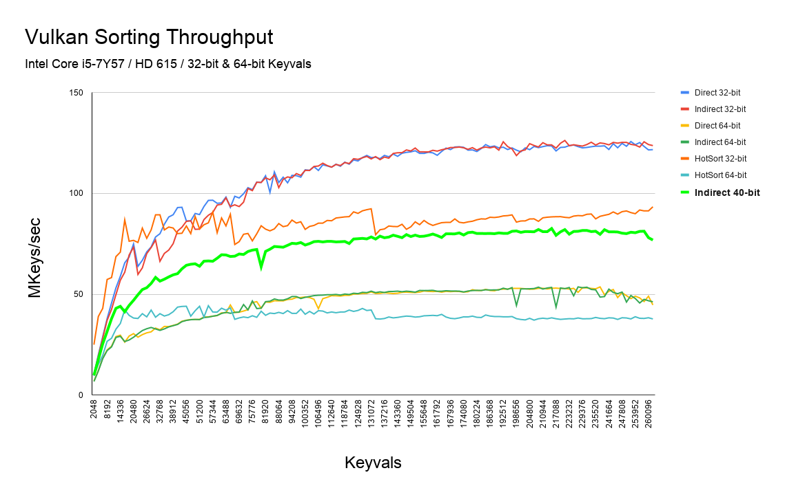
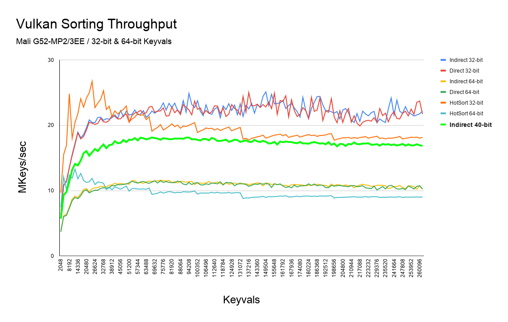
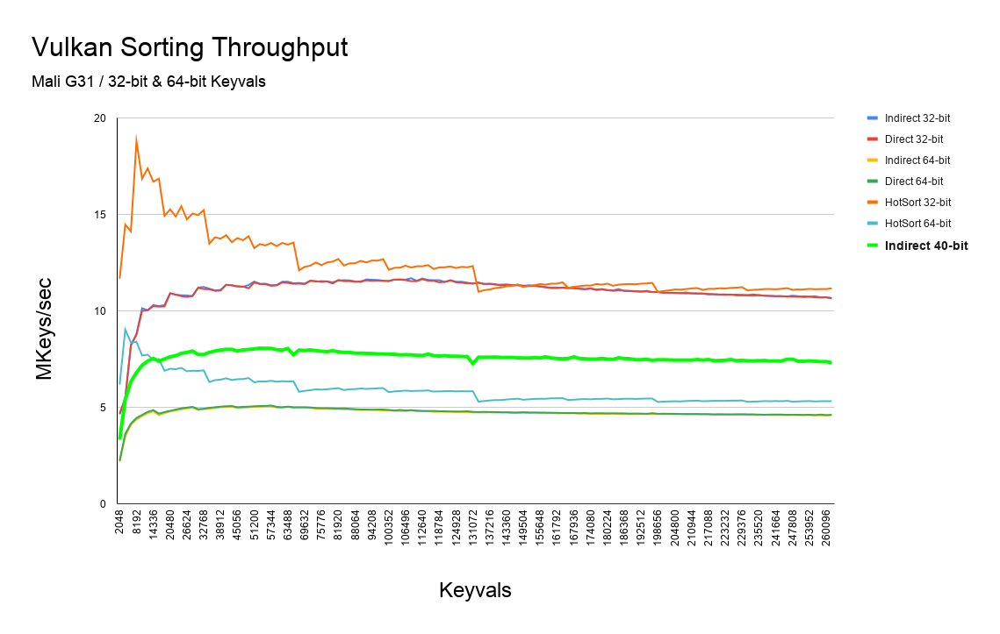

# RadixSort/VK

RadixSort/VK is a high-performance sorting library for Vulkan 1.2.

Features include:

* Ultra-fast stable sorting of 32‑bit or 64‑bit keyvals
* Key size is declared at sort time
* Indirectly dispatchable
* Simple to integrate in a Vulkan 1.2 environment

## Usage

See [`radix_sort_vk.h`](platforms/vk/include/radix_sort/platforms/vk/radix_sort_vk.h).

### Device Support

The following architectures are supported:

Vendor | Architecture  | 32‑bit Keyvals     | 64‑bit Keyvals  | Notes
-------|---------------|:------------------:|:---------------:|------
NVIDIA | sm_35+        | ✔                  | ✔               |
AMD    | GCN           | ✔                  | ✔               |
ARM    | Bifrost4      | ✔                  | ✔               |
ARM    | Bifrost8      | ✔                  | ✔               |
Intel  | GEN8+         | ✔                  | ✔               |

## Benchmarks

### NVIDIA GeForce RTX 2060

### NVIDIA Quadro K2200

### AMD Radeon RX 560

### Intel HD Graphics 615

### ARM Mali G52

### ARM Mali G31

## References
