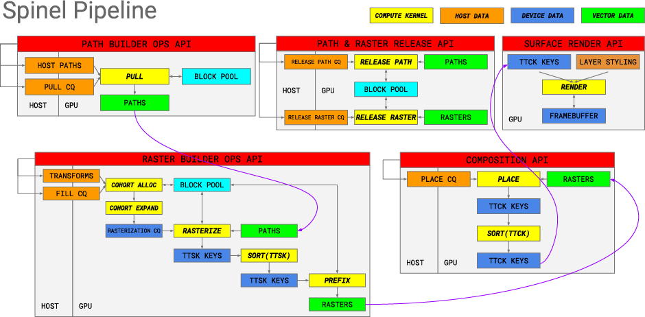

# Spinel

Spinel is a high-performance GPU-accelerated vector graphics, compositing and
image processing pipeline for Vulkan 1.2 GPUs.

Spinel differs from other vector graphics implementations by providing
explicit APIs for defining:

* _Paths_: first-class standalone objects
* _Rasters_: transformed-to-screen-space rasterized Paths
* _Compositions_: an arrangement of Rasters on Layers
* _Stylings_: rendering instructions for each Layer in a Composition

These new explicit sub-APIs allow new programming idioms that untangle the
canonical immediate-mode 2D API.

## Advantages

The Spinel API and its new idioms achieve a number of advantages over existing
2D APIs.  These include:

### Spinel scales with available GFLOPS

All processing is offloaded to the GPU and every stage in the rendering pipeline
is parallelized.  This drives both performance and efficiency.

### Spinel’s rendering model is extensible

Most of the Spinel pipeline is focused on rasterizing paths, building a
proto-scene graph of where these paths appear on layers, and encoding how each
layer is rendered.  These inputs are passed to an extremely performant
tile-based renderer that is effectively a small “virtual machine” for rendering
vector graphics, blending layers, applying masks, and more.

### Spinel’s Composition and Styling idioms enable both animation and inexpensive “redraw”

Layers are explicit and their rules and stylings can be defined in any order.

Furthermore, rasters can be “placed” onto layers in any order.

These two capabilities can enable significant work reuse.

## Support

### Vulkan

The following Vulkan 1.2 devices are supported:

Vendor | Architecture                              | Status         | Notes
-------|-------------------------------------------|:--------------:|------
AMD    | GCN3+                                     | ✔              |
ARM    | Bifrost (4-wide)                          | ✔              |
ARM    | Bifrost (8-wide)                          | ✔              |
ARM    | Valhall (16-wide)                         | 🚧              | Under construction
NVIDIA | Non-mobile: sm_35+                        | ✔              |
NVIDIA | Mobile: sm_30,sm_32,sm_53,sm_62           | 🚧              | Under construction
Intel  | GEN8+                                     | ✔              |
Intel  | APL/GLK using a 2x9 or 1x12 thread pool   | 🚧              | Under construction

## Benchmarks

🚧

## Programming Idioms

🚧

## Architecture

🚧

## Future Enhancements

🚧
