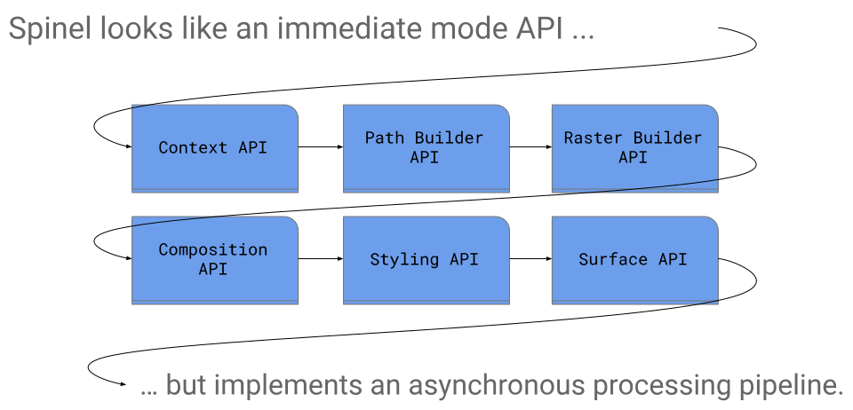
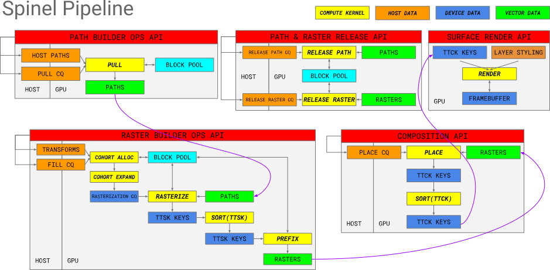

# Spinel

Spinel is a high-performance GPU-accelerated vector graphics,
compositing and image processing pipeline for Vulkan 1.1 GPUs.

Spinel differs from other vector graphics implementations by providing
explicit APIs for defining:

* _Paths_: first-class standalone objects
* _Rasters_: transformed-to-screen-space rasterized Paths
* _Compositions_: an arrangement of Rasters on Layers
* _Stylings_: rendering instructions for each Layer in a Composition

These new explicit sub-APIs allow new programming idioms that
“untangle” the canonical immediate-mode 2D API.

## Advantages

The Spinel API and its new idioms achieve a number of advantages over
existing 2D APIs.  These include:

### Spinel scales with available GFLOPS

Every stage in the pipeline is parallelized.  This drives both
performance and efficiency.  It also frees the CPU to perform other
processing.

Contrast this to traditional APIs that are either single-threaded or
GPU-starved because.

### Spinel’s rendering model is extensible

Most of the Spinel pipeline is focused on rasterizing paths, building
a proto-scene graph of where these paths appear on layers, and
encoding how each layer is rendered.  These inputs are passed to an
extremely performant tile-based renderer that is effectively a small
“virtual machine” for rendering vector graphics, blending layers,
applying masks, and more.

### Spinel’s Composition and Styling idioms enable both animation and inexpensive “redraw”

Layers are explicit and their rules and stylings can be defined in any order.

Furthermore, rasters can be “placed” onto layers in any order.

These two capabilities can enable significant work reuse.

# Benchmarks

:construction:

# Usage

There is a Vulkan 1.1 implementation that targets modern GPUs.

## Vulkan

The following architectures are under development:

Vendor | Architecture                              | Status         | Notes
-------|-------------------------------------------|:--------------:|------
AMD    | GCN3+                                     | :construction: | Under construction
ARM    | Bifrost (4-wide)                          | :construction: | Under construction
ARM    | Bifrost (8-wide)                          | :construction: | Under construction
NVIDIA | sm_35,sm_37,sm_50,sm_52,sm_60,sm_61,sm_70 | :construction: | Under construction
NVIDIA | sm_30,sm_32,sm_53,sm_62                   | :x:            |
Intel  | GEN8+                                     | :construction: | Under construction
Intel  | APL/GLK using a 2x9 or 1x12 thread pool   | :x:            |

# Programming Idioms

:construction:

# Architecture

:construction:

# Future Enhancements

:construction:
