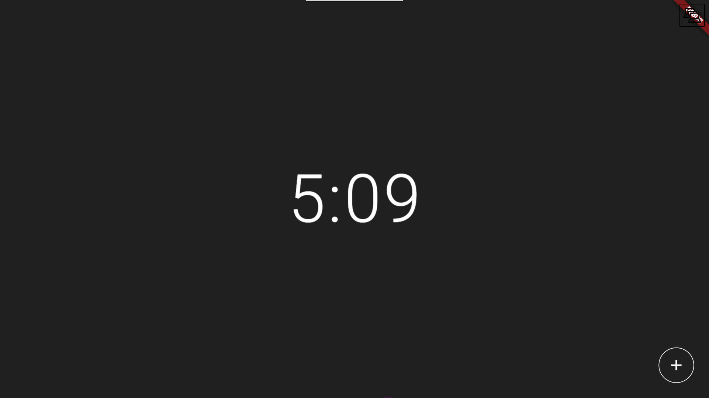
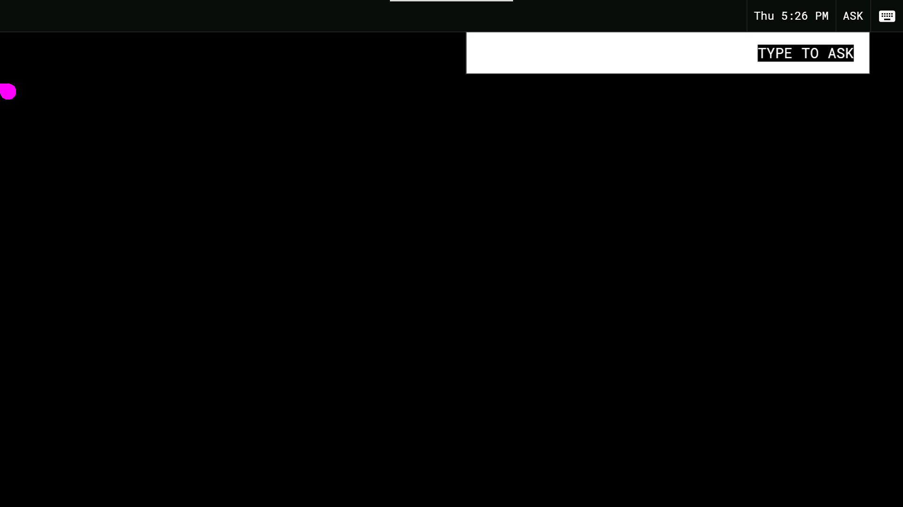
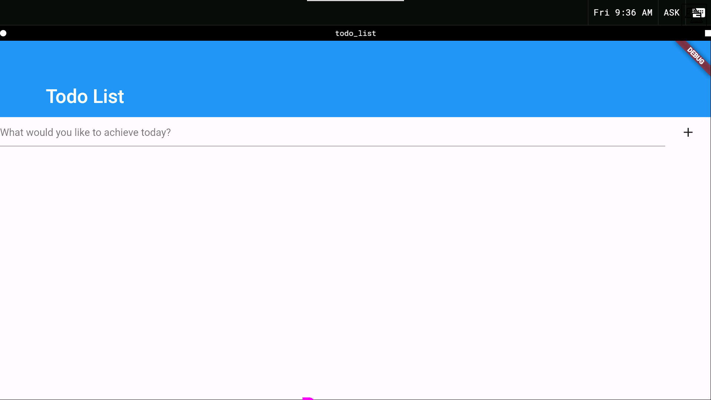
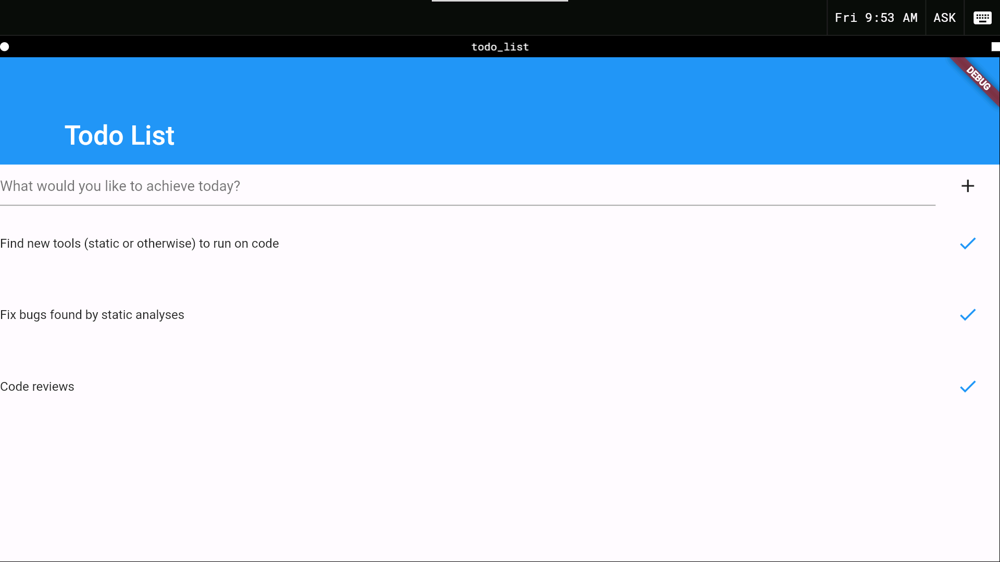
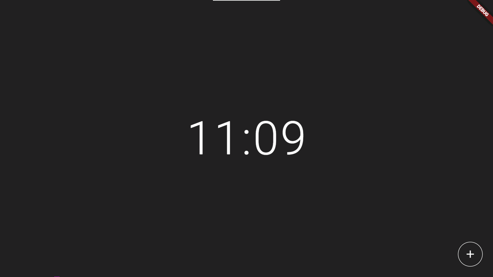

# Inspect

The Ledger is integrated with Fuchsia's Inspect system.

# Use

`iquery` is the utility used by developers to read data exposed by a running
Ledger binary. A typical command may look something like
 ```
$ fx shell iquery --find /hub/c/ledger.cmx/*/out/diagnostics
/hub/c/ledger.cmx/4042026/out/diagnostics
```
or
```
$ fx shell iquery --ls /hub/c/ledger.cmx/4042026/out/diagnostics#repositories/4B0958A113F62EF7AF81988906CC847F/ledgers/modular_sessionmgr
pages
```
A particular "dump everything" recipe to keep handy is
```
$ fx shell iquery --cat --recursive /hub/c/ledger.cmx/*/out/diagnostics
```
This will show all data exposed by all discovered Ledger processes.

# Extension

As the Ledger exposes data to Inspect by maintaining a hierarchy of
[`Node`](https://fuchsia.googlesource.com/fuchsia/+/c5c27602444f96b3147108d7fdaf1823e7e353fe/garnet/public/lib/inspect_deprecated/inspect.h#443)
instances to which properties, metrics, and other `Node` instances are attached,
exposing additional data entails adding more Inspect object instances to those
already-present `Node`s. For example, we might add an indication of whether
peer-to-peer sync is present or absent for a given ledger by adding a
[`StringProperty`](https://fuchsia.googlesource.com/fuchsia/+/c5c27602444f96b3147108d7fdaf1823e7e353fe/garnet/public/lib/inspect_deprecated/inspect.h#295)
member to `LedgerManager` and instantiating it in the `LedgerManager`
constructor with
```C++
sync_property_(inspect_node_.CreateStringProperty(convert::ToString(kSyncInspectPathComponent),
                                                  ledger_sync_ ? "present" : "absent")),
```

## Children Managers

At several points in our hierarchy we make use of [the `ChildrenManager` API](https://fuchsia.googlesource.com/fuchsia/+/c5c27602444f96b3147108d7fdaf1823e7e353fe/garnet/public/lib/inspect_deprecated/inspect.h#582)
to enable Inspect's dynamically querying and discovering parts of our hierarchy
that are disk-resident or otherwise latent rather than immediately maintained in
memory. An instance of a `ChildrenManager` implementation is scoped to a single
`Node` and offers Inspect two methods: `GetNames`, which describes names of
children available under the node, and `Attach`, which adds a named child to the
hierarchy (and keeps it in the hierarchy until Inspect signals that it is done
examining it). For example, `LedgerManager`'s implementation of `GetNames` scans
the disk for the names of directories representing pages but only its
implementation of `Attach` actually brings up a `PageManager` for a page.

# Demo

Need help getting started? Demo-it-yourself by following these steps:
* Build a `workstation` configuration with a few extra packages:
   ```
   $ fx set workstation.x64 --with=//topaz,//garnet/packages:all,//peridot/packages:all
   ```
* Bring up the device:
   
* Execute
   ```
   $ fx shell iquery --cat --recursive /hub/c/ledger.cmx/*/out/diagnostics
   ```
   and observe that the command fails because there is not yet a Ledger binary
   running anywhere on the system.
* Execute
   ```
   $ fx shell sessionctl login_guest
   ```
   to log in:
   
* Execute
   ```
   $ fx shell iquery --cat --recursive /hub/c/ledger.cmx/*/out/diagnostics
   ```
   again, and observe output generally appearing as
   ```
   ledger_component:
     statistic_gathering = on
     repositories:
       0954C54C92203ACB4E401E0B9949688A:
         requests = 1
         ledgers:
           fuchsia-pkg://fuchsia.com/clipboard_agent#meta/clipboard_agent.cmx:
             pages:
               436C6970626F617264506167655F5F5F ("ClipboardPage___"):
                 commits:
                   0000000000000000000000000000000000000000000000000000000000000000:
                     entries:
                     parents:
                 heads:
                   0000000000000000000000000000000000000000000000000000000000000000:
           fuchsia-pkg://fuchsia.com/discovermgr#meta/discovermgr.cmx:
             pages:
               00000000000000000000000000000000:
                 commits:
                   0000000000000000000000000000000000000000000000000000000000000000:
                     entries:
                     parents:
                 heads:
                   0000000000000000000000000000000000000000000000000000000000000000:
           modular_sessionmgr:
             pages:
               00000000000000000000000000000000:
                 commits:
                   0000000000000000000000000000000000000000000000000000000000000000:
                     entries:
                     parents:
                 heads:
                   0000000000000000000000000000000000000000000000000000000000000000:
               4167656E7452756E6E6572506167655F ("AgentRunnerPage_"):
                 commits:
                   0000000000000000000000000000000000000000000000000000000000000000:
                     entries:
                     parents:
                 heads:
                   0000000000000000000000000000000000000000000000000000000000000000:
               4D657373616765517565756550616765 ("MessageQueuePage"):
                 commits:
                   0000000000000000000000000000000000000000000000000000000000000000:
                     entries:
                     parents:
                 heads:
                   0000000000000000000000000000000000000000000000000000000000000000:
   ```
   . Note that there's a lot going on here:
   * A Ledger binary is now running on the system! Just one, that's what the one
      `ledger_component` appearing at hierarchical-top-level (least-indented)
      means in the output.
   * There is just one repository. Repositories are scoped to users, and we just
      logged in as the single guest user, so it would be a surprise to see more
      or fewer repositories.
   * There are three ledgers, each with a name that easily identifies the binary
      with which it is associated:
      * `fuchsia-pkg://fuchsia.com/clipboard_agent#meta/clipboard_agent.cmx`
      * `fuchsia-pkg://fuchsia.com/discovermgr#meta/discovermgr.cmx`
      * `modular_sessionmgr`
   * While no entries have yet been written by anyone, the ledgers differ in
      that `fuchsia-pkg://fuchsia.com/clipboard_agent#meta/clipboard_agent.cmx`
      and `fuchsia-pkg://fuchsia.com/discovermgr#meta/discovermgr.cmx` each
      store only the root page, but `modular_sessionmgr` stores the root page
      plus two other pages of its own naming (`AgentRunnerPage_` and
      `MessageQueuePage`).
* Execute
   ```
   $ fx shell 'sessionctl --story_name="My-TODO" --mod_name="my_todo_list" add_mod "fuchsia-pkg://fuchsia.com/todo_list#meta/todo_list.cmx"'
   ```
   to bring up the `todo_list` mod:
   
* Execute
   ```
   $ fx shell iquery --cat --recursive /hub/c/ledger.cmx/*/out/diagnostics
   ```
   a third time and observe that:
   * Entries now appear:
      ```
                          ("Story/Data/My-TODO") 53746F72792F446174612F4D792D544F444F:
                            value = Binary:
      0000  7b 22 40 76 65 72 73 69  6f 6e 22 3a 36 2c 22 73  {"@version":6,"s
      0010  74 6f 72 79 5f 69 6e 66  6f 22 3a 7b 22 69 64 22  tory_info":{"id"
      0020  3a 22 4d 79 2d 54 4f 44  4f 22 2c 22 6c 61 73 74  :"My-TODO","last
      0030  5f 66 6f 63 75 73 5f 74  69 6d 65 22 3a 31 35 36  _focus_time":156
      0040  38 33 36 37 32 34 35 33  35 39 39 38 33 35 30 35  8367245359983505
      0050  2c 22 61 6e 6e 6f 74 61  74 69 6f 6e 73 22 3a 5b  ,"annotations":[
      0060  5d 7d 2c 22 73 74 6f 72  79 5f 6e 61 6d 65 22 3a  ]},"story_name":
      0070  22 4d 79 2d 54 4f 44 4f  22 2c 22 73 74 6f 72 79  "My-TODO","story
      0080  5f 6f 70 74 69 6f 6e 73  22 3a 7b 22 6b 69 6e 64  _options":{"kind
      0090  5f 6f 66 5f 70 72 6f 74  6f 5f 73 74 6f 72 79 22  _of_proto_story"
      00a0  3a 66 61 6c 73 65 7d 2c  22 73 74 6f 72 79 5f 70  :false},"story_p
      00b0  61 67 65 5f 69 64 22 3a  7b 22 69 64 22 3a 5b 32  age_id":{"id":[2
      00c0  39 2c 31 37 31 2c 32 31  35 2c 31 38 38 2c 31 37  9,171,215,188,17
      00d0  35 2c 32 32 35 2c 33 39  2c 31 30 36 2c 31 31 38  5,225,39,106,118
      00e0  2c 36 31 2c 32 33 39 2c  32 30 31 2c 37 36 2c 37  ,61,239,201,76,7
      00f0  30 2c 33 38 2c 31 33 34  5d 7d 7d                 0,38,134]}}
      ```
   * `modular_sessionmgr` has now added a fourth page with a randomly-generated
      page ID.
* Add a few items to the list:
   
* Execute
   ```
   $ fx shell iquery --cat --recursive /hub/c/ledger.cmx/*/out/diagnostics
   ```
   a fourth time and observe that the ledger associated with
   `fuchsia-pkg://fuchsia.com/todo_list#meta/todo_list.cmx` now contains the
   items you entered in the mod as stored entries at its head commit:
   ```
                     entries:
                       18614A38FECDE7F9AF8068466E7D7F89:
                         value = Binary:
   0000  46 69 6e 64 20 6e 65 77  20 74 6f 6f 6c 73 20 28  Find new tools (
   0010  73 74 61 74 69 63 20 6f  72 20 6f 74 68 65 72 77  static or otherw
   0020  69 73 65 29 20 74 6f 20  72 75 6e 20 6f 6e 20 63  ise) to run on c
   0030  6f 64 65                                          ode
                       429E5D5A28D1DAA27EDFB7A0C7B40FEC:
                         value = Binary:
   0000  46 69 78 20 62 75 67 73  20 66 6f 75 6e 64 20 62  Fix bugs found b
   0010  79 20 73 74 61 74 69 63  20 61 6e 61 6c 79 73 65  y static analyse
   0020  73                                                s
                       5AD51E849FE9C34186EBB7FA48FB2F19:
                         value = Binary:
   0000  43 6f 64 65 20 72 65 76  69 65 77 73              Code reviews
   ```
* Execute
   ```
   $ fx shell 'sessionctl delete_story "My-TODO"'
   ```
   to remove the mod:
   
* Execute
   ```
   $ fx shell iquery --cat --recursive /hub/c/ledger.cmx/*/out/diagnostics
   ```
   a fifth time, and observe that the output is exactly the same as the last
   execution - as long as the data is disk-resident and a `LedgerRepository`
   scoped to the user is in memory, Inspect and `iquery` will be able to locate
   it.
* Execute
   ```
   $ fx shell sessionctl restart_session
   ```
   to log out:
   
* Execute
   ```
   $ fx shell iquery --cat --recursive /hub/c/ledger.cmx/*/out/diagnostics
   ```
   one last time, and again observe that (as was the case before logging in)
   Inspect is not able to find anything because there is no running Ledger
   binary.

# How To Cautiously Explore Without Traversing Everything, Inflating Everything, And Exhausting Memory
* Use `iquery --find` (without `--recursive`) to determine [the values against
   which the asterisks in other commands match](https://bugs.fuchsia.dev/p/fuchsia/issues/detail?id=36554):
   ```
   $ fx shell iquery --find /hub/c/ledger.cmx/*/out/diagnostics
   /hub/c/ledger.cmx/1896955/out/diagnostics
   ```
* Then use `iquery --cat` to view the properties and metrics attached to each
   node and `iquery --ls` to view the direct children of each node:
   ```
   $ fx shell iquery --find /hub/c/ledger.cmx/*/out/diagnostics
   /hub/c/ledger.cmx/1896955/out/diagnostics
   $ fx shell iquery --ls /hub/c/ledger.cmx/1896955/out/diagnostics#repositories
   3235C737627E9D24B7AB7152B0593F2E
   $ fx shell iquery --ls /hub/c/ledger.cmx/1896955/out/diagnostics#repositories/3235C737627E9D24B7AB7152B0593F2E
   ledgers
   $ fx shell iquery --ls /hub/c/ledger.cmx/1896955/out/diagnostics#repositories/3235C737627E9D24B7AB7152B0593F2E/ledgers
   fuchsia-pkg://fuchsia.com/clipboard_agent#meta/clipboard_agent.cmx
   fuchsia-pkg://fuchsia.com/discovermgr#meta/discovermgr.cmx
   fuchsia-pkg://fuchsia.com/todo_list#meta/todo_list.cmx
   modular_sessionmgr
   ```

# Caveats

* [Wildcards don't work when attempting to navigate less-than-everything.](https://bugs.fuchsia.dev/p/fuchsia/issues/detail?id=36554)
* [Tab completion would be _really_ nice.](https://bugs.fuchsia.dev/p/fuchsia/issues/detail?id=36553)
* [Only the first 1024 bytes of entries are currently available.](https://bugs.fuchsia.dev/p/fuchsia/issues/detail?id=36555)
