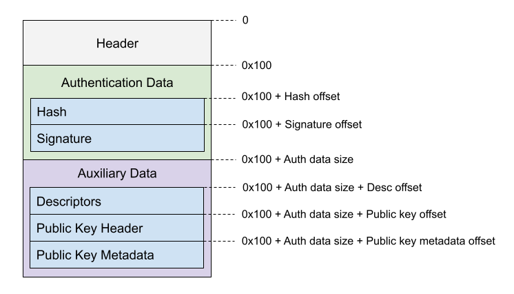
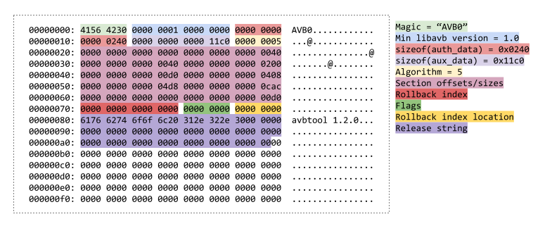
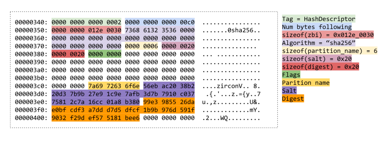
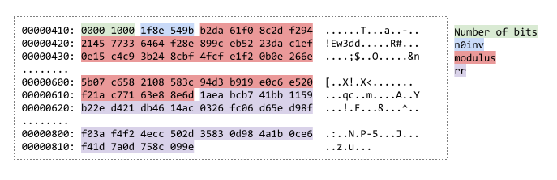

# VBMeta

This Rust crate can be used to generate the VBMeta block of the system image.
VBMeta holds a key and descriptors needed during startup to verify the integrity
of the image, which is part of the
[Verified Boot](https://android.googlesource.com/platform/external/avb/+/master/README.md)
process.

It further defines the `vbmeta` tool, which is a thin wrapper around the main
functionality of the library. It serves as a means of creating one-off VBMeta
images from ZBIs - and its source further serves as example usage of the
crate.

**Usage**

```
use vbmeta::{Key, HashDescriptor, Salt, VBMeta};

let key = Key::try_new(PRIVATE_KEY_PEM, PUBLIC_KEY_METADATA).unwrap();
let salt = Salt::random().unwrap();
let descriptor = HashDescriptor::new("zircon", ZBI_BYTES, salt);
let descriptors = vec![descriptor];

let mut vbmeta = VBMeta::sign(descriptors, key).unwrap();
let vbmeta_bytes = vbmeta.bytes;
```

## VBMeta struct

The layout of the VBMeta struct consists of a header, authentication data,
and auxiliary data. The header is required and is always 0x100 bytes in length.
Both the authentication and auxiliary data are generally optional, but in this
API must be explicitly specified in `VBMeta::sign(descriptors, key)`, because
a VBMeta block without a descriptor and key is not useful on Fuchsia.



### Header

The VBMeta header contains information about how the block was generated,
and section offsets for the authentication and auxiliary data.



### Authentication Data

The authentication data is used to verify the integrity of the vbmeta header
and auxiliary data by signing it with the private key. First, the hash is
calculated by digesting the header concatenated with the auxiliary data.
Second, the signature is found by signing the hash with the private key.

### Auxiliary Data

**Descriptors**

Currently, Fuchsia only uses hash descriptors.
VBMeta hash descriptors are used to verify the integrity of a particular image
(such as the ZBI). The salt is added to the image before generating the digest.
During startup, the image is hashed, and if it does not match the digest in
VBMeta, the image is found to be untrustworthy.



**Public key header**

The public key is used to verify the signature in the authentication data
matches the hash in the authentication data. On startup, the public key header
is verified by comparing with a known trustworthy public key (usually fused
onto the device).

As RSA signing large images is quite slow, intermediate values
(`n0inv` and `rr`) are pre-calculated and stored in VBMeta's public key header
to speed up the process.



**Public key metadata**

The public key metadata is copied directly from the input of
`Key::try_new(PRIVATE_KEY_PEM, PUBLIC_KEY_METADATA)`, and placed after the
public key header.

## Device startup and image verification

When a device starts up, before loading the ZBI, Zircon uses `libavb` to verify
the authenticity of the VBMeta struct and each image. This is completed with the
[ZirconVBootSlotVerify](https://fuchsia.googlesource.com/fuchsia/+/refs/heads/master/src/firmware/lib/zircon_boot/zircon_vboot.h#12)
function in Zircon's boot process, and performs the following steps:

1. Verifying the validity of the VBMeta header
1. Verifying the VBMeta hash by digesting the header and auxiliary data
1. Verifying that the VBMeta signature came from the hash using the public key header
1. Verifying the authenticity of the public key header by comparing with a stored trusted public key
1. Verifying the authenticity of each image by comparing their digest with the VBMeta descriptors
