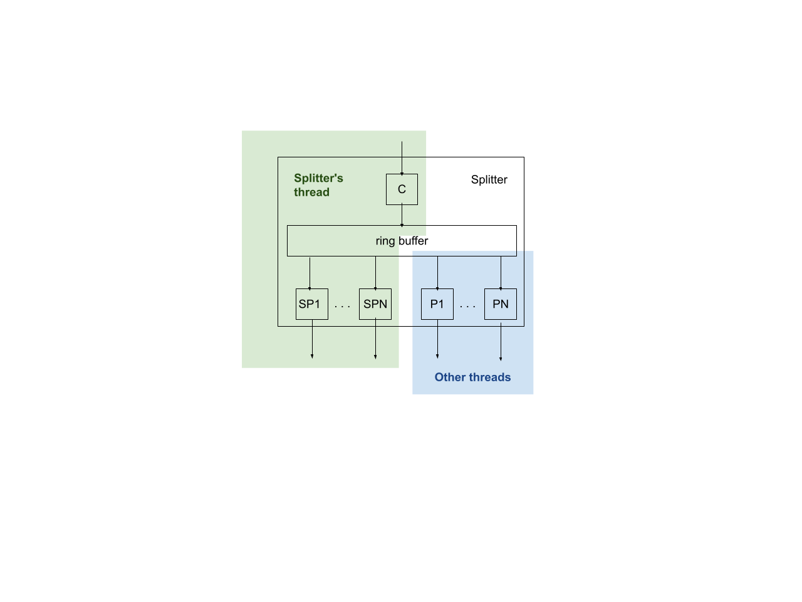

# Audio Mixer Service: Splitter Nodes

[TOC]

## Node structure

A SplitterNode implements fan-out: an incoming audio stream is cloned into
multiple outgoing streams. SplitterNodes are useful in three cases:

*   In an input pipeline, to clone a source stream (e.g. a microphone device)
    into multiple AudioCapturers
*   In an output pipeline, to clone a source stream (e.g. an AudioRenderer) into
    multiple output devices
*   In an output pipeline, to clone a source stream into a loopback interface
    which can be read by an input pipeline

Within a SplitterNode, an incoming audio stream is fed into a consumer, which
copies that stream into a ring buffer, which can be read by multiple producers:



The above diagram shows a single SplitterNode, which contains a consumer
(labeled C) and multiple producers, where the producers are partitioned into two
groups: one group that shares the same thread as the splitter (labeled SPi in
the above diagram) and everything else (labeled Pi).

## Semantics

The consumer is driven passively by the same-thread producers. The consumer will
not write to the ring buffer if the splitter has no same-thread producers. As
the producers SPi need data, they ask the consumer to write that data to the
ring buffer. The consumer will write enough data to satisfy all producers (not
just the specific producer SPi which asked for data). If there are no
same-thread producers, then C never writes any data to the ring buffer -- there
must be at least one same-thread producer to drive C. The details are best
explained by example in the following scenarios.

### Output pipeline with a single thread

Suppose a SplitterNode is connected to three ConsumerNodes X, Y, and Z, which
represent output devices, where all destinations are output pipelines and run on
the same thread as C:

```
           A
           |
+----------V-----------+
|        +---+ Splitter|
|        | C |         |
|        +-|-+         |
|          V           |
|      RingBuffer      |
|     |    |     |     |
| +---V+ +-V--+ +V---+ |
| | P1 | | P2 | | P3 | |
| +----+ +----+ +----+ |
+---|------|------|----+
    |      |      |
    V      V      V
    X      Y      Z
```

When the thread wakes to perform a mix job at time T, it will process X, Y, and
Z in any order. Suppose X is first. When X asks P1 for frames, P1 first asks C
to fill the ring buffer with all frames that might be needed by P1, P2, or P3 in
this current mix job. This is the range `(T, T + MaxDelay]`, where MaxDelay is
the maximum [delay](delay.md) on any path downstream of the SplitterNode.

After C has filled the ring buffer, P1 reads from the ring buffer. When Y asks
P2 for frames, P2 makes the same request to C, but this request was already
satisfied, so it's a no-op.

This is illustrated below:

```
                   |<-------- DownstreamDelay(X) -------->|
                   |<----- DownstreamDelay(Y) ----->|
                   |<----------- DownstreamDelay(Z) ----------->|
                   |<---------------- MaxDelay ---------------->|
frame timeline: ++++++++++++++++++++++++++++++++++++++++++++++++++++
                   ^
               frame presented
                at time T
```

Suppose that:

*   DownstreamDelay(X) = 5 frames
*   DownstreamDelay(Y) = 10 frames
*   DownstreamDelay(Z) = 20 frames

MaxDelay is 20, so the ring buffer must contain at least 20 frames. Note that X
and Y are running "behind" Z, or put differently, Z is running with more
lookahead. In the current mix job, Z might read up through frame T+20, while X
will not read beyond frame T+5. X will read frames T+6 through T+20 in
subsequent mix jobs.

The very next mix job happens at time `T + MixPeriod`. This job follows the same
process, however since C has already written frames `(T, T + MaxDelay]`, it only
needs to write frames `(T + MaxDelay, T + MaxDelay + MixPeriod]`. Hence, while C
may need to write a lot of frames to prime the very first mix job, in the steady
state, C will write just MixPeriod frames.

### Output pipeline with multiple threads

Now assume that Y and Z run on different threads. The consumer C is driven
passively by node X as before. We synchronize C, Y, and Z with time: during the
mix job at time T, C writes frames that Y and Z will need starting at time `T +
MixPeriod(C.thread)`. C is guaranteed to finish writing those frames before that
time, hence it will be safe for Y and Z to read those frames. This adds a delay
of `MixPeriod(C.thread)` to both P2 and P3.

In the steady state, P2 can read from `(T, T + DownstreamDelay(Y)]` while C
writes `MixPeriod` frames in the future:

```
                   |<----- DownstreamDelay(Y) ----->|<--- MixPeriod -->|
frame timeline: +++++++++++++++++++++++++++++++++++++++++++++++++++++++++
                   ^<------- readable by P2 ------->|<- written by C ->|
                   |
               frame presented
                at time T
```

Note that if X did not exist, there would not be any same-thread producers to
drive C, so nothing would get written to the ring buffer.

### Input pipeline

Now assume that all nodes participate in an input pipeline, where X, Y, and Z
represent capturer interfaces. This works almost identically as before, except
that for a mix job at time T, C writes all frames in the range `[T - MaxDelay,
T)`, where MaxDelay is, again, the maximum delay on any path downstream of the
SplitterNode. As before, if Y and Z run on different threads, then a delay of
`MixPeriod(C.thread)` is added to both P2 and P3.

Note that output pipelines operate in the future (with lookahead), while input
pipelines operate in the past (with lookbehind):

```
                   |<---------------- MaxDelay ---------------->|
frame timeline: ++++++++++++++++++++++++++++++++++++++++++++++++++++
                                                                ^
                                                            frame presented
                                                             at time T
```

### Output pipeline with loopback

Now assume that X and Y have are output devices while Z is a loopback capturer.
This SplitterNode's ring buffer represents a loopback buffer. This works very
similarly to the output pipeline case, with two differences:

*   MaxDelay is the maximum delay downstream of P1 and P2.
*   The ring buffer must have enough room for `MaxDelay + DownstreamDelay(P3)`
    frames.

To illustrate:

```
                                           |<------ DownstreamDelay(X) ------>|
                                           |<- DownstreamDelay(Y) ->|
                                           |<----------- MaxDelay ----------->|
                 |<- DownstreamDelay(P3) ->|
frame timeline: ++++++++++++++++++++++++++++++++++++++++++++++++++++++++++++++++++
                                           ^
                                       frame presented
                                        at time T
```

At time T, Z reads in the past while X and Y read in the future. C writes enough
data to cover DownstreamDelay(P3) before T and MaxDelay after T. As before, in
the steady state, C writes just MixPeriod frames at the end of this range.
