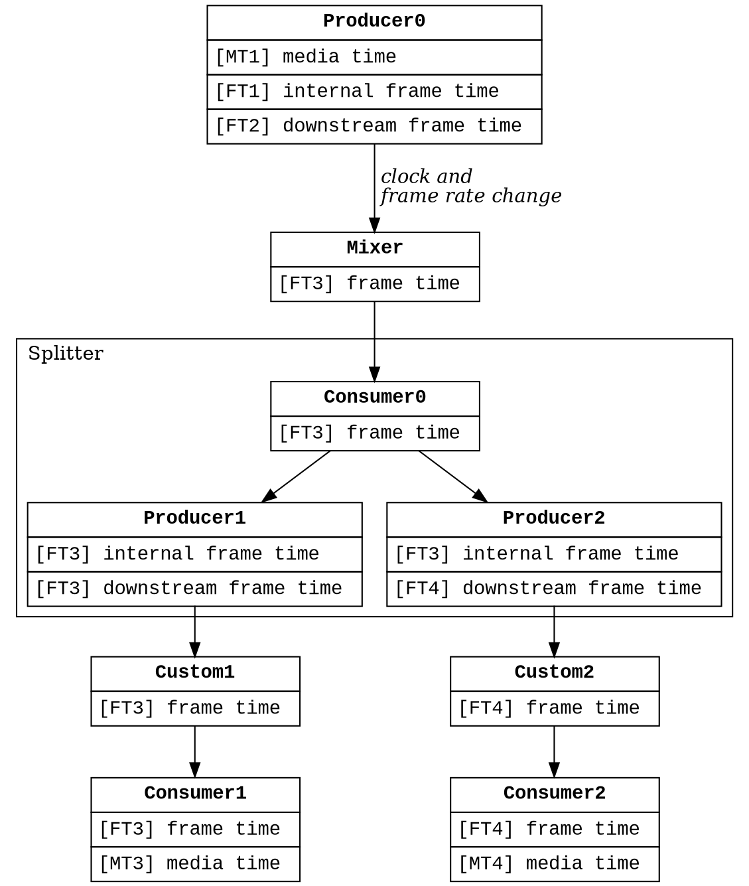
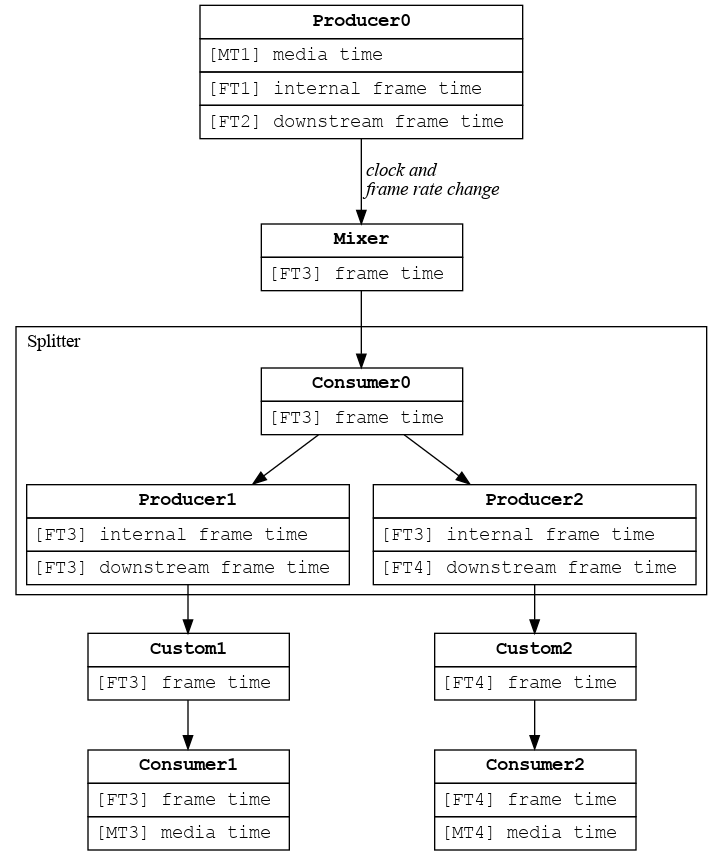

# Audio Mixer Service: Timelines

[TOC]

## Reference time, media time, and frame time

**TODO (fxbug.dev/87651): consider renaming "media time" and "frame time" to
"media units" or "media ticks" and "frame units", reserving "time" for values
read from an actual clock. (If we do this, TBD if we will use "media timestamp"
to refer to a single point on the media timeline.)**

Every edge in the mix graph represents a single audio stream, where each audio
stream contains a sequence of timestamped frames. We measure the progress of
time in three ways:

*   **Reference time** is a `zx::time` value relative to a specific `zx::clock`
    [reference clock](clocks.md). Reference time advances continuously and
    monotonically and is always expressed in nanoseconds relative to the clock's
    epoch.

*   **Media time** represents the logical sequence of frames produced or
    consumed by a Producer/Consumer node. Media time advances when the node is
    started and stops advancing when the node is stopped. Media time is defined
    at Producers and Consumers only -- it is not defined at any other graph
    nodes.

    When a Producer/Consumer node is backed by a
    [StreamSink](https://cs.opensource.google/fuchsia/fuchsia/+/main:sdk/fidl/fuchsia.audio.mixer/node_options.fidl;drc=e859bd380655c4be3890af5625de9a2e15984c11;l=26)
    (i.e., a packet queue), packet timestamps are expressed in media time and
    the client can define media time using any units they like. Common choices
    are nanoseconds and frames. For example, a 30 second audio stream might
    start at media timestamp 0 and end at media timestamp 30,000,000,000 (in
    nanosecond units) or 30,000,000 (in millisecond units) or 1,440,000 (in
    frame units assuming 48kHz audio).

    When a Producer/Consumer node is backed by a ring buffer, media time always
    has units frames, where each media timestamp corresponds to a unique
    position in the ring buffer.

*   **Frame time** is used internally by the mixer and is not accessible to
    clients. Frame time behaves similarly to media time but always has units
    frames. Every PipelineStage operates on frame time internally. Producer and
    Consumer stages are responsible for translating media times to-and-from
    frame times.

## Presentation timestamps

For each audio frame, the most important reference time is the frame's
**presentation timestamp**. For output pipelines, this is the time the frame
will be presented (i.e. rendered) at a speaker, at the end of the pipeline. For
input pipelines, this is the time the frame was initially presented (i.e.
captured) at a live microphone, at the beginning of the pipeline.

## Translating between media time and presentation time

Each call to [`Graph.Start`](TODO<fxbug.dev/87651>: add link) links a pair of
timestamps *(Tr0, Tm0)*, where reference time *Tr0* is media time *Tm0*'s
*presentation timestamp*. Given this pair plus the units for media time, we can
build a
[TimelineFunction](https://cs.opensource.google/fuchsia/fuchsia/+/main:src/media/audio/lib/timeline/timeline_function.h;drc=b076cf49545244228ad4ba0ba2b48582b6cb76a6;l=21),
to translate between media timestamps and presentation timestamps. This function
has the following coefficients:

*   The pair *(Tr0, Tm0)* provided by `Graph.Start` defines the
    TimelineFunction's epoch. The first frame, at *Tm0*, has presentation
    timestamp *Tr0*.

*   A rate *∆m / ∆r*, where every *∆m* steps of media time correspond to *∆r*
    steps of reference time. If the media timeline is stopped, this rate is 0.
    If media time has units nanoseconds, this rate is 1. If media time has units
    frames, this is the frame rate.

While an audio stream is running, the above translation is defined for all
timestamps from *(Tr0, Tm0)* and higher. When
[Graph.Stop](TODO<fxbug.dev/87651>: add link) is called to stop the audio stream
at time *(Tr1, Tm1)*, media time stops advancing which makes the translation
undefined. By convention, we represent the translation between presentation and
media times as a `std::optional<TimelineFunction>` which is `std::nullopt` iff
the stream is stopped.

`Graph.Start` and `Graph.Stop` behave slightly differently at Consumers vs
Producers:

Each Consumer node consumes from an audio stream that is conceptually always
running. When the Consumer is started, it joins at some place in the stream.
When the Consumer stops, then starts again, it must rejoin the stream at some
time after the position it stopped, because while it was stopped the stream was
still conceptually running in the background. This mimics real Consumer
scenarios, such as live microphones, which capture continuously in real time
even if we temporarily stop listening.

Producers don't necessarily represent a continuously advancing stream. Producers
may represent static streams that are being navigated dynamically by "loop" or
"seek" events, as in typical media players. When a Producer is started, it
starts producing from some point in the stream. When the Producer stops, then
restarts, it can restart at any media time, including at an older media time to
implement a "seek backwards" action.

Hence, given a sequence *Start at (Tr0, Tm0), Stop at (Tr1, Tm1), Start at (Tr2,
Tm2)*, we always have *Tr0 ≤ Tr1 ≤ Tr2*, because reference time advances
continuously and monotonically. At Consumers, we have *Tm0 ≤ Tm1 ≤ Tm2*, while
at Producers we have *Tm0 ≤ Tm1* with no constraints *Tm2* because Producers
(unlike Consumers) are allowed to seek backwards.

## Translating between media time and frame time

Each Consumer has a single frame timeline that is used to drive mix jobs. We
translate from media time *Tm* to frame *Tf* using the function *Tf = Tm * ∆f /
∆m*, where every *∆f* frames correspond to *∆m* steps of media time. Since *∆f*
and *∆m* are constants set when the Consumer is created, this function never
changes.

Each Producer has *internal* and *downstream* frame timelines. The internal
frame timeline is defined relative to the Producer's media timeline, using the
same function above: *Tf = Tm * ∆f / ∆m*. The downstream frame timeline is
described in the next section and is unrelated to the Producer's media timeline.

## Frame time in mix jobs

On `Graph.Start(Tr0, Tm0)`, a Consumer starts generating a sequence of output
frames starting from the frame at media time *Tm0*, which is frame *Tf0 = Tm0 *
∆f / ∆m*. This entire process is driven by frame time: the Consumer asks its
source for frame *Tf0*, which asks its source for *Tf0* (and possibly additional
frames, e.g. to resample), and so on, until we reach a Producer, which
interprets *Tf0* as a *downstream frame*, translates that to an *internal
frame*, then returns the requested frame.

If a Consumer's source graph uses a single clock and frame rate, and the graph
does not have any Splitters, then all PipelineStages use a frame timeline
identical to the root Consumer. If there are multiple clocks or frame rates,
then we need translations at MixerStages as follows:

*   If a Mixer's source has a different frame rate, we compute the source frame
    *Tfs* from the destination frame *Tfd* using the formula *Tfs = Tfd * FRs /
    FRd*, where *FRs* and *FRd* are the frame rates of the source and
    destination streams, respectively. Put differently, the frame timelines of
    the source and destination share the same epoch (when *Tfd=0*, *Tfs=0*) but
    have different rates.

*   If a Mixer's source has a different clock, we compute *Tfs* from *Tfd*
    through a multi-step translation from destination frame, to presentation
    timestamp (destination clock), to presentation timestamp (system monotonic
    clock), to presentation timestamp (source clock), to source frame. This
    requires a translation between frames and presentation time, as defined in
    the next section. (In practice, this translation can be imprecise because of
    [clock reconciliation](clocks.md).)

*   If a Mixer's source has a different frame rate and clock, we combine the
    above two translations.

### Translating between frame time and presentation time

At every PipelineState, we can define a translation from frame *Tf* to that
frame's presentation time *Tr*. As before, we say that *Tr* is the *presentation
timestamp* for frame *Tf*. This translation is stored in the property
`std::optional<TimelineFunction> presentation_time_to_frac_frame`.

At each ConsumerStage, the translation from *Tf* to *Tr* is defined by a
two-step translation from *Tf* to *Tm* to *Tr*. When a ConsumerStage is started
or stopped, we recompute that ConsumerStage's `presentation_time_to_frac_frame`
then recurse upwards, as shown in the following recursive pseudocode:

```cpp
void UpdatePresentationTimeToFracFrame(std::optional<TimelineFunction> f) {
  if (this is a ConsumerStage) {
    this.presentation_time_to_frac_frame = compose Tf-to-Tm with Tm-to-Tr;
    source.UpdateFrameTimeline(this.presentation_time_to_frac_frame);
  }
  else if (this is a MixerStage) {
    this.presentation_time_to_frac_frame = f;
    for (auto source : this.sources) {
      // Adjust `f` based on the source's clock and frame rate, as described in the prior section.
      auto new_f = ...;
      source.UpdateFrameTimeline(new_f);
    }
  }
  else if (this is CustomStage) {
    this.presentation_time_to_frac_frame = f;
    source.UpdatePresentationTimeToFracFrame(f);
  }
  else if (this is a ProducerStage) {
    // `f` defines the translation from presentation time to downstream frame.
    this.presentation_time_to_frac_frame = f;
  }
  else if (this is a Splitter) {
    // see below
  }
}
```

At Producers, recall that we have two frame timelines (*internal* and
*downstream*). The above pseudocode computes the translation from *downstream*
frame to presentation time. Separately, the translation from *internal* frame to
presentation time is defined by a two-step translation from internal frame, to
media timestamp, to presentation timestamp. This internal translation is updated
each time the Producer is started or stopped.

At Splitters, there may be multiple destination streams. We split these streams
into same-thread streams and other-thread streams. Splitters are
[driven by same-thread destination streams](splitters.md), so we ignore frame
timeline updates coming from other threads. For frame timeline updates coming
from the same thread, the first update wins: once the splitter is "started", it
keeps that TimelineFunction forever. (This could in theory be relaxed -- we
could change the Splitter's TimelineFunction as destinations are added and
removed -- but this introduces tricky synchronization problems when the
Splitter's destinations run on different threads.)

Within a Splitter, each destination stream is wrapped by a Producer that reads
from an internal ring buffer. That Producer is responsible for translating
between the downstream frame timeline and the Splitter's frame timeline.

### Example

The following example demonstrates how frame time can propagate through a mix
graph. As we walk the graph upwards from a Consumer, note that frame timelines
change in just in two cases: at MixerStages (when the source has a different
frame rate or clock) and within ProducerStages (where the internal frame
timeline may differ from the downstream frame timeline). In this example,
`Custom1` happened to send a frame timeline update to the Splitter before
`Custom2.

<!-- frame-time-example.png

To generate the image, copy to a file and run `dot -Tpng <file> > images/frame-time-example.png`.



-->



### Optimality

This algorithm minimizes the number of frame timeline translations in most
cases. The exceptions involve Splitters: we sometimes use more frame timeline
translations in Splitters than strictly necessary. For example, if the Splitter
has destination streams A and B, where A is started, then B is started, then A
is stopped, then while A is stopped, it would be optimal to switch the Splitter
to use B's timeline, but for simplicity we don't bother doing this.

### Concurrency

If the graph has no Splitters, `UpdatePresentationTimeToFracFrame` can run in an
entirely single-threaded way. If the graph has Splitters, then each time we
encounter a Splitter node we may need to hop to a different thread to update the
Splitter's source stream. As discussed above, this is done using message queues.

To ensure that the Splitter's consumer and producer stages have coherent frame
timelines, the ConsumerStage does not send any packets to ProducerStage P until
after it has sent a message to update P's internal frame timeline.

## Other ideas

Another idea is to define one frame timeline per pair of (reference clock, frame
rate), where we always define `frame time 0 == presentation time 0`. All nodes
with the same clock and frame rate automatically have the same frame timeline.
This idea is dramatically simpler: every node uses the same frame time for
source and destination streams except for Mixer nodes, which may need a frame
time translation if the source and destination use different clocks or different
frame rates.

Unfortunately, this idea can cause a phase shift at Consumers by up to one
frame. We consider this precision insufficient. To see how this can happen,
consider a Consumer which represents an output device, where the output device
runs at frame rate 10kHz. Each frame is 100us. If the Consumer starts at *Tr =
150us*, then by the above simplified definitions, frame 1.5 must be the first
frame presented on at the device. Since output devices must consume whole
frames, the Consumer must round up or down, to frame 2.0 or 1.0. In the worst
case this leads to a phase shift of just less than one frame.

For output devices, *Tr* is selected by the hardware, so we have no control over
*Tr*. The only solution is to dynamically define *Tf* so it is integrally
aligned relative to the presentation time epoch *Tr*.
