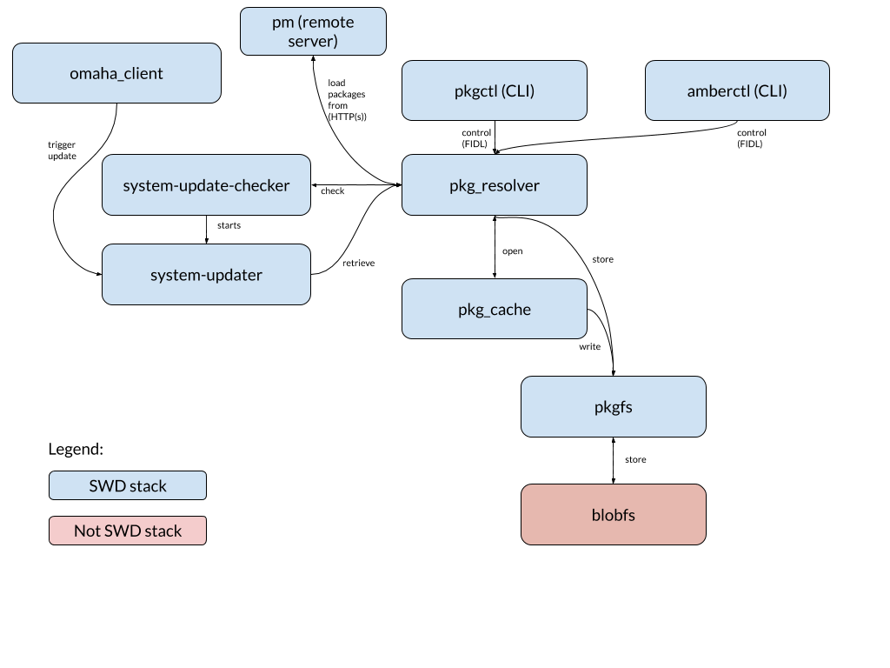

# Contributing to the Software Delivery Stack

## Overview

### Software Delivery (SWD) Subsystems



### Binaries and their Locations

Updated: November 2019

<table>
  <tr>
   <td><strong>Subsystem</strong>
   </td>
   <td><strong>Purpose</strong>
   </td>
   <td><strong>Location</strong>
   </td>
   <td><strong>Language</strong>
   </td>
  </tr>
  <tr>
   <td>pkgctl
   </td>
   <td>CLI for pkg-resolver
   </td>
   <td>`//src/sys/pkg/bin/pkgctl`
   </td>
   <td>Rust
   </td>
  </tr>
  <tr>
   <td>pkg-resolver
   </td>
   <td>Main entry point for software delivery stack. Coordinates retrieval and installation of packages.
   </td>
   <td>`//src/sys/pkg/bin/pkg-resolver`
   </td>
   <td>Rust
   </td>
  </tr>
  <tr>
   <td>pkg-cache
   </td>
   <td>Caches downloaded packages in case they are needed again.
   </td>
   <td>`//src/sys/pkg/bin/pkg-cache`
   </td>
   <td>Rust
   </td>
  </tr>
  <tr>
   <td>pkgfs
   </td>
   <td>A filesystem for interacting with packages that are stored on a host. It presents a tree of packages that are locally available and a tree that enables a user to add new packages and / or package content to the host.
   </td>
   <td>`//src/sys/pkg/bin/pkgfs/pkgfs`
   </td>
   <td>Go
   </td>
  </tr>
  <tr>
   <td>amberctl
   </td>
   <td>Deprecated CLI for various components. `amberctl` is deprecated, scheduled to be replaced by `pkgctl`
   </td>
   <td>`//src/sys/pkg/bin/amber/amberctl`
   </td>
   <td>Go
   </td>
  </tr>
  <tr>
   <td>system-update-checker
   </td>
   <td>Does what it says on the tin, checks for system updates!
   </td>
   <td>`//src/sys/pkg/bin/system-update-checker`
   </td>
   <td>Rust
   </td>
  </tr>
  <tr>
   <td>system-updater
   </td>
   <td>Actually performs system updates.
   </td>
   <td>`//src/sys/pkg/bin/system-updater\
   </td>
   <td>Go
   </td>
  </tr>
  <tr>
   <td>FIDL bindings
   </td>
   <td>Language-agnostic interfaces for subsystems.
   </td>
   <td>`//sdk/fidl/fuchsia.pkg`
<p>
`//sdk/fidl/fuchsia.pkg.rewrite`
<p>
`//sdk/fidl/fuchsia.update`
<p>
///sdk/fidl/fuchsia.update.channel
<p>
//sdk/fidl/fuchsia.update.channelcontrol
<p>
//src/sys/pkg/fidl/fuchsia.update.installer
   </td>
   <td>FIDL
   </td>
  </tr>
  <tr>
   <td>system_ota_test
   </td>
   <td>An end-to-end test of system over the air updates.
   </td>
   <td>//src/sys/pkg/tests/system-ota-tests
   </td>
   <td>Go
   </td>
  </tr>
</table>

#### Key Dependencies

*   [rust-tuf](https://fuchsia.googlesource.com/third_party/rust-mirrors/rust-tuf/)
*   [go-tuf](https://fuchsia.googlesource.com/third_party/go-tuf/)
*   [hyper](https://github.com/hyperium/hyper)
*   [rustls](https://github.com/ctz/rustls).

#### Useful Debugging Tools

*   [`fidlcat`](https://fuchsia.dev/fuchsia-src/development/tools/fidl_inspecting):
    it’s `strace`, but for every IPC on the system, not just syscalls.
*   [`zxdb`](https://fuchsia.dev/fuchsia-src/development/debugger/debugger_usage):
    Fuchsia’s debugger. Similar usage to `gdb`, and has Unicode support
    (emoji!). Doesn’t currently work well with golang, but works fine with Rust.
*   [Inspect](https://fuchsia.dev/fuchsia-src/development/inspect): Opt-in APIs
    for components to expose aspects of their state. Several portions of the SWD
    stack implement this, and more to come.

##### IDEs

VS Code seems to work pretty well. Follow the instructions
[here](https://fuchsia.dev/fuchsia-src/development/editors/vscode), including
any language-specific instructions you find relevant; the Rust instructions are
a good place to start.

#### Style Guide

Use the style guide appropriate for the language you’re in. The SWD stack is
mostly in Rust and Go, which have strong opinions about style. All commits in
those languages should be formatted with `rustfmt` and `gofmt` respectively, and
most editors/IDEs have a mode in which you can run those commands when you save
a file. Do so!

### Setup

#### Fuchsia Setup

Read the Fuchsia Getting Started guide
[first](https://fuchsia.googlesource.com/fuchsia/+/refs/heads/master/docs/get-started/index.md)

Most of the SWD stack is in the `base` image of fuchsia, so to get a swd stack
working with tests, your build configuration is quite simple:

#### First tests

```sh

Tab 1 > fx set core.x64 --with //bundles:tests && fx build && fx serve

Tab 2 > fx qemu -kN

Tab 3 > fx run-test pkg-resolver-integration-tests # example of running the pkg-resolver integration tests

```

For further info on fx workflows:
https://fuchsia.dev/fuchsia-src/development/workflows/fx

#### More general tests

If you’ve successfully run the above, you have a working Fuchsia system with the
software delivery stack working.

You can discover more tests with by running `fx list-packages` on the host.

### Common Workflows

##### Updating a base image to get a new version of pkg-resolver or pkgctl

To update the base of your fuchsia image, you can use `fx update` if you’re
running on hardware which supports OTA. If you’re running under QEMU, you’ll
need to just restart QEMU to get an updated base after a rebuild. Don’t worry,
it’s fast.

##### Pulling down a new version of an external dependency

You’ll need to update that dependency’s vendored repository in //third_party.
See the
[Rust documentation](/doc/development/languages/rust/third_party#steps_to_update_a_third_party_crate.md)
for examples.

##### Resolve a package and run a contained component

The package resolver is configured by default to resolve `fuchsia.com` to the
local development host. To run a component in a package you’ve built locally,
you can run something like `fx shell run
fuchsia-pkg://fuchsia.com/<package_name>#meta/<component_name>.cmx`

TODO(wittrock): is there a global package repository we can use as a repo for
this example?

### FAQs

#### How do I run a hosted package server?

See the instructions on
[running a package repository with pm](https://fuchsia.dev/fuchsia-src/development/sdk/documentation/packages)

### More information:

*   [Package overview](/docs/development/sdk/documentation/packages.md)
*   [Package updates](/docs/concepts/packages/package_update.md)
*   [Package metadata](/docs/concepts/packages/package.md)
*   [Package URLs](/docs/concepts/packages/package_url.md)
*   [Software updates](/docs/concepts/system/software_update_system.md)
