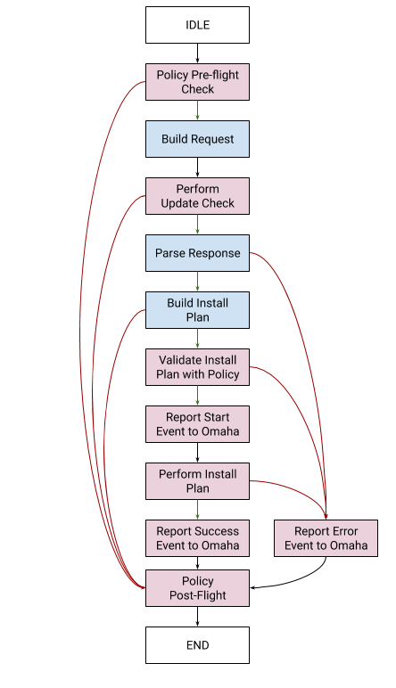

# Omaha Client Library

Updated: 2020-09

This is a platform- and product-agnostic implementation of the client end of the
[Omaha Protocol](https://github.com/google/omaha/blob/master/doc/ServerProtocolV3.md)
protocol for signaling that updates are available to a device or application.

# Overview

### Design Goals

- **Features:** All protocol features needed by a device that wishes to use the Omaha protocol for
update management.
- **Correct Operation at Scale:**  When used at scale, there are behaviors that must be implemented
to ensure that global synchronization does not occur, and if some outside action causes a large
number of clients to synchronize, they need to quickly de-synchronize.
- **Testability:** Full-coverage of both normal and abnormal use-cases via unit-tests.
- **Modularity:** Clear separation of modules for testability and portability via Rust Traits.
- **Sepration of concerns:** The state machine for the protocol, and the policy that governs it, are
wholly separate for testabilty.

## High Level Design

This is a general overview of the major conceptual components of the library:

The omaha client library provides for these main pieces:
- An [App](src/common.rs) struct which is used to define the thing that needs update checks.
- The [State Machine](src/state_machine.rs) for the protocol.

and the definitions (via Traits) for an implementor using the library to provide the following:

- The [Policy](src/policy.rs) for the `StateMachine` to use when it needs to make decisions.
- The [PolicyEngine](src/policy.rs) which gathers the system data that the `Policy` needs to make
decisions for the `StateMachine`.
- The [Installer](src/installer.rs) for performing installations / updates.
- The [Observer](src/state_machine/observer.rs) for providing library users with state and progress.

This split allows the implementor of a binary or update-check service to focus on the platform- and
product-specific aspects of the `Policy`, `Installer`, etc.

The relationships between the `StateMachine` and the other components is as follows:

**State Machine and Policy:**

The `StateMachine` asks the `Policy` various questions, such as *"is it time to check for an
update?"* or *“can an update be installed right now?”*.

The `Policy` implementation itself is stateless, `self`-less, and idempotent.  It MUST NOT track any
state of its own, and repeated questions with the same arguments MUST have the same answer.

**Policy Engine and the Policy itself**

The `Policy` answers questions, but to do so, it often needs data from the system (e.g. the current
time).  The `Policy` can't gather any data itself.  All the information that it uses to base its
decisions on comes to it from the `PolicyEngine`, which is the intermediary between the
`StateMachine` and the `Policy`.

The `PolicyEngine` takes the arguments passed to it from the `StateMachine`, adds the data that it
needs to gather (called `PolicyData`), or the state that it's been tracking, and calls upon the
`Policy` to make a decision which is returned to the `StateMachine`.

While the `Policy` is stateless, the `PolicyEngine` almost certainly is not, but only acts to gather
and hold state that it can pass to the `Policy` via `PolicyData`.

**State Machine and Installer:**

The `StateMachine` instructs the `Installer` to perform an update and the `Installer` provides
progress and status notifications back to the `StateMachine` as the update is downloaded and
applied.  When complete, the `StateMachine` may signal the `Installer` to reboot.

**State Machine and Installer (InstallationPlan)**
The `StateMachine` takes the Omaha response, and after parsing/validating it from a protocol point
of view, hands it off to the `Installer` to create an InstallPlan for performing the update that was
contained in the response.

# StateMachine

The `StateMachine` has two parts:
1. An outer loop which initiates regular checks for updates.
1. An inner process flow which performs the requisite requests to Omaha to propertly check for, and
provide feedback on, an update.

The process flow is:

Tasks that are fully synchronous (and internal to the `StateMachine`) are in blue, with the tasks
that require asynchronous operation in red.  Error-path transitions are in red, success-path
transitions are in green, and the transitions that are taken for both error and success cases are in
black.

There are a number of “don’t care” tasks, specifically around the reporting of events and errors to
Omaha.  These are “best effort” actions that are taken, and a response waited for, but if no
response comes, or it’s malformed, the `StateMachine` doesn’t take different action from the success
case, does not retry, and continues on to the next task.

The error cases on the left involve the emitting of local status messages, and an ending of the
protocol, without needing to signal Omaha of that fact.  These are cases where an update check
cannot be performed at this time, or the update check itself fails (at the transport layer), or the
response says there is no update to be performed.

The error cases on the right involve a need to be reported to Omaha.  They are, in order: a
malformed response from Omaha, a response and `InstallPlan` that cannot be performed based on the
current `PolicyData` or a `Policy` decision, or an error during the performing of an update.