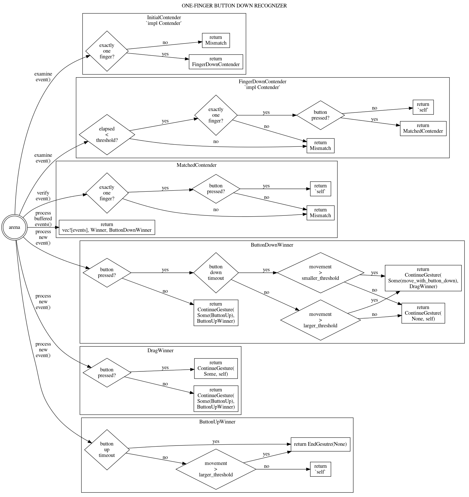

# input_pipeline > Gestures > One finger Button Recognizer

Reviewed-on: 2022-10-13

# Purpose

The one finger button recognizer detects a click or a click-drag on the touchpad.

A click occurs when the user exerts enough force on the touchpad to move the pad itself then
release the button. (This is distinct from a tap, which does not move the pad.)

A one finger drag occurs when the user exerts enough force on the touchpad to move the pad
itself to trigger the button then move the finger more than threshold.

Notably, this includes discarding any spurious motion that occurs during the click
(when a button has been pressed but not yet released).

This recognizer will replace click recognizer and one finger drag recognizer.

# State machine

The one finger button recognizer implements the state machine below.

The state machine is also available in other formats:

- [state machine as graphviz source](one_button_state_machine.dot)
- [state machine as SVG](one_button_state_machine.svg)
