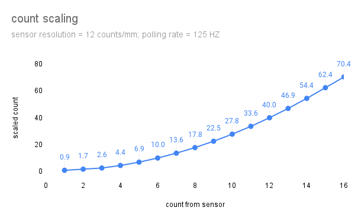
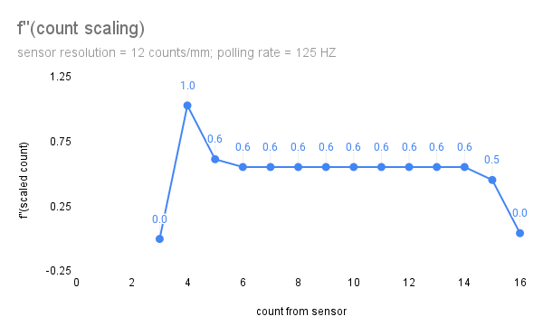

# input_pipeline > PointerMotionSensorScaleHandler

The `PointerMotionSensorScaleHandler` scales pointer motion, to
improve the usability of mice and touchpads.

# Theory of operation
Mice and touchpads must simultaneously support two different
use cases, working with motion that is constrained to a small
surface area.
* For touchpads, the area is constrained by the touchpad itself.
* For mice, the area isn't constrained by the sensor, but by
  the comfortable range of motion of human hands.)

If the system maps a given amount of motion (e.g. 1mm) of/on
the sensor to the same amount of motion of the pointer on the
screen, the user will be able to make fine motions suitable
for uses like
* selecting small amounts of text
* moving an on-screen object a small number of pixels to
  finely align that object with other items on the screen.

However, such a mapping makes it difficult to navigate across
the whole width or height of the display. The user might have
to, e.g., swipe three or four times across the touchpad to
move the cursor from the left edge of the display to the right
edge.

This effect grows with the resolution of the display. So,
for example, 4K and higher displays are more difficult to use.
(See, however, [`PointerMotionDisplayScaleHandler`](pointer_motion_display_scale_handler.md)
for a complementary stage that's useful when the additional
physical pixels are used for smooth rendering, rather than
fitting more context onto the display.)

Conversely, choosing a linear mapping that optimizes for large
motions sacrifices the ease of making small motions.

To resolve the dilemma, this handler maps sensor motion to
pointer motion using not just the distance of the motion, but
also the speed of the motion.
* At low speeds, the motion is mapped linearly, to preserve
  fine control.
* At medium speeds, the motion is mapped quadratically, to
  allow rapid motion across the screen.
* At high speeds, motion is mapped linearly, using the slope
  at the end of the medium speed region.

# Visualization

## Count scaling

The graph below illustrates the scaling curve, where  `x` is
the count read from the sensor, and `y` is the scaled count
computed by this handler.

The graph assumes a sensor with 12 counts per millimeter, and
a 125 HZ polling rate. Under such a configuration:
* the medium scaling region begins at 4 counts
* the high scaling region begins at 14 counts

> The X and Y axes, while both linear, are drawn at different scales.
> This highlights the change in the shape of the curve, but obscures
> its absolute slope.

## First derivative

The graph below plots the first derivative of the function in
the [count scaling section](#count-scaling).

> The X and Y axes, while both linear, are drawn at different scales.
> This highlights the change in the shape of the curve, but obscures
> its absolute slope.

## Second derivative

The graph below plots the second derivate of the function in
the [count scaling section](#count-scaling).

> The X and Y axes, while both linear, are drawn at different scales.
> This highlights the change in the shape of the curve, but obscures
> its absolute slope.

# Notes
1. Some systems refer to this as "pointer acceleration". This
   handler avoids the term "acceleration", as that term implies
   physics (inertia) that this handler does not provide. Said
   differently: the output of this handler depends primarily
   on the current input event, not the history of input events.
2. The "primarily" hedge in point 1 hides the fact that the
   speed of motion for a given event is computed based on the
   delta between the event's timestamp, and the previous event's
   timestamp. Improving this is tracked in https://fxbug.dev/98920.
3. This handler deliberately deals only in `UnhandledInputEvent`s.
   That's because most handlers send an event to a FIDL peer
   before marking the event as handled. Scaling an event that has
   already been sent to FIDL peers might lead to inconsistencies,
   if another handler downstream from this handler also sends
   pointer events to FIDL peers.