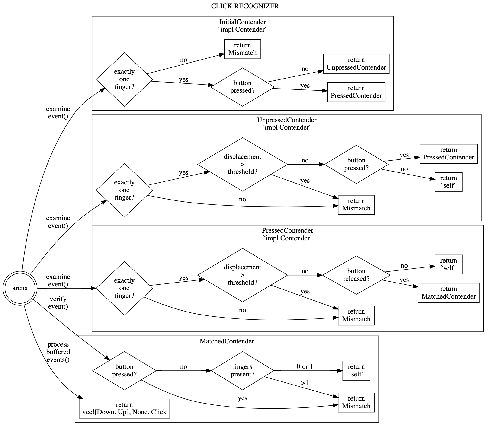

# input_pipeline > Gestures > Click Recognizer

Reviewed-on: 2022-06-30

# Purpose

The click recognizer detects a click on the touchpad, and discards all touchpad
events related to the click.

A click occurs when the user exerts enough force on the touchpad to move the pad itself. (This is distinct from a tap, which does not move the pad.)

Notably, this includes discarding any spurious motion that occurs during the click (when a button has been pressed but not yet released).

This recognizer is needed for feature parity with the ClickDragHandler that’s used in mouse mode.

# State machine

The click recognizer implements the state machine below.

The state machine is also available in other formats:

- [state machine as graphviz source](click_state_machine.dot)
- [state machine as SVG](click_state_machine.svg)
