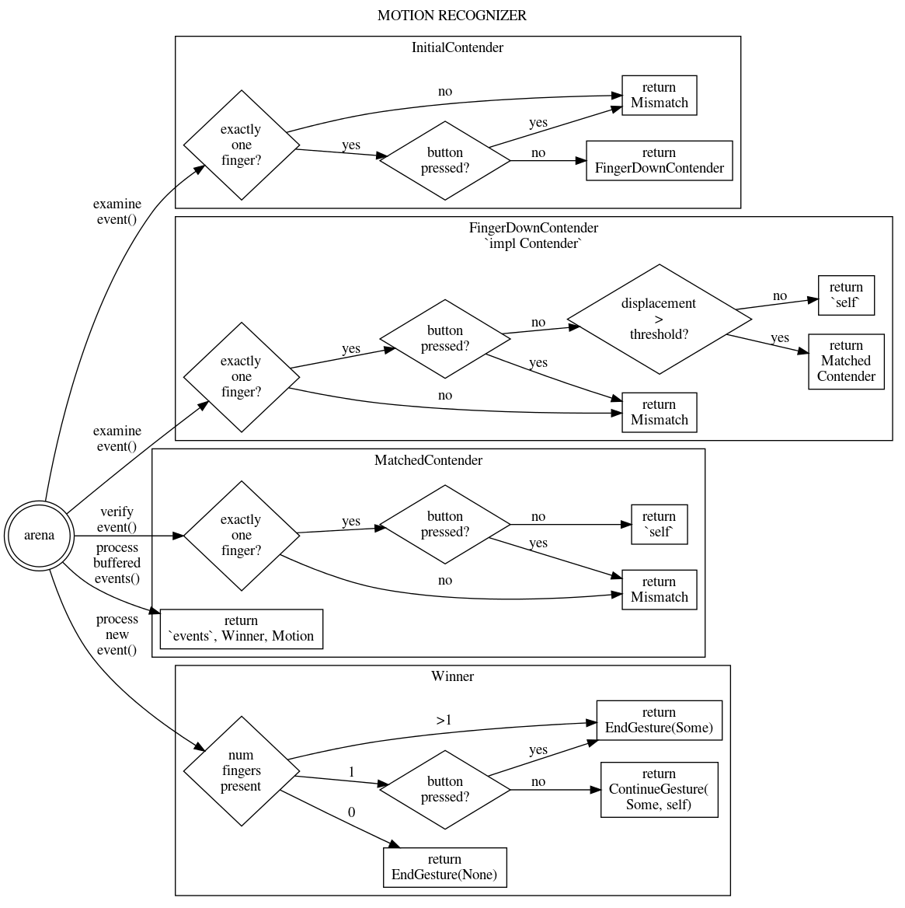

# input_pipeline > Gestures > Motion Recognizer

Reviewed-on: 2022-07-20

# Purpose

The motion recognizer detects 1 finger motion on the touchpad, and converts all related
touchpad events to mouse motion events.

A motion occurs when the user places 1 finger on the touchpad surface. And the finger move
more than the threshold.

# State machine

The motion recognizer implements the state machine below.

The state machine is also available in other formats:

- [state machine as graphviz source](motion_state_machine.dot)
- [state machine as SVG](motion_state_machine.svg)
