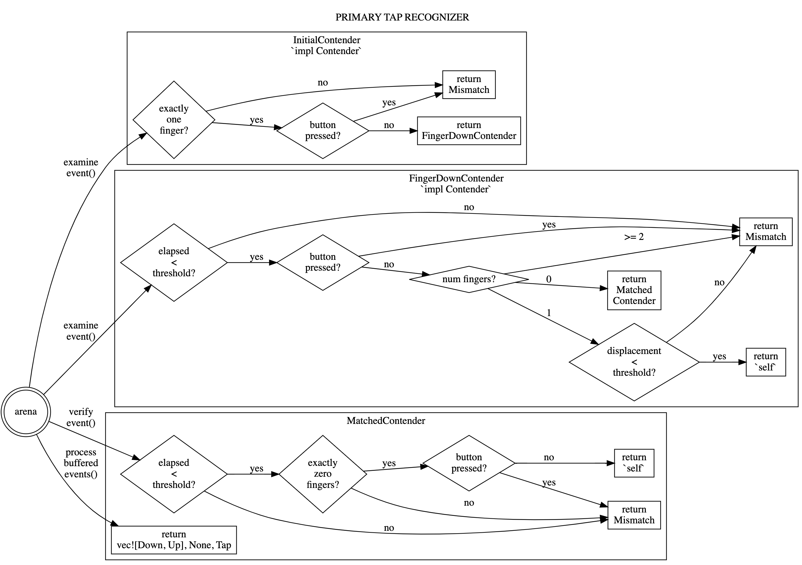

# input_pipeline > Gestures > Primary Tap Recognizer

Reviewed-on: 2022-07-06

# Purpose

The tap recognizer detects a one-finger-tap on the touchpad, generates a mouse click event, and discards all touchpad events related to the tap.

A tap occurs when the user puts one-finger down on the touchpad, exercises zero-to-minimal movement of that one finger, and then removes that finger, all within a short time frame and without moving the pad. (This is distinct from a click, for which a user exerts enough force on the touchpad to move the pad itself.)

Notably, this includes discarding any spurious motion that occurs during the tap (when a finger has made contact down but has not yet been raised up).

# State machine

The tap recognizer implements the state machine below.

The state machine is also available in other formats:

- [state machine as graphviz source](primary_tap_state_machine.dot)
- [state machine as SVG](primary_tap_state_machine.svg)
