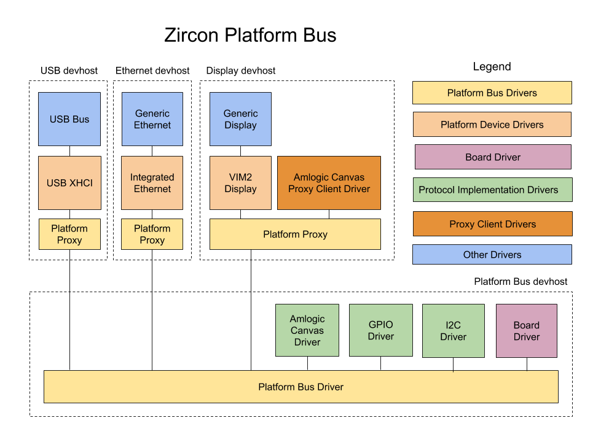

# Zircon's Platform Bus

## Introduction

The term **platform bus** refers to a specific Zircon driver with source code located at
[system/dev/bus/platform/](../../system/dev/bus/platform/)).
However this term also refers to the framework that manages lower level drivers on arm64
SOC-based platforms. To differentiate the two below, we will use *platform bus driver*
when referring to the specific driver, and *platform bus* when referring to the general framework.

The platform bus is currently not used on x86 platforms, since ACPI performs a similar role on x86.
On platforms that use it, the platform bus is represented in the device tree as `/sys`.

The platform bus as a whole contains several types of drivers:

- The **platform bus driver**, which manages the platform bus. This is a generic driver
with no hardware specific functionality. The platform bus driver is started automatically
by the devmgr when the system boots.

- The **board driver**, which is the first driver loaded by the platform bus driver.
The board driver contains all the platform specific information needed by the platform bus
and controls what other drivers will be loaded by the platform bus.
The platform bus driver uses information from the bootloader to bind the correct board driver
for the platform it is running on.

- The **platform device drivers** are the foundations for the higher level drivers in Zircon.
These drivers provide the lowest level of support for a particular feature, like USB,
eMMC or NAND storage, etc., with higher level drivers loading on top of that.

- The **protocol implementation drivers**, such as GPIO or I2C, which provide protocol
support as resources to platform device drivers. These drivers run in the same devhost as the
platform bus driver. Protocol implementation drivers can also implement vendor or SOC-specific
protocols and make them available to platform devices using a **proxy client driver** (see below).

- The **proxy client driver** is a driver that implements client support for a vendor or
SOC-specific protocol. This driver loads in the platform device's devhost and is responsible
for proxying its protocol to the protocol implementation driver.
The Amlogic Canvas driver at [system/dev/display/aml-canvas/](../../system/dev/display/aml-canvas/)
provides a simple example of how the proxying works.

- Finally, the **platform proxy driver** a companion to the platform bus driver that loads
into the platform device devhosts. This driver supports proxying the platform device protocol
and other resource protocols from the platform device driver to the platform bus driver and
protocol implementation drivers. This is needed because the platform device drivers run in a
different devhost process than the platform bus driver and the protocol implementation drivers.

Source: [https://goto.google.com/zircon-platform-bus-diagram](https://goto.google.com/zircon-platform-bus-diagram)

## Initialization

The platform bus driver is started automatically by the devmgr at boot.
Since the platform bus driver is a generic driver that contains no information about the
platform it is running on, it first loads the board driver, which handles platform specific logic.
To determine which board driver to load, platform bus driver reads the `BOOTDATA_PLATFORM_ID`
record from the [ZBI data](../../system/public/zircon/boot/image.h) passed from the bootloader.
It then adds a device with protocol `ZX_PROTOCOL_PBUS` with the
`BIND_PLATFORM_DEV_VID` and `BIND_PLATFORM_DEV_PID` binding variables set to the vid and did
from the platform data record. The correct board driver will bind to this device and continue
the platform bus initialization process..

The board driver uses the platform bus protocol to communicate with the platform bus driver.
After it does its own initialization, the board driver then uses the `pbus_protocol_device_add()`
API to load protocol implementation drivers for GPIO, I2C and other low level SOC protocols to be
provided to the platform device drivers.
After the protocol implementation drivers are loaded and have registered their protocols
via the pbus_register_protocol() API, the board driver will call pbus_device_add() to create
platform devices, which will result in platform device drivers loading each in its own devhost.
After the platform devices are created, the platform bus initialization is complete.

## Platform Device Protocol

The [platform device protocol](../../system/ulib/ddk/include/ddk/protocol/platform-device.h)
(`ZX_PROTOCOL_PDEV`) is the main protocol provided by the platform bus to
platform device drivers. This protocol provides access to resources like MMIO ranges, interrupts,
BTIs, and SMC ranges to the platform device driver. Rather than requesting MMIOs and interrupts by
physical addresses or IRQ numbers, these resource are requested by a zero-based index.
This allows us to have platform device drivers for particular IP that works across multiple
platforms, since the knowledge of the exact MMIO addresses and interrupt numbers do not need to be
known by the driver. Instead the board driver configures the MMIO addresses and IRQ numbers in the
`pbus_dev_t` struct passed via `pbus_add_device()`.

The platform device protocol is also available to protocol implementation drivers.
For example, a GPIO driver may use the platform device protocol to access its MMIO and interrupts.
This allows protocol implementation drivers to be shared among different SOC variants,
where the functionality may be identical but the MMIO addresses and interrupt numbers may be
different.

The platform device protocol can also be made available to children or indirect descendants
of platform devices. This solves the use case where children or grandchildren of platform devices
have drivers that also need to access platform bus resources like MMIO regions and interrupts.

## Resource Protocols

In Zircon, DDK protocols are typically provided as part of the device parent/child relationship.
The driver for the parent device implements a protocol and the driver for the child device is a
client of that protocol. However, some protocols don't fit well with the parent/child device
relationship.
For example, a driver may need to access one or more GPIOs, but the GPIO is unrelated to the
main function of the driver. For cases like this, the platform bus can provide protocols to
platform devices outside of the parent/child relationship.

In addition to MMIOs and interrupts, the board driver can assign GPIOs and I2C buses to platform
devices via the `pbus_dev_t` struct passed via `pbus_add_device()`.
The platform device drivers can call `device_get_protocol()` to retrieve these protocols
and then work with the GPIO pins and I2C buses assigned by the board driver.
In these protocols, the platform device driver uses zero-based indices to refer to these resources
rather than raw GPIO pin numbers or I2C bus and address numbers.
This allows platform device drivers to be more easily reused across different platforms.

## Platform Bus Protocol

The [platform bus protocol](../../system/ulib/ddk/include/ddk/protocol/platform-bus.h)
(`ZX_PROTOCOL_PBUS`) is used by board drivers and protocol implementation drivers
to communicate with the platform bus driver. It is only available to drivers running in the
platform bus's devhost (in particular, it is not accessible to platform device drivers).
The purpose of this protocol is for the board driver to load protocol implementation drivers
and to start platform device drivers. It is also used by protocol implementation drivers to
register their protocols with the platform bus so their protocols can be made available
to platform device drivers.

## Platform Proxy Protocol

The [platform proxy protocol](../../system/ulib/ddk/include/ddk/protocol/platform-proxy.h)
(`ZX_PROTOCOL_PLATFORM_PROXY`) is used by the proxy client drivers that proxy protocols to
protocol implementation drivers. It provides support for the proxy client driver to register
its protocol with the platform proxy driver and for proxying its protocol to the
protocol implementation driver over a channel.
